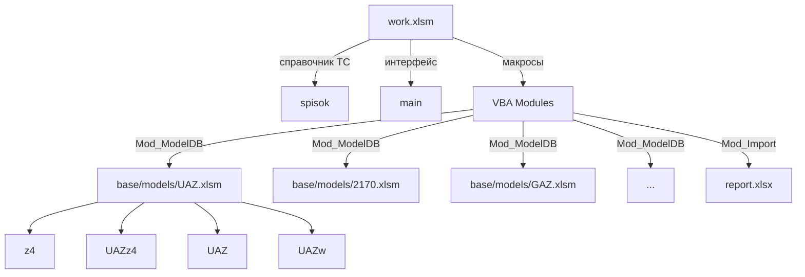

# Архитектура выноса данных работ и запчастей из work.xlsm

> Версия: 1.0
> Проект: SysW v1.0.12
> Статус: Реализовано (SQLite-хранилище внедрено в v1.0.7)
>
> **Актуальный статус:** Миграция на SQLite реализована — единая база `SysW.db` (корень проекта), DDL в `db/schema.sql`, провайдеры `Mod_SQLiteDB.cls` / `Mod_ModelDBProvider.cls` / `IModelDataProvider.cls`, пересборка скриптом `scripts/migrate_models_to_sqlite.py` и контроль целостности в составе конвейера `scripts/build_all.py`.
>
> **Реестр макросов, скриптов и тестов:** актуальный состав процедур VBA и скриптов автоматизации приведён в [`docs/reestr.md`](reestr.md).

---

## 0. Единый стандарт структуры листов (v1.0.9)

Начиная с v1.0.9 все рабочие листы `work.xlsm` (`main`, `spisok`, `models`, `libname`)
и модельные листы (`z4`, `{GroupName}`, `{GroupName}w`, `{GroupName}z4`) приводятся к
единому стандарту:

- **строки 1–2** — технические (пустые/служебные, не несут данных);
- **строка 3** — заголовки столбцов;
- **данные** — начиная с **строки 4**;
- первые три строки **закрепляются** (`FreezePanes A4`).

Маппинг по листам:

| Лист | Действие |
| --- | --- |
| `main` | без сдвига (ввод № заказа `B4`, шапка `B5:B17`, заголовки стр.3, данные с 4-й) |
| `spisok` | заголовки стр.1→3, данные со 2-й→4-й (сдвиг +2) |
| `models` | двухрядная шапка сведена к строке 3; ключи — только в константах `MODELS_COL_*_NAME`; данные с 4-й |
| `libname` | заголовки стр.1→3, данные со 2-й→4-й (сдвиг +2) |
| модельные листы | без сдвига (уже стр.3 / с 4-й); только FreezePanes |

Единые константы в [`Mod_Constants.bas`](../src/modules/Mod_Constants.bas):
`HEADER_ROW=3`, `DATA_START_ROW=4`, `FREEZE_START_CELL="A4"`; по листам
`MAIN_/SPISOK_/MODELS_/LIBNAME_{HEADER_ROW,DATA_START_ROW}`; `MAIN_INPUT_CELL="B4"`.
Закрепление реализовано через `Mod_SheetOps.ApplyFreezePanes` и события
`Worksheet_Activate` классов листов `Лист2`..`Лист5`. Для модельных файлов
`base/models/*.xlsm` применён **Вариант C — XML-инъекция элемента `<pane>`**
(`apply_freeze_panes_to_models`): точечная правка `sheet*.xml` внутри zip-архива книги
без пересохранения через openpyxl, поскольку `keep_vba=True` повреждал структуру
модельных `.xlsm`; VBA-классы не добавляются.

---

## 1. Общая схема хранения

### 1.1. Целевая структура каталогов

```
SysW\
├── work.xlsm                    # Макросы + листы main, spisok (интерфейс)
├── report.xlsx                  # Входящие документы (не изменяется)
│
├── base\
│   ├── templates\               # Шаблоны (v1.0.4; v1.0.12: model.xlsm с модулями)
│   │   ├── work.xlsm            # Шаблон work с кодом (после impVBA.py)
│   │   ├── work0.xlsm           # Шаблон work пустой (без VBA)
│   │   ├── model.xlsm           # Модельный шаблон с модулями (из копии GAZ.xlsm)
│   │   ├── model0.xlsm          # Модельный шаблон без модулей
│   │   └── report0.xlsx         # Шаблон отчёта пустой (без данных)
│   └── models\                  # Файлы модельных групп
│       ├── .gitkeep
│       ├── 2170.xlsm            # Группа 2170
│       ├── UAZ.xlsm             # Группа UAZ
│       ├── GAZ.xlsm             # Группа GAZ
│       ├── 4x4.xlsm             # Группа 4x4
│       ├── 2180.xlsm            # Группа 2180
│       ├── 2190.xlsm            # Группа 2190
│       └── ...                  # Другие группы
│
├── src\                         # Исходный код VBA (13 .bas, 6 .cls, 1 лист)
│   ├── modules\                 # 13 стандартных модулей
│   ├── classes\                 # 6 классов (PartIdentity, WorkIdentity, WorkEntry,
│   │                            #   IModelDataProvider, Mod_ModelDBProvider, Mod_SQLiteDB)
│   └── sheets\                  # 1 класс листа (Лист2_main)
├── db\                          # DDL-схема
│   └── schema.sql               # Схема SysW.db
├── docs\                        # Документация
├── plans\                       # Планы
├── SysW.db                      # Единая база данных SQLite
└── scripts\                     # Скрипты автоматизации (в т.ч. build_all.py)
```

#### Защита листов шаблонов (v1.0.4)

В шаблонах `base/templates/` применена защита листов (`Protect` + `AllowEditRanges`
+ `FreezePanes`) **без изменения VBA-кода**:
- 3 верхние строки (строки 1–3) блокируются и **сохраняют формат, заданный в шаблоне**;
- `FreezePanes` на `A4` (закреплены строки 1–3) на листах ЗЧ/работ/main и других
  листах с заголовками;
- для `main` столбцы `A:B` — только защита (без закрепления столбцов), закрепление
  только на `A4`;
- `AllowEditRanges`: `main` — `B4`, `B5:B17`, `C1`, `Z1`, данные с 4-й строки;
  листы работ/запчастей — `C1`, данные с 4-й строки; прочие листы — данные с 2–3-й строки.

### 1.2. Принцип именования файлов модельных групп

| Правило | Пример |
|---------|--------|
| Имя файла = ключ группы из листа model (колонка B) | `UAZ.xlsm`, `2170.xlsm`, `GAZ.xlsm` |
| Регистр букв сохраняется как в model | `UAZ.xlsm` ≠ `uaz.xlsm` |
| Расширение — `.xlsm` (с макросами) | `UAZ.xlsm` |
| Недопустимые символы в имени файла заменяются на `_` | `VAZ-2110` → `VAZ_2110.xlsm` |

### 1.3. Структура файла модельной группы

Файл: `base/models/{GroupName}.xlsm`

| Лист          | Назначение                                                                 | Источник наполнения                |
| ----------------- | ------------------------------------------------------------------------------------ | ---------------------------------------------------- |
| `z4`            | Все запчасти для данной группы                             | Исходная база запчастей         |
| `{GroupName}z4` | Модельные запчасти с библиотека соответствий | Формируется пользователем    |
| `{GroupName}`   | Все работы для данной группы                                 | Исходная база работ (~2000 поз.) |
| `{GroupName}w`  | Модельные работы с библиотека соответствий     | Формируется пользователем    |

**Пример для группы UAZ:**

```
UAZ.xlsm
├── z4              — все запчасти UAZ
├── UAZz4           — модельные запчасти UAZ с библиотека соответствий UAZ
├── UAZ             — все работы UAZ
└── UAZw            — модельные работы UAZ с библиотека соответствий UAZ

ВНИМАНИЕ!!!: тождества соответствий работ и з/ч должны подбираться по определенному алгоритму: [по поиску в столбце, по заполнению столбца, по пропуску строки] для кнопок АВТО РАБ и АВТО ЗЧ
```

### 1.4. Схема связей между файлами



---

## 2. Спецификация листов

### 2.1. Лист `z4` (глобальный и в каждой группе)

**Назначение:** Хранение полного каталога запчастей. В файле группы — подмножество, отфильтрованное по модели.

**Колонки:**

| № | Имя колонки | Тип данных | Обязательность | Описание |
|---|------------|-----------|---------------|----------|
| A | Code | String (50) | Да | Код запчасти (уникальный) |
| B | Name | String (255) | Да | Наименование запчасти |
| C | Unit | String (20) | Нет | Единица измерения (шт, кг, л) |
| D | Price | Currency | Нет | Цена за единицу |
| E | Note | String (255) | Нет | Примечание |

**Пример данных:**

| A | B | C | D | E |
|---|---|---|---|---|
| 2101-1001015 | Блок цилиндров ВАЗ 2101 | шт | 15000.00 | |
| 2108-1102010 | Фильтр воздушный | шт | 350.00 | аналог |
| 2123-1803020 | Карданный вал | шт | 8500.00 | |

**Ожидаемый объём:** до 700 000 строк в глобальной базе, до 50 000 в групповой.

---

### 2.2. Лист `{GroupName}z4` (модельные запчасти)

**Назначение:** Аннотированный перечень запчастей, привязанных к конкретной модели. Содержит ссылки на коды из листа `z4` и дополнительные поля.

**Колонки:**

| № | Имя колонки | Тип данных | Обязательность | Описание |
|---|------------|-----------|---------------|----------|
| A | z4Code | String (50) | Да | Код запчасти (ссылка на z4.Code) |
| B | Name | String (255) | Да | Наименование (может отличаться от z4) |
| C | Quantity | Double | Да | Нормативное количество |
| D | Unit | String (20) | Нет | Единица измерения |
| E | Note | String (255) | Нет | Аннотация, примечание по установке |
| F | Category | String (50) | Нет | Категория (двигатель, ходовая, кузов) |

**Пример данных:**

| A | B | C | D | E | F |
|---|---|---|---|---|---|
| 2101-1001015 | Блок цилиндров УАЗ Patriot | 1 | шт | Только дизель | двигатель |
| 2108-1102010 | Фильтр воздушный Patriot | 2 | шт | Замена каждые 15 000 км | двигатель |

**Ожидаемый объём:** от 0 до 5 000 строк на группу (формируется пользователем).

---

### 2.3. Лист `{GroupName}` (все работы группы)

**Назначение:** Полный перечень работ для данной модели/группы. Исходная база.

**Колонки:**

| № | Имя колонки | Тип данных | Обязательность | Описание |
|---|------------|-----------|---------------|----------|
| A | Code | String (50) | Да | Код работы (уникальный в пределах группы) |
| B | Name | String (255) | Да | Наименование работы |
| C | Unit | String (20) | Нет | Единица измерения (н/ч, шт) |
| D | NormHours | Double | Нет | Норматив в нормо-часах |
| E | Price | Currency | Нет | Цена работы |
| F | Note | String (255) | Нет | Примечание |

**Пример данных:**

| A | B | C | D | E | F |
|---|---|---|---|---|---|
| UAZ-001 | Замена масла в двигателе | н/ч | 0.5 | 1200.00 | |
| UAZ-002 | Замена тормозных колодок | н/ч | 1.2 | 2880.00 | передние |
| UAZ-003 | Регулировка клапанов | н/ч | 0.8 | 1920.00 | |

**Ожидаемый объём:** ~2 000 строк на группу. Начально 8 групп.

---

### 2.4. Лист `{GroupName}w` (модельные работы)

**Назначение:** Аннотированный перечень работ с привязкой к конкретной модели. Содержит ссылки на коды из листа `{GroupName}`.

**Колонки:**

| № | Имя колонки | Тип данных | Обязательность | Описание |
|---|------------|-----------|---------------|----------|
| A | WorkCode | String (50) | Да | Код работы (ссылка на {GroupName}.Code) |
| B | Name | String (255) | Да | Наименование (может отличаться) |
| C | NormHours | Double | Нет | Скорректированный норматив |
| D | Price | Currency | Нет | Скорректированная цена |
| E | Note | String (255) | Нет | Аннотация, особенности выполнения |

**Пример данных:**

| A | B | C | D | E |
|---|---|---|---|---|
| UAZ-001 | Замена масла Patriot 3163 | 0.6 | 1440.00 | Масло 5W-40 |
| UAZ-002 | Замена колодок Patriot 3163 | 1.5 | 3600.00 | С датчиком износа |

**Ожидаемый объём:** от 0 до 2 000 строк на группу (формируется пользователем).

---

### 2.5. Библиотека соответствий (внутри листов `{GroupName}z4` и `{GroupName}w`)

**Назначение:** Соответствия между входящими позициями (из `report.xlsx`) и модельными позициями хранятся **внутри** листов `{GroupName}z4` (модельные запчасти) и `{GroupName}w` (модельные работы). Отдельного листа `matlib{GroupName}` в структуре файла модельной группы **нет**.

**Хранение соответствий:**
- В листе `{GroupName}w` (модельные работы) — соответствия работ: входящая работа из `report.xlsx` сопоставляется с модельной работой из листа `{GroupName}`.
- В листе `{GroupName}z4` (модельные запчасти) — соответствия запчастей: входящая запчасть из `report.xlsx` сопоставляется с модельной запчастью из листа `z4`.

**Поддержка сложных связей:**

| Сценарий | Пример |
|----------|--------|
| 1 входящая работа = 1 модельная работа | Замена масла → UAZ-001 |
| 1 входящая работа = 2 модельных работы | Замена ГРМ → UAZ-010 + UAZ-011 |
| 1 входящая работа = 1 работа + 2 запчасти | Замена масла → UAZ-001 + 2101-1001015 + 2108-1102010 |
| 2 входящих работы = 1 модельная | Снятие + установка генератора → UAZ-020 |

**Ключевые правила:**
- Одна входящая позиция может быть разложена на несколько целевых (1:N) — несколько строк соответствий с одинаковым кодом входящей позиции.
- Несколько входящих позиций могут быть собраны в одну целевую (N:1) — одинаковый код целевой позиции.
- Коэффициент позволяет задавать пересчёт количества (например, 2 запчасти на 1 работу).
- Тождества соответствий работ и з/ч подбираются по определённому алгоритму: [по поиску в столбце, по заполнению столбца, по пропуску строки] для кнопок АВТО РАБ и АВТО ЗЧ.

**Ожидаемый объём:** от 0 до 10 000 строк на группу.

---

## 3. Модуль `Mod_ModelDB` — спецификация

### 3.1. Общее описание

Новый модуль `Mod_ModelDB` будет отвечать за все операции с файлами модельных групп: создание, открытие, поиск, чтение данных. Модуль реализует слой абстракции между бизнес-логикой и физическим хранением данных.

### 3.2. Константы

```vba
' Каталог с файлами групп
Public Const MODELDB_BASE_PATH As String = "base\models\"

' Каталог с глобальной базой запчастей (не используется — данные хранятся в файлах групп)
' Public Const MODELDB_GLOBAL_Z4_PATH As String = "base\z4_global.xlsx"

' Имена листов (шаблоны)
Public Const MODELDB_SHEET_Z4 As String = "z4"
Public Const MODELDB_SHEET_MODEL_Z4_SUFFIX As String = "z4"       ' {Group}z4
Public Const MODELDB_SHEET_WORKS As String = ""                    ' {GroupName}
Public Const MODELDB_SHEET_MODEL_WORKS_SUFFIX As String = "w"     ' {GroupName}w
```

### 3.3. Функции

---

#### `CreateModelGroupFile`

```vba
Public Function CreateModelGroupFile(groupName As String) As Boolean
```

**Назначение:** Создаёт новый файл группы `{groupName}.xlsm` с пустыми листами.

**Параметры:**
| Параметр | Тип | Описание |
|----------|-----|----------|
| `groupName` | `String` | Имя группы (ключ из model.column B) |

**Возвращает:** `True` если файл создан успешно, `False` если файл уже существует или произошла ошибка.

**Логика:**
1. Проверяет, существует ли файл `base/models/{groupName}.xlsm`
2. Если существует — возвращает `False` (не перезаписывает)
3. Если не существует — создаёт новую книгу с листами:
   - `z4`
   - `{groupName}z4`
   - `{groupName}`
   - `{groupName}w`
4. Сохраняет файл, закрывает
5. Возвращает `True`

---

#### `OpenModelGroupFile`

```vba
Public Function OpenModelGroupFile(groupName As String) As Workbook
```

**Назначение:** Открывает файл группы `{groupName}.xlsm` (если ещё не открыт) и возвращает ссылку на Workbook.

**Параметры:**
| Параметр | Тип | Описание |
|----------|-----|----------|
| `groupName` | `String` | Имя группы |

**Возвращает:** `Workbook` если файл существует и открыт, `Nothing` если файл не найден.

**Логика:**
1. Проверяет, не открыт ли уже файл `{groupName}.xlsm` в `Workbooks` коллекции
2. Если открыт — возвращает ссылку на него
3. Если не открыт — проверяет существование файла через `Dir()`
4. Если файл существует — открывает `ReadOnly:=False`, возвращает ссылку
5. Если файл не существует — возвращает `Nothing`

---

#### `FindModelGroupByModel`

```vba
Public Function FindModelGroupByModel(modelName As String) As String
```

**Назначение:** Определяет имя группы по названию модели. Ищет в листе `model` (work.xlsm) соответствие модели и группы.

**Параметры:**
| Параметр | Тип | Описание |
|----------|-----|----------|
| `modelName` | `String` | Название модели (из spisok.column B) |

**Возвращает:** Имя группы (String) если найдено, пустую строку `""` если не найдено.

**Логика:**
1. Открывает лист `model` в `ThisWorkbook`
2. Ищет `modelName` в колонке A (Модель)
3. Если найдено — возвращает значение из колонки B (Группа)
4. Если не найдено — возвращает `""`

---

#### `GetParts`

```vba
Public Function GetParts(groupName As String, filters As Variant) As Collection
```

**Назначение:** Возвращает коллекцию запчастей из листа `z4` файла группы с применением фильтров.

**Параметры:**
| Параметр | Тип | Описание |
|----------|-----|----------|
| `groupName` | `String` | Имя группы |
| `filters` | `Variant` | Массив фильтров: `Array("Code", "2101-*")` или `Array("Name", "*масло*")` |

**Возвращает:** `Collection` объектов `PartEntry` (Code, Name, Unit, Price, Note). Пустая коллекция если ничего не найдено.

**Логика:**
1. Открывает файл группы через `OpenModelGroupFile`
2. Читает данные листа `z4` с конца (последняя заполненная строка)
3. Применяет фильтры (поддержка wildcard `*`)
4. Возвращает коллекцию найденных запчастей

**Структура PartEntry:**

```vba
Public Type PartEntry
    Code As String
    Name As String
    Unit As String
    Price As Currency
    Note As String
End Type
```

---

#### `GetWorks`

```vba
Public Function GetWorks(groupName As String, filters As Variant) As Collection
```

**Назначение:** Возвращает коллекцию работ из листа `{groupName}` файла группы с применением фильтров.

**Параметры:**
| Параметр | Тип | Описание |
|----------|-----|----------|
| `groupName` | `String` | Имя группы |
| `filters` | `Variant` | Массив фильтров |

**Возвращает:** `Collection` объектов `WorkEntry`. Пустая коллекция если ничего не найдено.

**Структура WorkEntry:**

```vba
Public Type WorkEntry
    Code As String
    Name As String
    Unit As String
    NormHours As Double
    Price As Currency
    Note As String
End Type
```

---

#### `GetMatLibEntries`

```vba
Public Function GetMatLibEntries(groupName As String, entryCode As String) As Collection
```

**Назначение:** Возвращает все соответствия для указанной входящей позиции. Соответствия хранятся **внутри** листов `{groupName}z4` (модельные запчасти) и `{groupName}w` (модельные работы) — отдельного листа `matlib{groupName}` нет.

**Параметры:**
| Параметр | Тип | Описание |
|----------|-----|----------|
| `groupName` | `String` | Имя группы |
| `entryCode` | `String` | Код входящей позиции (из report.xlsx) |

**Возвращает:** `Collection` объектов `MatLibEntry`. Пустая коллекция если соответствий нет.

**Логика:**
1. Открывает файл группы через `OpenModelGroupFile`
2. Читает листы `{groupName}z4` и `{groupName}w`
3. Фильтрует строки по `EntryCode` (код входящей позиции)
4. Для каждой найденной строки создаёт `MatLibEntry`
5. Возвращает коллекцию

**Структура MatLibEntry:**

```vba
Public Type MatLibEntry
    EntryType As String       ' work / part
    EntryCode As String
    EntryName As String
    TargetType As String      ' work / mod_work / part / mod_part
    TargetCode As String
    TargetName As String
    Coefficient As Double
    TargetSheet As String
    Note As String
End Type
```

---

#### `GetModelParts` (дополнительная)

```vba
Public Function GetModelParts(groupName As String, filters As Variant) As Collection
```

**Назначение:** Возвращает коллекцию модельных запчастей из листа `{groupName}z4`.

**Параметры:** Аналогично `GetParts`.

**Возвращает:** `Collection` объектов `ModelPartEntry`.

**Структура ModelPartEntry:**

```vba
Public Type ModelPartEntry
    z4Code As String
    Name As String
    Quantity As Double
    Unit As String
    Note As String
    Category As String
End Type
```

---

#### `GetModelWorks` (дополнительная)

```vba
Public Function GetModelWorks(groupName As String, filters As Variant) As Collection
```

**Назначение:** Возвращает коллекцию модельных работ из листа `{groupName}w`.

**Параметры:** Аналогично `GetWorks`.

**Возвращает:** `Collection` объектов `ModelWorkEntry`.

**Структура ModelWorkEntry:**

```vba
Public Type ModelWorkEntry
    WorkCode As String
    Name As String
    NormHours As Double
    Price As Currency
    Note As String
End Type
```

---

### 3.4. Вспомогательные функции

```vba
' Санитизация имени файла: замена недопустимых символов на _
Public Function SanitizeFileName(name As String) As String

' Проверка существования файла группы
Public Function ModelGroupFileExists(groupName As String) As Boolean

' Получение полного пути к файлу группы
Public Function GetModelGroupFilePath(groupName As String) As String

' Получение списка всех доступных групп (сканирование каталога)
Public Function GetAllModelGroups() As Collection
```

---

## 4. Интеграция с существующими модулями

### 4.1. Изменения в `Mod_Import`

**Текущая логика:**
1. `ImportSheet(grz)` — копирует лист из `report.xlsx` в `work.xlsm`
2. `ImportDataToMain(wsSource)` — переносит данные из листа-источника в лист `main` (колонки L:N — работы, X:AA — запчасти)

**Архитектурные изменения:**


**Что меняется:**
1. После `ImportDataToMain` добавляется вызов `Mod_ModelDB.FindModelGroupByModel` для определения группы по модели из B4
2. Для каждой импортированной работы/запчасти вызывается `Mod_ModelDB.GetMatLibEntries` для поиска соответствий
3. Найденные соответствия подставляются в дополнительные колонки на листе `main`
4. Если группа не найдена — пользователю предлагается создать новый файл группы через `CreateModelGroupFile`

**Новые колонки на листе main (предложение):**

| Диапазон | Сейчас | После изменений |
|----------|--------|----------------|
| L:N | Импорт работ (наименование, объём, цена) | Без изменений |
| O:P | — | Код модельной работы + коэффициент (из соответствий) |
| X:AA | Импорт запчастей (наименование, код, кол-во, цена) | Без изменений |
| AB:AC | — | Код модельной запчасти + коэффициент (из соответствий) |

### 4.2. Изменения в `Mod_OrderHeader`

**Текущая логика:**
1. `FillHeaderFromOrder(orderNum)` — читает данные из `spisok` и `model` (листы в `work.xlsm`)
2. Заполняет B5:B17 на листе `main`

**Архитектурные изменения:**


**Что меняется:**
1. После определения группы (model.column B) вызывается `Mod_ModelDB.OpenModelGroupFile` для открытия/подтверждения доступности файла группы
2. В `main` добавляется скрытая строка или ячейка с путём к текущему файлу группы (для быстрого доступа другим модулям)
3. `Mod_OrderHeader` больше не читает данные работ/запчастей из листа `model` — только группу и цену н/ч
4. Данные работ и запчастей читаются через `Mod_ModelDB.GetWorks` / `Mod_ModelDB.GetParts`

### 4.3. Изменения в `Mod_Constants`

**Что меняется:**
1. Добавляются константы для новых колонок на листе `main` (модельные коды, коэффициенты)
2. Константы для листа `model` остаются, но часть из них (WORK_ORIG, WORKS_MOD, Z4_MOD) становится неактуальной — данные будут во внешних файлах

### 4.4. Изменения в `Mod_SheetOps`

**Что меняется:**
1. Функция `SearchSheetByGRZ` остаётся без изменений — она работает с `report.xlsx`
2. Добавляется новая функция `GetModelGroupForCurrentOrder` — определяет, какой файл группы открыт для текущего заказа

### 4.5. Изменения в `Лист2_main` (класс листа)

**Что меняется:**
1. Обработчик `Worksheet_Change` для B2 остаётся без изменений
2. Добавляется обработчик для новых ячеек, связанных с выбором модельных позиций

### 4.6. Изменения в `Mod_ButtonDispatcher` / `Mod_SheetButtons`

**Что меняется:**
1. Кнопки `AUTOz4` и `AUTOw` (автоподбор) — будут использовать `Mod_ModelDB.GetParts` / `Mod_ModelDB.GetWorks` для поиска
2. Кнопки `MANz4` и `MANw` (ручной подбор) — будут открывать UI для выбора из внешних файлов через `Mod_ModelDB`
3. Обработчики кнопок централизованы в `Mod_ButtonDispatcher`; привязка кнопок листа — в `Mod_SheetButtons`

---

## 5. Миграция на SQLite (реализована в v1.0.7)

### 5.1. Абстракции провайдера данных

Для изоляции хранилищ (Excel/`base/models/` ↔ SQLite/`SysW.db`) в проекте реализованы следующие абстракции:

#### 5.1.1. Интерфейсный модуль `IModelDataProvider`

Концептуальный интерфейс (через `VBA Interface` или документированный контракт):

```vba
' Контракт провайдера данных моделей
' Реализации: Mod_ModelDB (Excel), Mod_SQLiteDB (SQLite)
'
' Methods:
'   Function GetParts(groupName, filters) As Collection
'   Function GetWorks(groupName, filters) As Collection
'   Function GetModelParts(groupName, filters) As Collection
'   Function GetModelWorks(groupName, filters) As Collection
'   Function GetMatLibEntries(groupName, entryCode) As Collection
'   Function CreateModelGroupFile(groupName) As Boolean
'   Function ModelGroupFileExists(groupName) As Boolean
'   Function GetAllModelGroups() As Collection
```

#### 5.1.2. Единые структуры данных (Type)

Все `Type`-структуры (`PartEntry`, `WorkEntry`, `MatLibEntry` и т.д.) выносятся в отдельный модуль `Mod_ModelTypes` — они будут одинаковыми для Excel и SQLite реализации. Модуль `Mod_ModelTypes.bas` уже создан и содержит UDT (`WorkIdentity`, `PartIdentity`, `WorkEntry`); классы `PartIdentity.cls` и `WorkIdentity.cls` реализуют соответствующие объекты.

#### 5.1.3. Фабричный метод

```vba
Public Function GetModelDataProvider() As Object
    ' Возвращает экземпляр Mod_ModelDB или Mod_SQLiteDB
    ' в зависимости от настроек
End Function
```

#### 5.1.4. Изоляция файловых операций

Все операции с файловой системой (открытие/закрытие книг, пути) изолированы в `Mod_ModelDB`. При переходе на SQLite:
- `OpenModelGroupFile` → `OpenSQLiteDatabase`
- `CreateModelGroupFile` → `CreateSQLiteDatabase`
- Чтение листов → SQL-запросы `SELECT`

### 5.2. Модуль `Mod_SQLiteDB` (реализован)

**Сигнатуры функций** (идентичны `Mod_ModelDB`):

```vba
' Mod_SQLiteDB

Public Function GetParts(groupName As String, filters As Variant) As Collection
    ' SQL: SELECT * FROM z4 WHERE groupName = ? AND (code LIKE ? OR name LIKE ?)
End Function

Public Function GetWorks(groupName As String, filters As Variant) As Collection
    ' SQL: SELECT * FROM works WHERE groupName = ?
End Function

Public Function GetMatLibEntries(groupName As String, entryCode As String) As Collection
    ' SQL: SELECT * FROM model_works WHERE groupName = ? AND entryCode = ?
    '      UNION SELECT * FROM model_parts WHERE groupName = ? AND entryCode = ?
End Function

Public Function CreateModelGroupFile(groupName As String) As Boolean
    ' SQL: CREATE TABLE IF NOT EXISTS ...
    ' Создаёт таблицы: z4, model_z4, works, model_works
End Function
```

### 5.3. Что изменится при переходе на SQLite

| Аспект | Сейчас (Excel) | Потом (SQLite) |
|--------|---------------|----------------|
| Хранение | Файлы .xlsm в `base/models/` | Один файл .db или несколько по группам |
| Доступ к данным | `Workbook.Sheets("z4").Cells(row, col)` | `SQLite3.Execute("SELECT ...")` |
| Фильтрация | Цикл по строкам + `InStr`/`Like` | `WHERE code LIKE '%...%'` |
| Производительность | Замедление при >100 000 строк | Быстрые индексы, <1ms на запрос |
| Одновременный доступ | Только один пользователь | Возможен многопользовательский |
| Сложность связей | Многострочные соответствия в `{GroupName}z4`/`{GroupName}w` | JOIN-запросы |
| Резервное копирование | Копирование .xlsm | `.backup` команда SQLite |

### 5.4. Рекомендации по структуре таблиц SQLite (на будущее)

```sql
-- Таблица групп (справочник)
CREATE TABLE model_groups (
    group_name TEXT PRIMARY KEY,
    created_at TEXT DEFAULT (datetime('now')),
    note TEXT
);

-- Таблица запчастей (глобальная)
CREATE TABLE parts (
    code TEXT PRIMARY KEY,
    name TEXT NOT NULL,
    unit TEXT,
    price REAL,
    note TEXT
);

-- Таблица запчастей по группам (связь многие-ко-многим)
CREATE TABLE group_parts (
    group_name TEXT NOT NULL,
    part_code TEXT NOT NULL,
    PRIMARY KEY (group_name, part_code),
    FOREIGN KEY (group_name) REFERENCES model_groups(group_name),
    FOREIGN KEY (part_code) REFERENCES parts(code)
);

-- Таблица модельных запчастей
CREATE TABLE model_parts (
    id INTEGER PRIMARY KEY AUTOINCREMENT,
    group_name TEXT NOT NULL,
    z4_code TEXT NOT NULL,
    name TEXT,
    quantity REAL DEFAULT 1.0,
    unit TEXT,
    note TEXT,
    category TEXT,
    FOREIGN KEY (group_name) REFERENCES model_groups(group_name)
);

-- Таблица работ
CREATE TABLE works (
    code TEXT NOT NULL,
    group_name TEXT NOT NULL,
    name TEXT NOT NULL,
    unit TEXT,
    norm_hours REAL,
    price REAL,
    note TEXT,
    PRIMARY KEY (code, group_name),
    FOREIGN KEY (group_name) REFERENCES model_groups(group_name)
);

-- Таблица модельных работ
CREATE TABLE model_works (
    id INTEGER PRIMARY KEY AUTOINCREMENT,
    group_name TEXT NOT NULL,
    work_code TEXT NOT NULL,
    name TEXT,
    norm_hours REAL,
    price REAL,
    note TEXT,
    FOREIGN KEY (group_name) REFERENCES model_groups(group_name)
);

-- Индексы для производительности
CREATE INDEX idx_works_group ON works(group_name);
CREATE INDEX idx_group_parts_group ON group_parts(group_name);
```

### 5.5. Единый конвейер и глубокая подстановка (v1.0.8)

Полная пересборка проекта выполняется единым конвейером `scripts/build_all.py`:
бэкап (`work.xlsm`, `SysW.db`) → `impVBA.py` → **ранний контроль компиляции VBA
(`check_vba_syntax.py`)** → `build_templates.py` → `migrate_models_to_sqlite.py` →
контроль целостности БД → `run_tests.py`.

#### 5.5.1. Устойчивость COM-этапов к зависаниям (v1.0.8)

- Во всех COM-скриптах (`impVBA.py`, `build_templates.py`, `run_tests.py`) открытие
  книги выполняется обёрткой `open_workbook_with_retry`: до **5 попыток** с паузой
  **3 сек**, обработка `None`/`COMError -2147352567`, явные параметры `Workbooks.Open`
  (`ReadOnly=False`, `UpdateLinks=0`, `ConfirmConversion=False`), `DisplayAlerts=False`.
- В `build_templates.py` установлен `AutomationSecurity = 3` (макросы не выполняются);
  в `impVBA.py` — сохранён `ForceDisable`; в `run_tests.py` — НЕ выставляется
  (скрипт выполняет макросы).
- В `build_all.py` каждому этапу задан таймаут (`STEP_TIMEOUT`); при зависании
  процесса `EXCEL.EXE` он принудительно завершается командой `taskkill /F /PID`
  по PID из `logs/excel_pid_<stage>.txt` (завершаются только «свои» процессы,
  интерактивные сессии пользователя не затрагиваются).

#### 5.5.2. Ранний контроль компиляции VBA (v1.0.8)

Новый этап `check_vba_syntax.py` выполняется сразу после `impVBA`, **до**
`build_templates`/`run_tests`. Статический анализ исходников `src/` без запуска
Excel ловит типовые ошибки (недопустимая inline-инициализация модульных переменных,
несбалансированные блоки, отсутствие `Attribute VB_Name`, дубликаты процедур,
нечитаемые/пустые модули). Exit code: `0` — ошибок нет, `1` — найдены ошибки;
этапу соответствует код конвейера `vbacompile` = 22. Это защищает от рецидивов
ошибки компиляции вида `Public ... As Boolean = True` из v1.0.7.

#### 5.5.3. Глубокая подстановка модельных кодов (v1.0.7)

При импорте действует бизнес-правило глубокой подстановки модельных кодов
(флаг `Mod_Constants.ApplyMatLibSubstitution = True`):
- запчасти — по № кат. **X(24)** с fallback по наименованию **Y(25)** → **AB(28)**;
- работы — по наименованию **L(12)** → **O(15)**.

В `GetMatLibEntries` используется детерминированный `ORDER BY target_type, target_code`.

#### 5.5.4. Поиск/фильтрация на листах работ и запчастей (v1.0.8)

Первоначально поиск был реализован отдельно для листов UAZ и запчастей:
`ExecuteUAZSearch`/`ExecutePartsSearch`, `Btn_UAZ_SearchByArticle`/`Btn_Parts_SearchByArticle`
(столбец B), `Btn_UAZ_SearchByName`/`Btn_Parts_SearchByName` (столбец C),
`Btn_UAZ_ClearFilter`/`Btn_Parts_ClearFilter` (сброс + очистка C1), диспетчеры
`Btn_UAZ_Article_Click`/`Btn_Parts_Article_Click`, `Btn_UAZ_Name_Click`/`Btn_Parts_Name_Click`,
`Btn_UAZ_Clear_Click`/`Btn_Parts_Clear_Click`. Работали на листах `z4` и `{Группа}z4`,
лист `spisok` не затрагивался. В v1.0.12 имена приведены к нейтральным (см. §5.5.5).

#### 5.5.5. Универсальный поиск, ручной подбор запчастей и шаблоны (v1.0.12)

**Макросы:**
- **Удалены:** `Btn_main_Import_Click`, `Btn_main_ImportByInput_Click`,
  `Btn_main_RenameSheets_Click`, `Btn_main_ShowWorkbookPath_Click`,
  `Btn_main_ShowCurrentUser_Click`, `Btn_main_ImportFromSheetM_Click`
  (+ их `_UI`: `ImportSheet_UI`, `ImportByInput_UI`, `RenameSheets_UI`, `ImportFromSheetM_UI`).
- **Переименованы в нейтральные (универсальный поиск листов):**
  - `Mod_SheetButtons.bas`: `ExecuteUAZSearch` → `ExecuteSearch`;
    `Btn_UAZ_SearchByArticle`/`Btn_Parts_SearchByArticle` → `Btn_Search_ByArticle`;
    `Btn_UAZ_SearchByName`/`Btn_Parts_SearchByName` → `Btn_Search_ByName`;
    `Btn_UAZ_ClearFilter`/`Btn_Parts_ClearFilter` → `Btn_ClearFilter`.
    Добавлены `ClassifySheet` (enum `SheetKind`), `ResolveGroupName`, `GetGroupName`.
    Имя группы динамически читается из `main!$B$14` с fallback по имени листа; поиск
    работает на `{Group}`, `{Group}w`, `z4`, `{Group}z4` любой группы.
  - `Mod_ButtonDispatcher.bas`: `Btn_UAZ_Article_Click`/`Btn_Parts_Article_Click` →
    `Btn_Search_ByArticle_Click`; `Btn_UAZ_Name_Click`/`Btn_Parts_Name_Click` →
    `Btn_Search_ByName_Click`; `Btn_UAZ_Clear_Click`/`Btn_Parts_Clear_Click` →
    `Btn_Search_Clear_Click`.
- **Добавлены:** `Mod_PickWork.PickParts_UI` (ручной подбор запчастей «РУЧ ЗЧ» для
  листа `{Group}z4`/`z4`) + хелпер `GetPartsSheetName`;
  обработчик `Mod_ButtonDispatcher.Btn_main_PickParts_Click`.
- `Mod_AutoMatch.bas`: комментарии «из тождеств UAZ/UAZw/UAZz4» → «из тождеств работ/запчастей»;
  исправлен комментарий `ImportVH` (`{B2}M` → `{B4}M`).

**Шаблоны `base/templates/` и импорт VBA:**
- `export_vba.py`: карта `COMPONENTS` — `Лист4` → `Лист9`.
- `impVBA.py`: добавлен CLI-аргумент `--target` (параметризация целевой книги);
  sheet-компоненты при отсутствии в целевой книге пропускаются.
- `build_templates.py`: `GROUPS` читаются из `base/models/*.xlsm`; `build_model_templates`
  строится из копии `GAZ.xlsm` (модель с модулями).
- `template_protection.py`: исправлен порядок XML-узлов защиты (после `</sheetData>`),
  устранена ошибка `0x800A03EC`; `_reduce_to_include` снимает защиту перед удалением.
- Пересобраны шаблоны: `work.xlsm`, `work0.xlsm`, `model.xlsm` (с модулями),
  `model0.xlsm` (без модулей), `report0.xlsx`.

---

## 6. План миграции (пошагово)

### Фаза 1: Подготовка инфраструктуры

1. Создать каталог `base/models/` с `.gitkeep`
2. Создать файлы модельных групп `base/models/{GroupName}.xlsm` (импорт существующей базы запчастей)
3. Создать модуль `Mod_ModelTypes` с Type-структурами
4. Создать модуль `Mod_ModelDB` с базовыми функциями (Create, Open, Find)

### Фаза 2: Перенос данных

5. Для каждой существующей группы из листа `model`:
   - Создать файл `{GroupName}.xlsm` через `CreateModelGroupFile`
   - Перенести работы из листа `model` в соответствующие листы
   - Перенести запчасти из `z4` (если есть) в лист `z4` файла группы
6. Выгрузить глобальную базу запчастей в файлы модельных групп

### Фаза 3: Интеграция

7. Модифицировать `Mod_Import` для работы с `Mod_ModelDB`
8. Модифицировать `Mod_OrderHeader` для работы с `Mod_ModelDB`
9. Обновить `Mod_Constants` (новые константы)
10. Обновить `Mod_ButtonDispatcher` / `Mod_SheetButtons` (кнопки подбора)

### Фаза 4: Тестирование

11. Проверить импорт из `report.xlsx` с подстановкой соответствий
12. Проверить заполнение шапки заказа
13. Проверить создание новых групп
14. Проверить производительность на 700 000 запчастей

---

## 7. Риски и ограничения

| Риск | Влияние | Митигация |
|------|---------|-----------|
| Excel зависает при открытии файла группы с большим объёмом данных | Критическое | Использовать Power Query или разбить на подмножества; SQLite решит проблему |
| Пользователь создаёт дублирующиеся группы | Среднее | Проверка в `CreateModelGroupFile`; поиск по частичному совпадению имени |
| Потеря связей соответствий при переименовании группы | Высокое | Хранить `groupName` как ключ; при переименовании обновлять все ссылки |
| Конфликт имён листов (Excel ограничение 31 символ) | Среднее | Обрезать имя группы до 31 символа для имён листов |
| Одновременное открытие файла группы из нескольких экземпляров Excel | Среднее | Проверка `IsFileOpen` перед записью; работа только через `OpenModelGroupFile` |