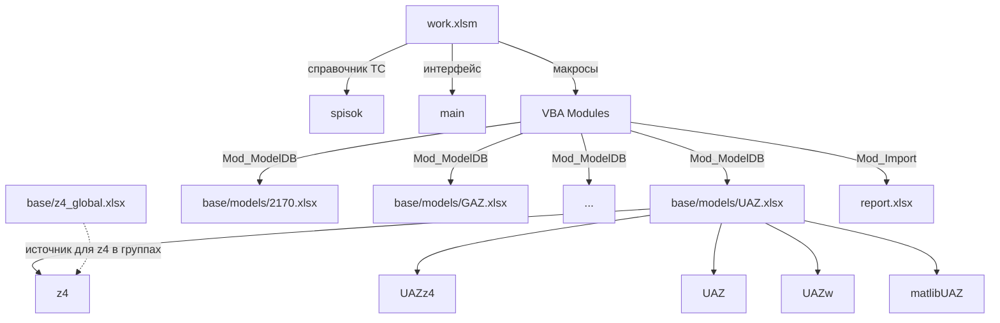
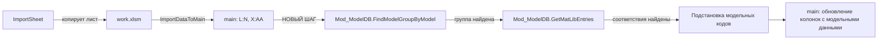

# Архитектура выноса данных работ и запчастей из work.xlsm

> Версия: 1.0
> Проект: SysW v0.7.1 → v0.8.0
> Статус: Проектирование

---

## 1. Общая схема хранения

### 1.1. Целевая структура каталогов

```
L:\PROject\SysW\
├── work.xlsm                    # Макросы + листы main, spisok (интерфейс)
├── report.xlsx                  # Входящие документы (не изменяется)
│
├── base\
│   ├── models\                  # Файлы модельных групп
│   │   ├── .gitkeep
│   │   ├── 2170.xlsx            # Группа 2170
│   │   ├── UAZ.xlsx             # Группа UAZ
│   │   ├── GAZ.xlsx             # Группа GAZ
│   │   └── ...                  # Другие группы
│   │
│   └── z4_global.xlsx           # Глобальная база запчастей (700 000 поз.)
│
├── src\                         # Исходный код VBA (без изменений)
├── docs\                        # Документация
├── plans\                       # Планы
└── scripts\                     # Скрипты автоматизации
```

### 1.2. Принцип именования файлов модельных групп

| Правило | Пример |
|---------|--------|
| Имя файла = ключ группы из листа model (колонка B) | `UAZ.xlsx`, `2170.xlsx`, `GAZ.xlsx` |
| Регистр букв сохраняется как в model | `UAZ.xlsx` ≠ `uaz.xlsx` |
| Расширение — `.xlsx` (без макросов) | `UAZ.xlsx` |
| Недопустимые символы в имени файла заменяются на `_` | `VAZ-2110` → `VAZ_2110.xlsx` |

### 1.3. Структура файла глобальной базы запчастей

Файл: `base/z4_global.xlsx`

| Лист | Назначение |
|------|-----------|
| `z4` | Единый список всех запчастей (до 700 000 строк) |

### 1.4. Структура файла модельной группы

Файл: `base/models/{GroupName}.xlsx`

| Лист | Назначение | Источник наполнения |
|------|-----------|-------------------|
| `z4` | Все запчасти для данной группы (подмножество из z4_global) | Выборка из z4_global |
| `{GroupName}z4` | Модельные запчасти с аннотациями | Формируется пользователем |
| `{GroupName}` | Все работы для данной группы | Исходная база работ (~2000 поз.) |
| `{GroupName}w` | Модельные работы с аннотациями | Формируется пользователем |
| `matlib{GroupName}` | Библиотека соответствий | Формируется пользователем |

**Пример для группы UAZ:**

```
UAZ.xlsx
├── z4              — все запчасти UAZ
├── UAZz4           — модельные запчасти UAZ с аннотациями
├── UAZ             — все работы UAZ
├── UAZw            — модельные работы UAZ с аннотациями
└── matlibUAZ       — библиотека соответствий UAZ
```

### 1.5. Схема связей между файлами



---

## 2. Спецификация листов

### 2.1. Лист `z4` (глобальный и в каждой группе)

**Назначение:** Хранение полного каталога запчастей. В `z4_global.xlsx` — все 700 000 позиций. В файле группы — подмножество, отфильтрованное по модели.

**Колонки:**

| № | Имя колонки | Тип данных | Обязательность | Описание |
|---|------------|-----------|---------------|----------|
| A | Code | String (50) | Да | Код запчасти (уникальный) |
| B | Name | String (255) | Да | Наименование запчасти |
| C | Unit | String (20) | Нет | Единица измерения (шт, кг, л) |
| D | Price | Currency | Нет | Цена за единицу |
| E | Note | String (255) | Нет | Примечание |

**Пример данных:**

| A | B | C | D | E |
|---|---|---|---|---|
| 2101-1001015 | Блок цилиндров ВАЗ 2101 | шт | 15000.00 | |
| 2108-1102010 | Фильтр воздушный | шт | 350.00 | аналог |
| 2123-1803020 | Карданный вал | шт | 8500.00 | |

**Ожидаемый объём:** до 700 000 строк в глобальной базе, до 50 000 в групповой.

---

### 2.2. Лист `{GroupName}z4` (модельные запчасти)

**Назначение:** Аннотированный перечень запчастей, привязанных к конкретной модели. Содержит ссылки на коды из листа `z4` и дополнительные поля.

**Колонки:**

| № | Имя колонки | Тип данных | Обязательность | Описание |
|---|------------|-----------|---------------|----------|
| A | z4Code | String (50) | Да | Код запчасти (ссылка на z4.Code) |
| B | Name | String (255) | Да | Наименование (может отличаться от z4) |
| C | Quantity | Double | Да | Нормативное количество |
| D | Unit | String (20) | Нет | Единица измерения |
| E | Note | String (255) | Нет | Аннотация, примечание по установке |
| F | Category | String (50) | Нет | Категория (двигатель, ходовая, кузов) |

**Пример данных:**

| A | B | C | D | E | F |
|---|---|---|---|---|---|
| 2101-1001015 | Блок цилиндров УАЗ Patriot | 1 | шт | Только дизель | двигатель |
| 2108-1102010 | Фильтр воздушный Patriot | 2 | шт | Замена каждые 15 000 км | двигатель |

**Ожидаемый объём:** от 0 до 5 000 строк на группу (формируется пользователем).

---

### 2.3. Лист `{GroupName}` (все работы группы)

**Назначение:** Полный перечень работ для данной модели/группы. Исходная база.

**Колонки:**

| № | Имя колонки | Тип данных | Обязательность | Описание |
|---|------------|-----------|---------------|----------|
| A | Code | String (50) | Да | Код работы (уникальный в пределах группы) |
| B | Name | String (255) | Да | Наименование работы |
| C | Unit | String (20) | Нет | Единица измерения (н/ч, шт) |
| D | NormHours | Double | Нет | Норматив в нормо-часах |
| E | Price | Currency | Нет | Цена работы |
| F | Note | String (255) | Нет | Примечание |

**Пример данных:**

| A | B | C | D | E | F |
|---|---|---|---|---|---|
| UAZ-001 | Замена масла в двигателе | н/ч | 0.5 | 1200.00 | |
| UAZ-002 | Замена тормозных колодок | н/ч | 1.2 | 2880.00 | передние |
| UAZ-003 | Регулировка клапанов | н/ч | 0.8 | 1920.00 | |

**Ожидаемый объём:** ~2 000 строк на группу. Начально 8 групп.

---

### 2.4. Лист `{GroupName}w` (модельные работы)

**Назначение:** Аннотированный перечень работ с привязкой к конкретной модели. Содержит ссылки на коды из листа `{GroupName}`.

**Колонки:**

| № | Имя колонки | Тип данных | Обязательность | Описание |
|---|------------|-----------|---------------|----------|
| A | WorkCode | String (50) | Да | Код работы (ссылка на {GroupName}.Code) |
| B | Name | String (255) | Да | Наименование (может отличаться) |
| C | NormHours | Double | Нет | Скорректированный норматив |
| D | Price | Currency | Нет | Скорректированная цена |
| E | Note | String (255) | Нет | Аннотация, особенности выполнения |

**Пример данных:**

| A | B | C | D | E |
|---|---|---|---|---|
| UAZ-001 | Замена масла Patriot 3163 | 0.6 | 1440.00 | Масло 5W-40 |
| UAZ-002 | Замена колодок Patriot 3163 | 1.5 | 3600.00 | С датчиком износа |

**Ожидаемый объём:** от 0 до 2 000 строк на группу (формируется пользователем).

---

### 2.5. Лист `matlib{GroupName}` (библиотека соответствий)

**Назначение:** Хранение связей между входящими позициями (из `report.xlsx`) и модельными позициями (из `{GroupName}`, `{GroupName}z4`). Поддерживает сложные соответствия 1:N, N:1, N:M.

**Колонки:**

| № | Имя колонки | Тип данных | Обязательность | Описание |
|---|------------|-----------|---------------|----------|
| A | EntryType | String (10) | Да | Тип входящей позиции: `work` или `part` |
| B | EntryCode | String (100) | Да | Код входящей позиции (из report.xlsx) |
| C | EntryName | String (255) | Нет | Наименование входящей позиции (для справки) |
| D | TargetType | String (10) | Да | Тип целевой позиции: `work`, `mod_work`, `part`, `mod_part` |
| E | TargetCode | String (50) | Да | Код целевой позиции (из {GroupName}.Code или {GroupName}z4.z4Code) |
| F | TargetName | String (255) | Нет | Наименование целевой позиции (для справки) |
| G | Coefficient | Double | Да | Коэффициент пересчёта (по умолчанию 1.0) |
| H | TargetSheet | String (50) | Да | Имя листа, где находится целевая позиция |
| I | Note | String (255) | Нет | Примечание к соответствию |

**Поддержка сложных связей:**

| Сценарий | Пример | Запись 1 | Запись 2 | Запись 3 |
|----------|--------|---------|---------|---------|
| 1 входящая работа = 1 модельная работа | Замена масла → UAZ-001 | work | EXTERNAL-001 | work | UAZ-001 | 1.0 | UAZ | |
| 1 входящая работа = 2 модельных работы | Замена ГРМ → UAZ-010 + UAZ-011 | work | EXTERNAL-002 | work | UAZ-010 | 1.0 | UAZ | |
|  |  | work | EXTERNAL-002 | work | UAZ-011 | 1.0 | UAZ | |
| 1 входящая работа = 1 работа + 2 запчасти | Замена масла → UAZ-001 + 2101-1001015 + 2108-1102010 | work | EXTERNAL-003 | work | UAZ-001 | 1.0 | UAZ | |
|  |  | work | EXTERNAL-003 | mod_part | 2101-1001015 | 1.0 | UAZz4 | |
|  |  | work | EXTERNAL-003 | mod_part | 2108-1102010 | 2.0 | UAZz4 | Коэффициент 2 = 2 шт |
| 2 входящих работы = 1 модельная | Снятие + установка генератора → UAZ-020 | work | EXTERNAL-004A | work | UAZ-020 | 0.5 | UAZ | Демонтаж |
|  |  | work | EXTERNAL-004B | work | UAZ-020 | 0.5 | UAZ | Монтаж |

**Ключевые правила:**
- Одна входящая позиция может быть разложена на несколько целевых (1:N) — несколько строк с одинаковым `EntryCode`.
- Несколько входящих позиций могут быть собраны в одну целевую (N:1) — одинаковый `TargetCode`.
- Коэффициент позволяет задавать пересчёт количества (например, 2 запчасти на 1 работу).
- `TargetSheet` указывает, в каком листе искать целевую позицию (для быстрого доступа).

**Ожидаемый объём:** от 0 до 10 000 строк на группу.

---

## 3. Модуль `Mod_ModelDB` — спецификация

### 3.1. Общее описание

Новый модуль `Mod_ModelDB` будет отвечать за все операции с файлами модельных групп: создание, открытие, поиск, чтение данных. Модуль реализует слой абстракции между бизнес-логикой и физическим хранением данных.

### 3.2. Константы

```vba
' Каталог с файлами групп
Public Const MODELDB_BASE_PATH As String = "L:\PROject\SysW\base\models\"

' Каталог с глобальной базой запчастей
Public Const MODELDB_GLOBAL_Z4_PATH As String = "L:\PROject\SysW\base\z4_global.xlsx"

' Имена листов (шаблоны)
Public Const MODELDB_SHEET_Z4 As String = "z4"
Public Const MODELDB_SHEET_MODEL_Z4_SUFFIX As String = "z4"       ' {Group}z4
Public Const MODELDB_SHEET_WORKS As String = ""                    ' {GroupName}
Public Const MODELDB_SHEET_MODEL_WORKS_SUFFIX As String = "w"     ' {GroupName}w
Public Const MODELDB_SHEET_MATLIB_SUFFIX As String = "matlib"     ' matlib{GroupName}
```

### 3.3. Функции

---

#### `CreateModelGroupFile`

```vba
Public Function CreateModelGroupFile(groupName As String) As Boolean
```

**Назначение:** Создаёт новый файл группы `{groupName}.xlsx` с пустыми листами.

**Параметры:**
| Параметр | Тип | Описание |
|----------|-----|----------|
| `groupName` | `String` | Имя группы (ключ из model.column B) |

**Возвращает:** `True` если файл создан успешно, `False` если файл уже существует или произошла ошибка.

**Логика:**
1. Проверяет, существует ли файл `base/models/{groupName}.xlsx`
2. Если существует — возвращает `False` (не перезаписывает)
3. Если не существует — создаёт новую книгу с листами:
   - `z4`
   - `{groupName}z4`
   - `{groupName}`
   - `{groupName}w`
   - `matlib{groupName}`
4. Сохраняет файл, закрывает
5. Возвращает `True`

---

#### `OpenModelGroupFile`

```vba
Public Function OpenModelGroupFile(groupName As String) As Workbook
```

**Назначение:** Открывает файл группы `{groupName}.xlsx` (если ещё не открыт) и возвращает ссылку на Workbook.

**Параметры:**
| Параметр | Тип | Описание |
|----------|-----|----------|
| `groupName` | `String` | Имя группы |

**Возвращает:** `Workbook` если файл существует и открыт, `Nothing` если файл не найден.

**Логика:**
1. Проверяет, не открыт ли уже файл `{groupName}.xlsx` в `Workbooks` коллекции
2. Если открыт — возвращает ссылку на него
3. Если не открыт — проверяет существование файла через `Dir()`
4. Если файл существует — открывает `ReadOnly:=False`, возвращает ссылку
5. Если файл не существует — возвращает `Nothing`

---

#### `FindModelGroupByModel`

```vba
Public Function FindModelGroupByModel(modelName As String) As String
```

**Назначение:** Определяет имя группы по названию модели. Ищет в листе `model` (work.xlsm) соответствие модели и группы.

**Параметры:**
| Параметр | Тип | Описание |
|----------|-----|----------|
| `modelName` | `String` | Название модели (из spisok.column B) |

**Возвращает:** Имя группы (String) если найдено, пустую строку `""` если не найдено.

**Логика:**
1. Открывает лист `model` в `ThisWorkbook`
2. Ищет `modelName` в колонке A (Модель)
3. Если найдено — возвращает значение из колонки B (Группа)
4. Если не найдено — возвращает `""`

---

#### `GetParts`

```vba
Public Function GetParts(groupName As String, filters As Variant) As Collection
```

**Назначение:** Возвращает коллекцию запчастей из листа `z4` файла группы с применением фильтров.

**Параметры:**
| Параметр | Тип | Описание |
|----------|-----|----------|
| `groupName` | `String` | Имя группы |
| `filters` | `Variant` | Массив фильтров: `Array("Code", "2101-*")` или `Array("Name", "*масло*")` |

**Возвращает:** `Collection` объектов `PartEntry` (Code, Name, Unit, Price, Note). Пустая коллекция если ничего не найдено.

**Логика:**
1. Открывает файл группы через `OpenModelGroupFile`
2. Читает данные листа `z4` с конца (последняя заполненная строка)
3. Применяет фильтры (поддержка wildcard `*`)
4. Возвращает коллекцию найденных запчастей

**Структура PartEntry:**

```vba
Public Type PartEntry
    Code As String
    Name As String
    Unit As String
    Price As Currency
    Note As String
End Type
```

---

#### `GetWorks`

```vba
Public Function GetWorks(groupName As String, filters As Variant) As Collection
```

**Назначение:** Возвращает коллекцию работ из листа `{groupName}` файла группы с применением фильтров.

**Параметры:**
| Параметр | Тип | Описание |
|----------|-----|----------|
| `groupName` | `String` | Имя группы |
| `filters` | `Variant` | Массив фильтров |

**Возвращает:** `Collection` объектов `WorkEntry`. Пустая коллекция если ничего не найдено.

**Структура WorkEntry:**

```vba
Public Type WorkEntry
    Code As String
    Name As String
    Unit As String
    NormHours As Double
    Price As Currency
    Note As String
End Type
```

---

#### `GetMatLibEntries`

```vba
Public Function GetMatLibEntries(groupName As String, entryCode As String) As Collection
```

**Назначение:** Возвращает все соответствия для указанной входящей позиции из библиотеки соответствий.

**Параметры:**
| Параметр | Тип | Описание |
|----------|-----|----------|
| `groupName` | `String` | Имя группы |
| `entryCode` | `String` | Код входящей позиции (из report.xlsx) |

**Возвращает:** `Collection` объектов `MatLibEntry`. Пустая коллекция если соответствий нет.

**Логика:**
1. Открывает файл группы через `OpenModelGroupFile`
2. Читает лист `matlib{groupName}`
3. Фильтрует строки по `EntryCode` (колонка B)
4. Для каждой найденной строки создаёт `MatLibEntry`
5. Возвращает коллекцию

**Структура MatLibEntry:**

```vba
Public Type MatLibEntry
    EntryType As String       ' work / part
    EntryCode As String
    EntryName As String
    TargetType As String      ' work / mod_work / part / mod_part
    TargetCode As String
    TargetName As String
    Coefficient As Double
    TargetSheet As String
    Note As String
End Type
```

---

#### `GetModelParts` (дополнительная)

```vba
Public Function GetModelParts(groupName As String, filters As Variant) As Collection
```

**Назначение:** Возвращает коллекцию модельных запчастей из листа `{groupName}z4`.

**Параметры:** Аналогично `GetParts`.

**Возвращает:** `Collection` объектов `ModelPartEntry`.

**Структура ModelPartEntry:**

```vba
Public Type ModelPartEntry
    z4Code As String
    Name As String
    Quantity As Double
    Unit As String
    Note As String
    Category As String
End Type
```

---

#### `GetModelWorks` (дополнительная)

```vba
Public Function GetModelWorks(groupName As String, filters As Variant) As Collection
```

**Назначение:** Возвращает коллекцию модельных работ из листа `{groupName}w`.

**Параметры:** Аналогично `GetWorks`.

**Возвращает:** `Collection` объектов `ModelWorkEntry`.

**Структура ModelWorkEntry:**

```vba
Public Type ModelWorkEntry
    WorkCode As String
    Name As String
    NormHours As Double
    Price As Currency
    Note As String
End Type
```

---

### 3.4. Вспомогательные функции

```vba
' Санитизация имени файла: замена недопустимых символов на _
Public Function SanitizeFileName(name As String) As String

' Проверка существования файла группы
Public Function ModelGroupFileExists(groupName As String) As Boolean

' Получение полного пути к файлу группы
Public Function GetModelGroupFilePath(groupName As String) As String

' Получение списка всех доступных групп (сканирование каталога)
Public Function GetAllModelGroups() As Collection
```

---

## 4. Интеграция с существующими модулями

### 4.1. Изменения в `Mod_Import`

**Текущая логика:**
1. `ImportSheet(grz)` — копирует лист из `report.xlsx` в `work.xlsm`
2. `ImportDataToMain(wsSource)` — переносит данные из листа-источника в лист `main` (колонки L:N — работы, X:AA — запчасти)

**Архитектурные изменения:**



**Что меняется:**
1. После `ImportDataToMain` добавляется вызов `Mod_ModelDB.FindModelGroupByModel` для определения группы по модели из B4
2. Для каждой импортированной работы/запчасти вызывается `Mod_ModelDB.GetMatLibEntries` для поиска соответствий
3. Найденные соответствия подставляются в дополнительные колонки на листе `main`
4. Если группа не найдена — пользователю предлагается создать новый файл группы через `CreateModelGroupFile`

**Новые колонки на листе main (предложение):**

| Диапазон | Сейчас | После изменений |
|----------|--------|----------------|
| L:N | Импорт работ (наименование, объём, цена) | Без изменений |
| O:P | — | Код модельной работы + коэффициент (из matlib) |
| X:AA | Импорт запчастей (наименование, код, кол-во, цена) | Без изменений |
| AB:AC | — | Код модельной запчасти + коэффициент (из matlib) |

### 4.2. Изменения в `Mod_OrderHeader`

**Текущая логика:**
1. `FillHeaderFromOrder(orderNum)` — читает данные из `spisok` и `model` (листы в `work.xlsm`)
2. Заполняет B3:B15 на листе `main`

**Архитектурные изменения:**


**Что меняется:**
1. После определения группы (model.column B) вызывается `Mod_ModelDB.OpenModelGroupFile` для открытия/подтверждения доступности файла группы
2. В `main` добавляется скрытая строка или ячейка с путём к текущему файлу группы (для быстрого доступа другим модулям)
3. `Mod_OrderHeader` больше не читает данные работ/запчастей из листа `model` — только группу и цену н/ч
4. Данные работ и запчастей читаются через `Mod_ModelDB.GetWorks` / `Mod_ModelDB.GetParts`

### 4.3. Изменения в `Mod_Constants`

**Что меняется:**
1. Добавляются константы для новых колонок на листе `main` (модельные коды, коэффициенты)
2. Константы для листа `model` остаются, но часть из них (WORK_ORIG, WORKS_MOD, Z4_MOD) становится неактуальной — данные будут во внешних файлах

### 4.4. Изменения в `Mod_SheetOps`

**Что меняется:**
1. Функция `SearchSheetByGRZ` остаётся без изменений — она работает с `report.xlsx`
2. Добавляется новая функция `GetModelGroupForCurrentOrder` — определяет, какой файл группы открыт для текущего заказа

### 4.5. Изменения в `Sheet1_main` (класс листа)

**Что меняется:**
1. Обработчик `Worksheet_Change` для B2 остаётся без изменений
2. Добавляется обработчик для новых ячеек, связанных с выбором модельных позиций

### 4.6. Изменения в `Mod_MainButtons`

**Что меняется:**
1. Кнопки `AUTOz4` и `AUTOw` (автоподбор) — будут использовать `Mod_ModelDB.GetParts` / `Mod_ModelDB.GetWorks` для поиска
2. Кнопки `MANz4` и `MANw` (ручной подбор) — будут открывать UI для выбора из внешних файлов через `Mod_ModelDB`

---

## 5. Подготовка к SQLite

### 5.1. Абстракции, закладываемые сейчас

Для облегчения будущей миграции с Excel на SQLite, в `Mod_ModelDB` закладываются следующие абстракции:

#### 5.1.1. Интерфейсный модуль `IModelDataProvider`

Концептуальный интерфейс (через `VBA Interface` или документированный контракт):

```vba
' Контракт провайдера данных моделей
' Реализации: Mod_ModelDB (Excel), Mod_SQLiteDB (SQLite)
'
' Methods:
'   Function GetParts(groupName, filters) As Collection
'   Function GetWorks(groupName, filters) As Collection
'   Function GetModelParts(groupName, filters) As Collection
'   Function GetModelWorks(groupName, filters) As Collection
'   Function GetMatLibEntries(groupName, entryCode) As Collection
'   Function CreateModelGroupFile(groupName) As Boolean
'   Function ModelGroupFileExists(groupName) As Boolean
'   Function GetAllModelGroups() As Collection
```

#### 5.1.2. Единые структуры данных (Type)

Все `Type`-структуры (`PartEntry`, `WorkEntry`, `MatLibEntry` и т.д.) выносятся в отдельный модуль `Mod_DataTypes` — они будут одинаковыми для Excel и SQLite реализации.

#### 5.1.3. Фабричный метод

```vba
Public Function GetModelDataProvider() As Object
    ' Возвращает экземпляр Mod_ModelDB или Mod_SQLiteDB
    ' в зависимости от настроек
End Function
```

#### 5.1.4. Изоляция файловых операций

Все операции с файловой системой (открытие/закрытие книг, пути) изолированы в `Mod_ModelDB`. При переходе на SQLite:
- `OpenModelGroupFile` → `OpenSQLiteDatabase`
- `CreateModelGroupFile` → `CreateSQLiteDatabase`
- Чтение листов → SQL-запросы `SELECT`

### 5.2. Будущий модуль `Mod_SQLiteDB`

**Сигнатуры функций** (идентичны `Mod_ModelDB`):

```vba
' Mod_SQLiteDB

Public Function GetParts(groupName As String, filters As Variant) As Collection
    ' SQL: SELECT * FROM z4 WHERE groupName = ? AND (code LIKE ? OR name LIKE ?)
End Function

Public Function GetWorks(groupName As String, filters As Variant) As Collection
    ' SQL: SELECT * FROM works WHERE groupName = ?
End Function

Public Function GetMatLibEntries(groupName As String, entryCode As String) As Collection
    ' SQL: SELECT * FROM matlib WHERE groupName = ? AND entryCode = ?
End Function

Public Function CreateModelGroupFile(groupName As String) As Boolean
    ' SQL: CREATE TABLE IF NOT EXISTS ...
    ' Создаёт таблицы: z4, model_z4, works, model_works, matlib
End Function
```

### 5.3. Что изменится при переходе на SQLite

| Аспект | Сейчас (Excel) | Потом (SQLite) |
|--------|---------------|----------------|
| Хранение | Файлы .xlsx в `base/models/` | Один файл .db или несколько по группам |
| Доступ к данным | `Workbook.Sheets("z4").Cells(row, col)` | `SQLite3.Execute("SELECT ...")` |
| Фильтрация | Цикл по строкам + `InStr`/`Like` | `WHERE code LIKE '%...%'` |
| Производительность | Замедление при >100 000 строк | Быстрые индексы, <1ms на запрос |
| Одновременный доступ | Только один пользователь | Возможен многопользовательский |
| Сложность связей | Многострочные соответствия в matlib | JOIN-запросы |
| Резервное копирование | Копирование .xlsx | `.backup` команда SQLite |

### 5.4. Рекомендации по структуре таблиц SQLite (на будущее)

```sql
-- Таблица групп (справочник)
CREATE TABLE model_groups (
    group_name TEXT PRIMARY KEY,
    created_at TEXT DEFAULT (datetime('now')),
    note TEXT
);

-- Таблица запчастей (глобальная)
CREATE TABLE parts (
    code TEXT PRIMARY KEY,
    name TEXT NOT NULL,
    unit TEXT,
    price REAL,
    note TEXT
);

-- Таблица запчастей по группам (связь многие-ко-многим)
CREATE TABLE group_parts (
    group_name TEXT NOT NULL,
    part_code TEXT NOT NULL,
    PRIMARY KEY (group_name, part_code),
    FOREIGN KEY (group_name) REFERENCES model_groups(group_name),
    FOREIGN KEY (part_code) REFERENCES parts(code)
);

-- Таблица модельных запчастей
CREATE TABLE model_parts (
    id INTEGER PRIMARY KEY AUTOINCREMENT,
    group_name TEXT NOT NULL,
    z4_code TEXT NOT NULL,
    name TEXT,
    quantity REAL DEFAULT 1.0,
    unit TEXT,
    note TEXT,
    category TEXT,
    FOREIGN KEY (group_name) REFERENCES model_groups(group_name)
);

-- Таблица работ
CREATE TABLE works (
    code TEXT NOT NULL,
    group_name TEXT NOT NULL,
    name TEXT NOT NULL,
    unit TEXT,
    norm_hours REAL,
    price REAL,
    note TEXT,
    PRIMARY KEY (code, group_name),
    FOREIGN KEY (group_name) REFERENCES model_groups(group_name)
);

-- Таблица модельных работ
CREATE TABLE model_works (
    id INTEGER PRIMARY KEY AUTOINCREMENT,
    group_name TEXT NOT NULL,
    work_code TEXT NOT NULL,
    name TEXT,
    norm_hours REAL,
    price REAL,
    note TEXT,
    FOREIGN KEY (group_name) REFERENCES model_groups(group_name)
);

-- Таблица библиотеки соответствий
CREATE TABLE matlib (
    id INTEGER PRIMARY KEY AUTOINCREMENT,
    group_name TEXT NOT NULL,
    entry_type TEXT NOT NULL CHECK(entry_type IN ('work', 'part')),
    entry_code TEXT NOT NULL,
    entry_name TEXT,
    target_type TEXT NOT NULL CHECK(target_type IN ('work', 'mod_work', 'part', 'mod_part')),
    target_code TEXT NOT NULL,
    target_name TEXT,
    coefficient REAL DEFAULT 1.0,
    target_sheet TEXT,
    note TEXT,
    FOREIGN KEY (group_name) REFERENCES model_groups(group_name)
);

-- Индексы для производительности
CREATE INDEX idx_matlib_entry ON matlib(group_name, entry_code);
CREATE INDEX idx_matlib_target ON matlib(group_name, target_code);
CREATE INDEX idx_works_group ON works(group_name);
CREATE INDEX idx_group_parts_group ON group_parts(group_name);
```

---

## 6. План миграции (пошагово)

### Фаза 1: Подготовка инфраструктуры

1. Создать каталог `base/models/` с `.gitkeep`
2. Создать файл `base/z4_global.xlsx` с листом `z4` (импорт существующей базы запчастей)
3. Создать модуль `Mod_DataTypes` с Type-структурами
4. Создать модуль `Mod_ModelDB` с базовыми функциями (Create, Open, Find)

### Фаза 2: Перенос данных

5. Для каждой существующей группы из листа `model`:
   - Создать файл `{GroupName}.xlsx` через `CreateModelGroupFile`
   - Перенести работы из листа `model` в соответствующие листы
   - Перенести запчасти из `z4` (если есть) в лист `z4` файла группы
6. Выгрузить глобальную базу запчастей в `z4_global.xlsx`

### Фаза 3: Интеграция

7. Модифицировать `Mod_Import` для работы с `Mod_ModelDB`
8. Модифицировать `Mod_OrderHeader` для работы с `Mod_ModelDB`
9. Обновить `Mod_Constants` (новые константы)
10. Обновить `Mod_MainButtons` (кнопки подбора)

### Фаза 4: Тестирование

11. Проверить импорт из `report.xlsx` с подстановкой соответствий
12. Проверить заполнение шапки заказа
13. Проверить создание новых групп
14. Проверить производительность на 700 000 запчастей

---

## 7. Риски и ограничения

| Риск | Влияние | Митигация |
|------|---------|-----------|
| Excel зависает при открытии `z4_global.xlsx` с 700 000 строк | Критическое | Использовать Power Query или разбить на подмножества; SQLite решит проблему |
| Пользователь создаёт дублирующиеся группы | Среднее | Проверка в `CreateModelGroupFile`; поиск по частичному совпадению имени |
| Потеря связей в matlib при переименовании группы | Высокое | Хранить `groupName` как ключ; при переименовании обновлять все ссылки |
| Конфликт имён листов (Excel ограничение 31 символ) | Среднее | Обрезать имя группы до 31 символа для имён листов |
| Одновременное открытие файла группы из нескольких экземпляров Excel | Среднее | Проверка `IsFileOpen` перед записью; работа только через `OpenModelGroupFile` |