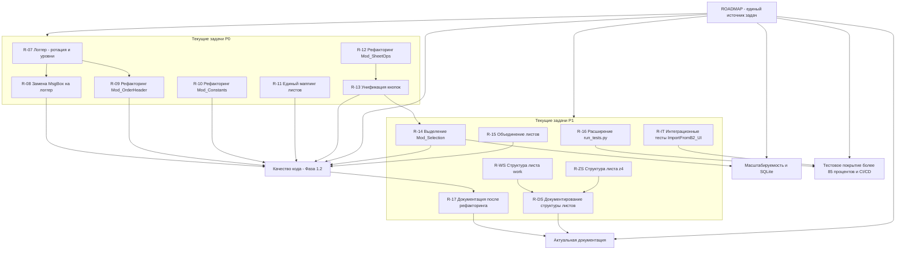

# План развития системы SysW (Roadmap)

> **Версия системы:** 1.1.0
> **Дата:** 2026-08-26
> **Статус:** Актуализирован (**v1.0.15**): механизм инициации пользовательских файлов
> (`scripts/initiate_models.py` — детекция новых групп в `base/models/`, регистрация в
> `SysW.db` и миграция данных), единый публичный хелпер `Mod_Utils.GetGroupName` (DRY: три
> дубля чтения `main!$B$14` заменены), стилевой рефакторинг `Mod_AutoMatch`, актуализация
> `{B2}M`→`{B4}M`; тесты расширены до TC-64. Ранее (v1.0.14): финализация релиза и
> документации; v1.0.12 — универсальный поиск листов (имя группы из `main!$B$14`,
> нейтральные `Btn_Search_*`/`Btn_ClearFilter`).

---

## 1. Текущее состояние

Система SysW (v1.0.15) — модульная VBA-надстройка для Excel с обвязкой на Python/PowerShell, автоматизирующая обработку заказ-нарядов авторемонта (импорт данных из отчётов, заполнение шапки заказа, поиск по ГРЗ, учёт работ и запчастей).

### Что реализовано

| Область | Статус | Подробности |
|---------|--------|-------------|
| **Структура проекта** | ✅ v0.6.0, актуализировано v1.0.10 | `src/modules/` (13 `.bas`), `src/classes/` (6 `.cls`), `src/sheets/` (4 `.cls`: Лист2/Лист3/Лист5/Лист9), `scripts/`, `docs/`, `plans/` |
| **Тестирование** | ✅ v0.2.0, актуализировано v1.0.15 | `Mod_FullTestRunner` — TC-01..TC-64 + TC-S1..TC-S3 (полный перечень — см. `docs/DEVELOPER.md`, Приложение F) |
| **Техническая документация** | ✅ v0.5.0 | `docs/DEVELOPER.md` — архитектура, кодировка, CI/CD, тестирование |
| **Реестр макросов, скриптов и тестов** | ✅ v1.0.10, интегрирован v1.1.0 | [`docs/DEVELOPER.md`](DEVELOPER.md), Приложения D–G — полный реестр процедур VBA, скриптов автоматизации и тестов с замечаниями аудита |
| **CI/CD** | ✅ v0.4.0 | GitHub Actions (`vba-check.yml`), `docs/git-workflow.md` |
| **SourceCraft интеграция** | ✅ v0.3.0 | `.ycarules`, `docs/sourcecraft-guide.md` |
| **Двухфазная кодировка** | ✅ | UTF-8 на диске, CP1251 в Excel |
| **Скрипты экспорта/импорта** | ✅ | `export_vba.py`, `impVBA.py` |
| **README.md** | ✅ | Архитектура, быстрый старт, состав команды |
| **CHANGELOG.md** | ✅ | История версий в формате Keep a Changelog |
| **Фаза 1.1 — Критические исправления (P0)** | ✅ v0.7.1 | R-01..R-06: исправление кодировки, `export_vba.py`, утечки, `isProcessing`, диапазоны, дублирование |
| **Аудит стабильности v0.7.1** | ✅ Выполнен | Проверено 13 модулей, найдено 26 проблем (4 Critical, 7 High, 10 Medium, 5 Low), исправлено 11 проблем (4 Critical + 7 High) |
| **Рефакторинг Mod_LibName → Mod_Constants** | ✅ v0.9.0 | Объединение модулей, централизация констант и реестра имён |
| **Импорт с листа B2 (ImportFromB2_UI)** | ✅ v0.10.0 | Новая кнопка "ИМПОРТ ВХ", импорт из `{B4}M` или `report.xlsx` |
| **Исправление импорта (пропуск заголовка)** | ✅ v0.10.0 | Замена `IsNumeric()` на безусловный пропуск 2 строк заголовка |
| **Вынос логов в `logs/`** | ✅ v0.14.0 | Перенос `log.txt` и `test_results.log` в `logs/`, добавление `LOGS_DIR` в `Mod_Constants.bas`, обновление `Mod_Logger.bas`, `Mod_FullTestRunner.bas`, `scripts/config.py`, `scripts/run_tests.py` |

### Модульная архитектура VBA

```
UI-слой:              Лист2_main.cls
                      Mod_ButtonDispatcher  |  Mod_SheetButtons
                           │                          │
Бизнес-логика:       Mod_OrderHeader  |  Mod_Import  |  Mod_SheetOps
                           │                          │
Утилиты:             Mod_Utils  |  Mod_Constants  |  Mod_Logger
                           │
Тестирование:        Mod_FullTestRunner
```

---

## 2. Выполненные задачи

### Фаза 1.1 — Критические исправления (P0) — ✅ v0.7.1

> **Цель:** устранены проблемы, блокирующие работу или ведущие к потере данных.

| ID | Задача | Описание | Затрагиваемые модули/файлы | Версия |
|----|--------|----------|---------------------------|--------|
| R-01 | Исправление кодировки в VBA-модулях | Проверить и исправить кракозябры в комментариях и строках. Пересохранить файлы в UTF-8 без BOM через `export_vba.py` | `Mod_FullTestRunner.bas`, `Mod_Constants.bas`, `Mod_SheetOps.bas`, `Mod_Import.bas`, `Mod_OrderHeader.bas` | v0.7.1 |
| R-02 | Исправление `export_vba.py` | Корректный экспорт в UTF-8 без BOM, обработка пустых строк, добавление недостающих модулей в `COMPONENTS` | `scripts/export_vba.py` | v0.7.1 |
| R-03 | Устранение утечки обработчика | Освобождение обработчика (`wbReport.Close`) во всех модулях при ошибках | `Mod_Import.bas` | v0.7.1 |
| R-04 | Замена `isProcessing` на модульный флаг | Убрать глобальный статический флаг `isProcessing` из `Лист2_main.cls`, сделать локальный для каждого модуля | `Лист2_main.cls` | v0.7.1 |
| R-05 | Диапазон очистки `Mod_SheetOps` | Исправить обработку граничных значений: заменить `"A2:XFD"` на `"B2:ZZ"` | `Mod_Import.bas` | v0.7.1 |
| R-06 | Устранение дублирования кода | Вынести повторяющиеся блоки в `Mod_Utils`. Устранить дублирование `Btn_main_Import` | `Mod_Utils.bas` | v0.7.1 |

### Рефакторинг и новая функциональность — ✅ v0.9.0–v0.10.0

| ID | Задача | Описание | Затрагиваемые модули/файлы | Версия |
|----|--------|----------|---------------------------|--------|
| R-LN | Объединение `Mod_LibName` → `Mod_Constants` | Централизация констант и реестра имён. Добавлены константы `*_NAME`, `SPISOK_COL_NUM`, `SPISOK_COL_GROUP`, записи `models_col_group`, `z4` | `Mod_Constants.bas`, `Mod_LibName.bas` (удалён) | v0.9.0 |
| R-IM | Импорт с листа B2 (`ImportFromB2_UI`) | Новая процедура импорта данных на лист "мэйн" из листа `{B4}M`; если листа нет — копирует из `report.xlsx` | `Mod_Import.bas`, `Mod_ButtonDispatcher.bas` | v0.10.0 |
| R-IF | Исправление импорта (пропуск заголовка) | Замена циклов `IsNumeric()` на безусловный пропуск 2 строк заголовка таблиц | `Mod_Import.bas` | v0.10.0 |

---

## 3. Архитектура и рефакторинг

### Фаза 1.2 — Критические архитектурные изменения (P0, ~18 ч)

> **Цель:** рефакторинг архитектуры — выделение новых модулей, унификация, устранение дублирования.
> **Риск:** средний. Требуется тестирование после каждого изменения.

| ID | Задача | Описание | Затрагиваемые модули/файлы | Критерии готовности |
|----|--------|----------|---------------------------|---------------------|
| R-07 | Выделение `Mod_Logger` в отдельный модуль | Централизованное логирование с ротацией вместо `Mod_Utils.WriteLog`. Реализовать: `WriteLog(Message, Level)`, `SetLogFile(Path)`, `SetMaxSize(Bytes)`, автоматическую ротацию | `Mod_Logger.bas` (доработать), `Mod_Utils.bas` (удалить `WriteLog`) | Логи пишутся с уровнями; ротация работает при превышении размера |
| R-08 | Замена `MsgBox` на Logger | Во всех модулях заменить прямые вызовы `MsgBox` на `Mod_Logger`. Создать `_UI`-обёртки для пользовательских диалогов | Все модули | `MsgBox` остаётся только в `_UI`-обёртках; чистые функции не содержат диалогов |
| R-09 | Рефакторинг `Mod_OrderHeader` | Разделение на подфункции, уменьшение связанности. Убрать `MsgBox` из `FillHeaderFromOrder`, вынести в `_UI`-обёртку | `Mod_OrderHeader.bas`, `Лист2_main.cls` | `FillHeaderFromOrder` — чистая функция; `_UI`-обёртка в диспетчере |
| R-10 | Рефакторинг `Mod_Constants` | Вынести магические строки/числа в константы, структурировать по группам. Перенести тип `OrderHeader` из `Mod_Utils`. Создать единый словарь маппинга столбцов | `Mod_Constants.bas`, `Mod_Utils.bas`, `Mod_OrderHeader.bas`, `Mod_Import.bas` | Все константы в одном модуле; магические числа заменены; компиляция проходит |
| R-11 | Маппинг листов | Создать единый словарь маппинга листов вместо разрозненных ссылок по всему коду | `Mod_Constants.bas`, все модули, использующие имена листов | Единая точка изменений для имён листов |
| R-12 | Рефакторинг `Mod_SheetOps` | Разделить на логические блоки, уменьшить размер. Перенести операции с листами из `Mod_Import` | `Mod_SheetOps.bas`, `Mod_Import.bas`, `Mod_ButtonDispatcher.bas` | `Mod_Import` сокращён; все операции с листами в `Mod_SheetOps` |
| R-13 | Унификация кнопок | `Mod_ButtonDispatcher`, `Mod_SheetButtons` — единый интерфейс. Унифицировать нейминг: `Btn_<лист>_<действие>_Click`. Удалить дублирующиеся обработчики | `Mod_ButtonDispatcher.bas`, `Mod_SheetButtons.bas` | Все 13+ кнопок работают; единый стиль именования; нет дублирования |

### Фаза 2 — Высокий приоритет (P1, ~5.5 ч)

> **Цель:** улучшение качества кода, устранение косметических проблем, подготовка к будущему росту.
> **Риск:** низкий. Изменения изолированные.

| ID | Задача | Описание | Затрагиваемые модули/файлы | Критерии готовности |
|----|--------|----------|---------------------------|---------------------|
| R-14 | Выделение `Mod_Selection` | Модуль работы с выделенным диапазоном. Перенести заглушки из `Mod_SheetButtons`. Реализовать базовую логику подбора запчастей и работ | `Mod_Selection.bas` (создать, не реализован), `Mod_SheetButtons.bas`, `Mod_ButtonDispatcher.bas` | Заглушки перенесены; кнопки подбора не падают с ошибкой |
| R-15 | Объединение листов | Единый класс листа `Лист2_main` (архивные `Sheet_work`/`Sheet_z4` удалены). Вынести общую логику в `Mod_SheetCommon` при необходимости | `Лист2_main.cls` | Нет дублирования кода событий |
| R-16 | Расширение `run_tests.py` | Добавить аргументы командной строки (`--module`, `--verbose`, `--output`), генерацию отчётов (JSON/HTML), поддержку выборочного запуска тестов | `scripts/run_tests.py` | `run_tests.py --help` показывает все аргументы; отчёты сохраняются |
| R-17 | Обновление документации после архитектурного рефакторинга | После завершения Фазы 1.2 (R-07..R-13) обновить `DEVELOPER.md` и `README.md` — актуализировать схемы зависимостей, таблицы модулей, маппинг файлов под новую архитектуру | `docs/DEVELOPER.md`, `README.md` | Вся документация соответствует актуальной архитектуре после рефакторинга |

---

## 4. Функциональность

### Фаза 3 — Долгосрочные улучшения (P2, опционально)

> **Цель:** масштабирование для больших справочников (10000+ записей).
> **Риск:** высокий. Требует изменений в архитектуре импорта.

| ID | Задача | Описание | Затрагиваемые модули/файлы | Критерии готовности |
|----|--------|----------|---------------------------|---------------------|
| R-18 | Внешние справочники | Выгрузка справочников в отдельные файлы (CSV/JSON). Создать `справочник_запчастей.xlsx` и `справочник_работ.xlsx`, открываются ReadOnly | `Mod_Selection.bas` (не реализован), новые файлы справочников | Подбор работает с внешними справочниками; поиск через AutoFilter |
| R-19 | SQLite | Замена Excel-справочников на SQLite через ADO. Индексация по VIN/модели/ГРЗ для быстрого поиска среди 700000+ записей | `Mod_Selection.bas` (не реализован), `SysW.db` | Сложные запросы (JOIN, WHERE, ORDER BY) через SQLite; производительность выше циклов VBA |
| R-20 | CI/CD расширение | Pre-commit hook (проверка кодировки UTF-8 без BOM), автоматические прогоны тестов в GitHub Actions при пуше | `.github/workflows/vba-check.yml`, новый `.husky/pre-commit` | Pre-commit проверяет кодировку; CI прогоняет тесты (с SKIP на Linux/MacOS) |
| R-21 | Автоматизация экспорта/импорта | Улучшение скриптов: обработка ошибок, `--dry` режим, логирование операций, параллельный экспорт | `scripts/export_vba.py`, `scripts/impVBA.py` | Все скрипты имеют `--dry` режим; ошибки обрабатываются; есть логи операций |

### Фаза 4 — Низкий приоритет (P3)

> **Цель:** концептуальные улучшения, не имеющие срочности.
> **Риск:** варьируется.

| ID | Задача | Описание | Потенциальные модули |
|----|--------|----------|---------------------|
| R-22 | Интеграция с GitHub Projects | Автоматическое создание issues при добавлении задач в ROADMAP. Связь коммитов с issues через Conventional Commits | `.github/workflows/`, `plans/` |
| R-23 | Генерация документации | Autodoc по VBA-комментариям. Извлечение документации из `'''` комментариев в Markdown | Новый скрипт `scripts/generate_docs.py` |
| R-24 | Веб-интерфейс | Просмотр логов и статусов через веб-страницу. Flask/FastAPI бэкенд, чтение логов `Mod_Logger` | Новый модуль `web/` |
| R-25 | Поддержка нескольких языков | Локализация интерфейса (русский/английский/казахский). Вынос строк в ресурсные файлы | `Mod_Constants.bas`, новые `.res` файлы |

---

## 5. Тестирование и CI/CD

### Текущее состояние

- **63 теста** в `Mod_FullTestRunner.bas` (TC-01..TC-62 + TC-S1..TC-S3): Total=63, Passed=54, Failed=0, Skipped=9 (прогон финализации v1.0.14)
- **Покрытие:** ~89%
- **Запуск:** `python scripts/run_tests.py` (COM-автоматизация Excel)
- **CI/CD:** GitHub Actions — проверка наличия файлов, кодировки UTF-8, синтаксиса VBA, актуальности CHANGELOG

### План расширения

| ID | Задача | Приоритет | Описание |
|----|--------|-----------|----------|
| R-26 | TC-31..TC-35: Unit-тесты для `Mod_Constants` | P2 | Проверка всех констант и маппингов |
| R-27 | TC-36..TC-40: Unit-тесты для `Mod_Logger` (ротация, уровни) | P2 | Проверка ротации при превышении размера, корректности уровней |
| R-28 | TC-41..TC-45: Интеграционные тесты для `Mod_SheetOps` | P2 | Проверка создания/удаления/копирования листов |
| R-29 | Pre-commit hook: проверка UTF-8 | P3 | Автоматическая проверка кодировки `.bas`/`.cls` файлов перед коммитом |
| R-30 | CI: автоматический прогон тестов | P3 | Добавление `run_tests.py` в GitHub Actions (с SKIP на Linux/MacOS) |
| R-31 | CI: проверка покрытия | P4 | Генерация отчёта о покрытии и сравнение с порогом (цель: >85%) |
| **R-IT** | **Интеграционное тестирование ImportFromB2_UI** | **P1** | TC-46..TC-50: проверка импорта с листа B2, копирования из `report.xlsx`, обработки отсутствующего листа, корректности данных после импорта |

---

## 6. Документация

### Текущее состояние

| Документ | Статус | Описание |
|----------|--------|----------|
| `README.md` | ✅ Актуально | Общее описание, архитектура, быстрый старт, состав команды |
| `docs/DEVELOPER.md` | ✅ Актуально (v0.9.0) | Техническая документация: архитектура, кодировка, CI/CD, тестирование |
| `docs/git-workflow.md` | ✅ Актуально | Веточная стратегия, Conventional Commits, pre-commit процедуры |
| `docs/sourcecraft-guide.md` | ✅ Актуально (v0.9.0) | Руководство по SourceCraft, роли, процессы |
| `docs/ARCHITECTURE.md` | 🟡 Проектирование | Архитектура выноса данных работ и запчастей из work.xlsm |
| `docs/ROADMAP.md` | 🆕 Настоящий документ | Единый план развития системы |

### План обновления

| ID | Задача | Приоритет | Описание |
|----|--------|-----------|----------|
| R-32 | Обновление `DEVELOPER.md` после Фазы 1.2 | P2 | Обновить схемы зависимостей, таблицы модулей, маппинг файлов после рефакторинга |
| R-33 | Обновление `README.md` после Фазы 1.2 | P2 | Синхронизировать описание архитектуры с новыми модулями |
| R-34 | Создание `docs/developer-guide.md` | P3 | Руководство для новых разработчиков: как добавить модуль, кнопку, тест |
| R-35 | Обновление `docs/sourcecraft-guide.md` | P3 | Актуализация схемы структуры проекта и ссылок |
| R-36 | Архивирование устаревших планов | P3 | Перенос выполненных планов в `plans/_archive/` (выполнено) |

---

## 7. Интеграция с SourceCraft/GitHub

### Текущее состояние

- `.ycarules` — 8 групп правил (G, Z, K, U, S, O, T, E)
- `docs/sourcecraft-guide.md` — руководство по работе с SourceCraft
- GitHub Actions — базовый CI/CD workflow

### План улучшения

| ID | Задача | Приоритет | Описание |
|----|--------|-----------|----------|
| R-37 | Улучшение `.ycarules` | P2 | Добавить правила для новых модулей (`Mod_Selection` — не реализован), обновить правило `[S1]` |
| **R-YC** | **Доработка `.ycarules` — новые разделы** | **P2** | Добавить раздел 7 "Автодополнение текста" (`[T1]`–`[T4]`) и раздел 8 "Система правил исключений и обязательного вхождения" (`[E1]`–`[E5]`) согласно `plans/_archive/new-ycarules-sections.md` |
| R-38 | Скрипты автоматизации SourceCraft | P3 | Создать скрипты для автоматической генерации планов, проверки соответствия `.ycarules` |
| R-39 | GitHub Projects интеграция | P4 | Автоматическое создание issues из задач ROADMAP; связь коммитов с issues |
| R-40 | Метрики и отчёты | P4 | Генерация отчётов о прогрессе по фазам; дашборд статуса задач |

---

## 8. Структура листов work.xlsm

### Текущее состояние

Структура листов `work` и `z4` в VBA-коде не описана — классы `Sheet_work.cls` и `Sheet_z4.cls` содержат только событие `Worksheet_Activate` с `FreezePanes`. Фактические заголовки столбцов необходимо заполнить из Excel.

### План

| ID | Задача | Приоритет | Описание |
|----|--------|-----------|----------|
| **R-WS** | **Заполнение структуры листа `work`** | **P1** | Открыть `work.xlsm` в Excel, скопировать фактические заголовки столбцов листа `work`, зафиксировать структуру в документации |
| **R-ZS** | **Заполнение структуры листа `z4`** | **P1** | Открыть `work.xlsm` в Excel, скопировать фактические заголовки столбцов листа `z4`, зафиксировать структуру в документации |
| **R-DS** | **Документирование структуры листов** | **P1** | Создать/обновить документ с описанием структуры всех листов `work.xlsm` (main, spisok, model, work, z4) на основе `plans/_archive/structure_current_work.xlsm.md` |

---

## 9. Миграция на SQLite

### Текущее состояние

SQLite-хранилище **реализовано в v1.0.7**: единая база `SysW.db` (корень проекта), DDL в `db/schema.sql`, провайдеры `Mod_SQLiteDB.cls` / `Mod_ModelDBProvider.cls` / `IModelDataProvider.cls`. Данные мигрируются скриптом `scripts/migrate_models_to_sqlite.py`; контроль целостности БД выполняется в составе единого конвейера `scripts/build_all.py`.

### План миграции

| ID | Задача | Приоритет | Описание | Затрагиваемые модули/файлы |
|----|--------|-----------|----------|---------------------------|
| **R-S1** | **Создание каталога `base/models/`** | **P2** | Создать каталог с `.gitkeep` для хранения файлов модельных групп | `base/models/` |
| **R-S2** | **Создание `Mod_ModelTypes`** | **P2** | Модуль с Type-структурами: `PartEntry`, `WorkEntry`, `MatLibEntry`, `ModelPartEntry`, `ModelWorkEntry` | `Mod_ModelTypes.bas` (реализован) |
| **R-S3** | **Создание `Mod_ModelDB`** | **P2** | Модуль с базовыми функциями: `CreateModelGroupFile`, `OpenModelGroupFile`, `FindModelGroupByModel`, `GetParts`, `GetWorks`, `GetMatLibEntries` | `Mod_ModelDB.bas` (реализован) |
| **R-S4** | **Перенос данных групп** | **P2** | Для каждой группы из листа `model` создать файл `{GroupName}.xlsx` и перенести работы/запчасти | `base/models/*.xlsx` |
| **R-S5** | **Интеграция с `Mod_Import`** | **P2** | После `ImportDataToMain` добавить подстановку модельных кодов через `Mod_ModelDB` | `Mod_Import.bas` |
| **R-S6** | **Интеграция с `Mod_OrderHeader`** | **P2** | Чтение данных работ/запчастей через `Mod_ModelDB` вместо листа `model` | `Mod_OrderHeader.bas` |
| **R-S7** | **Подготовка абстракций для SQLite** | **P3** | Интерфейсный модуль `IModelDataProvider`, фабричный метод `GetModelDataProvider`, изоляция файловых операций | `Mod_ModelDB.bas`, `Mod_ModelTypes.bas` |
| **R-S8** | **Создание `Mod_SQLiteDB`** | **P3** | Реализация провайдера данных на SQLite через ADO с идентичным интерфейсом | `Mod_SQLiteDB.cls` (реализован), `SysW.db` |

---

## 10. Сводная информация

### Сводка по фазам

| Фаза | Приоритет | Часы | Задач | Статус |
|------|-----------|------|-------|--------|
| Фаза 1.1 (P0) — Критические исправления | P0 | ~3.5 | 6 (R-01..R-06) | ✅ v0.7.1 |
| Рефакторинг Mod_LibName → Mod_Constants | P0 | ~2.0 | 1 (R-LN) | ✅ v0.9.0 |
| ImportFromB2_UI + исправление импорта | P0 | ~4.0 | 2 (R-IM, R-IF) | ✅ v0.10.0 |
| Вынос логов в `logs/` | P0 | ~1.0 | — | ✅ v0.14.0 |
| Фаза 1.2 — Критические архитектурные изменения | P0 | ~18.0 | 7 (R-07..R-13) | ⬜ Не начата |
| Фаза 2 — Высокий приоритет | P1 | ~5.5 | 4 (R-14..R-17) | ⬜ Не начата |
| Структура листов work.xlsm | P1 | ~2.0 | 3 (R-WS, R-ZS, R-DS) | ⬜ Не начата |
| Интеграционное тестирование ImportFromB2_UI | P1 | ~3.0 | 1 (R-IT) | ⬜ Не начата |
| Фаза 3 — Долгосрочные улучшения | P2 | — | 4 (R-18..R-21) | ⬜ Опционально |
| Миграция на SQLite | P2-P3 | — | 8 (R-S1..R-S8) | ✅ Реализовано (v1.0.7) |
| Фаза 4 — Низкий приоритет | P3 | — | 4 (R-22..R-25) | 💡 Концепции |
| Тестирование и CI/CD | P2-P4 | — | 7 (R-26..R-31, R-IT) | ⬜ План |
| Документация | P2-P3 | — | 5 (R-32..R-36) | ⬜ План |
| SourceCraft/GitHub | P2-P4 | — | 5 (R-37..R-40, R-YC) | ⬜ План |
| **Аудит стабильности v0.7.1** | **P0** | **~4.0** | **11 проблем** | **✅ Выполнен** |
| **Итого** | **P0-P4** | **~38.0** | **55 + аудит** | **⬜ ~20%** |

### Распределение по модулям

| Модуль/файл | Затрагивается задачами |
|-------------|----------------------|
| `Mod_Utils.bas` | R-06, R-07, R-08, R-10 |
| `Mod_OrderHeader.bas` | R-01, R-09, R-10, R-S6 |
| `Mod_Import.bas` | R-01, R-03, R-05, R-10, R-12, R-IM, R-IF, R-S5 |
| `Mod_ButtonDispatcher.bas` | R-12, R-13, R-14, R-IM |
| `Mod_FullTestRunner.bas` | R-01, R-IT |
| `Mod_Logger.bas` | R-07, R-08 |
| `Mod_Constants.bas` | R-01, R-10, R-11, R-LN |
| `Mod_SheetOps.bas` | R-01, R-05, R-12 |
| `Mod_SheetButtons.bas` | R-13, R-14 |
| **`Mod_Selection.bas`** (не реализован) | R-14, R-18, R-19 |
| **`Mod_ModelTypes.bas`** (реализован) | R-S2, R-S7 |
| **`Mod_ModelDB.bas`** (новый) | R-S3, R-S5, R-S6, R-S7 |
| **`Mod_SQLiteDB.bas`** (новый) | R-S8 |
| `Лист2_main.cls` | R-04, R-09, R-15 |
| `scripts/export_vba.py` | R-02, R-21 |
| `scripts/impVBA.py` | R-21 |
| `scripts/run_tests.py` | R-16 |
| `docs/DEVELOPER.md` | R-17, R-32 |
| `docs/ARCHITECTURE.md` | R-S1..R-S8 |
| `README.md` | R-17, R-33 |
| `.ycarules` | R-37, R-YC |
| `.github/workflows/vba-check.yml` | R-20, R-30 |
| `base/models/` | R-S1, R-S4 |

---

## 11. Актуальные задачи и подзадачи

> **Назначение:** этот раздел — единый источник актуальных задач и планов. Статус каждой задачи ведётся здесь через чекбоксы `[ ]` (не выполнено) / `[x]` (выполнено). Таблицы фаз в §3–§9 — справочное/архивное описание задач, актуальный статус отслеживается только в этом разделе.
>
> **Формат строки:** `- [ ] **ID** · тип · связь · условие — описание`
> - **тип:** `текущая` (P0/P1) или `глобальная` (цель верхнего уровня);
> - **связь:** `независимая` либо `зависит от <ID/фазы>`;
> - **условие:** `без условий` либо конкретное условие (например, доступ к `work.xlsm` в Excel).

### Дерево задач



### Текущие задачи P0

- [x] **R-07** · выполнено в v1.1.0 · независимая (старт Фазы 1.2) · без условий — ротация и уровни логирования в `Mod_Logger`: `RotateLogIfNeeded` (системный лог `logs/log.txt`) + тестовый лог `logs/test_results.log` с уровнями INFO/WARN/ERROR через `WriteTestLog`/`LogTestInfo`/`LogTestWarn`/`LogTestError` (реализовано в рамках v1.1.0, Задача 1 «2 лога»; API отличается от исходной спецификации R-07 — вместо `WriteLog(Message, Level)`/`SetLogFile`/`SetMaxSize` используется текущий интерфейс `Mod_Logger`)
- [ ] **R-08** · текущая · зависит от R-07 · без условий — замена `MsgBox` на логгер, `_UI`-обёртки
- [ ] **R-09** · текущая · зависит от R-07 · без условий — рефакторинг `Mod_OrderHeader` (чистые функции)
- [ ] **R-10** · текущая · независимая (в рамках Фазы 1.2) · без условий — рефакторинг `Mod_Constants`, вынос магических чисел
- [ ] **R-11** · текущая · независимая (в рамках Фазы 1.2) · без условий — единый словарь маппинга листов
- [ ] **R-12** · текущая · независимая (в рамках Фазы 1.2) · без условий — рефакторинг `Mod_SheetOps`, перенос операций из `Mod_Import`
- [x] **R-13** · выполнено в v1.0.12 · зависит от R-12 · без условий — унификация кнопок: `Btn_UAZ_*`/`Btn_Parts_*` → нейтральные `Btn_Search_*`/`Btn_ClearFilter`, универсальный поиск листов (`main!$B$14`), добавлен `Btn_main_PickParts_Click`

### Текущие задачи P1

- [ ] **R-14** · текущая · зависит от Фазы 1.2 (R-13) · без условий — выделение `Mod_Selection`
- [ ] **R-15** · текущая · независимая · без условий — объединение листов, единый класс `Лист2_main`
- [ ] **R-16** · текущая · независимая · без условий — расширение `run_tests.py` (`--module`, `--verbose`, `--output`, отчёты)
- [ ] **R-17** · текущая · зависит от Фазы 1.2 · без условий — обновление документации после рефакторинга
- [ ] **R-WS** · текущая · независимая · условие: доступ к `work.xlsm` в Excel — заполнение структуры листа `work`
- [ ] **R-ZS** · текущая · независимая · условие: доступ к `work.xlsm` в Excel — заполнение структуры листа `z4`
- [ ] **R-DS** · текущая · зависит от R-WS и R-ZS · без условий — документирование структуры всех листов `work.xlsm`
- [ ] **R-IT** · текущая · независимая · условие: наличие рабочей книги/отчёта — интеграционное тестирование `ImportFromB2_UI` (TC-46..TC-50)

### Задачи, выполняемые в рамках финализации (v1.0.14)

> Задачи рефакторинга поиска з/ч и работ (плана `plans/plan_1.0.13_refactor_search.md`)
> реализованы и закоммичены локально (коммит `c9fb3d1`, ветка `dev`).

- [ ] **R-PUSH** · текущая (финализация v1.0.14) · независимая · условие: доступ к github.com (сеть/VPN) — выполнить `git push origin dev` (коммит `c9fb3d1`); после успешного пуша — слияние `dev → main` по подтверждению пользователя и возврат на `dev` (отдельный git-этап Orchestrator) <!-- УСТАРЕЛО: коммит c9fb3d1 (финализация v1.0.14) фактически уже слит/превзойдён — проект продвинулся через v1.0.15 до v1.1.0 (см. docs/CHANGELOG.md); точный акт push/merge подтверждается только на этапе git-операций -->
- [x] **R-TESTEXCEL** · выполнено в v1.0.14 · независимая · без условий — полный прогон тестов (`run_tests.py`) включая новые TC-60..62 (группа `RunGlobalBaseTests`): Total=63, Passed=54, Failed=0, Skipped=9
- [ ] **R-Z4GEN** · отложенная (deferred) · независимая · условие: наличие `SysW.db` (после миграции) — запустить `python scripts/build_global_parts.py` для генерации `base/models/z4.xlsx` (650 000+ позиций); **остаётся отложенной, не блокирует релиз**

### Задачи промта 1.1.0 (v1.1.0)

> Регистрация рабочих задач плана [`plans/promt1.1.0_plan.md`](../plans/promt1.1.0_plan.md). Статусы `[x]`/`[ ]` отражают фактическое исполнение по коду/файлам на дату актуализации. Отложенные глобальные цели (Задачи 7, 8, 13) — см. раздел «Глобальные цели верхнего уровня» (`G-COLOR`, `G-UBUNTU`, `G-REESTR`).

- [x] **T01** · текущая (Задача 1) · выполнено · без условий — логгер «2 лога»: системный `logs/log.txt` + расширенный тестовый `logs/test_results.log` (уровни INFO/WARN/ERROR, ошибки VBA); список тестов переработан до **TC-01..TC-64 + TC-S1..TC-S3**
- [ ] **T02** · текущая (Задача 2) · зависит от этапов «РАБОЧЕЙ СХЕМЫ» · без условий — завершение незакрытых этапов «РАБОЧЕЙ СХЕМЫ» 1.0.17 (проверка Debug, документация, очистка, коммит/пуш `dev`, слияние `dev → main`)
- [x] **T03** · текущая (Задача 3) · независимая · без условий — модернизация версионности: `scripts/update_version.py` принимает формат `X.Y.Z.W` (4-й сегмент — шаг внутри промта) без остаточных хвостов
- [ ] **T04** · текущая (Задача 4) · независимая · без условий — синхронизация todo ↔ CHANGELOG ↔ git-коммиты (единая версия 1.1.0; правило `[U7]` внесено, полная связка по версии — на этапе документации/бампа)
- [x] **T05** · текущая (Задача 5) · независимая · без условий — правило «если путь заблокирован — запрос пользователю на снятие блокировки» (правило `[Z8]` в `.ycarules`, синхронизировано)
- [x] **T06** · текущая (Задача 6) · независимая · без условий — расширение правила `[U4]`/`[E3]`: ключевые файлы (`scripts/*`, `src/*`, `.sourcecraft`) и групповые последовательности команд
- [x] **T07** · текущая (Задача 7) · независимая · без условий — цветовая схема листов вынесена в отложенную глобальную задачу `G-COLOR` (зарегистрирована в todo)
- [x] **T08** · текущая (Задача 8) · независимая · без условий — миграция на Ubuntu вынесена в отложенную глобальную задачу `G-UBUNTU` (зарегистрирована в todo)
- [x] **T09** · текущая (Задача 9) · независимая · без условий — новый скрипт `scripts/clean_system.py` для ручной очистки системы (`--dry-run`/`--apply`)
- [x] **T10** · текущая (Задача 10) · независимая · без условий — лимит хранимых бэкапов `BACKUP_KEEP=5` с автоматической ротацией `_backup/<stamp>/` в `build_all.py`
- [x] **T11** · текущая (Задача 11) · независимая · без условий — команда мониторинга длительных процессов (`scripts/monitor_long.ps1`, правило `[U6]`)
- [x] **MARKER-12** · поведение (Задача 12) · выполнено · без условий — глобальное поведение агентов «вместо плана — регистрация задачи в todo» (правило `[U1]` внесено в `.ycarules`, синхронизировано в `docs/sourcecraft-guide.md`)
- [x] **T13** · текущая (Задача 13) · выполнено · без условий — интеграция `docs/reestr.md` в общую документацию: реестр перенесён в `docs/DEVELOPER.md` (Приложения D–G), файл `docs/reestr.md` удалён, ссылки исправлены (`G-REESTR` закрыта)
- [ ] **T14** · диалоговая (Задача 14) · независимая · без условий — комментарий пользователю про настройку вывода логов процессов без контекста ИИ
- [ ] **T15** · оркестрация (Задача 15) · независимая · без условий — фиксация порядка задач в todo; координация исполнения Orchestrator

### Глобальные цели верхнего уровня

- [ ] **G-RM** · глобальная · независимая · без условий — ROADMAP — единый источник задач (актуализировано v1.0.12)
- [ ] **G-Q1** · глобальная · охватывает Фазу 1.2 (R-07..R-15) · без условий — качество кода Фаза 1.2
- [ ] **G-SQ** · глобальная · зависит от R-14 · без условий — масштабируемость и SQLite (вести к R-18/R-19)
- [ ] **G-TC** · глобальная · зависит от R-16, R-IT · без условий — тестовое покрытие >85% и CI/CD (вести к R-20, R-29..R-31)
- [ ] **G-DO** · глобальная · зависит от R-17, R-DS · без условий — актуальная документация (вести к R-32..R-33)
- [ ] **G-COLOR** · глобальная (отложенная, v1.1.0) · независимая · условие: диалог Architect+пользователь — цветовая схема листов проекта, формат ячеек и дизайнерские аспекты объектов для лучшей восприимчивости информации; вынесена из активного блока (промт 1.1.0 Задача 7)
- [ ] **G-UBUNTU** · глобальная (отложенная, v1.1.0) · независимая · условие: анализ актуальности + диалог по составу (COM/VBA, Windows-only, PowerShell/SQLite) — параллельная разработка/миграция системы на Ubuntu; вынесена из активного блока (промт 1.1.0 Задача 8)
- [x] **G-REESTR** · глобальная (выполнена, v1.1.0) · независимая · без условий — интеграция `docs/reestr.md` в общую документацию выполнена (Задача 13): содержимое перенесено в `docs/DEVELOPER.md` (Приложения D–G), файл `docs/reestr.md` удалён, ссылки исправлены

> Промежуточные задачи P2/P3 (R-18..R-25, R-26..R-31, R-32..R-40) не выносятся отдельными строками — они представлены глобальными целями; при необходимости могут быть добавлены позже как подзадачи глобальной цели.

---

## 12. Принципы и ограничения

### Архитектурные принципы

1. **SRP (Single Responsibility Principle)** — каждый модуль отвечает за одну зону ответственности
2. **Слабая связанность** — модули общаются через вызовы функций, без глобальных переменных
3. **UI-обёртки** — функции с суффиксом `_UI` содержат диалоги (`MsgBox`), чистые функции — нет
4. **Единая точка входа** — все кнопки проходят через `Mod_ButtonDispatcher`
5. **Тестируемость** — чистые функции можно тестировать без Excel
6. **Масштабируемость** — внешние справочники для больших объёмов данных

### Технические ограничения

| Ограничение | Описание |
|-------------|----------|
| **Двухфазная кодировка** | VBA-файлы на диске — UTF-8 (без BOM), в Excel — CP1251. Конвертация через `export_vba.py` / `impVBA.py`. Запрещено менять кодировку вручную (правило K1-K3) |
| **Conventional Commits** | Формат коммитов: `тип(область): описание`. Типы: `feat`, `fix`, `refactor`, `docs`, `chore`, `test`, `ci` |
| **Веточная стратегия** | `main` — стабильная, `dev` — разработка, feature-ветки от `dev`. Запрещён прямой push в `main` |
| **Запрет кириллицы в именах** | Имена файлов, папок, модулей, процедур, переменных — только латиница (правило Z3) |
| **Запрет самовольных правок VBA** | Изменения в `.bas`/`.cls`/`.frm` — только после создания и утверждения плана (правило Z5) |
| **CHANGELOG** | При любых изменениях обновлять `CHANGELOG.md` в формате Keep a Changelog (правило U2) |
| **PowerShell-скрипты** | Должны быть в UTF-8 with BOM (требование PowerShell для кириллицы) |

### Ссылки

| Ресурс | Ссылка |
|--------|--------|
| Правила SourceCraft | `.ycarules` |
| Техническая документация | `docs/DEVELOPER.md` |
| Git-инструкции | `docs/git-workflow.md` |
| Руководство SourceCraft | `docs/sourcecraft-guide.md` |
| Архитектура SQLite | `docs/ARCHITECTURE.md` |
| История версий | `CHANGELOG.md` |
| Общее описание | `README.md` |

---

*Документ создан на основе анализа: `CHANGELOG.md`, `docs/DEVELOPER.md`, `docs/ARCHITECTURE.md`, `docs/sourcecraft-guide.md`, `README.md`, `.ycarules`, `plans/_archive/structure_current_work.xlsm.md`, `plans/_archive/new-ycarules-sections.md`*