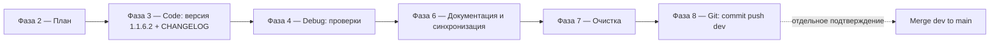

# Полный план фаз 2–8 — SysW v1.1.6.2

**Статус:** черновик для согласования (Architect).
**Целевая версия:** `1.1.6.2` (формат X.Y.Z.W).
**Текущая версия:** `1.1.5` (единый источник [`scripts/config.py`](../scripts/config.py:11), [`Mod_Constants.bas`](../src/modules/Mod_Constants.bas:18)).
**Основание:** планы [`1.1.6.md`](1.1.6.md), [`1.1.6.1_структура_ycarules.md`](1.1.6.1_структура_ycarules.md), [`1.1.6_согласование_ycarules.md`](1.1.6_согласование_ycarules.md). Рабочая схема — раздел «РАБОЧАЯ СХЕМА» из `1.1.6.md`.

---

## 0. Резюме контекста (что уже выполнено и что осталось)

### Уже реализовано (незафиксировано в документации)
- Новая структура `.ycarules` по **Варианту А** — единый справочник из **8 тематических модулей** `[O][G][Z][K][U][S][T][E]`.
- Каталог рабочих правил [`.codeassistant/rules/`](../.codeassistant/rules/) создан — **8 файлов-зеркал** (`01-roles.md`, `02-global.md`, `03-restrictions.md`, `04-encoding.md`, `05-changes.md`, `06-structure.md`, `07-autocomplete.txt`, `08-exceptions.md`), коды идентичны `.ycarules`.
- Глобальная задача `G-CHAT-UI` (постепенная интеграция SourceCraft `chat-rules` → `skills` → `chat-interface` для VSCode) зарегистрирована в [`docs/ROADMAP.md`](../docs/ROADMAP.md:462).

### Не зафиксировано / требует доводки
- **Все документы** (`README.md`, `docs/DEVELOPER.md`, `docs/ARCHITECTURE.md`, `docs/ROADMAP.md`, `docs/table.md`, `docs/sourcecraft-guide.md`) находятся на версии **v1.1.5** и **не отражают** новую структуру правил, каталог `.codeassistant/rules/` и глобальную задачу `G-CHAT-UI`.
- [`docs/sourcecraft-guide.md`](../docs/sourcecraft-guide.md:234) описывает `.codeassistant/` только как `mcp.json`, раздел «Структура проекта» не содержит `.codeassistant/rules/`.
- Открытые замечания аудита из [`docs/DEVELOPER.md`](../docs/DEVELOPER.md:1527): неполный список скриптов в `sourcecraft-guide.md`; расхождение состава листов (`Лист2_main.cls`/`Лист4.cls` vs фактические `Лист2/Лист3/Лист5/Лист9`).
- Статус согласования P1–P16 в [`1.1.6_согласование_ycarules.md`](1.1.6_согласование_ycarules.md:58) формально не проставлен (чекбоксы пусты).

### Принятые решения пользователя (для данного цикла)
1. **Фаза 3 (Code)** — только доводка: подъём версии до `1.1.6.2`, синхронизация правил, обновление CHANGELOG. **Кодовых правок VBA/Python нет.**
2. **Версия** — переход `1.1.5 → 1.1.6.2` **одной командой** `update_version.py 1.1.6.2`; доки обновляются с учётом перехода.
3. **Фаза 8 (git)** — коммит + push в `origin/dev`, затем **отдельный запрос** на слияние `dev → main`.

---

## 1. Целевые файлы (сводный перечень)

| Файл | Тип операции | Область изменений |
|------|--------------|-------------------|
| `scripts/config.py` | авто (update_version) | `APP_VERSION = "1.1.6.2"` |
| `src/modules/Mod_Constants.bas` | авто (update_version) | `APP_VERSION = "1.1.6.2"` |
| `scripts/config.ps1` | авто (update_version) | `$Script:AppVersion` |
| `README.md` | авто + правка | версия; упоминание `.codeassistant/rules/` |
| `docs/DEVELOPER.md` | авто + правка | версия; раздел SourceCraft/.codeassistant; замечания аудита |
| `docs/ROADMAP.md` | авто + правка | версия; статус интеграции chat-rules; G-CHAT-UI |
| `docs/ARCHITECTURE.md` | авто + правка | версия; синхронизация |
| `docs/CHANGELOG.md` | авто + правка | новый раздел `## [v1.1.6.2]` |
| `docs/sourcecraft-guide.md` | ручная правка | версия; структура проекта; `.codeassistant/rules/`; список скриптов |
| `docs/table.md` | ручная правка | версия; перекрёстные ссылки |
| `.ycarules` | проверка (не менять без согласования) | синхронизация кодов с `.codeassistant/rules/` |
| `.codeassistant/rules/*` | проверка (не менять без согласования) | сверка кодов с `.ycarules` |

> Примечание: `.ycarules` и `.codeassistant/rules/*` — **критические** ([E3], `[E5]`). В данном цикле они **не редактируются** — только верифицируется их синхронность (Фаза 4). Любые правки — отдельным согласованием.

---

## 2. Фаза 2 — Архитектурный полный план (текущий документ)

Настоящий файл `plans/1.1.6.2_plan.md` и является результатом Фазы 2. Он определяет порядок, целевые файлы и зависимости для фаз 3–8.

**Зависимости между фазами:**

- Фаза 3 обязательна перед Фазой 4 (версия должна быть поднята до проверки актуальности).
- Фаза 4 обязательна перед Фазой 6 (доки приводятся к уже проверенному состоянию).
- Фаза 6 обязательна перед Фазой 7 (очистка не должна удалить только что созданное/правленое).
- Фаза 7 обязательна перед Фазой 8 (в git не попадают временные артефакты).
- Merge `dev → main` — вне основного цикла, по отдельному подтверждению.

---

## 3. Фаза 3 — Code (доводка, без кодовых правок)

### 3.1 Подъём версии
1. Выполнить: `python scripts/update_version.py 1.1.6.2`
   - Скрипт сам обновит: `Mod_Constants.bas`, `config.py`, `config.ps1`, `README.md`, `DEVELOPER.md`, `ROADMAP.md`, `ARCHITECTURE.md`, `CHANGELOG.md` (новый раздел) — единый источник `config.APP_VERSION`.
   - Формат `X.Y.Z.W` валиден (см. [`update_version.py`](../scripts/update_version.py:40)).

### 3.2 CHANGELOG
2. Дополнить раздел `## [v1.1.6.2]` в [`docs/CHANGELOG.md`](../docs/CHANGELOG.md) (если скрипт создал заготовку — наполнить содержанием):
   - **Added:** новая структура `.ycarules` (8 модулей, Вариант А); каталог рабочих правил `.codeassistant/rules/` (8 зеркал с идентичными кодами `[O][G][Z][K][U][S][T][E]`).
   - **Changed:** версия проекта `1.1.6.2`, синхронизирована во всех точках `[U7]`.
   - **Roadmap:** зарегистрирована глобальная задача `G-CHAT-UI` (chat-rules → skills → chat-interface).

### 3.3 Синхронизация правил (верификация, без правок)
3. Сверить коды `[O][G][Z][K][U][S][T][E]` между `.ycarules` и `.codeassistant/rules/` (список модулей/кодов из [`1.1.6.1_структура_ycarules.md`](1.1.6.1_структура_ycarules.md:69)). Расхождений быть не должно; при обнаружении — зафиксировать и вынести отдельным согласованием (файлы критические, [E3]).

---

## 4. Фаза 4 — Debug (диагностика и проверка)

Выполняется после Фазы 3. Перечень проверок:

1. **Проверка версий `[U7]`:** убедиться, что `1.1.6.2` присутствует во всех связанных точках: `scripts/config.py`, `src/modules/Mod_Constants.bas`, `scripts/config.ps1`, `README.md`, `docs/DEVELOPER.md`, `docs/ROADMAP.md`, `docs/ARCHITECTURE.md`, `docs/CHANGELOG.md`.
2. **`python scripts/check_docs.py --check`** — контроль согласованности документации с фактической структурой (док не должен считаться устаревшим до старта Фазы 6; цель — зафиксировать исходные расхождения).
3. **`python scripts/check_vba_syntax.py`** — синтаксис VBA (контроль, т.к. VBA не менялся, ожидается OK; обязателен как страховка перед релизом).
4. **Сверка кодов правил**: автоматизированная/ручная сверка модулей `.ycarules` ↔ `.codeassistant/rules/` (см. Фаза 3.3).
5. **Регрессионный прогон `python scripts/run_tests.py`** (базовый) — опционально; поскольку VBA не менялся, допустимо ограничиться `--module` быстрым набором или пропустить по решению Orchestrator. Любой красный тест → остановка и передача в Debug.
6. **Отчёты** фиксируются в `logs/`; итоги заносятся в CHANGELOG (раздел Tested).

> Если в процессе выявлены реальные дефекты (не касающиеся правил) — они выносятся отдельными задачами, вне рамок «доводки» версии 1.1.6.2.

---

## 5. Фаза 6 — Документация и синхронизация

**Главная фаза цикла.** Цель — полностью актуализировать все документы под версию `1.1.6.2` и зафиксировать изменения 1.1.6/1.1.6.1, включая «последние незафиксированные обновления».

### 5.1 Принципы синхронизации `[U7]`
- Единая версия `1.1.6.2` во всех документах и коде.
- Проверить перекрёстные ссылки (реестр, версии, пути к `.codeassistant/rules/`), устранить устаревшие упоминания.
- Перед правкой каждого документа применять `[E3]`/`[U5]` (резервная копия ключевых файлов — при необходимости).

### 5.2 Точечные правки по документам

| № | Файл | Правки |
|---|------|--------|
| D1 | `docs/sourcecraft-guide.md` | **(наибольший приоритет)** Версия → v1.1.6.2. Добавить раздел/подраздел о каталоге `.codeassistant/rules/` (рабочие правила рабочей области, 8 файлов-зеркал, иерархия `[E5]`). Обновить «Структура проекта» (`.codeassistant/` теперь содержит `rules/`, а не только `mcp.json`). Актуализировать список `scripts/` (замечание аудита). |
| D2 | `docs/DEVELOPER.md` | Версия → v1.1.6.2. Раздел SourceCraft/правила — упомянуть `.codeassistant/rules/` как второй источник. Закрыть замечания аудита: актуализировать состав листов `src/sheets/` (`Лист2/Лист3/Лист5/Лист9`), корректные списки скриптов. |
| D3 | `docs/ARCHITECTURE.md` | Версия → v1.1.6.2; синхронизация ссылок на `.codeassistant/rules/` и правила `[E5]`. |
| D4 | `docs/ROADMAP.md` | Версия → v1.1.6.2. Обновить статус: интеграция `chat-rules` (Задача 1 v1.1.6) выполнена; `skills` (Задача 2) — отложена; `G-CHAT-UI` — актуализировать запись. |
| D5 | `docs/table.md` | Версия → v1.1.6.2; перекрёстные ссылки на `.codeassistant/rules/`, реестр. |
| D6 | `docs/CHANGELOG.md` | Раздел `## [v1.1.6.2]` — наполнен (см. Фаза 3.2), включая блок Tested по итогам Фазы 4. |
| D7 | `README.md` | Версия → v1.1.6.2; краткое упоминание `.codeassistant/rules/` и SourceCraft-интеграции. |

### 5.3 Контроль
- После правок повторно `python scripts/check_docs.py --check` — ожидается чистый результат (без расхождений).
- Сверка перекрёстных ссылок между README, DEVELOPER, ROADMAP, ARCHITECTURE, table, sourcecraft-guide, CHANGELOG (`[U7]`).
- Удаление/замена устаревших упоминаний (например, `Лист2_main.cls`, `Лист4.cls`, `.codeassistant/mcp.json` как единственного содержимого).

---

## 6. Фаза 7 — Очистка проекта `[S7]`

Выполняется после завершения Фазы 6.

1. Удалить временные артефакты: `__pycache__/`, `*.pyc`, `*.pyo`, `*.sync-conflict-*`, `~$*.xlsm`, `~$*.xlsx`, `.tmp`.
2. Удалить временные каталоги ассистента/скриптов при их наличии: `_temp/`, `_temp_export/`, `_temp_import/` (созданные в этом цикле).
3. Проверить `logs/` — системные и тестовые логи; при необходимости оставить актуальные отчёты (`test_results.log`, отчёты бизнес-прогонов), не коммитить служебные.
4. Опционально `python scripts/clean_system.py` — при подтверждении пользователем (важно: не удалять `_backup/` и защищённые файлы, см. [Z2], [S7]).
5. Убедиться, что проект чист: `git status` (через MCP Git Tools) показывает только ожидаемые изменения.

---

## 7. Фаза 8 — Git: коммит, push, слияние `[G10]`

Все git-операции — **только через MCP Git Tools** (`git_status`, `git_diff`, `git_add`, `git_commit`, `git_log`, `git_branch`, `git_push`), не системными командами.

1. **`git status` / `git_diff`** — проверить состав изменений перед коммитом.
2. **`git_add`** — добавить целевые файлы подзадачи (файлы из раздела 1, без временных артефактов).
3. **`git_commit`** — Conventional Commits с областью версии/задачи, например:
   `docs(rules): актуализировать документацию под v1.1.6.2 (.codeassistant/rules, G-CHAT-UI)` (комментарии на русском; тема — версия 1.1.6.2).
4. **`git_push`** в ветку `dev` (`origin/dev`).
5. **Запросить у пользователя подтверждение** на слияние `dev → main` (отдельная точка подтверждения, не выполнять самостоятельно).
6. После подтверждения — **`git_checkout`/merge** `dev → main`, затем вернуться на ветку `dev`.
7. Итог: текущая ветка — `dev`, изменения в `origin/dev`, слияние `main` — по согласованию.

---

## 8. Критерии приёмки

1. Версия `1.1.6.2` едина во всех точках `[U7]` (config.py, Mod_Constants.bas, config.ps1, README, DEVELOPER, ROADMAP, ARCHITECTURE, CHANGELOG).
2. Все документы актуализированы; `.codeassistant/rules/` и G-CHAT-UI задокументированы; устаревшая информация очищена.
3. `check_docs.py --check` — без расхождений; `check_vba_syntax.py` — OK.
4. Коды правил `.ycarules` ↔ `.codeassistant/rules/` синхронны.
5. Проект очищен (нет `__pycache__`, `~$`, `*.sync-conflict-*`).
6. Коммит и push в `origin/dev` выполнены через MCP Git Tools; текущая ветка — `dev`; merge `dev → main` — по отдельному подтверждению.

---

## 9. Риски и примечания

- `.ycarules` и `.codeassistant/rules/*` — критические ([E3]); в цикле не редактируются, только верифицируются.
- Правка ключевых Excel-файлов (`work.xlsm`, `report.xlsx`, `base/*`) в данном цикле **не предусмотрена** ([U5] резервные копии — только если потребуется ручная проверка).
- Временные файлы, создаваемые скриптами в ходе цикла, удаляются в Фазе 7.
- Обновление версии выполняется одним вызовом `update_version.py 1.1.6.2`; повторные/двойные бампы исключены.