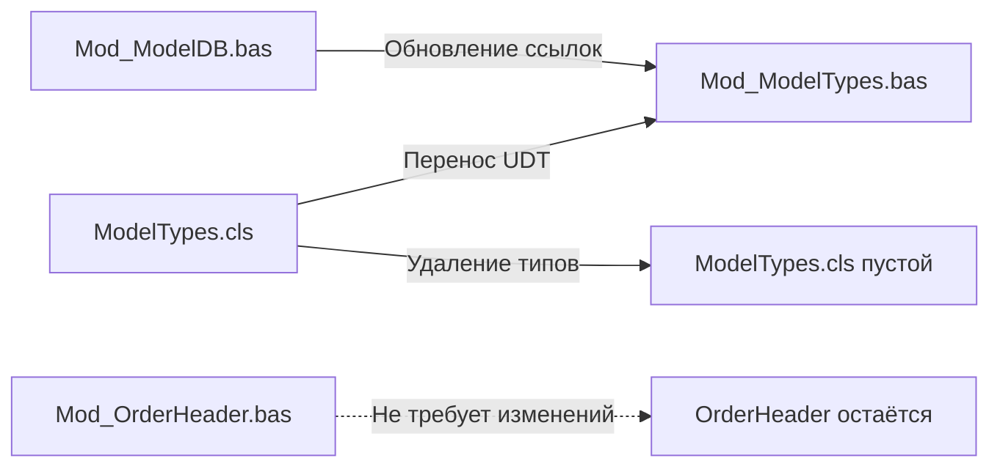
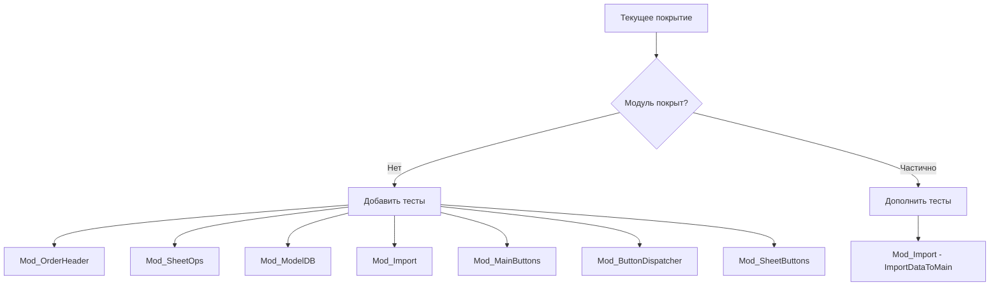
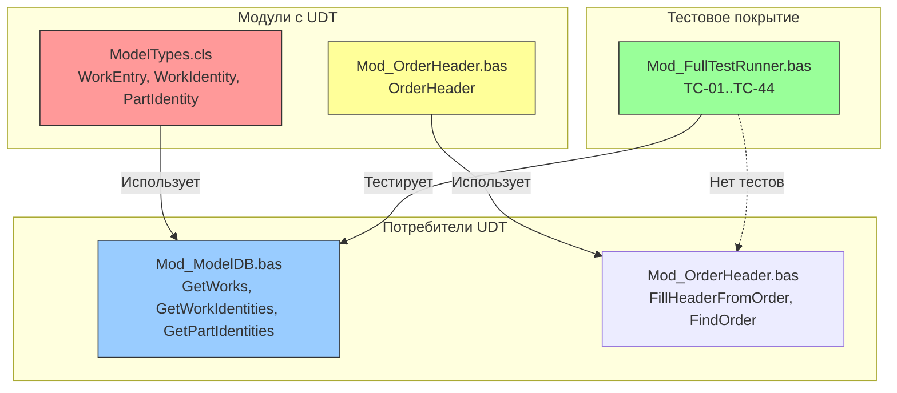

# Сводный анализ и план исправлений

## 1. Сводный анализ текущего состояния

### 1.1. Проблема 1: Ошибка компиляции UDT

**Описание:** Три пользовательских типа (`Public Type`) объявлены в class-модуле [`ModelTypes.cls`](src/classes/ModelTypes.cls):
- `WorkEntry` (строка 18)
- `WorkIdentity` (строка 34)
- `PartIdentity` (строка 50)

**Причина:** VBA запрещает использовать UDT из class-модуля (`*.cls`) как тип параметра или возвращаемого значения `Public`-процедур в стандартных модулях (`*.bas`). При попытке компиляции возникает ошибка: *"Only public user defined types defined in public object modules can be used as parameters or return types for public procedures of class modules or as fields of public user defined types defined in public object modules"*.

**Где используется:**
- [`Mod_ModelDB.bas`](src/modules/Mod_ModelDB.bas) — `GetWorks()` (строка 133) использует `ModelTypes.WorkEntry` как локальную переменную; `GetWorkIdentities()` (строка 204) использует `ModelTypes.WorkIdentity`; `GetPartIdentities()` (строка 279) использует `ModelTypes.PartIdentity`
- [`Mod_OrderHeader.bas`](src/modules/Mod_OrderHeader.bas) — содержит собственный `Public Type OrderHeader` (строка 15), который НЕ в class-модуле, поэтому НЕ подвержен этой ошибке

**Влияние:** Критическое — проект не компилируется. Любые изменения в `Mod_ModelDB.bas` или зависимых модулях приводят к ошибке компиляции. Блокирует разработку и тестирование.

**История:** Типы были перенесены из [`Mod_ModelDB.bas`](src/modules/Mod_ModelDB.bas) в `ModelTypes.cls` (согласно комментарию на строках 9-12 `ModelTypes.cls`) для исправления *другой* ошибки компиляции, но это создало новую проблему.

---

### 1.2. Проблема 2: Импорт модулей в UAZ.xlsm

**Описание:** В проекте отсутствует функция импорта VBA-модулей в книги моделей (`base/models/UAZ.xlsm` и другие).

**Причина:**
- Скрипт [`impVBA.py`](scripts/impVBA.py) импортирует модули ТОЛЬКО в `work.xlsm` (путь задан в [`config.py`](scripts/config.py), строка 14: `WORKBOOK_PATH = PROJECT_DIR / "work.xlsm"`)
- Процедура [`PickWork_UI`](src/modules/Mod_PickWork.bas:58) открывает `UAZ.xlsm` для ручного копирования *данных*, а не VBA-кода
- В архитектуре проекта нет механизма распространения VBA-модулей на книги моделей

**Влияние:** Среднее. Если книги моделей должны содержать одинаковый VBA-код (например, обработчики кнопок поиска из `Mod_SheetButtons`), то изменения кода приходится вносить вручную в каждую книгу. Если же книги моделей — это только данные (справочники), то проблема отсутствует.

**Текущее поведение:** Кнопки поиска на листах UAZ (`Btn_UAZ_SearchByArticle`, `Btn_UAZ_SearchByName`, `Btn_UAZ_ClearFilter`) определены в [`Mod_SheetButtons.bas`](src/modules/Mod_SheetButtons.bas) и импортируются только в `work.xlsm`. Книги моделей в `base/models/` не содержат этих обработчиков.

---

### 1.3. Проблема 3: Тестовое покрытие

**Описание:** Тестовый набор (TC-01..TC-44) в [`Mod_FullTestRunner.bas`](src/modules/Mod_FullTestRunner.bas) имеет следующие проблемы:

**Количественные показатели:**
- Всего тестов: 44 (TC-01..TC-44)
- Активных: 40
- Пропущено (skipped): 4 (TC-12 кейс 1, TC-41, TC-42, TC-43, TC-44)
- Пропуск в нумерации: TC-15..TC-30 (16 номеров не используются)

**Модули без тестового покрытия:**

| Модуль | Статус | Критические функции без тестов |
|--------|--------|-------------------------------|
| [`Mod_OrderHeader.bas`](src/modules/Mod_OrderHeader.bas) | Нет тестов | `FillHeaderFromOrder`, `FindOrder` |
| [`Mod_SheetOps.bas`](src/modules/Mod_SheetOps.bas) | Нет тестов | `ExtractNumberFromGRZ`, `SearchSheetByGRZ`, `RenameSheetsByGRZ`, `ClearMainSheet_UI`, `ClearHeader_UI` |
| [`Mod_Import.bas`](src/modules/Mod_Import.bas) | Частично (TC-14) | `ImportDataToMain`, `ImportSheet`, `ImportFromB2_UI`, `ImportFromSheetM_UI` |
| [`Mod_MainButtons.bas`](src/modules/Mod_MainButtons.bas) | Нет тестов | Все обработчики кнопок (5 шт.) |
| [`Mod_ButtonDispatcher.bas`](src/modules/Mod_ButtonDispatcher.bas) | Нет тестов | Все диспетчеры кнопок (18 шт.) |
| [`Mod_SheetButtons.bas`](src/modules/Mod_SheetButtons.bas) | Нет тестов | `Btn_UAZ_SearchByArticle`, `Btn_UAZ_SearchByName`, `Btn_UAZ_ClearFilter` |

**Критические пробелы (функции бизнес-логики без тестов):**
1. `FillHeaderFromOrder` — заполнение шапки заказа (ключевая бизнес-функция)
2. `ImportDataToMain` — перенос данных из листа-источника в main
3. `ExtractNumberFromGRZ` — извлечение цифр из ГРЗ (используется в поиске листов)
4. `GetWorks` — чтение справочника работ из файла группы
5. `GetWorkIdentities` — чтение тождеств работ
6. `GetPartIdentities` — чтение тождеств запчастей

**Влияние:** Высокое. Критические функции бизнес-логики не имеют тестового покрытия, что увеличивает риск регрессии при изменениях. Пропуск в нумерации TC-15..TC-30 указывает на то, что тесты были удалены или перенумерованы без обновления документации.

---

### 1.4. Приоритизация проблем

| Проблема | Приоритет | Обоснование |
|----------|-----------|-------------|
| Ошибка компиляции UDT | **P0 (Критический)** | Блокирует компиляцию проекта. Без исправления невозможно разрабатывать и тестировать. |
| Тестовое покрытие | **P1 (Высокий)** | Критические функции без тестов создают риск регрессии. Необходимо для обеспечения качества. |
| Импорт модулей в UAZ.xlsm | **P2 (Средний)** | Требует архитектурного решения. Не блокирует текущую разработку, но важен для консистентности. |

---

## 2. План исправлений

### 2.1. Этап 1: Исправление ошибки компиляции UDT (P0)

**Цель:** Перенести UDT из class-модуля в стандартный BAS-модуль, чтобы устранить ошибку компиляции.

- [ ] **Шаг 1.1:** Создать новый файл [`src/modules/Mod_ModelTypes.bas`](src/modules/Mod_ModelTypes.bas) со следующим содержимым:
  - `Attribute VB_Name = "Mod_ModelTypes"`
  - `Option Explicit`
  - Перенести `Public Type WorkEntry`, `Public Type WorkIdentity`, `Public Type PartIdentity` из `ModelTypes.cls`
  - Добавить `Public Type OrderHeader` (перенести из `Mod_OrderHeader.bas` для централизации всех UDT)

- [ ] **Шаг 1.2:** В [`ModelTypes.cls`](src/classes/ModelTypes.cls) удалить объявления типов, оставив только заголовок модуля и `Option Explicit` (или удалить файл, если класс не используется для других целей)

- [ ] **Шаг 1.3:** Обновить ссылки в [`Mod_ModelDB.bas`](src/modules/Mod_ModelDB.bas):
  - Заменить `ModelTypes.WorkEntry` на `Mod_ModelTypes.WorkEntry` (строка 133)
  - Заменить `ModelTypes.WorkIdentity` на `Mod_ModelTypes.WorkIdentity` (строка 204)
  - Заменить `ModelTypes.PartIdentity` на `Mod_ModelTypes.PartIdentity` (строка 279)

- [ ] **Шаг 1.4:** Обновить ссылки в [`Mod_OrderHeader.bas`](src/modules/Mod_OrderHeader.bas):
  - Удалить `Public Type OrderHeader` (строка 15-24)
  - Добавить ссылку на `Mod_ModelTypes.OrderHeader` (или импортировать через `Dim h As Mod_ModelTypes.OrderHeader`)

- [ ] **Шаг 1.5:** Обновить скрипт [`impVBA.py`](scripts/impVBA.py):
  - Убедиться, что новый файл `Mod_ModelTypes.bas` автоматически обнаруживается (он уже будет найден, т.к. скрипт сканирует `modules/` директорию)

- [ ] **Шаг 1.6:** Перекомпилировать проект:
  - Запустить `impVBA.py` для импорта модулей в `work.xlsm`
  - Открыть `work.xlsm` в Excel
  - Выполнить Debug -> Compile VBA Project
  - Убедиться в отсутствии ошибок компиляции

- [ ] **Шаг 1.7:** Запустить тесты (TC-01..TC-44) через `RunAllTests_UI` для проверки регрессии

---

### 2.2. Этап 2: Расширение тестового покрытия (P1)

**Цель:** Добавить тесты для критических функций, покрыть модули без тестов.

- [ ] **Шаг 2.1:** Добавить тесты для [`Mod_OrderHeader.bas`](src/modules/Mod_OrderHeader.bas):
  - `TC-15`: `FillHeaderFromOrder` с существующим номером заказа
  - `TC-16`: `FillHeaderFromOrder` с несуществующим номером
  - `TC-17`: `FillHeaderFromOrder` с пустым номером
  - `TC-18`: `FindOrder` с существующим номером
  - `TC-19`: `FindOrder` с несуществующим номером

- [ ] **Шаг 2.2:** Добавить тесты для [`Mod_SheetOps.bas`](src/modules/Mod_SheetOps.bas):
  - `TC-20`: `ExtractNumberFromGRZ` с форматом "А123АН77" -> "123"
  - `TC-21`: `ExtractNumberFromGRZ` с форматом "А12АН34" -> "" (2 цифры)
  - `TC-22`: `ExtractNumberFromGRZ` с форматом "А1234АН77" -> "1234"
  - `TC-23`: `ExtractNumberFromGRZ` с пустой строкой -> ""
  - `TC-24`: `ClearMainSheet_UI` с silent=True (не вызывает ошибку)

- [ ] **Шаг 2.3:** Добавить тесты для [`Mod_ModelDB.bas`](src/modules/Mod_ModelDB.bas):
  - `TC-25`: `GetWorks` с существующей группой (UAZ)
  - `TC-26`: `GetWorks` с несуществующей группой
  - `TC-27`: `GetWorkIdentities` с существующей группой
  - `TC-28`: `GetPartIdentities` с существующей группой

- [ ] **Шаг 2.4:** Добавить тесты для [`Mod_Import.bas`](src/modules/Mod_Import.bas):
  - `TC-29`: `ImportDataToMain` с корректным листом-источником (требует тестовых данных)
  - `TC-30`: `ImportDataToMain` с пустым листом

- [ ] **Шаг 2.5:** Добавить тесты для модулей-диспетчеров:
  - `TC-31`: `Btn_main_Clear_Click` (через `Mod_ButtonDispatcher`)
  - `TC-32`: `Btn_main_FillHeader_Click` (через `Mod_ButtonDispatcher`)
  - `TC-33`: `Btn_UAZ_SearchByArticle` с пустым C1 (не вызывает ошибку)

- [ ] **Шаг 2.6:** Устранить пропуски в нумерации:
  - Перенумеровать тесты TC-15..TC-30 в соответствии с новыми тестами
  - Обновить комментарии в [`Mod_FullTestRunner.bas`](src/modules/Mod_FullTestRunner.bas)

- [ ] **Шаг 2.7:** Запустить полный набор тестов и убедиться, что все новые тесты проходят

---

### 2.3. Этап 3: Уточнение архитектуры импорта в UAZ.xlsm (P2)

**Цель:** Принять архитектурное решение и реализовать его.

- [ ] **Шаг 3.1:** Провести анализ:
  - Определить, какие VBA-модули должны присутствовать в книгах моделей (`base/models/*.xlsm`)
  - Определить, какие модули специфичны только для `work.xlsm`

- [ ] **Шаг 3.2:** Принять одно из решений:

  **Вариант A (рекомендуемый):** Признать текущее поведение штатным
  - Книги моделей содержат только данные (справочники)
  - Весь VBA-код находится только в `work.xlsm`
  - Кнопки поиска на листах UAZ не требуются (пользователь работает через `work.xlsm`)
  - Обновить документацию в [`docs/DEVELOPER.md`](docs/DEVELOPER.md)

  **Вариант B:** Добавить импорт модулей во все книги моделей
  - Модифицировать [`impVBA.py`](scripts/impVBA.py) для импорта в несколько книг
  - Добавить параметр `--target` или список книг в [`config.py`](scripts/config.py)
  - Обновить документацию

- [ ] **Шаг 3.3:** Реализовать выбранное решение

- [ ] **Шаг 3.4:** Обновить документацию проекта

---

### 2.4. Этап 4: Проверка работоспособности

**Цель:** Интеграционная проверка всех исправлений.

- [ ] **Шаг 4.1:** Полная перекомпиляция проекта:
  - Запустить `impVBA.py`
  - Выполнить `Debug -> Compile VBA Project` в Excel
  - Устранить все ошибки компиляции

- [ ] **Шаг 4.2:** Прогон всех тестов:
  - Запустить `RunAllTests_UI` в `work.xlsm`
  - Проверить, что все 40+ тестов проходят (PASS)
  - Проверить, что нет новых ошибок

- [ ] **Шаг 4.3:** Проверка импорта модулей:
  - Убедиться, что `Mod_ModelTypes.bas` импортирован в `work.xlsm`
  - Убедиться, что `ModelTypes.cls` больше не содержит UDT (или удалён)

- [ ] **Шаг 4.4:** Финальная проверка:
  - Открыть `work.xlsm` в Excel
  - Проверить работу основных кнопок (импорт, автоподбор, ручной подбор)
  - Убедиться в отсутствии ошибок времени выполнения

---

## Приложение: Схема зависимостей модулей

---

## Резюме

| Этап | Задача | Приоритет | Зависимости |
|------|--------|-----------|-------------|
| 1 | Исправление ошибки компиляции UDT | P0 | Нет |
| 2 | Расширение тестового покрытия | P1 | Этап 1 (нужна компиляция) |
| 3 | Уточнение архитектуры импорта | P2 | Нет |
| 4 | Проверка работоспособности | P0 | Этапы 1-3 |