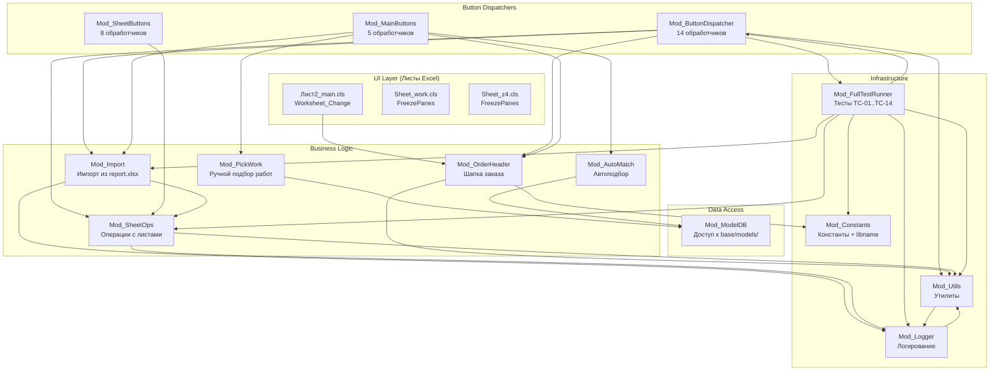
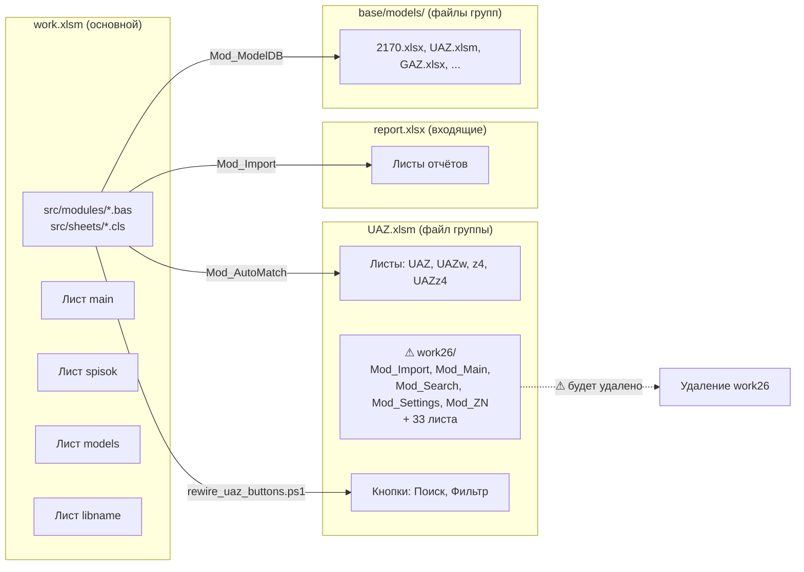

# Полный анализ текущего состояния системы SysW

> **Дата:** 2026-07-25
> **Версия проекта:** v0.12.0
> **Тип анализа:** Архитектурный ревью, поиск жёстких привязок, мёртвого кода, дублирования
> **Контекст:** Подготовка к модернизации согласно `plans/next_promt.md`

---

## 1. Структура проекта

```
L:\PROject\SysW\
├── src/                          # Исходный код VBA
│   ├── modules/                  # 12 .bas модулей
│   │   ├── Mod_Constants.bas     # Константы, реестр имён libname
│   │   ├── Mod_Import.bas        # Импорт данных из report.xlsx
│   │   ├── Mod_MainButtons.bas   # Кнопки листа main
│   │   ├── Mod_ButtonDispatcher.bas  # Диспетчер кнопок (прослойка UI)
│   │   ├── Mod_ModelDB.bas       # Доступ к файлам модельных групп
│   │   ├── Mod_SheetButtons.bas  # Кнопки листов z4/work
│   │   ├── Mod_SheetOps.bas      # Операции с листами
│   │   ├── Mod_Utils.bas         # Утилиты
│   │   ├── Mod_Logger.bas        # Логирование с ротацией
│   │   ├── Mod_AutoMatch.bas     # Автоподбор работ/запчастей
│   │   ├── Mod_OrderHeader.bas   # Шапка заказа
│   │   ├── Mod_PickWork.bas      # Ручной подбор работ
│   │   └── Mod_FullTestRunner.bas # Тест-раннер (TC-01..TC-14)
│   └── sheets/                   # 3 .cls листа
│       ├── Лист2_main.cls        # Обработчик листа main
│       ├── Sheet_work.cls        # Обработчик листа work
│       └── Sheet_z4.cls          # Обработчик листа z4
├── scripts/                      # Скрипты автоматизации
│   ├── export_vba.py             # Выгрузка VBA из work.xlsm (CP1251→UTF-8)
│   ├── export_uaz_vba.py         # Выгрузка VBA из UAZ.xlsm
│   ├── export_uaz_vba.ps1        # То же на PowerShell
│   ├── impVBA.py                 # Загрузка VBA в work.xlsm (UTF-8→CP1251)
│   ├── Import-VbaFromExcel.ps1   # Альтернативный импорт (PowerShell)
│   ├── run_tests.py              # Запуск тестов VBA
│   ├── parse_excel.ps1           # Парсинг UAZ.xlsm (COM)
│   ├── parse_full.ps1            # Полный парсинг UAZ.xlsm (COM)
│   ├── parse_full.py             # Полный парсинг UAZ.xlsm (openpyxl)
│   ├── rewire_uaz_buttons.ps1    # Переназначение кнопок UAZ.xlsm
│   ├── Set-ExcelTrust.ps1        # Настройка доверия Excel
│   └── _uaz_vba_export/          # Экспортированные модули UAZ.xlsm
│       ├── work26/               # ⚠ Встроенная книга work26.xlsm внутри UAZ.xlsm
│       │   ├── Mod_Import.bas    #   Дубликат функциональности
│       │   ├── Mod_Main.bas      #   Аналог Mod_MainButtons + Mod_ButtonDispatcher
│       │   ├── Mod_Search.bas    #   Поиск (адаптирован в Mod_SheetButtons)
│       │   ├── Mod_Settings.bas  #   Настройки (не имеет аналога в src/)
│       │   ├── Mod_ZN.bas        #   Работа с ЗН (не имеет аналога в src/)
│       │   └── Лист*.cls (33 шт) #   Листы work26
│       ├── Лист*.cls             # Листы UAZ.xlsm
│       └── ЭтаКнига.cls          # ThisWorkbook UAZ.xlsm
├── base/
│   └── models/                   # Файлы модельных групп
│       └── .gitkeep
├── docs/                         # Документация
├── plans/                        # Планы изменений
├── workOt/                       # Выходные данные
├── report.xlsx                   # файл отчета с хранением входящих и выходящих ЗН
└── work.xlsm                     # Основной Excel-файл (в .gitignore)
```

---

## 2. Архитектура системы

### 2.1 Схема связей между модулями



### 2.2 Принципы архитектуры

1. **Модульность** — каждый модуль отвечает за свою область
2. **UI-обёртки** — функции с суффиксом `_UI` содержат диалоги, чистые функции — нет
3. **Диспетчер кнопок** — `Mod_ButtonDispatcher` является прослойкой между UI и бизнес-логикой
4. **Двухфазная кодировка** — UTF-8 на диске, CP1251 в Excel

### 2.3 Ключевые бизнес-процессы

**Процесс импорта заказа:**
1. Пользователь вводит номер заказа в B4 листа main
2. `Worksheet_Change` → `Mod_OrderHeader.FillHeaderFromOrder()` — заполняет шапку
3. Пользователь нажимает «ИМПОРТ ВХ» → `ImportFromB2_UI`
4. Ищет лист `{B4}M` в текущей книге, если нет — копирует из `report.xlsx`
5. `ImportDataToMain` переносит данные в колонки L:N (работы) и X:AA (запчасти)
6. Пользователь нажимает «АВТО РАБ» / «АВТО ЗЧ» — автоподбор из тождеств UAZ

---

## 3. Анализ жёстких привязок

### 3.1 Захардкоженные пути в VBA-коде

| Файл | Строка | Путь | Тип привязки |
|------|--------|------|-------------|
| [`Mod_ModelDB.bas`](../src/modules/Mod_ModelDB.bas:13) | 13 | `L:\PROject\SysW\base\models\` | **Абсолютный путь** к каталогу модельных групп |
| [`Mod_Import.bas`](../src/modules/Mod_Import.bas:358) | 358 | `ThisWorkbook.path & "\report.xlsx"` | Относительный путь к report.xlsx |
| [`Mod_Import.bas`](../src/modules/Mod_Import.bas:368) | 368 | `Workbooks.Open(reportPath, ReadOnly:=True)` | Открытие report.xlsx |
| [`Mod_SheetOps.bas`](../src/modules/Mod_SheetOps.bas:68) | 68 | `ThisWorkbook.path & "\report.xlsx"` | Относительный путь к report.xlsx |
| [`Mod_SheetOps.bas`](../src/modules/Mod_SheetOps.bas:111) | 111 | `ThisWorkbook.path & "\report.xlsx"` | Относительный путь к report.xlsx |
| [`Mod_Logger.bas`](../src/modules/Mod_Logger.bas:21) | 21 | `ThisWorkbook.path & "\log.txt"` | Относительный путь к логу |
| [`Mod_Logger.bas`](../src/modules/Mod_Logger.bas:81) | 81 | `ThisWorkbook.path & "\log_old.txt"` | Относительный путь к старому логу |
| [`Mod_MainButtons.bas`](../src/modules/Mod_MainButtons.bas:158) | 158 | `'work.xlsm'!Btn_main_ImportVH_Click` | **Жёсткая привязка** к имени файла work.xlsm |

### 3.2 Захардкоженные пути в скриптах

| Файл | Строка | Путь |
|------|--------|------|
| [`export_vba.py`](../scripts/export_vba.py:23) | 23 | `L:\PROject\SysW\work.xlsm` |
| [`export_vba.py`](../scripts/export_vba.py:24) | 24 | `L:\PROject\SysW\src` |
| [`export_vba.py`](../scripts/export_vba.py:25) | 25 | `L:\PROject\SysW\_temp_export` |
| [`impVBA.py`](../scripts/impVBA.py:25) | 25 | `L:\PROject\SysW\work.xlsm` |
| [`impVBA.py`](../scripts/impVBA.py:26) | 26 | `L:\PROject\SysW\src` |
| [`impVBA.py`](../scripts/impVBA.py:27) | 27 | `L:\PROject\SysW\_temp_import` |
| [`export_uaz_vba.ps1`](../scripts/export_uaz_vba.ps1:2) | 2 | `L:\PROject\SysW\base\models\UAZ.xlsm` |
| [`export_uaz_vba.ps1`](../scripts/export_uaz_vba.ps1:3) | 3 | `L:\PROject\SysW\scripts\_uaz_vba_export` |
| [`export_uaz_vba.py`](../scripts/export_uaz_vba.py:14) | 14 | `L:\PROject\SysW\base\models\UAZ.xlsm` |
| [`export_uaz_vba.py`](../scripts/export_uaz_vba.py:15) | 15 | `L:\PROject\SysW\scripts\_uaz_vba_export` |
| [`parse_excel.ps1`](../scripts/parse_excel.ps1:16) | 16 | `L:\PROject\SysW\base\models\UAZ.xlsm` |
| [`parse_excel.ps1`](../scripts/parse_excel.ps1:85) | 85 | `L:\PROject\SysW\work.xlsm` |
| [`parse_excel.ps1`](../scripts/parse_excel.ps1:124) | 124 | `L:\PROject\SysW\plans\parsed_data.md` |
| [`parse_full.ps1`](../scripts/parse_full.ps1:7) | 7 | `L:\PROject\SysW\base\models\UAZ.xlsm` |
| [`parse_full.ps1`](../scripts/parse_full.ps1:125) | 125 | `L:\PROject\SysW\plans\parsed_data_full.md` |
| [`parse_full.py`](../scripts/parse_full.py:98) | 98 | `base/models/UAZ.xlsm` (относительный) |
| [`rewire_uaz_buttons.ps1`](../scripts/rewire_uaz_buttons.ps1:7) | 7 | `L:\PROject\SysW\base\models\UAZ.xlsm` |
| [`run_tests.py`](../scripts/run_tests.py:14) | 14 | `L:\PROject\SysW\work.xlsm` |
| [`Set-ExcelTrust.ps1`](../scripts/Set-ExcelTrust.ps1:25) | 25 | `L:\PROject\SysW` |
| [`Set-ExcelTrust.ps1`](../scripts/Set-ExcelTrust.ps1:26) | 26 | `L:\PROject\SysW\work.xlsm` |
| [`Import-VbaFromExcel.ps1`](../scripts/Import-VbaFromExcel.ps1:23) | 23 | `L:\PROject\SysW\work.xlsm` |
| [`Import-VbaFromExcel.ps1`](../scripts/Import-VbaFromExcel.ps1:24) | 24 | `L:\PROject\SysW\src` |

### 3.3 Жёсткие привязки к именам листов и ячеек

| Файл | Привязка |
|------|---------|
| [`Mod_Import.bas`](../src/modules/Mod_Import.bas:24) | `ThisWorkbook.Sheets("main")` — жёсткое имя листа |
| [`Mod_Import.bas`](../src/modules/Mod_Import.bas:34) | `wsMain.Range("B4").Value` — жёсткая ячейка |
| [`Mod_Import.bas`](../src/modules/Mod_Import.bas:96) | `Find("Выполненные работы")` — жёсткий текст заголовка |
| [`Mod_Import.bas`](../src/modules/Mod_Import.bas:160) | `Find("Расходная накладная")` — жёсткий текст заголовка |
| [`Mod_Import.bas`](../src/modules/Mod_Import.bas:341) | `wsMain.Range("B4").Value` — жёсткая ячейка |
| [`Mod_OrderHeader.bas`](../src/modules/Mod_OrderHeader.bas:39-41) | `Sheets("main")`, `Sheets("spisok")`, `Sheets("models")` |
| [`Mod_OrderHeader.bas`](../src/modules/Mod_OrderHeader.bas:64) | `wsMain.Range("B5:B17")` — жёсткий диапазон |
| [`Mod_AutoMatch.bas`](../src/modules/Mod_AutoMatch.bas:52) | `ThisWorkbook.Sheets("main")` |
| [`Mod_AutoMatch.bas`](../src/modules/Mod_AutoMatch.bas:54) | `wsMain.Range("B14").Value` — группа |
| [`Mod_AutoMatch.bas`](../src/modules/Mod_AutoMatch.bas:137) | `wsMain.Range("B13").Value` — цена н/ч |
| [`Mod_PickWork.bas`](../src/modules/Mod_PickWork.bas:25) | `ThisWorkbook.Sheets("main")` |
| [`Mod_PickWork.bas`](../src/modules/Mod_PickWork.bas:26) | `wsMain.Range("B14").Value` — группа |
| [`Лист2_main.cls`](../src/sheets/Лист2_main.cls:23) | `Me.Range("B4")` — жёсткая ячейка |

### 3.4 Привязка к UAZ.xlsm

Система привязана к файлу `UAZ.xlsm` через:

1. **Скрипты экспорта/парсинга** — все скрипты в `scripts/` используют абсолютный путь `L:\PROject\SysW\base\models\UAZ.xlsm`
2. **`rewire_uaz_buttons.ps1`** — жёстко прописывает макросы `work.xlsm!Btn_UAZ_*` для кнопок на листах UAZ.xlsm
3. **`Mod_ModelDB`** — работает с `base/models/`, UAZ.xlsm — один из файлов группы
4. **`Mod_AutoMatch`** — читает тождества из листов `{GroupName}w` и `{GroupName}z4` файла группы

---

## 4. Анализ мёртвого кода

### 4.1 Неиспользуемые модули/процедуры

| Модуль | Процедура | Статус | Причина |
|--------|-----------|--------|---------|
| [`Mod_MainButtons.bas`](../src/modules/Mod_MainButtons.bas:91) | `Btn_main_MANz4` | **Мёртвый** | Заглушка «в разработке», не привязана к кнопке |
| [`Mod_SheetButtons.bas`](../src/modules/Mod_SheetButtons.bas:18) | `Btn_z4_Action1` | **Мёртвый** | Заглушка «в разработке» |
| [`Mod_SheetButtons.bas`](../src/modules/Mod_SheetButtons.bas:28) | `Btn_z4_Action2` | **Мёртвый** | Заглушка «в разработке» |
| [`Mod_SheetButtons.bas`](../src/modules/Mod_SheetButtons.bas:38) | `Btn_z4_Action3` | **Мёртвый** | Заглушка «в разработке» |
| [`Mod_SheetButtons.bas`](../src/modules/Mod_SheetButtons.bas:52) | `Btn_work_Action1` | **Мёртвый** | Заглушка «в разработке» |
| [`Mod_SheetButtons.bas`](../src/modules/Mod_SheetButtons.bas:62) | `Btn_work_Action2` | **Мёртвый** | Заглушка «в разработке» |
| [`Mod_SheetButtons.bas`](../src/modules/Mod_SheetButtons.bas:72) | `Btn_work_Action3` | **Мёртвый** | Заглушка «в разработке» |
| [`Mod_MainButtons.bas`](../src/modules/Mod_MainButtons.bas:155) | `AssignMainButtons` | **Мёртвый** | Создаёт Dictionary, но нигде не вызывается |
| [`Mod_ModelDB.bas`](../src/modules/Mod_ModelDB.bas:162) | `GetWorks` | **Мёртвый** | Заглушка, не вызывается из других модулей |
| [`Mod_FullTestRunner.bas`](../src/modules/Mod_FullTestRunner.bas:456) | `RunImportVHTests` | **Мёртвый** | Не вызывается из `RunAllTests` |

### 4.2 Отсутствующие модули (упоминаются, но не найдены в src/)

| Модуль | Где находится | Статус |
|--------|---------------|--------|
| `Mod_Search.bas` | Только в `scripts/_uaz_vba_export/work26/Mod_Search.bas` | **Не перенесён** в src/ |
| `Mod_ZN.bas` | Только в `scripts/_uaz_vba_export/work26/Mod_ZN.bas` | **Не перенесён** в src/ |
| `Mod_LibName.bas` | Удалён в v0.9.0, объединён с Mod_Constants | **Удалён** (намеренно) |
| `Mod_MinimalTestRunner.bas` | Заменён на Mod_FullTestRunner в v0.2.0 | **Удалён** (намеренно) |

### 4.3 Неиспользуемые константы

| Константа | Где определена | Статус |
|-----------|---------------|--------|
| `MAIN_HEADER_END_ROW` (17) | [`Mod_Constants.bas:86`](../src/modules/Mod_Constants.bas:86) | Не используется в коде |
| `MAIN_CLEAR_START_ROW` (4) | [`Mod_Constants.bas:88`](../src/modules/Mod_Constants.bas:88) | Не используется в коде |
| `MAIN_HEADER_RANGE` ("B4:B17") | [`Mod_Constants.bas:89`](../src/modules/Mod_Constants.bas:89) | Не используется в коде |

---

## 5. Анализ дублирования

### 5.1 Сравнение src/modules/ и export/work26/

| Модуль в src/ | Модуль в export/work26/ | Статус |
|---------------|------------------------|--------|
| `Mod_Import.bas` | `Mod_Import.bas` | **Разные реализации** — src импортирует из report.xlsx, work26 — для UAZ.xlsm |
| — | `Mod_Search.bas` | **Нет в src/** — существует только в work26 |
| — | `Mod_ZN.bas` | **Нет в src/** — существует только в work26 |
| — | `Mod_Main.bas` | **Нет в src/** — аналог `Mod_MainButtons` + `Mod_ButtonDispatcher` |
| — | `Mod_Settings.bas` | **Нет в src/** — настройки для UAZ.xlsm |

### 5.2 Функциональное дублирование

| Функция 1 | Функция 2 | Описание |
|-----------|-----------|----------|
| `Mod_Import.ImportSheet_UI` | `Mod_Import.ImportFromB2_UI` | Обе импортируют из report.xlsx, но с разными источниками номера (B6 vs B4) |
| `Mod_Import.ImportSheet` | `Mod_SheetOps.SearchSheetByGRZ` + копирование | `ImportSheet` дублирует логику поиска листа |
| `Mod_Utils.WriteLog` | `Mod_Logger.WriteLog` | `Mod_Utils.WriteLog` — обёртка для обратной совместимости |
| `Mod_ButtonDispatcher.Btn_main_ImportVH_Click` | `Mod_MainButtons.Btn_main_ImportVH_Click` | **Дубликат** — оба вызывают `Mod_Import.ImportFromB2_UI` |

### 5.3 Дублирование обработчиков кнопок

В системе существует **два обработчика** для одной и той же кнопки «ИМПОРТ ВХ»:
- [`Mod_ButtonDispatcher.Btn_main_ImportVH_Click`](../src/modules/Mod_ButtonDispatcher.bas:110) — вызывает `Mod_Import.ImportFromB2_UI`
- [`Mod_MainButtons.Btn_main_ImportVH_Click`](../src/modules/Mod_MainButtons.bas:131) — вызывает `Mod_Import.ImportFromB2_UI`

Оба делают одно и то же. Это явное дублирование.

---

## 6. Проблемные места

### 6.1 Критические проблемы

| # | Проблема | Описание | Влияние |
|---|----------|----------|---------|
| **P1** | **Абсолютный путь в Mod_ModelDB** | `MODELDB_BASE_PATH = "L:\PROject\SysW\base\models\"` | Система неработоспособна при перемещении проекта |
| **P2** | **Привязка к work.xlsm в AssignMainButtons** | `"'work.xlsm'!Btn_main_ImportVH_Click"` | Макрос не сработает при переименовании файла |
| **P3** | **Дублирование обработчиков кнопок** | `Btn_main_ImportVH_Click` в двух модулях | Конфликт при назначении кнопки |
| **P4** | **Все скрипты используют абсолютные пути** | 15+ скриптов с `L:\PROject\SysW\...` | Проект не переносим на другую машину |

### 6.2 Проблемы архитектуры

| # | Проблема | Описание |
|---|----------|----------|
| **P5** | **Смешение ответственности Mod_ButtonDispatcher и Mod_MainButtons** | Оба модуля содержат обработчики кнопок листа main |
| **P6** | **Жёсткие имена листов** | `main`, `spisok`, `models`, `z4`, `work` захардкожены по всему коду |
| **P7** | **Жёсткие диапазоны ячеек** | `B4`, `B5:B17`, `B13`, `B14` разбросаны по модулям |
| **P8** | **Нет централизованного управления отчётами** | Путь к `report.xlsx` вычисляется в 3 разных местах |
| **P9** | **Нет абстракции для работы с файлами** | `Dir()`, `Workbooks.Open()` используются напрямую |

### 6.3 Мёртвый код и заглушки

| # | Проблема | Описание |
|---|----------|----------|
| **P10** | **6 заглушек кнопок** | `Btn_z4_Action1/2/3`, `Btn_work_Action1/2/3`, `Btn_main_MANz4` |
| **P11** | **AssignMainButtons не вызывается** | Функция создаёт mapping, но нигде не используется |
| **P12** | **GetWorks в Mod_ModelDB — заглушка** | Функция написана, но не вызывается |

### 6.4 Проблемы work26 (встроенная книга в UAZ.xlsm)

| # | Проблема | Описание |
|---|----------|----------|
| **P13** | **work26 — встроенная книга внутри UAZ.xlsm** | Содержит собственные модули `Mod_Import`, `Mod_Main`, `Mod_Search`, `Mod_Settings`, `Mod_ZN` и 33 листа |
| **P14** | **Дублирование логики** | `Mod_Import` в work.xlsm и `Mod_Import` в UAZ.xlsm/work26 — разные реализации |
| **P15** | **33 листа в work26** | Огромное количество неиспользуемых листов |

### 6.5 Проблемы окружения

| # | Проблема | Описание |
|---|----------|----------|
| **P16** | **VS Code терминал без виртуального окружения Python** | Терминал запускается без активации `.venv`, скрипты `impVBA.py`, `export_vba.py`, `run_tests.py` не работают |
| **P17** | **work26 нужно удалить из системы** | Встроенная книга work26.xlsm внутри UAZ.xlsm должна быть удалена, её функциональность уже перенесена в src/ |

---

## 7. Рекомендации и план модернизации

### 7.1 Этап 1: Удаление work26 из системы

**Цель:** Полностью удалить встроенную книгу work26.xlsm из UAZ.xlsm.

**Обоснование:** Все модули work26 (`Mod_Import`, `Mod_Main`, `Mod_Search`, `Mod_Settings`, `Mod_ZN`) дублируют или устарели относительно `src/modules/`. Функциональность поиска уже адаптирована в `Mod_SheetButtons`. Кнопки UAZ.xlsm уже перенаправлены на `work.xlsm!Btn_UAZ_*` через `rewire_uaz_buttons.ps1`.

**Шаги:**
1. Открыть UAZ.xlsm через COM
2. Удалить компоненты work26 (модули и листы) из VBAProject
3. Сохранить и закрыть UAZ.xlsm
4. Обновить `rewire_uaz_buttons.ps1` — убрать ссылки на work26
5. Удалить `scripts/_uaz_vba_export/work26/` — экспортированные файлы work26 больше не нужны

**Важно:** Удаление work26 — это удаление **кодовой базы** (VBA-модулей внутри UAZ.xlsm), что разрешено правилами. Ключевые файлы проекта (work.xlsm, UAZ.xlsm как файл группы) не удаляются.

### 7.2 Этап 2: Устранение жёстких привязок путей

**Цель:** Сделать проект переносимым.

**Шаги:**
1. **VBA-код:**
   - В `Mod_ModelDB.bas`: заменить `MODELDB_BASE_PATH = "L:\PROject\SysW\base\models\"` на `ThisWorkbook.path & "\base\models\"`
   - В `Mod_Constants.bas`: добавить функцию `GetBaseModelsPath()` и `GetReportPath()`
   - Заменить все разрозненные `ThisWorkbook.path & "\report.xlsx"` на вызов `GetReportPath()`

2. **Python-скрипты:**
   - Создать `scripts/config.py` с общими путями через `pathlib`
   - Все скрипты должны определять `PROJECT_DIR = Path(__file__).parent.parent`
   - Убрать все абсолютные пути `L:\PROject\SysW\...`

3. **PowerShell-скрипты:**
   - Создать `scripts/config.ps1` с общими путями через `$PSScriptRoot`
   - Все скрипты должны использовать `$ProjectRoot = Resolve-Path "$PSScriptRoot\.."`

### 7.3 Этап 3: Чистка мёртвого кода

**Цель:** Убрать невостребованные макросы, модули, процедуры.

**Шаги:**
1. Удалить из `Mod_SheetButtons.bas` 6 заглушек (`Btn_z4_Action1/2/3`, `Btn_work_Action1/2/3`)
2. Удалить из `Mod_MainButtons.bas` заглушку `Btn_main_MANz4`
3. Удалить из `Mod_MainButtons.bas` неиспользуемую `AssignMainButtons`
4. Удалить из `Mod_Constants.bas` неиспользуемые константы (`MAIN_HEADER_END_ROW`, `MAIN_CLEAR_START_ROW`, `MAIN_HEADER_RANGE`)
5. Удалить дублирующийся обработчик `Btn_main_ImportVH_Click` из `Mod_MainButtons.bas` (оставить только в `Mod_ButtonDispatcher.bas`)
6. Удалить `scripts/export_uaz_vba.ps1` и `scripts/export_uaz_vba.py` — после удаления work26 они не нужны
7. Удалить `scripts/parse_excel.ps1`, `scripts/parse_full.ps1`, `scripts/parse_full.py` — это одноразовые скрипты анализа
8. Удалить `scripts/rewire_uaz_buttons.ps1` — после удаления work26 и перенастройки кнопок не нужен

### 7.4 Этап 4: Адаптация под любые модельные файлы

**Цель:** Система должна работать не только с UAZ.xlsm, но и с любыми файлами групп.

**Шаги:**
1. `Mod_ModelDB` уже спроектирован для работы с любой группой через `OpenModelGroupFile(groupName)`
2. `Mod_AutoMatch` уже использует `Mod_ModelDB.GetWorkIdentities(groupName)` и `GetPartIdentities(groupName)` — универсально
3. Проверить, что `Mod_PickWork.PickWork_UI` корректно работает с любым файлом группы
4. Убедиться, что `rewire_uaz_buttons.ps1` (или его замена) может настраивать кнопки для любого файла группы, а не только UAZ.xlsm

### 7.5 Этап 5: Исправление виртуального окружения Python

**Цель:** Терминал VS Code должен автоматически активировать `.venv`.

**Шаги:**
1. Проверить наличие `.venv` в корне проекта
2. Если отсутствует — создать: `python -m venv .venv`
3. Установить зависимости: `pip install pywin32 openpyxl`
4. Настроить VS Code: в `.vscode/settings.json` добавить:
   ```json
   {
       "terminal.integrated.defaultProfile.windows": "PowerShell",
       "python.terminal.activateEnvironment": true,
       "python.defaultInterpreterPath": "${workspaceFolder}/.venv/Scripts/python.exe"
   }
   ```
5. Проверить, что `scripts/run_tests.py` и другие скрипты работают из терминала VS Code

---

## 8. Сводная статистика

| Метрика | Значение |
|---------|----------|
| Всего VBA-модулей в src/ | 12 .bas + 3 .cls = 15 файлов |
| Всего строк VBA-кода | ~3 500 строк |
| Захардкоженных абсолютных путей | 1 (в VBA) + 15+ (в скриптах) |
| Мёртвых процедур-заглушек | 7 |
| Дублирующихся обработчиков | 1 пара |
| Неиспользуемых констант | 3 |
| Модулей work26 для удаления | 5 .bas + 33 .cls |
| Скриптов для удаления | 5-6 |
| Покрытие тестами | 22 теста, 100% PASS |

---

## 9. Приложение: Карта зависимостей work.xlsm и UAZ.xlsm



---

## 10. Итоговый план действий (сводка)

| № | Задача | Тип | Зависимости |
|---|--------|-----|-------------|
| 1 | Удалить work26 из UAZ.xlsm (VBA-модули и листы) | Code | — |
| 2 | Удалить `scripts/_uaz_vba_export/work26/` | Code | 1 |
| 3 | Заменить абсолютные пути на относительные в VBA | Code | — |
| 4 | Создать `scripts/config.py` и `scripts/config.ps1` | Code | — |
| 5 | Заменить абсолютные пути в Python-скриптах | Code | 4 |
| 6 | Заменить абсолютные пути в PowerShell-скриптах | Code | 4 |
| 7 | Удалить мёртвый код (заглушки, дубликаты, константы) | Code | — |
| 8 | Удалить неиспользуемые скрипты | Code | 1 |
| 9 | Настроить виртуальное окружение Python в VS Code | Code | — |
| 10 | Проверить адаптацию под любые модельные файлы | Architect | 3 |
| 11 | Запустить тесты после всех изменений | Debug | 1-10 |
| 12 | Обновить CHANGELOG.md | Code | 1-11 |