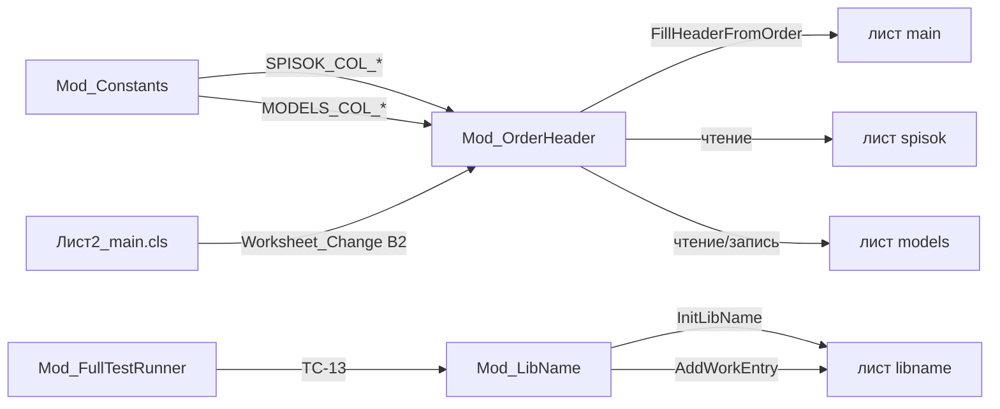
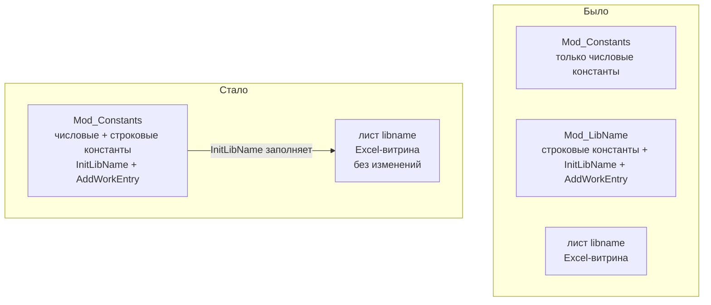

# Аналитический отчёт: Mod_Constants.bas ↔ Mod_LibName.bas ↔ лист libname

**Дата:** 2026-07-21
**Проект:** SysW (work.xlsm)
**Тип отчёта:** Анализ связей, актуальности и план рефакторинга

---

## 1. Общая архитектура проекта

Проект — Excel-книга с макросами (`work.xlsm`) для автоматизации заказ-нарядов автосервиса.
VBA-исходники: [`src/modules/`](src/modules/) (`.bas`) и [`src/sheets/`](src/sheets/) (`.cls`).

**Ключевые листы `work.xlsm`:**

| Лист | Назначение |
|------|-----------|
| `main` | Интерфейс заказа-наряда (ввод/отображение) |
| `spisok` | Справочник ТС (входящий список авто) |
| `models` | Справочник групп и цен н/ч по моделям |
| `libname` | Реестр имён проекта (документация сущностей) |
| `work` | Работы (структура не описана в коде) |
| `z4` | Запчасти (структура не описана в коде) |

---

## 2. Анализ Mod_Constants.bas

**Файл:** [`src/modules/Mod_Constants.bas`](src/modules/Mod_Constants.bas)
**Назначение:** Централизованное хранение констант столбцов.

### Определённые константы

**Лист `spisok` (столбцы A–J):**

| Константа | Значение | Столбец |
|-----------|----------|---------|
| `SPISOK_COL_MODEL` | 2 | B — Модель |
| `SPISOK_COL_GRZ` | 3 | C — ГРЗ |
| `SPISOK_COL_VIN` | 4 | D — VIN |
| `SPISOK_COL_GARAGE` | 5 | E — Гараж. № |
| `SPISOK_COL_YEAR` | 6 | F — Год выпуска |
| `SPISOK_COL_MILEAGE` | 7 | G — Пробег |
| `SPISOK_COL_DATE` | 8 | H — Дата |
| `SPISOK_COL_NOTE` | 10 | J — РЕЗЕРВ |

**Лист `models` (столбцы A–C):**

| Константа | Значение | Столбец |
|-----------|----------|---------|
| `MODELS_COL_MODEL` | 1 | A — Модель |
| `MODELS_COL_GROUP` | 2 | B — Группа |
| `MODELS_COL_PRICE` | 3 | C — Цена н/ч |

### Потребители констант

Константы используются **только** в [`Mod_OrderHeader.bas`](src/modules/Mod_OrderHeader.bas) (строки 83–89, 100, 116–117, 122–123, 138).

### Замечания

1. **`SPISOK_COL_NOTE = 10`** объявлена, но **нигде не используется**.
2. **Нет константы для столбца A** (№ п/п) листа `spisok` — в коде используется прямое `Columns(1)`.
3. **Нет константы для столбца I** (группа) листа `spisok`.
4. **Нет констант для листа `main`** — все адреса жёстко закодированы (B2, B3:B15, L:N, X:AA).
5. **Нет констант для листов `work` и `z4`** — структура не описана.

---

## 3. Анализ Mod_LibName.bas

**Файл:** [`src/modules/Mod_LibName.bas`](src/modules/Mod_LibName.bas)
**Назначение:** Управление листом `libname` — реестр имён проекта.

### Структура модуля

- **Приватный тип** `LibNameEntry` (NameKey, England, Russian) — строки 16–20
- **`InitLibName()`** — заполняет лист `libname` начальными данными (стр. 27–68)
- **`BuildEntryArray()`** — возвращает массив из 13 записей (стр. 81–156)
- **`AddWorkEntry()`** — добавляет запись `work.xlsm` в конец списка (стр. 162–197)

### Записи реестра

| # | NameKey | England | Russian |
|---|---------|---------|---------|
| 0 | `spisok_col_num` | spisok | лист spisok с входящим списком авто |
| 1 | `spisok_col_model` | model | Модель (столбец B листа spisok) |
| 2 | `spisok_col_grz` | grz | ГРЗ (столбец C листа spisok) |
| 3 | `spisok_col_vin` | vin | VIN (столбец D листа spisok) |
| 4 | `spisok_col_garnum` | garnum | Гараж. № (столбец E листа spisok) |
| 5 | `spisok_col_year` | year | Год выпуска (столбец F листа spisok) |
| 6 | `spisok_col_mileage` | mileage | Пробег (столбец G листа spisok) |
| 7 | `spisok_col_date` | date | Дата (столбец H листа spisok) |
| 8 | `spisok_col_group` | group | Группа (столбец I листа spisok) |
| 9 | `spisok_col_reserve` | reserve | РЕЗЕРВ (столбец J листа spisok) |
| 10 | `models_col_model_name` | model_name | Модель (столбец A листа models) |
| 11 | `models_col_hrpr` | hrpr | Цена н/ч (столбец C листа models) |
| 12 | `work.xlsm` | work | книга Excel с макросами |

### Потребители

- **`Mod_FullTestRunner.bas`** (стр. 376–441) — тест TC-13 проверяет заполнение листа `libname`.
- **`Mod_Logger.bas`** — логирование внутри модуля.

---

## 4. Связи: Mod_Constants ↔ Mod_LibName ↔ лист libname

### Граф зависимостей



### Несоответствия между Mod_Constants и Mod_LibName

| Аспект | Mod_Constants | Mod_LibName (libname) | Статус |
|--------|--------------|----------------------|--------|
| Столбец I (группа) spisok | **Нет константы** | `spisok_col_group` — есть | ⚠️ Расхождение |
| Столбец J (РЕЗЕРВ) spisok | `SPISOK_COL_NOTE = 10` | `spisok_col_reserve` | ⚠️ Разные имена |
| Столбец A (№ п/п) spisok | **Нет константы** | `spisok_col_num` — есть | ⚠️ Расхождение |
| Столбец B (группа) models | `MODELS_COL_GROUP = 2` | **Нет записи** | ⚠️ Расхождение |
| Лист `work` | **Нет констант** | **Нет записей** | ✅ Согласовано |
| Лист `z4` | **Нет констант** | **Нет записей** | ✅ Согласовано |

---

## 5. Проверка актуальности

### 5.1. Mod_Constants.bas

| Критерий | Оценка |
|----------|--------|
| Соответствие листу `spisok` | ✅ Актуально (B–H, J) |
| Соответствие листу `models` | ✅ Актуально (A–C) |
| Используемость `SPISOK_COL_NOTE` | ⚠️ Не используется |
| Покрытие листа `spisok` | ⚠️ Неполное (нет A, I) |
| Покрытие листа `main` | ❌ Отсутствует |
| Покрытие листов `work`/`z4` | ❌ Отсутствует |

### 5.2. Mod_LibName.bas

| Критерий | Оценка |
|----------|--------|
| Соответствие Mod_Constants | ⚠️ Частичное (4 расхождения) |
| Полнота реестра | ⚠️ Нет `models_col_group` |
| `AddWorkEntry()` | ✅ Актуально |
| `InitLibName()` | ✅ Актуально |
| Тест TC-13 | ✅ Актуален |

### 5.3. Лист libname

Лист `libname` — **документационный реестр**, не участвует в бизнес-логике.
Проблемы: нет записи для `models_col_group`, имя `spisok_col_reserve` не соответствует `SPISOK_COL_NOTE`.

---

## 6. План рефакторинга: объединение Mod_LibName → Mod_Constants (Вариант C)

### Обоснование

Три компонента дублируют информацию о структуре листов.
**Цель:** единый модуль констант, лист `libname` остаётся как витрина для пользователя Excel.

### Что меняется



### Детальный план

#### Шаг 1. Добавить строковые константы в Mod_Constants

Добавить константы по шаблону `{ЛИСТ}_COL_{СУЩНОСТЬ}_NAME`:

```vba
' === Строковые константы для листа libname ===
Public Const SPISOK_COL_NUM_NAME As String = "spisok"
Public Const SPISOK_COL_MODEL_NAME As String = "model"
Public Const SPISOK_COL_GRZ_NAME As String = "grz"
Public Const SPISOK_COL_VIN_NAME As String = "vin"
Public Const SPISOK_COL_GARAGE_NAME As String = "garnum"
Public Const SPISOK_COL_YEAR_NAME As String = "year"
Public Const SPISOK_COL_MILEAGE_NAME As String = "mileage"
Public Const SPISOK_COL_DATE_NAME As String = "date"
Public Const SPISOK_COL_GROUP_NAME As String = "group"
Public Const SPISOK_COL_NOTE_NAME As String = "reserve"   ' согласовано с libname
Public Const MODELS_COL_MODEL_NAME As String = "model_name"
Public Const MODELS_COL_GROUP_NAME As String = "group"     ' новая
Public Const MODELS_COL_PRICE_NAME As String = "hrpr"
Public Const WORK_NAME As String = "work"
Public Const Z4_NAME As String = "z4"
```

#### Шаг 2. Перенести InitLibName и AddWorkEntry в Mod_Constants

- Скопировать процедуры `InitLibName()` и `AddWorkEntry()` из `Mod_LibName.bas` в `Mod_Constants.bas`
- Заменить жёстко закодированные строки в `BuildEntryArray()` на строковые константы из шага 1
- Добавить недостающие записи: `models_col_group`, `work`, `z4`

#### Шаг 3. Обновить Mod_FullTestRunner

- Заменить `Call Mod_LibName.InitLibName` на `Call Mod_Constants.InitLibName`
- Обновить TC-13: добавить проверку новых записей (`models_col_group`, `work`, `z4`)

#### Шаг 4. Удалить Mod_LibName.bas

- Файл [`src/modules/Mod_LibName.bas`](src/modules/Mod_LibName.bas) удаляется
- Все импорты/экспорты VBA обновить

#### Шаг 5. Обновить документацию

- [`docs/DEVELOPER.md`](docs/DEVELOPER.md) — обновить таблицу модулей (стр. 309–310)
- [`plans/structure_current_work.xlsm.md`](plans/structure_current_work.xlsm.md) — добавить структуру `work` и `z4`

### Что НЕ меняется

- Лист `libname` в `work.xlsm` — остаётся как есть
- Логика `Mod_OrderHeader` — не меняется (использует числовые константы)
- Логика `Mod_Import`, `Mod_SheetOps` — не меняется
- Тест TC-13 — обновляется только вызов, логика та же

### Риски

| Риск | Вероятность | Митигация |
|------|------------|-----------|
| Забыть обновить тест TC-13 | Низкая | Явно указано в плане |
| Конфликт имён констант | Низкая | Префиксы `SPISOK_`, `MODELS_` уникальны |
| Нарушение обратной совместимости | Низкая | `InitLibName` и `AddWorkEntry` — Public, вызовы только из теста |

---

## 7. Итоговые выводы

1. **`Mod_Constants.bas`** — стабильный, но неполный. Требует добавления констант для столбцов A, I (spisok) и листа main.
2. **`Mod_LibName.bas`** — функционально корректен, но имеет 4 расхождения с `Mod_Constants`.
3. **Лист `libname`** — актуален как документация, но требует синхронизации.
4. **Прямой зависимости** между `Mod_Constants` и `Mod_LibName` нет — они независимы.
5. **Рекомендация:** объединить `Mod_LibName` → `Mod_Constants` (Вариант C), устранив расхождения и централизовав управление константами.