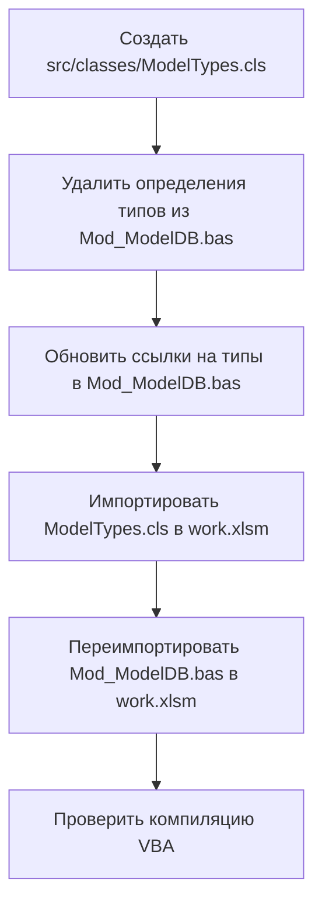

# План исправления ошибки компиляции VBA

## "Only public user defined types defined in public object modules can be used..."

---

## 1. Описание проблемы

В проекте VBA (Excel) три `Public Type` — `WorkEntry`, `WorkIdentity`, `PartIdentity` — определены в **Standard `.bas` module** [`Mod_ModelDB.bas`](src/modules/Mod_ModelDB.bas:24).

Согласно правилам VBA, `Public Type`, определённый в Standard `.bas` module, **не может** использоваться как параметр или возвращаемый тип Public процедур **Class modules** (включая листы `Лист2_main.cls`, у которого `VB_Exposed = True`).

Хотя **на данный момент** эти типы используются только внутри `Mod_ModelDB.bas` (как локальные переменные `Dim tmpIdentity As WorkIdentity`), ошибка может возникать при определённых условиях компиляции, либо проект планируется расширять, и типы могут начать использоваться в `Лист2_main.cls`.

**Корень проблемы**: `Public Type` в Standard `.bas` module не является "public user defined type defined in public object module".

---

## 2. Анализ текущего состояния

### 2.1. Определения типов (все в `Mod_ModelDB.bas`)

| Тип | Строки | Описание |
|-----|--------|----------|
| `WorkEntry` | 24–31 | Структура записи работы (Code, Name, Unit, NormHours, Price, Note) |
| `WorkIdentity` | 40–47 | Структура тождества работ (OutArticle, OutName, NormHours, QtyZN, Aggregate, InName) |
| `PartIdentity` | 56–64 | Структура тождества запчастей (OutArticle, OutName, QtyZN, Price, Aggregate, InCatNum, InName) |

### 2.2. Использование типов

Все три типа используются **исключительно** внутри `Mod_ModelDB.bas`:

- `WorkEntry` — строка 189: `Dim tmpEntry As WorkEntry` в функции `GetWorks()`
- `WorkIdentity` — строка 260: `Dim tmpIdentity As WorkIdentity` в функции `GetWorkIdentities()`
- `PartIdentity` — строка 335: `Dim tmpIdentity As PartIdentity` в функции `GetPartIdentities()`

**Ни в одном другом файле проекта** эти типы не используются (результаты поиска по `*.bas` и `*.cls`).

### 2.3. Public Object Module в проекте

Единственный класс-модуль: [`Лист2_main.cls`](src/sheets/Лист2_main.cls) — лист `main` с атрибутами:
- `VB_Exposed = True` (публичный объектный модуль)
- `VB_Creatable = False`
- `VB_PredeclaredId = True`

### 2.4. Существующий паттерн (успешный)

В [`Mod_OrderHeader.bas`](src/modules/Mod_OrderHeader.bas) определён `Public Type OrderHeader`, но модуль содержит `Option Private Module`, что делает тип доступным только внутри проекта и **не вызывает** ошибку компиляции.

---

## 3. Выбор стратегии исправления

### Рассмотренные варианты

| Вариант | Описание | Оценка |
|---------|----------|--------|
| **A** | Перенести типы в `Лист2_main.cls` | ❌ Нежелательно — смешение логики данных и логики листа |
| **B** | Создать отдельный `ModelTypes.cls` | ✅ Рекомендуется — чистое разделение ответственности |
| **C** | Добавить `Option Private Module` в `Mod_ModelDB.bas` | ❌ Сломает доступ к Public функциям модуля из других модулей |
| **D** | Оставить как есть (если нет ошибки сейчас) | ❌ Не решает проблему, ошибка может проявиться |

### Решение: **Вариант B** — создать отдельный класс `ModelTypes.cls`

**Обоснование**:
1. Типы данных (`WorkEntry`, `WorkIdentity`, `PartIdentity`) — это модель данных, а не логика листа.
2. `Лист2_main.cls` отвечает за обработку событий листа `main` — смешивать с определением типов некорректно.
3. Отдельный класс `ModelTypes.cls` с `VB_Exposed = True` будет "public object module", что разрешает использование `Public Type` в Public процедурах.
4. Все три типа логически связаны (модельные данные) — их группировка в одном классе оправдана.

---

## 4. Точные изменения

### 4.1. Создать файл `src/classes/ModelTypes.cls`

**Содержимое** (новый файл):

```vba
VERSION 1.0 CLASS
BEGIN
  MultiUse = -1  'True
END
Attribute VB_Name = "ModelTypes"
Attribute VB_GlobalNameSpace = False
Attribute VB_Creatable = False
Attribute VB_PredeclaredId = True
Attribute VB_Exposed = True

Option Explicit

' ============================================================
' Модуль: ModelTypes
' Назначение: Определение публичных типов данных модели
'             Перенесено из Mod_ModelDB.bas (v0.15.0)
' ============================================================

' --------------------------------------------------------------------------
' WorkEntry
' Структура записи работы из листа {GroupName} файла группы
' --------------------------------------------------------------------------
Public Type WorkEntry
    Code As String
    Name As String
    Unit As String
    NormHours As Double
    Price As Currency
    Note As String
End Type

' --------------------------------------------------------------------------
' WorkIdentity
' Структура записи тождества работ из листа {GroupName}w
' --------------------------------------------------------------------------
Public Type WorkIdentity
    OutArticle As String   ' B — Артикул (модельный)
    OutName As String      ' C — Наименование (модельное)
    NormHours As Double    ' D — н/ч
    QtyZN As Double        ' G — Кол-во ЗН
    Aggregate As String    ' I — Агрегат (код)
    InName As String       ' J — Наим-ние (входящее)
End Type

' --------------------------------------------------------------------------
' PartIdentity
' Структура записи тождества запчастей из листа {GroupName}z4
' --------------------------------------------------------------------------
Public Type PartIdentity
    OutArticle As String   ' B — Артикул (модельный)
    OutName As String      ' C — Наименование (модельное)
    QtyZN As Double        ' G — Кол-во ЗН
    Price As Currency      ' F — Цена за ед. изм.
    Aggregate As String    ' I — АГРЕГАТ (код)
    InCatNum As String     ' J — № кат. (входящий)
    InName As String       ' K — Наим-ние (входящее)
End Type
```

### 4.2. Изменить `src/modules/Mod_ModelDB.bas`

**Удалить** строки 16–64 (весь блок "Типы данных" — определения `WorkEntry`, `WorkIdentity`, `PartIdentity`).

После удаления блок "Типы данных" будет выглядеть так:

```vba
' ============================================================
' Типы данных
' ============================================================
' @moved v0.15.0 — Перенесены в ModelTypes.cls
```

**Дополнительно**: добавить `Option Private Module` в `Mod_ModelDB.bas` **НЕ НУЖНО**, так как модуль содержит Public функции, используемые из других модулей (например, `GetModelDBBasePath`, `OpenModelGroupFile`, `GetWorks` и др.).

### 4.3. Обновить ссылки на типы в `Mod_ModelDB.bas`

В строках 189, 260, 335 типы используются как `Dim tmpEntry As WorkEntry`, `Dim tmpIdentity As WorkIdentity`, `Dim tmpIdentity As PartIdentity`.

Поскольку `ModelTypes.cls` будет иметь `VB_PredeclaredId = True`, к типам можно обращаться как `ModelTypes.WorkEntry`, `ModelTypes.WorkIdentity`, `ModelTypes.PartIdentity`.

**Изменения**:

| Строка | Было | Стало |
|--------|------|-------|
| 189 | `Dim tmpEntry As WorkEntry` | `Dim tmpEntry As ModelTypes.WorkEntry` |
| 260 | `Dim tmpIdentity As WorkIdentity` | `Dim tmpIdentity As ModelTypes.WorkIdentity` |
| 335 | `Dim tmpIdentity As PartIdentity` | `Dim tmpIdentity As ModelTypes.PartIdentity` |

---

## 5. Порядок выполнения изменений



### Шаг 1: Создать `src/classes/ModelTypes.cls`
- Создать директорию `src/classes/` (если не существует)
- Записать содержимое из п. 4.1

### Шаг 2: Изменить `src/modules/Mod_ModelDB.bas`
- Удалить блок определений типов (строки 16–64)
- Добавить комментарий о переносе
- Обновить три объявления `Dim` с префиксом `ModelTypes.`

### Шаг 3: Импортировать в `work.xlsm`
- Импортировать `ModelTypes.cls` в проект VBA
- Переимпортировать `Mod_ModelDB.bas`

### Шаг 4: Проверить компиляцию
- В редакторе VBA: `Debug → Compile VBAProject`
- Убедиться, что ошибка "Only public user defined types..." отсутствует

---

## 6. Проверка результата

### Критерии успеха

1. **Компиляция**: `Debug → Compile VBAProject` проходит без ошибок.
2. **Функциональность**: Все функции `Mod_ModelDB` (`GetWorks`, `GetWorkIdentities`, `GetPartIdentities`) работают корректно.
3. **Структура**: Типы данных находятся в `ModelTypes.cls`, а не в `Mod_ModelDB.bas`.
4. **Совместимость**: Ни один другой модуль не использует эти типы напрямую (подтверждено поиском).

### Команды для проверки

```bash
# Поиск использования типов в проекте (не должно быть результатов кроме Mod_ModelDB.bas)
findstr /s "WorkIdentity\|WorkEntry\|PartIdentity" src\*.bas src\*.cls
```

---

## 7. Риски и предостережения

| Риск | Вероятность | Митигация |
|------|-------------|-----------|
| Забыть обновить `Dim`-объявления | Низкая | Чётко указаны строки для замены |
| Конфликт имён с другими модулями | Низкая | Префикс `ModelTypes.` уникален |
| Потеря комментариев к типам | Низкая | Комментарии переносятся вместе с типами |
| `VB_PredeclaredId = True` не сработает | Низкая | Стандартный атрибут для class modules |

---

## 8. Итог

**Что делаем**: Переносим `Public Type WorkEntry`, `WorkIdentity`, `PartIdentity` из `Mod_ModelDB.bas` в новый класс `ModelTypes.cls` с `VB_Exposed = True`.

**Почему**: Это единственный способ сделать типы доступными для Public процедур Class modules без ошибки компиляции.

**Объём изменений**: 1 новый файл, 1 изменённый файл, 3 замены строк.