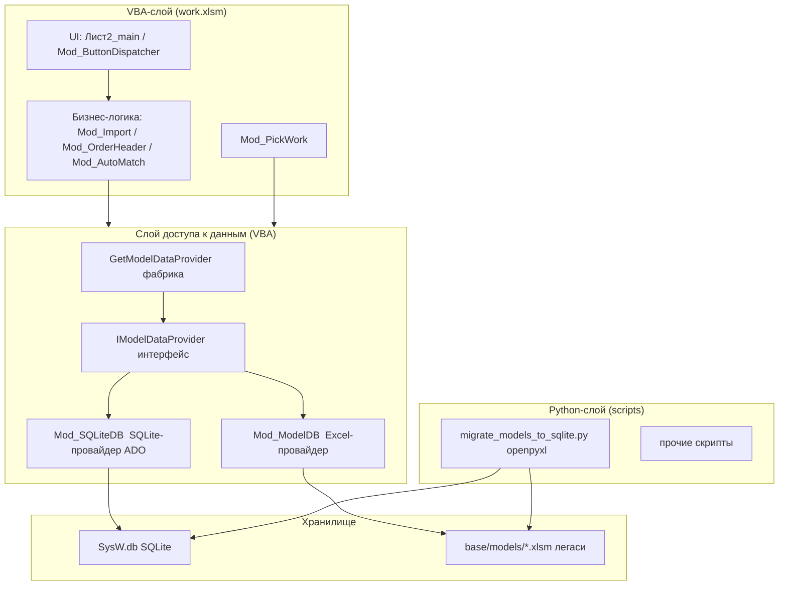
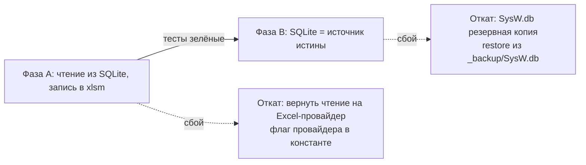

# План миграции системы SysW на SQLite (единая база данных)

> **Статус:** Проектирование (архитектурный план)
> **Проект:** SysW v1.0.4
> **Цель:** Полный перевод слоя хранения модельных данных (работы, запчасти, тождества, группы) с Excel-файлов `base/models/*.xlsm` на единую базу данных SQLite `SysW.db` с сохранением интерфейсной совместимости с VBA-слоем.
> **Автор:** Архитектор (режим Architect)
> **Дата:** 2026-08-14

---

## 0. Резюме

Система SysW имеет два независимых слоя — VBA (Excel) и Python — оба зависят от Excel-файлов. Цель — ввести единую БД `SysW.db` (SQLite), к которой:
- **Python пишет** (миграция/обновление данных из `base/models/*.xlsm` через openpyxl без COM);
- **VBA читает** (в рантайме через ADO) и, начиная с Фазы B, также записывает (создание групп, запись тождеств).

Миграция выполняется **двухфазно**:
- **Фаза A — слой чтения:** VBA получает доступ к моделям через `Mod_SQLiteDB` (read-only провайдер). Excel-файлы остаются эталоном записи, но чтение (GetWorks, GetWorkIdentities, GetPartIdentities) переводится на SQLite.
- **Фаза B — полный переход:** `SysW.db` становится источником истины; интеграция с `Mod_Import`, `Mod_OrderHeader`, `Mod_AutoMatch`; запись через ADO.

Ключевые блокеры (COM-зависание на `Workbooks.Open`, частично реализованный `Mod_ModelDB`, Excel-зависимость) решаются за счёт: конвертера на openpyxl (без COM), абстракции `IModelDataProvider` + фабрики, и сохранения Excel-файлов как read-only легаси на время переходного периода.

---

## 1. Целевая архитектура

### 1.1. Слои и компоненты



### 1.2. Расположение `SysW.db`

```
L:\PROject\SysW\
├── SysW.db                    # ЕДИНАЯ база данных SQLite (новая, корневой уровень)
├── base\
│   ├── templates\             # Шаблоны (не изменяются)
│   └── models\                # Легаси .xlsm (эталон записи в Фазе A; read-only в B)
├── src\                       # VBA-исходники (Mod_ModelDB, Mod_SQLiteDB, ...)
├── scripts\                   # Python (migrate_models_to_sqlite.py и др.)
├── docs\
└── plans\
```

**Правило пути:** VBA определяет путь к `SysW.db` как `ThisWorkbook.Path & "\SysW.db"` (аналогично `GetModelDBBasePath()`), Python — как `PROJECT_DIR / "SysW.db"` через [`scripts/config.py`](../scripts/config.py).

### 1.3. Интерфейс `IModelDataProvider`

VBA не имеет нативных интерфейсов (как в C#/Java), поэтому интерфейс реализуется **классом-интерфейсом** `IModelDataProvider.cls`, у которого все методы объявлены и возвращают `Err.Raise vbObjectError + 1, ...` (заглушки, которые не должны вызываться). Обе реализации (`Mod_ModelDB`, `Mod_SQLiteDB`) объявляются как `Implements IModelDataProvider`.

> **Важно:** Общие структуры данных (UDT) не могут быть возвращаемыми типами публичных процедур классов (ограничение VBA "Only public user defined types ..."), поэтому методы провайдера возвращают `Collection` объектов (`WorkIdentity`, `PartIdentity`, `WorkEntry` как класс), а не UDT. `WorkEntry` в текущем коде — UDT в [`Mod_ModelTypes.bas`](../src/modules/Mod_ModelTypes.bas:17). **Требуется рефакторинг `WorkEntry` из UDT в класс** `WorkEntry.cls` (по образцу `WorkIdentity.cls`/`PartIdentity.cls`), чтобы интерфейс мог возвращать объекты единообразно.

Полные сигнатуры интерфейса `IModelDataProvider.cls`:

```vba
' ============================================================
' IModelDataProvider — контракт провайдера данных моделей.
' Реализации: Mod_ModelDB (Excel), Mod_SQLiteDB (SQLite).
' Все методы возвращают коллекции ОБЪЕКТОВ.
' ============================================================
Attribute VB_Name = "IModelDataProvider"
Option Explicit

Public Function GetWorks(ByVal groupName As String, ByRef filters As Variant) As Collection
    Err.Raise vbObjectError + 1, "IModelDataProvider", "Not implemented"
End Function

Public Function GetParts(ByVal groupName As String, ByRef filters As Variant) As Collection
    Err.Raise vbObjectError + 1, "IModelDataProvider", "Not implemented"
End Function

Public Function GetModelWorks(ByVal groupName As String, ByRef filters As Variant) As Collection
    Err.Raise vbObjectError + 1, "IModelDataProvider", "Not implemented"
End Function

Public Function GetModelParts(ByVal groupName As String, ByRef filters As Variant) As Collection
    Err.Raise vbObjectError + 1, "IModelDataProvider", "Not implemented"
End Function

Public Function GetMatLibEntries(ByVal groupName As String, ByVal entryCode As String) As Collection
    Err.Raise vbObjectError + 1, "IModelDataProvider", "Not implemented"
End Function

Public Function GetWorkIdentities(ByVal groupName As String) As Collection
    Err.Raise vbObjectError + 1, "IModelDataProvider", "Not implemented"
End Function

Public Function GetPartIdentities(ByVal groupName As String) As Collection
    Err.Raise vbObjectError + 1, "IModelDataProvider", "Not implemented"
End Function

Public Function GetAllModelGroups() As Collection
    Err.Raise vbObjectError + 1, "IModelDataProvider", "Not implemented"
End Function

Public Function CreateModelGroupFile(ByVal groupName As String) As Boolean
    Err.Raise vbObjectError + 1, "IModelDataProvider", "Not implemented"
End Function

Public Function ModelGroupFileExists(ByVal groupName As String) As Boolean
    Err.Raise vbObjectError + 1, "IModelDataProvider", "Not implemented"
End Function
```

### 1.4. Фабричный метод

В `Mod_ModelDB.bas` добавляется фабрика (остаётся в этом модуле как точка входа):

```vba
' ============================================================
' Фабричный метод получения провайдера данных моделей.
' Определяет активный источник (SQLite по умолчанию, Excel — fallback).
' Возвращает объект, реализующий IModelDataProvider.
' ============================================================
Public Function GetModelDataProvider() As Object
    ' Приоритет: SQLite, если SysW.db существует.
    Dim dbPath As String
    dbPath = ThisWorkbook.Path & "\SysW.db"
    If Len(Dir(dbPath)) > 0 Then
        Set GetModelDataProvider = New Mod_SQLiteDB
    Else
        ' Fallback на Excel-провайдер (легаси), либо raise если не нужен.
        Set GetModelDataProvider = New Mod_ModelDB_Provider
    End If
End Function
```

> **Замечание:** `Mod_ModelDB` сейчас — модуль с функциями, а не класс. Для единообразия интерфейса вводится **класс-провайдер** `Mod_ModelDBProvider.cls` (обёртка над существующими функциями), либо `Mod_ModelDB` остаётся модулем-фабрикой + статическими функциями, а интерфейс реализуют классы. **Рекомендуется:** `Mod_ModelDB.bas` становится фабрикой/обёрткой, реальная Excel-реализация — новый класс `Mod_ModelDBProvider.cls`, SQLite-реализация — `Mod_SQLiteDB.cls`. Оба `Implements IModelDataProvider`.

### 1.5. Класс `Mod_SQLiteDB` (ADO-подключение, CRUD)

```vba
' ============================================================
' Класс: Mod_SQLiteDB
' Назначение: SQLite-провайдер через ADO (Microsoft ActiveX Data Objects 6.1).
' Реализует IModelDataProvider.
' ============================================================
Attribute VB_Name = "Mod_SQLiteDB"
Option Explicit
Implements IModelDataProvider

' Путь к БД (по умолчанию ThisWorkbook.Path & "\SysW.db")
Private m_dbPath As String

' Подключение
Private m_conn As ADODB.Connection

Public Property Get DbPath() As String
    DbPath = m_dbPath
End Property
Public Property Let DbPath(ByVal v As String)
    m_dbPath = v
End Property

' ------------------------------------------------------------
' OpenConnection — открывает ADO-подключение к SQLite.
' Драйвер: Microsoft ODBC для SQLite (или System.Data.SQLite ODBC provider).
' ------------------------------------------------------------
Public Sub OpenConnection()
    On Error GoTo ErrHandler
    If m_conn Is Nothing Then
        Set m_conn = New ADODB.Connection
        m_conn.ConnectionString = _
            "Driver={SQLite3 ODBC Driver};Database=" & m_dbPath & ";ReadOnly=0;"
        m_conn.Open
    End If
    Exit Sub
ErrHandler:
    Err.Raise Err.Number, "Mod_SQLiteDB", "OpenConnection: " & Err.Description
End Sub

Public Sub CloseConnection()
    On Error Resume Next
    If Not m_conn Is Nothing Then
        If m_conn.State = adStateOpen Then m_conn.Close
        Set m_conn = Nothing
    End If
End Sub

' ------------------------------------------------------------
' ExecuteScalar — возвращает скалярное значение
' ------------------------------------------------------------
Public Function ExecuteScalar(ByVal sql As String, ByRef params As Variant) As Variant
    ' ...
End Function

' ------------------------------------------------------------
' ExecuteQuery — выполняет SELECT, возвращает Recordset
' ------------------------------------------------------------
Public Function ExecuteQuery(ByVal sql As String, ByRef params As Variant) As ADODB.Recordset
    ' ...
End Function

' ------------------------------------------------------------
' ExecuteNonQuery — INSERT/UPDATE/DELETE/DDL
' ------------------------------------------------------------
Public Sub ExecuteNonQuery(ByVal sql As String, ByRef params As Variant)
    ' ...
End Sub
```

> **Примечание по драйверу:** ADO не имеет встроенного провайдера SQLite. Требуется ODBC-драйвер `SQLite3 ODBC Driver` (sqliteodbc.dll) либо использование `ADODB` с провайдером `Microsoft.ACE.OLEDB` (не поддерживает SQLite). Рекомендуется **ODBC SQLite3 Driver** и обязательная фиксация имени драйвера в константе + проверка его наличия при старте (иначе — graceful fallback на Excel-провайдер). Альтернативный вариант — использовать системную библиотеку через Declare (sqlite3.dll) без ADO, но это усложняет переносимость; ODBC — компромисс.

### 1.6. Полный DDL-схема (уточнённая)

На основе готовой DDL из [`docs/ARCHITECTURE.md`](../docs/ARCHITECTURE.md) (раздел 5.4) с дополнениями под фактические колонки листов (заголовки строка 3, данные с 4-й) и тождества.

```sql
-- ============================================================
-- SysW.db  Схема v1 (PRAGMA user_version = 1)
-- ============================================================

-- Справочник агрегатов (16 кодов AGG_*)
CREATE TABLE IF NOT EXISTS aggregates (
    code TEXT PRIMARY KEY,               -- DIAG, TO, ENG, ...
    name_ru TEXT NOT NULL,               -- "Диагностика", ...
    sort_order INTEGER DEFAULT 0
);

-- Группы моделей (соответствует base/models/{GroupName}.xlsm)
CREATE TABLE IF NOT EXISTS model_groups (
    group_name TEXT PRIMARY KEY,         -- UAZ, GAZ, 4x4, 2170, ...
    created_at TEXT DEFAULT (datetime('now')),
    note TEXT
);

-- Каталог запчастей (лист z4 файла группы; код уникален в пределах группы)
CREATE TABLE IF NOT EXISTS parts (
    group_name TEXT NOT NULL,
    code TEXT NOT NULL,                  -- A: Code
    name TEXT NOT NULL,                  -- B: Name
    unit TEXT,                           -- C: Unit
    price REAL,                          -- D: Price
    note TEXT,                           -- E: Note
    PRIMARY KEY (group_name, code),
    FOREIGN KEY (group_name) REFERENCES model_groups(group_name)
);

-- Каталог работ (лист {GroupName}; код уникален в пределах группы)
CREATE TABLE IF NOT EXISTS works (
    group_name TEXT NOT NULL,
    code TEXT NOT NULL,                  -- A: Code
    name TEXT NOT NULL,                  -- B: Name
    unit TEXT,                           -- C: Unit
    norm_hours REAL,                     -- D: NormHours
    price REAL,                          -- E: Price
    note TEXT,                           -- F: Note
    PRIMARY KEY (group_name, code),
    FOREIGN KEY (group_name) REFERENCES model_groups(group_name)
);

-- Модельные запчасти (лист {GroupName}z4, данные с 4-й строки)
-- Содержит и тождества (OutArticle/InCatNum/InName/Aggregate), т.к. соответствия
-- хранятся ВНУТРИ листа {GroupName}z4.
CREATE TABLE IF NOT EXISTS model_parts (
    id INTEGER PRIMARY KEY AUTOINCREMENT,
    group_name TEXT NOT NULL,
    out_article TEXT NOT NULL,           -- B: OutArticle (артикул модельный)
    out_name TEXT,                       -- C: OutName
    qty_zn REAL DEFAULT 0,               -- G: QtyZN (кол-во ЗН)
    price REAL DEFAULT 0,                -- F: Price (цена за ед.)
    aggregate TEXT,                      -- I: Агрегат (код)
    in_catnum TEXT,                      -- J: № кат. (входящий)
    in_name TEXT,                        -- K: Наим-ние (входящее)
    note TEXT,
    FOREIGN KEY (group_name) REFERENCES model_groups(group_name)
);

-- Модельные работы (лист {GroupName}w, данные с 4-й строки)
-- Содержит тождества работ (OutArticle/InName/Aggregate).
CREATE TABLE IF NOT EXISTS model_works (
    id INTEGER PRIMARY KEY AUTOINCREMENT,
    group_name TEXT NOT NULL,
    out_article TEXT NOT NULL,           -- B: OutArticle (артикул модельный)
    out_name TEXT,                       -- C: OutName
    norm_hours REAL DEFAULT 0,           -- D: н/ч
    qty_zn REAL DEFAULT 0,               -- G: QtyZN (кол-во ЗН)
    aggregate TEXT,                      -- I: Агрегат (код)
    in_name TEXT,                        -- J: Наим-ние (входящее)
    note TEXT,
    FOREIGN KEY (group_name) REFERENCES model_groups(group_name)
);

-- Глобальная таблица соответствий (библиотека соответствий).
-- В легаси соответствия лежат ВНУТРИ {GroupName}z4 / {GroupName}w,
-- поэтому здесь таблица НОРМАЛИЗУЕТ их в единый реестр (для GetMatLibEntries).
CREATE TABLE IF NOT EXISTS matlib_entries (
    id INTEGER PRIMARY KEY AUTOINCREMENT,
    group_name TEXT NOT NULL,
    entry_type TEXT NOT NULL,            -- 'work' | 'part' (входящая позиция)
    entry_code TEXT,                     -- код входящей позиции (поисковый ключ)
    entry_name TEXT,
    target_type TEXT NOT NULL,           -- 'work' | 'mod_work' | 'part' | 'mod_part'
    target_code TEXT,
    target_name TEXT,
    coefficient REAL DEFAULT 1.0,
    target_sheet TEXT,
    note TEXT,
    FOREIGN KEY (group_name) REFERENCES model_groups(group_name)
);

-- Индексы для производительности
CREATE INDEX IF NOT EXISTS idx_parts_group ON parts(group_name);
CREATE INDEX IF NOT EXISTS idx_works_group ON works(group_name);
CREATE INDEX IF NOT EXISTS idx_model_parts_group ON model_parts(group_name);
CREATE INDEX IF NOT EXISTS idx_model_parts_in_catnum ON model_parts(group_name, in_catnum);
CREATE INDEX IF NOT EXISTS idx_model_works_group ON model_works(group_name);
CREATE INDEX IF NOT EXISTS idx_model_works_in_name ON model_works(group_name, in_name);
CREATE INDEX IF NOT EXISTS idx_matlib_entry ON matlib_entries(group_name, entry_type, entry_code);

-- Версионирование БД
PRAGMA user_version = 1;
```

> **Уточнения к готовой DDL:**
> - `parts` и `works` — составной PK `(group_name, code)`, т.к. код уникален **в пределах группы** (каталог по группам). Глобальная таблица `group_parts` из ARCHITECTURE 5.4 заменена составным ключом — проще и соответствует модели "один файл = одна группа". Если потребуется глобальный каталог — добавится отдельная таблица позже.
> - Добавлены `aggregates` (16 кодов), `model_works` с тождествами работ, `model_parts` с тождествами запчастей, `matlib_entries` для единой библиотеки соответствий.
> - Таблица `model_works` в ARCHITECTURE 5.4 была без тождеств; здесь она объединяет модельные работы И тождества работ (т.к. в xlsm это один лист `{GroupName}w`).

### 1.7. Маппинг листов xlsm → таблицы

| Лист в `base/models/{G}.xlsm` | Таблица в `SysW.db` | Колонки (заголовки стр. 3, данные с 4-й) |
|-------------------------------|---------------------|------------------------------------------|
| `{G}` (все работы группы)     | `works`             | A→code, B→name, C→unit, D→norm_hours, E→price, F→note |
| `{G}w` (модельные работы + тождества) | `model_works` | B→out_article, C→out_name, D→norm_hours, G→qty_zn, I→aggregate, J→in_name |
| `z4` (все запчасти группы)    | `parts`             | A→code, B→name, C→unit, D→price, E→note |
| `{G}z4` (модельные запчасти + тождества) | `model_parts` | B→out_article, C→out_name, G→qty_zn, F→price, I→aggregate, J→in_catnum, K→in_name |
| служебные `{NN}M`             | — (не переносятся)  | — |

**Критерий строки для тождеств (совпадает с VBA-логикой):** строка включается, если не пустой столбец B (OutArticle) И не пустой столбец I (Агрегат) — как в [`Mod_ModelDB.GetWorkIdentities`](../src/modules/Mod_ModelDB.bas:250) и [`GetPartIdentities`](../src/modules/Mod_ModelDB.bas:333). Пустая строка или отсутствие агрегата = разделитель/пропуск.

---

## 2. Двухфазная стратегия миграции

### 2.1. Фаза A — слой чтения (SQLite как read-only провайдер)

**Цель:** VBA читает модели из `SysW.db` через `Mod_SQLiteDB`. Excel-файлы остаются эталоном записи (пока), но **чтение** (`GetWorks`, `GetWorkIdentities`, `GetPartIdentities`) переводится на SQLite. Это убирает COM-зависание на `Workbooks.Open` для `.xlsm` с VBA при чтении в неинтерактивной сессии (тесты).

**Объём:**
1. Создаётся `SysW.db` из 6 `base/models/*.xlsm` через Python-конвертер (см. раздел 4).
2. Вводится `IModelDataProvider.cls`, `Mod_SQLiteDB.cls`, `Mod_ModelDBProvider.cls`, фабрика `GetModelDataProvider()`.
3. `Mod_ModelDB.GetWorks` / `GetWorkIdentities` / `GetPartIdentities` переводятся на вызов провайдера (реализация через SQL).
4. `Mod_AutoMatch` (кнопки АВТО РАБ/АВТО ЗЧ) продолжает работать, т.к. читает тождества через провайдер.
5. `Mod_PickWork` (ручной подбор) в Фазе A остаётся на Excel-провайдере (нужен живой Workbook для UI).

**Критерии готовности Фазы A:**
- `SysW.db` создан и наполнен из 6 групп (контроль количества строк совпадает с xlsm).
- `Mod_SQLiteDB.GetWorkIdentities("UAZ")` возвращает ту же коллекцию, что и Excel-версия.
- Тесты TC-22..24, 31-35, 39-40, 44 проходят **без** открытия `UAZ.xlsm` через COM (не зависают).
- Fallback на Excel-провайдер работает, если `SysW.db` отсутствует.

### 2.2. Фаза B — полный переход (запись, интеграция)

**Цель:** `SysW.db` становится источником истины. Excel-файлы `base/models/*.xlsm` переводятся в **read-only легаси** (или перестают использоваться для записи). Реализуются операции записи через ADO и интеграция бизнес-логики.

**Объём:**
1. `CreateModelGroupFile` — создание группы в `SysW.db` (INSERT в `model_groups`, создание пустых таблиц не требуется — таблицы уже есть).
2. Интеграция с `Mod_Import` (`ImportFromB2_UI`, `ImportDataToMain`): после импорта — `FindModelGroupByModel` + `GetMatLibEntries` + подстановка модельных кодов (новые колонки O:P, AB:AC на листе main, см. ARCHITECTURE 4.1).
3. Интеграция с `Mod_OrderHeader.FillHeaderFromOrder`: чтение данных работ/запчастей через провайдер; автодобавление модели в `models` (лист) остаётся, но группа/цена могут читаться из БД.
4. Запись тождеств через ADO (если пользователь правит соответствия в новом UI).
5. `Mod_AutoMatch` полностью переводится на SQLite-чтение; Excel-провайдер остаётся только как резервный.
6. `Mod_PickWork` — либо сохраняет Excel-режим (пользователь хочет видеть книгу), либо переходит на SQLite (по решению).

**Критерии готовности Фазы B:**
- Полный цикл "импорт ЗН → автоподбор работ/запчастей → заполнение шапки" работает на `SysW.db` без открытия `base/models/*.xlsm`.
- Создание новой группы через `CreateModelGroupFile` создаёт запись в `SysW.db` (и при необходимости легаси-файл).
- Все 46 тестов проходят без COM-зависаний; невалидные тесты адаптированы.

### 2.3. Стратегия отката между фазами



Откат реализуется через **константу активного провайдера** в `Mod_Constants`:
```vba
Public Const MODELDB_PROVIDER_SQLITE As Boolean = True   ' True = SQLite, False = Excel
```
Если `SysW.db` повреждён или драйвер ODBC отсутствует — фабрика автоматически выбирает Excel-провайдер.

---

## 3. Схема данных SQLite, ADO в VBA, Python

### 3.1. Полное DDL

Приведено в разделе 1.6. Файл схемы должен быть вынесен в отдельный SQL-файл `scripts/schema.sql` (единый источник для Python-конвертера и документации).

### 3.2. Использование ADO в VBA

- Требуется ссылка **Microsoft ActiveX Data Objects 6.1 Library** (`ADODB`).
- Для SQLite — ODBC-драйвер `SQLite3 ODBC Driver`. Проверка наличия драйвера: `CreateObject("ADODB.Connection")` + перечисление `Conn.Providers` либо просто попытка `Open` с ошибкой → fallback.
- Все запросы — **параметризованные** (`Command.Parameters.Append`), чтобы избежать инъекций и корректно работать с кириллицей/кавычками.
- Соединение открывается/закрывается на время операции (или кешируется в классе, закрывается при `Class_Terminate`).

**Типовой SELECT в VBA:**
```vba
Dim cmd As ADODB.Command
Set cmd = New ADODB.Command
cmd.ActiveConnection = m_conn
cmd.CommandText = "SELECT out_article, out_name, norm_hours, qty_zn, aggregate, in_name " & _
                  "FROM model_works WHERE group_name = ?"
cmd.Parameters.Append cmd.CreateParameter("p1", adVarWChar, adParamInput, 50, groupName)
Dim rs As ADODB.Recordset
Set rs = cmd.Execute
Do While Not rs.EOF
    ' ... построение WorkIdentity
    rs.MoveNext
Loop
rs.Close
```

### 3.3. Python: чтение/запись `SysW.db` (sqlite3 stdlib)

```python
# scripts/migrate_models_to_sqlite.py  (фрагмент)
import sqlite3
from pathlib import Path
from openpyxl import load_workbook

DB_PATH = PROJECT_DIR / "SysW.db"
GROUPS = ["4x4", "2170", "2180", "2190", "GAZ", "UAZ"]  # и другие из model

def migrate(force=False):
    conn = sqlite3.connect(DB_PATH)
    conn.execute("PRAGMA foreign_keys = ON")
    # Схема из scripts/schema.sql (см. раздел 1.6)
    schema = (PROJECT_DIR / "scripts" / "schema.sql").read_text(encoding="utf-8")
    conn.executescript(schema)
    for g in GROUPS:
        wb = load_workbook(PROJECT_DIR / "base" / "models" / f"{g}.xlsm", read_only=True, data_only=True)
        # 1) model_groups
        conn.execute("INSERT OR REPLACE INTO model_groups(group_name) VALUES (?)", (g,))
        # 2) works из листа {g}  (заголовки стр.3, данные с 4-й)
        # 3) model_works из листа {g}w  (тождества работ)
        # 4) parts из листа z4
        # 5) model_parts из листа {g}z4  (тождества запчастей)
        # 6) matlib_entries — нормализация тождеств
        wb.close()
    conn.execute("PRAGMA user_version = 1")
    conn.commit()
    conn.close()
```

> **Важно:** `load_workbook(..., read_only=True, data_only=True)` — `data_only=True` возвращает значения формул (иначе `None`). Если в xlsm формулы ROUND и др., для переноса значений критично `data_only=True`. Легаси-файлы содержат формулы — конвертер должен брать **значения** (кэшированные), не формулы.

---

## 4. Миграция данных

### 4.1. Python-скрипт-конвертер (без COM)

Файл: `scripts/migrate_models_to_sqlite.py` (создать в Code-режиме).

**Требования:**
- Только stdlib + `openpyxl` (как [`template_protection.py`](../scripts/template_protection.py)). **Без** win32com — обходит COM-зависание.
- Читает 6 файлов `base/models/*.xlsm`.
- `GROUPS` — из константы или сканирование каталога `base/models/` по `*.xlsm` (надёжнее, т.к. GROUPS в build_templates фиксированный).
- Idempotent: повторный запуск не дублирует данные (`INSERT OR REPLACE` / `DELETE + INSERT` в транзакции).
- Сохраняет бэкап существующего `SysW.db` перед перезаписью (в `_backup/SysW_<date>.db`).

**Таблицы назначения:** `model_groups`, `works`, `parts`, `model_works`, `model_parts`, `matlib_entries` (схема в 1.6).

### 4.2. Обработка тождеств (OutArticle↔InName и т.д.)

Тождества лежат в листах `{G}w` и `{G}z4`. При миграции:
- Каждая строка с заполненным B (OutArticle) и I (Агрегат) → запись в `model_works` / `model_parts`.
- Дополнительно строится `matlib_entries`:
  - для работ: `entry_type='work'`, `entry_code=InName` (входящее наименование как поисковый ключ), `target_code=OutArticle`, `target_type='mod_work'`.
  - для запчастей: `entry_type='part'`, `entry_code=InCatNum` (входящий кат. №), `target_code=OutArticle`, `target_type='mod_part'`.
- Коэффициент `coefficient` = `qty_zn` (пересчёт количества), если применимо.

> **Важно про формат входящего кода:** VBA `AutoMatchWorks` сравнивает `identity.InName` с входящим наименованием (`MAIN_W_IN_NAME`), `AutoMatchParts` — `identity.InCatNum` с `MAIN_P_IN_CATNUM`. Схема `matlib_entries` должна хранить эти поля так, чтобы провайдер мог воспроизвести ту же логику фильтрации (LIKE/равенство с UPPER+TRIM).

### 4.3. Проверка объёмов (acceptance)

| Источник | Ожидание |
|----------|----------|
| `works` по всем группам | сумма строк = Σ(кол-во данных в листах `{G}`) |
| `parts` по всем группам | Σ(кол-во данных в листах `z4`) |
| `model_works` | Σ(кол-во тождеств в `{G}w` с B и I непустыми) |
| `model_parts` | Σ(кол-во тождеств в `{G}z4` с B и I непустыми) |

После миграции пишется отчёт `logs/migration_report.log` с контрольными числами.

---

## 5. Рефакторинг Mod_ModelDB

### 5.1. Превращение в IModelDataProvider + фабрика

Текущий [`Mod_ModelDB.bas`](../src/modules/Mod_ModelDB.bas) — модуль с функциями (не класс). План:

1. **`IModelDataProvider.cls`** (новый) — интерфейс-контракт (сигнатуры в 1.3).
2. **`Mod_ModelDBProvider.cls`** (новый) — Excel-реализация интерфейса. Обёртывает существующую логику чтения из листов (GetWorks, GetParts, GetWorkIdentities, GetPartIdentities, GetModelParts, GetModelWorks, GetMatLibEntries). Методы `Implements IModelDataProvider.*`.
3. **`Mod_SQLiteDB.cls`** (новый) — SQLite-реализация (см. 1.5).
4. **`Mod_ModelDB.bas`** — рефакторинг: остаётся фабрикой `GetModelDataProvider()` + служебными функциями путей (`GetModelDBBasePath`, `GetModelGroupFilePath`, `ModelGroupFileExists`, `GetAllModelGroups`) и композицией к провайдерам. Старые `GetWorks`/`GetWorkIdentities`/`GetPartIdentities` переписываются как делегаты к активному провайдеру (для обратной совместимости вызовов из `Mod_AutoMatch` и тестов).

**Миграция вызовов:** `Mod_AutoMatch` вызывает `Mod_ModelDB.GetWorkIdentities`/`GetPartIdentities` напрямую. Чтобы не менять все вызовы сразу, `Mod_ModelDB` сохраняет обёртки, которые делегируют в `GetModelDataProvider()`. В Фазе B вызовы переписываются на `provider.GetWorkIdentities(...)`.

### 5.2. Дополнительные реализации (R-S7, R-S8)

- `GetModelParts`/`GetModelWorks` — реализуются в обоих провайдерах (в Excel — чтение `{G}z4`/`{G}w`; в SQLite — SELECT из `model_parts`/`model_works`).
- `GetMatLibEntries(groupName, entryCode)` — в Excel читает листы `{G}z4`/`{G}w` и фильтрует; в SQLite — SELECT из `matlib_entries` по `(group_name, entry_type, entry_code)`.
- `GetAllModelGroups()` — в Excel сканирует каталог `base/models/`; в SQLite — SELECT из `model_groups`.
- `CreateModelGroupFile(groupName)` — в SQLite INSERT в `model_groups`; в Excel — создание файла (легаси).

---

## 6. Обработка блокеров

### 6.1. COM-зависание на `Workbooks.Open` (`.xlsm` с VBA)

**Первопричина** (подтверждена в [`plans/debug_hang_templates_v104.md`](../plans/debug_hang_templates_v104.md)): `Workbooks.Open` любого `.xlsm` с VBA-проектом уходит в бесконечное ожидание в неинтерактивной COM-сессии (Trust Center / AccessVBOM), **независимо** от `Visible`, `EnableEvents`, `AutomationSecurity`, `ReadOnly`.

**Решение:**
1. **Чтение моделей → SQLite, без COM.** Конвертер `migrate_models_to_sqlite.py` использует openpyxl (не открывает Excel). VBA в рантайме читает из `SysW.db` через ADO (не открывает `.xlsm` моделей). Это убирает `Workbooks.Open` из пути чтения моделей.
2. **Построение/защита шаблонов** (build_templates/apply_protection) — по варианту A из debug-плана: защиту фиксировать в XML через openpyxl, не переоткрывая COM-книги с VBA. Это уже отдельный план, но увязывается: с вводом `SysW.db` модельные `.xlsm` больше не нужны для построения шаблонов.
3. **Откат:** фабрика выбирает Excel-провайдер только если `SysW.db` отсутствует (в этом случае открытие `.xlsm` происходит в интерактивной сессии пользователя, а не в COM-автоматизации тестов).

### 6.2. Адаптация тестов (TC-22..24, 31-35, 39-40, 44)

- **TC-22..24** (`RunModelDBReadTests`): читают `UAZ` через `OpenModelGroupFile` → переписываются на `Mod_SQLiteDB` / `GetModelDataProvider`, **без** открытия `UAZ.xlsm`. Проверяют непустые коллекции из `SysW.db`.
- **TC-31..35** (`RunModelDBTests`): `GetModelGroupFilePath`/`ModelGroupFileExists` остаются (пути), но **TC-35 OpenModelGroupFile** заменяется на проверку `GetModelDataProvider()` возвращает SQLite-провайдер и `Mod_SQLiteDB.OpenConnection` успешен.
- **TC-39, TC-40** (`AutoMatchWorks`/`AutoMatchParts`): данные тождеств берутся из `SysW.db` (провайдер), не из `UAZ.xlsm`; не зависают.
- **TC-44** — остаётся пропущенным (изменяет данные на листе).
- Добавить новые тесты: TC-S1 (фабрика возвращает SQLite-провайдер при наличии БД), TC-S2 (GetWorks через SQLite эквивалентен Excel), TC-S3 (миграция конвертера даёт контрольные объёмы).

### 6.3. Защита шаблонов

Легаси `base/models/*.xlsm` защищены (`Protect`+`AllowEditRanges`+`FreezePanes`, зоны `WORK_MAIN_EDIT` и `MODEL_DATA`). Поскольку чтение переводится на SQLite, Excel-файлы для чтения не нужны. Для записи тождеств в Фазе B запись идёт в `SysW.db` через ADO (защита шаблонов не мешает). Если временно требуется править `.xlsm` — используется интерактивная сессия Excel с разрешёнными зонами.

### 6.4. Частичная реализация Mod_ModelDB

Нереализованные функции (`CreateModelGroupFile`, `FindModelGroupByModel`, `GetParts`, `GetMatLibEntries`, `GetModelParts`, `GetModelWorks`, `GetAllModelGroups`) реализуются в рамках рефакторинга 5.1 как в Excel-, так и в SQLite-провайдере.

### 6.5. Excel-формулы и событийная модель

Формулы (`ROUND`, суммы на листе main) не переносятся в SQLite — они остаются в Excel-интерфейсе. SQLite хранит только **данные**. Событийная модель (`Лист2_main.Worksheet_Change`) не затрагивается.

### 6.6. Разнородность типов

`GetWorks` возвращает Variant-массивы, `GetWorkIdentities`/`GetPartIdentities` — объекты. Унификация: все методы провайдера возвращают **Collection объектов**. `WorkEntry` переводится из UDT в класс (см. 1.3). Потребители (`Mod_AutoMatch`, `Mod_PickWork`) адаптируются к единому формату.

---

## 7. Совместимость Python/VBA

### 7.1. Единая SysW.db

- **Единый файл** `SysW.db` в корне проекта.
- **Python пишет** (миграция/обновление/валидация) через `sqlite3` stdlib.
- **VBA читает** (рантайм) через ADO/ODBC; в Фазе B также пишет.
- **Одновременный доступ:** SQLite допускает один писатель + несколько читателей. VBA-чтение конкурентно с Python-записью безопасно (WAL-режим). Рекомендуется включить `PRAGMA journal_mode=WAL` и `PRAGMA busy_timeout`.

### 7.2. Версионирование БД

- `PRAGMA user_version` хранит версию схемы (v1).
- Python-конвертер при старте: читает `user_version`, сравнивает с целевой версией скрипта; при несоответствии выполняет миграцию схемы (или предупреждает).
- В `scripts/config.py` добавляется `DB_SCHEMA_VERSION = 1` и `DB_PATH = PROJECT_DIR / "SysW.db"`.
- VBA проверяет `user_version` при подключении и логирует несоответствие.

---

## 8. Пошаговый план реализации (этапы, критерии готовности, режимы)

> Распределение: **Code** — правки `.bas`/`.cls`/`.py`; **Debug** — диагностика зависаний/ошибок; **Architect** — правки `.md` (план, документация).

### Этап 0 — Подготовка (Architect)
- [ ] Создать `scripts/schema.sql` (полное DDL из раздела 1.6).
- [ ] Добавить `DB_PATH` и `DB_SCHEMA_VERSION` в [`scripts/config.py`](../scripts/config.py).
- [ ] Актуализировать [`docs/ARCHITECTURE.md`](../docs/ARCHITECTURE.md) (раздел 5) под уточнённую схему.
- **Критерий:** schema.sql утверждён; config.py содержит пути к БД.

### Этап 1 — Конвертер данных (Code)
- [ ] Создать `scripts/migrate_models_to_sqlite.py` (openpyxl, без COM).
- [ ] Реализовать: чтение 6 xlsm, схему, заполнение таблиц, matlib_entries, PRAGMA user_version=1, бэкап в `_backup/`.
- [ ] Запустить, сверить контрольные объёмы, написать отчёт в `logs/`.
- **Критерий:** `SysW.db` создан; контрольные числа строк совпадают с xlsm; повторный запуск идемпотентен.

### Этап 2 — Классы/интерфейс VBA (Code)
- [ ] Создать `IModelDataProvider.cls` (интерфейс).
- [ ] Создать `WorkEntry.cls` (класс; вынести из UDT).
- [ ] Создать `Mod_SQLiteDB.cls` (ADO, CRUD, ODBC SQLite3, параметризованные запросы).
- [ ] Создать `Mod_ModelDBProvider.cls` (Excel-реализация, обёртка над текущей логикой).
- [ ] Рефакторинг `Mod_ModelDB.bas` (фабрика + делегаты).
- **Критерий:** код компилируется; фабрика возвращает SQLite-провайдер при наличии `SysW.db`.

### Этап 3 — Фаза A: чтение через SQLite (Code, Debug)
- [ ] `GetWorks`/`GetWorkIdentities`/`GetPartIdentities` → SQLite.
- [ ] Адаптировать тесты TC-22..24, 31-35, 39-40 (без открытия UAZ.xlsm).
- [ ] Прогнать `run_tests.py` (Debug) — убедиться в отсутствии зависаний.
- [ ] Добавить новые тесты TC-S1..TC-S3.
- **Критерий:** чтение моделей идёт из `SysW.db` без COM-зависаний; fallback на Excel работает.

### Этап 4 — Фаза B: запись и интеграция (Code)
- [ ] `CreateModelGroupFile` в SQLite.
- [ ] Интеграция `Mod_Import` (FindModelGroupByModel + GetMatLibEntries + подстановка кодов).
- [ ] Интеграция `Mod_OrderHeader.FillHeaderFromOrder`.
- [ ] `Mod_AutoMatch` полностью на SQLite-провайдере.
- [ ] Переключить константу `MODELDB_PROVIDER_SQLITE` в активное состояние.
- **Критерий:** полный цикл ЗН работает на `SysW.db` без открытия `base/models/*.xlsm`.

### Этап 5 — Валидация, документация, откат (Code, Architect)
- [ ] Полный прогон 46+ тестов.
- [ ] Обновить `docs/ARCHITECTURE.md`, `docs/ROADMAP.md` (R-S1..R-S8 статусы), `docs/CHANGELOG.md`.
- [ ] Проверка стратегии отката (бэкап/восстановление `SysW.db`, fallback-провайдер).
- **Критерий:** все тесты зелёные; документация актуальна; откат проверен.

---

## 9. Риски и стратегии отката

| # | Риск | Влияние | Митигация | Откат |
|---|------|---------|-----------|-------|
| 1 | ODBC-драйвер SQLite отсутствует в целевой среде | Критическое | Проверка драйвера при старте; fallback на Excel-провайдер; константа провайдера | Fallback на Excel |
| 2 | Несоответствие контрольных объёмов (данные потеряны при миграции) | Высокое | Контрольные числа в отчёте; бэкап `_backup/SysW_<date>.db` | Восстановить `SysW.db` из бэкапа |
| 3 | Разница в строках, не попавших в тождества (критерий B+I) | Среднее | Тот же критерий, что в VBA; сверка по числам | Перезапуск конвертера |
| 4 | `data_only=True` возвращает None для формул | Высокое | Проверка пустых значений; при None — подставлять 0/пусто; логирование | Перезапуск конвертера |
| 5 | Рефакторинг `WorkEntry` (UDT→класс) ломает потребителей | Среднее | Компиляция-проверка; замена всех обращений | Сохранение обеих форм (обёртка) |
| 6 | Конкурентная запись Python + чтение VBA | Среднее | WAL + busy_timeout; единый писатель (Python) в Фазе A | Перезапуск |
| 7 | COM-зависание сохраняется в тестах (если fallback на Excel) | Высокое | Тесты всегда на SQLite-провайдере; Excel-файлы не открываются в COM-тестах | — |
| 8 | Защита шаблонов мешает легаси-записи в `.xlsm` | Среднее | Запись в Фазе B идёт в `SysW.db`, не в `.xlsm` | Excel-редактирование вручную в интерактивной сессии |
| 9 | Схема БД эволюционирует (v1→v2) | Среднее | `PRAGMA user_version`; миграции в конвертере | Резервная копия перед миграцией |

---

## 10. Глоссарий и ссылки

| Понятие | Определение |
|---------|-------------|
| Тождество | Соответствие входящей позиции (из report.xlsx) модельной позиции (из группы) |
| Группа | Набор модельных работ/запчастей (UAZ, GAZ, 4x4, ...), хранится в файле `.xlsm` / таблицах `SysW.db` |
| Провайдер | Объект, реализующий `IModelDataProvider`, дающий доступ к данным моделей |

**Исходные материалы:**
- [`docs/ARCHITECTURE.md`](../docs/ARCHITECTURE.md) — спека модуля, DDL, интеграция.
- [`docs/ROADMAP.md`](../docs/ROADMAP.md) — задачи R-S1..R-S8.
- [`src/modules/Mod_ModelDB.bas`](../src/modules/Mod_ModelDB.bas) — текущий слой доступа.
- [`src/modules/Mod_ModelTypes.bas`](../src/modules/Mod_ModelTypes.bas), [`WorkIdentity.cls`](../src/classes/WorkIdentity.cls), [`PartIdentity.cls`](../src/classes/PartIdentity.cls).
- [`src/modules/Mod_AutoMatch.bas`](../src/modules/Mod_AutoMatch.bas), [`Mod_Import.bas`](../src/modules/Mod_Import.bas), [`Mod_OrderHeader.bas`](../src/modules/Mod_OrderHeader.bas).
- [`plans/debug_hang_templates_v104.md`](../plans/debug_hang_templates_v104.md) — анализ COM-зависания.
- [`scripts/build_templates.py`](../scripts/build_templates.py), [`scripts/template_protection.py`](../scripts/template_protection.py), [`scripts/config.py`](../scripts/config.py).