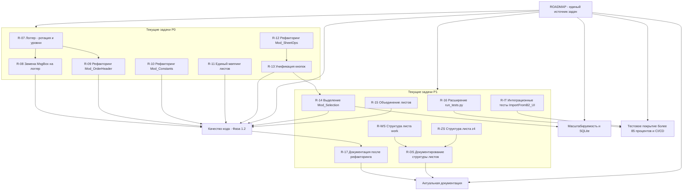

# План v1.0.11 — Интеграция системы отслеживания задач в `docs/ROADMAP.md`

> **Статус плана:** на ревью (Architect, проектирование).
> **Рабочий каталог:** `l:/PROject/SysW`.
> **Целевой файл:** `docs/ROADMAP.md` (критический, защищён правилом `[E3]` — изменения только после согласования плана).
> **Файл-источник задания:** [`plans/promt1.0.11.md`](../promt1.0.11.md).
> **Правила `.ycarules` в приоритете:** `[Z2]`, `[Z5]`, `[U1]`, `[U2]`, `[G2]`, `[G4]`, `[K1]/[K2]`, `[S7]`, `[E3]`.

---

## 1. Цель и объём v1.0.11

**Цель.** Превратить `docs/ROADMAP.md` в единый источник задач: добавить раздел с актуальными текущими (P0/P1) и глобальными целями верхнего уровня, отслеживаемыми Markdown-чекбоксами `[ ]`/`[x]`, визуализировать их mermaid-деревом и настроить расширение **Todo Tree** в VS Code для отображения дерева задач.

**Объём (входит в версию):**
- Изменение шапки ROADMAP: версия **1.0.10 → 1.0.11**, дата **2026-08-21 → 2026-08-25**.
- Добавление нового раздела **«Актуальные задачи и подзадачи»** с чекбоксами и mermaid-схемой.
- Корректировка несоответствий §5 (число тестов) и §7 (число групп правил).
- Настройка Todo Tree в `.vscode/settings.json` (добавление блока без поломки существующих настроек).
- Обновление документации (`DEVELOPER.md`, `CHANGELOG.md`, при необходимости `README.md`/`sourcecraft-guide.md`).

**Вне объёма (НЕ изменяется в этой версии):**
- Таблицы фаз ROADMAP остаются как справочная информация (не трогаем, не заменяем, не добавляем в них чекбоксы).
- VBA-код `.bas`/`.cls`/`.frm` не редактируется (правила `[Z4]`, `[Z5]`).
- Содержимое `.ycarules` не изменяется.
- `work.xlsm`, `report.xlsx` и прочие критические файлы не затрагиваются.

---

## 2. Текущее состояние (исходные данные)

| Аспект | Факт |
|--------|------|
| Шапка ROADMAP | Версия 1.0.10, дата 2026-08-21 |
| Структура | 11 разделов, таблицы фаз, без чекбоксов и mermaid-дерева |
| Всего задач в таблицах | ~55 (R-01..R-40 + R-LN/R-IM/R-IF/R-IT/R-YC + R-S1..S8 + R-WS/R-ZS/R-DS) |
| Миграция R-S1..R-S8 | ✅ выполнена (v1.0.7) |
| §5 «Тестирование» | Указано «44 теста», фактически **53** (TC-01..TC-50 + TC-S1..TC-S3) — расхождение |
| §7 «SourceCraft/GitHub» | Указано «6 групп правил (G,Z,K,U,S,O)», фактически **8** (добавлены T, E) — расхождение |
| `.vscode/settings.json` | Блок Todo Tree отсутствует; есть `files.*`, terminal, vba, python, sourcecraft-настройки |

---

## 3. Изменения `docs/ROADMAP.md`

### 3.1 Новая шапка

Заменить строки 3–5 блока «> **Версия системы:** …» на:

```markdown
> **Версия системы:** 1.0.11
> **Дата:** 2026-08-25
> **Статус:** Актуализирован (v1.0.11: интеграция системы отслеживания задач — новый раздел «Актуальные задачи и подзадачи» с чекбоксами и mermaid-деревом; настройка Todo Tree; устранены несоответствия §5 «44 теста» → «53 теста» и §7 «6 групп правил» → «8 групп правил»)
```

### 3.2 Размещение нового раздела

Новый раздел вставляется **между §10 «Сводная информация» и текущим §11 «Принципы и ограничения»**. Чтобы не ломать нумерацию и возможные ссылки:
- Новый раздел получает заголовок **`## 11. Актуальные задачи и подзадачи`**.
- Текущий §11 «Принципы и ограничения» перенумеровывается в **`## 12. Принципы и ограничения`**.

**Обоснование:** раздел задач находится перед закрывающими принципами, является «живым» источником задач и хорошо виден; перенумерация безопасна (внутренних перекрёстных ссылок на номер §11 в документе нет).

### 3.3 Формат строк с чекбоксами

Единый формат каждой задачи/подзадачи:

```markdown
- [ ] **ID** · тип · связь · условие — описание
```

Расшифровка атрибутов:
- **`[ ]`** — не выполнено; **`[x]`** — выполнено.
- **`ID`** — идентификатор задачи (R-07, R-IT, G-SQ и т.п.).
- **тип** — `текущая` (P0/P1) или `глобальная` (цель верхнего уровня).
- **связь** — `независимая` либо `зависит от <ID/фазы>`.
- **условие** — `без условий` либо конкретное условие (например, `доступ к work.xlsm в Excel`).
- **описание** — краткая формулировка задачи.

Пример готовой строки:

```markdown
- [ ] **R-07** · текущая · независимая (старт Фазы 1.2) · без условий — ротация и уровни логирования в Mod_Logger (модуль уже выделен)
```

### 3.4 Судьба таблиц фаз

Таблицы фаз (§3–§9) **остаются как справочная информация и не меняются**. В начало нового раздела добавляется примечание, что актуальный статус ведётся именно в новом разделе, а таблицы фаз — архивное/справочное описание.

---

## 4. Полный состав дерева задач

### 4.1 Текущие задачи (P0)

| ID | Тип | Связь | Условие | Описание |
|----|-----|-------|---------|----------|
| R-07 | текущая | независимая (старт Фазы 1.2) | без условий | Ротация и уровни логирования в `Mod_Logger` (модуль уже выделен; НЕ создание модуля) |
| R-08 | текущая | зависит от R-07 | без условий | Замена `MsgBox` на логгер, `_UI`-обёртки |
| R-09 | текущая | зависит от R-07 | без условий | Рефакторинг `Mod_OrderHeader` (чистые функции) |
| R-10 | текущая | независимая (в рамках Фазы 1.2) | без условий | Рефакторинг `Mod_Constants`, вынос магических чисел |
| R-11 | текущая | независимая (в рамках Фазы 1.2) | без условий | Единый словарь маппинга листов |
| R-12 | текущая | независимая (в рамках Фазы 1.2) | без условий | Рефакторинг `Mod_SheetOps`, перенос операций из `Mod_Import` |
| R-13 | текущая | зависит от R-12 | без условий | Унификация кнопок (`Btn_<лист>_<действие>_Click`) |

### 4.2 Текущие задачи (P1)

| ID | Тип | Связь | Условие | Описание |
|----|-----|-------|---------|----------|
| R-14 | текущая | зависит от Фазы 1.2 (R-13) | без условий | Выделение `Mod_Selection` |
| R-15 | текущая | независимая | без условий | Объединение листов, единый класс `Лист2_main` |
| R-16 | текущая | независимая | без условий | Расширение `run_tests.py` (`--module`, `--verbose`, `--output`, отчёты) |
| R-17 | текущая | зависит от Фазы 1.2 | без условий | Обновление документации после рефакторинга |
| R-WS | текущая | независимая | доступ к `work.xlsm` в Excel | Заполнение структуры листа `work` |
| R-ZS | текущая | независимая | доступ к `work.xlsm` в Excel | Заполнение структуры листа `z4` |
| R-DS | текущая | зависит от R-WS и R-ZS | без условий | Документирование структуры всех листов `work.xlsm` |
| R-IT | текущая | независимая | наличие рабочей книги/отчёта | Интеграционное тестирование `ImportFromB2_UI` (TC-46..TC-50) |

### 4.3 Глобальные цели верхнего уровня

| ID | Тип | Связь | Условие | Описание |
|----|-----|-------|---------|----------|
| G-RM | глобальная | независимая | без условий | ROADMAP — единый источник задач (текущая задача v1.0.11) |
| G-Q1 | глобальная | охватывает Фазу 1.2 (R-07..R-15) | без условий | Качество кода Фаза 1.2 |
| G-SQ | глобальная | зависит от R-14 | без условий | Масштабируемость и SQLite (вести к R-18/R-19) |
| G-TC | глобальная | зависит от R-16, R-IT | без условий | Тестовое покрытие >85% и CI/CD (вести к R-20, R-29..R-31) |
| G-DO | глобальная | зависит от R-17, R-DS | без условий | Актуальная документация (вести к R-32..R-33) |

> Промежуточные задачи P2/P3 (R-18..R-25, R-26..R-31, R-32..R-40) не выносятся отдельными строками — они представлены глобальными целями; при необходимости могут быть добавлены позже как подзадачи глобальной цели.

---

## 5. Итоговая mermaid-схема дерева задач

Схема помещается внутри нового раздела. Использован `flowchart TD` без сложных конструкций (без скобок/кавычек в подписях), совместим с VS Code и GitHub.

````markdown

````

**Связи, зафиксированные в схеме:**
- R-07 → R-08, R-07 → R-09, R-12 → R-13 (явные цепочки Фазы 1.2).
- R-13 → R-14, R-14 → G-SQ (переход Фаза 1.2 → Фаза 2 → масштабируемость/SQLite).
- R-WS → R-DS, R-ZS → R-DS (структура листов сводится в документ).
- G-Q1 → R-17, R-17 → G-DO (качество → документация).
- R-16/R-IT → G-TC (тесты и покрытие).

---

## 6. Настройка Todo Tree — `.vscode/settings.json`

**Принцип:** добавить блок `todo-tree.*` в корневой объект JSON, **не удаляя и не изменяя** существующие настройки (`files.*`, `terminal.*`, `python.*`, `vba.*`, `sourcecraft-code-assist.*`). Запятые после соседних ключей должны быть сохранены корректно.

### 6.1 Теги и regex

- Теги: `[ ]`, `[x]`, `TODO`, `FIXME`.
- Regex сочетает два источника: Markdown-чекбоксы `- [ ]`/`- [x]` и классические теги TODO/FIXME.
- Исключения: `**/node_modules/**`, `**/.venv/**`, `**/logs/*.log`.

### 6.2 Блок для добавления в `settings.json`

```json
"todo-tree.general.tags": [
    "TODO",
    "FIXME"
],
"todo-tree.regex.regex": "(^\\s*[-*]\\s*\\[[ xX]\\])|($TAGS)",
"todo-tree.highlights.enabled": true,
"todo-tree.highlights.defaultHighlight": {
    "type": "tag",
    "icon": "check"
},
"todo-tree.highlights.customHighlight": {
    "[ ]": {
        "icon": "circle",
        "type": "line",
        "foreground": "#9e9e9e"
    },
    "[x]": {
        "icon": "check",
        "type": "line",
        "foreground": "#4caf50"
    },
    "TODO": {
        "icon": "pencil",
        "type": "tag",
        "foreground": "#ffcc00"
    },
    "FIXME": {
        "icon": "bug",
        "type": "tag",
        "foreground": "#ff6b6b"
    }
},
"todo-tree.filtering.excludeGlobs": [
    "**/node_modules/**",
    "**/.venv/**",
    "**/logs/*.log"
],
"todo-tree.tree.showScanModeButton": false
```

**Пояснение по regex:** `(^\\s*[-*]\\s*\\[[ xX]\\])` захватывает строки вида `- [ ] ID …` / `- [x] ID …`; альтернатива `($TAGS)` разворачивается Todo Tree в `TODO|FIXME`. Чекбоксы подсвечиваются как отдельные «теги» `[ ]`/`[x]` через `customHighlight`.

> Если желаемая группировка дерева — только по ROADMAP, дополнительно можно задать `"todo-tree.general.rootFolder": "${workspaceFolder}/docs"`. По умолчанию rootFolder не задаётся, чтобы не ограничивать сканирование всего проекта.

---

## 7. Как SourceCraft обновляет статусы задач

1. **Чтение:** SourceCraft (роль Code/Orchestrator) читает `docs/ROADMAP.md`, находит строки с `- [ ] **ID**`.
2. **Обновление:** после фактического выполнения задачи меняет `- [ ]` → `- [x]` в соответствующей строке раздела (роль Code через `apply_diff`/`write_file`).
3. **Взаимосвязи:** перед отметкой выполненной задачи проверяет, что её предшественники помечены `[x]` (например, R-08/R-09 только после R-07; R-DS после R-WS и R-ZS).
4. **Глобальные цели:** отметка глобальной цели (`G-*`) допустима только после выполнения всех релевантных текущих задач.
5. **Фиксация:** после правок обновляется `CHANGELOG.md` (правило `[U2]`) и выполняется коммит по Conventional Commits.

Это правило фиксируется в документации (`docs/DEVELOPER.md`, новый подраздел о системе задач в ROADMAP) и в промтах SourceCraft.

---

## 8. Исправления несоответствий §5/§7

### 8.1 §5 «Тестирование и CI/CD»

Заменить в блоке «Текущее состояние»:

```markdown
- **44 теста** в `Mod_FullTestRunner.bas`
```

на:

```markdown
- **53 теста** в `Mod_FullTestRunner.bas` (TC-01..TC-50 + TC-S1..TC-S3)
```

> Значение «~89%» покрытия — перепроверить по последнему прогону `run_tests.py`; при необходимости актуализировать цифру на основе фактического отчёта.

### 8.2 §7 «Интеграция с SourceCraft/GitHub»

Заменить:

```markdown
- `.ycarules` — 6 групп правил (G, Z, K, U, S, O)
```

на:

```markdown
- `.ycarules` — 8 групп правил (G, Z, K, U, S, O, T, E)
```

---

## 9. Порядок выполнения этапов (роли)

| № | Этап | Роль | Действия |
|---|------|------|----------|
| 1 | Согласование плана | Architect | Данный файл плана утверждается пользователем |
| 2 | Изменение ROADMAP | Code | Новая шапка, новый раздел §11 с чекбоксами и mermaid-схемой, перенумерация §11→§12, исправления §5/§7 |
| 3 | Настройка Todo Tree | Code | Добавление блока `todo-tree.*` в `.vscode/settings.json` |
| 4 | Проверка | Debug | Корректность чекбоксов, синтаксис mermaid (VS Code + GitHub), распознавание Todo Tree, отсутствие конфликтов settings.json |
| 5 | Документация | Code | Обновить `docs/DEVELOPER.md` (подраздел о системе задач), `docs/CHANGELOG.md` (v1.0.11), при необходимости `README.md`/`docs/sourcecraft-guide.md` |
| 6 | Очистка | Code | Удалить временные файлы (правило `[S7]`); переместить утверждённый план в `plans/_archive/` (правило `[U1]`) |
| 7 | Коммит/пуш | Code | Коммит `docs: интеграция дерева задач в ROADMAP, настройка Todo Tree, обновление документации` в `dev`, пуш в `origin/dev`, запрос слияния `dev → main` |

---

## 10. Открытые вопросы и рекомендованные решения

| № | Вопрос | Рекомендованное решение |
|---|--------|------------------------|
| 1 | **Детализация дерева задач** (насколько глубоко) | Включить только текущие P0/P1 и глобальные цели верхнего уровня; P2/P3 не разворачивать (представить через глобальные цели). Избежать перегрузки ROADMAP |
| 2 | **Статус R-07** | Трактуется как **ротация и уровни логирования** в уже существующем `Mod_Logger.bas`, а НЕ как создание модуля. Формулировка строки R-07 скорректирована |
| 3 | **Размещение нового раздела** | Новый раздел `## 11. Актуальные задачи и подзадачи` между §10 и текущим §11; текущий §11 перенумеровать в §12 (внутренних ссылок на номер нет) |
| 4 | **Судьба таблиц фаз** | Оставить как справочную информацию, не трогать и не добавлять чекбоксы; указать примечание о переходе к новому разделу как источнику статуса |
| 5 | **Сводка «~20%» в §10** | Актуализировать строку «Итого»: пересчитать процент по факту (миграция R-S1..S8 = 8 выполнено; R-01..R-06, R-LN/R-IM/R-IF, вынос логов). Оценочно выполнено ~17 из 55 → ≈31%. Точную цифру пересчитать на этапе Debug по `docs/reestr.md` |
| 6 | **Несоответствия §5/§7** | §5: «44 теста» → «53 теста (TC-01..TC-50 + TC-S1..S3)». §7: «6 групп» → «8 групп (G,Z,K,U,S,O,T,E)» |
| 7 | **Теги Todo Tree** | Теги `[ ]`, `[x]`, `TODO`, `FIXME`; regex `(^\\s*[-*]\\s*\\[[ xX]\\])|($TAGS)`; исключения `**/node_modules/**`, `**/.venv/**`, `**/logs/*.log` |
| 8 | **Создание каталога `plans/_temp`** | Разрешено: это временный каталог ассистента (исключение `[Z2]`, правило `[S7]`). План размещается здесь; после утверждения и исполнения план переносится в `plans/_archive/` (правило `[U1]`), каталог очищается |

---

## 11. Критерии приёмки

- [ ] ROADMAP содержит раздел «Актуальные задачи и подзадачи» с чекбоксами `[ ]`/`[x]` и атрибутами (тип/связь/условие).
- [ ] Mermaid-схема отображается в VS Code и на GitHub без ошибок.
- [ ] Todo Tree показывает дерево задач из ROADMAP (чекбоксы + TODO/FIXME).
- [ ] Исправлены несоответствия §5 (53 теста) и §7 (8 групп правил).
- [ ] Шапка ROADMAP: версия 1.0.11, дата 2026-08-25.
- [ ] `.vscode/settings.json` не сломан; существующие настройки сохранены.
- [ ] Документация обновлена (`DEVELOPER.md`, `CHANGELOG.md`).
- [ ] Проект чист от временных файлов (`[S7]`); план архивирован (`[U1]`).

---

## 12. Риски

| Риск | Митигация |
|------|-----------|
| Перегрузка ROADMAP | Ограниченный набор задач (только P0/P1 + глобальные цели) |
| Дублирование источников задач | Новый раздел — единственный «живой» источник; таблицы фаз помечены как справочные |
| Mermaid не отображается | Используются простые конструкции `flowchart TD` без скобок/кавычек в подписях; проверка на Debug |
| Todo Tree не видит чекбоксы | Явный regex для `- [ ]`/`- [x]` и корректные теги; проверка на Debug |
| Поломка `settings.json` | Аккуратное добавление блока с сохранением запятых; проверка на Debug |
| Изменение критического файла | План утверждается до правок (правило `[E3]`) |