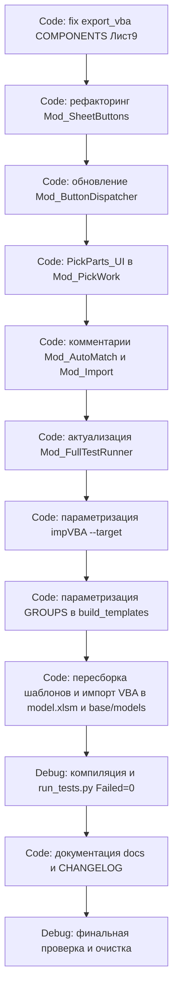

# План обновлений SysW v1.0.12 — рефакторинг макросов, универсальный поиск листов, шаблоны/модели

Роль: **Architect** (Этап 2 оркестрируемого процесса).
Основание: отчёт-анализ Этапа 1 (Ask) по результатам таблицы `plans/promt1.0.12.0.md`.
Мастер-процесс: `plans/promt1.0.12.md`.

> Статус: **черновик для согласования с пользователем.** Реализация — режим Code; проверка — режим Debug.

---

## 1. Реестр действий по макросам

Ниже сведены решения пользователя и точный перечень изменений. Имя «макрос» = обработчик кнопки в [`Mod_ButtonDispatcher.bas`](src/modules/Mod_ButtonDispatcher.bas). Базовые `_UI`/технические процедуры рассматриваются отдельно (см. §1.3 и вопрос Q7).

### 1.1. Удалить безусловно

| Обработчик             | Вызываемая процедура | Действие                                               |
| -------------------------------- | --------------------------------------- | -------------------------------------------------------------- |
| `Btn_main_Import_Click`        | `Mod_Import.ImportSheet_UI`           | Удалить обработчик из диспетчера. |
| `Btn_main_ImportByInput_Click` | `Mod_Import.ImportByInput_UI`         | Удалить обработчик из диспетчера. |
| `Btn_main_RenameSheets_Click`  | `Mod_Import.RenameSheets_UI`          | Удалить обработчик из диспетчера. |

- Проверить отсутствие других вызовов удаляемых `_UI`-процедур (grep по `ImportSheet_UI`, `ImportByInput_UI`, `RenameSheets_UI`). Если вызовов нет — удалить и сами `_UI`-процедуры из [`Mod_Import.bas`](src/modules/Mod_Import.bas) (согласовать — Q7).

### 1.2. Удалить условно (ждать подтверждения пользователя)

| Обработчик                | Процедура                 | Варианты                                                                                                     |
| ----------------------------------- | ---------------------------------- | -------------------------------------------------------------------------------------------------------------------- |
| `Btn_main_ShowWorkbookPath_Click` | `Mod_Utils.ShowWorkbookPath_UI`  | Удалить**или** скрыть с интерфейса (оставить код). Решение — Q2. |
| `Btn_main_ShowCurrentUser_Click`  | `Mod_Utils.ShowCurrentUser_UI`   | Удалить**или** скрыть с интерфейса. Решение — Q2.                           |
| `Btn_main_ImportFromSheetM_Click` | `Mod_Import.ImportFromSheetM_UI` | После сравнения с`ImportVH` (`ImportFromB2_UI`). Решение — Q3.                            |

### 1.3. Оставить без изменений

- `Btn_main_Clear_Click` → `Mod_SheetOps.ClearMainSheet_UI`
- `Btn_main_FillHeader_Click` → `Mod_OrderHeader.FillHeaderFromOrder_UI`
- `Btn_main_ClearHeader_Click` → `Mod_SheetOps.ClearHeader_UI`
- `Btn_main_CheckFileExists_Click` → `Mod_Utils.CheckFileExists_UI`
- `Btn_main_AutoMatchWorks_Click` → `Mod_AutoMatch.AutoMatchWorks`
- `Btn_main_AutoMatchParts_Click` → `Mod_AutoMatch.AutoMatchParts`

### 1.4. Актуализировать

| Обработчик        | Процедура                    | Действие                                                                                                                                                        |
| --------------------------- | ------------------------------------- | ----------------------------------------------------------------------------------------------------------------------------------------------------------------------- |
| `Btn_main_RunTests_Click` | `Mod_FullTestRunner.RunAllTests_UI` | Обновить модуль тестов под новые имена и удалённые макросы (см. §5). Сам обработчик остаётся. |

### 1.5. Редактировать

| Обработчик                           | Процедура                                                                       | Действие                                                                                                                                                                                                                                                       |
| ---------------------------------------------- | ---------------------------------------------------------------------------------------- | ---------------------------------------------------------------------------------------------------------------------------------------------------------------------------------------------------------------------------------------------------------------------- |
| `Btn_main_ImportVH_Click`                    | `Mod_Import.ImportFromB2_UI`                                                           | Исправить расхождение комментария «{B2}M» vs факт «B4/{B4}M»; проверить фактическую логику чтения номера заказа (строки 456–588 модуля). Подробности — Q4. |
| Блок 1.3 (поисковые кнопки) | `Mod_SheetButtons` + связанные обработчики в диспетчере | Полная переработка на универсальную схему (см. §2 и §3). Трактовка всего блока 20–25 как «переработать под новые условия» — подтвердить (Q1).                |

### 1.6. Рассказать подробнее (без изменений кода)

Подготовить объяснение поведения (в документацию `docs/DEVELOPER.md`), код не менять:

- `Btn_main_WriteLog_Click` → `Mod_Utils.WriteLog_UI`
- `Btn_main_ImportDataToMain_Click` → `Mod_Import.ImportDataToMain_UI`
- `Btn_main_FindOrder_Click` → `Mod_OrderHeader.FindOrder_UI`

### 1.7. Добавить функционал

- **«РУЧ ЗЧ»** — ручной подбор запчастей (аналог `PickWork_UI` для листа `z4`/`{Group}z4`).
  - Новый обработчик: `Btn_main_PickParts_Click` → `Mod_PickWork.PickParts_UI`.
  - Реализация — в [`Mod_PickWork.bas`](src/modules/Mod_PickWork.bas) (см. §4).
  - Спецификация зеркальности — уточнить (Q5).

---

## 2. Рефакторинг `Mod_SheetButtons` — универсальная схема

Файл: [`src/modules/Mod_SheetButtons.bas`](src/modules/Mod_SheetButtons.bas).

### 2.1. Нейтральные имена процедур (без UAZ/Parts)

| Текущее имя       | Новое имя                                | Назначение                                                                                                                                                                                                             |
| --------------------------- | ------------------------------------------------ | -------------------------------------------------------------------------------------------------------------------------------------------------------------------------------------------------------------------------------- |
| `ExecuteUAZSearch`        | `ExecuteSearch`                                | Единая функция поиска «содержит» по активному листу.                                                                                                                                |
| `Btn_UAZ_SearchByArticle` | `Btn_Search_ByArticle`                         | Поиск по артикулу (столбец B).                                                                                                                                                                             |
| `Btn_UAZ_SearchByName`    | `Btn_Search_ByName`                            | Поиск по наименованию (столбец C).                                                                                                                                                                     |
| `Btn_UAZ_ClearFilter`     | `Btn_Search_ClearFilter`                       | Сброс фильтра и очистка C1.                                                                                                                                                                                  |
| `ExecutePartsSearch`      | — (объединить с`ExecuteSearch`)    | Логика поиска по запчастям вливается в единый поиск.                                                                                                                                 |
| `IsPartsSheet`            | `IsSparePartsSheet` (рекомендация) | Универсальная проверка «лист запчастей».`Parts` в имени — не фиксированная группа, но для единообразия можно переименовать. |
| `IsSearchableSheet`       | оставить                                 | Проверка минимум 4 строк данных.                                                                                                                                                                       |

### 2.2. Динамическое получение имени группы из `main!$B$14`

Добавить приватную функцию (единый источник, аналогично `Mod_PickWork.GetGroupNameFromMain` / `Mod_AutoMatch.GetGroupName`):

```vba
Private Function GetGroupName() As String
    Dim wsMain As Worksheet
    On Error GoTo ErrHandler
    Set wsMain = ThisWorkbook.Sheets(Mod_Constants.SHEET_MAIN)
    GetGroupName = Trim(CStr(wsMain.Range("B14").Value))
    Exit Function
ErrHandler:
    Call Mod_Logger.WriteLog("Mod_SheetButtons", "GetGroupName: " & Err.Description)
    GetGroupName = ""
End Function
```

### 2.3. Универсальная идентификация листов

Ввести единую классификацию типа листа относительно имени группы `{Group}`:

| Тип                                            | Правило имени | Пример (Group=UAZ) |
| ------------------------------------------------- | ------------------------- | ------------------------ |
| Лист работ (общий/основной) | `{Group}`               | `UAZ`                  |
| Лист работ модели                  | `{Group}w`              | `UAZw`                 |
| Лист запчастей (общий)          | `z4`                    | `z4`                   |
| Лист запчастей модели          | `{Group}z4`             | `UAZz4`                |

Проектируемый перечислитель типа листа:

```vba
Private Enum SheetKind
    skUnknown = 0
    skWorks = 1      ' {Group}
    skWorksModel = 2 ' {Group}w
    skParts = 3      ' z4
    skPartsModel = 4 ' {Group}z4
End Enum

Private Function ClassifySheet(ByVal ws As Worksheet, ByVal groupName As String) As SheetKind
    ' Логика:
    '  name = LCase(Trim(ws.Name))
    '  g    = LCase(Trim(groupName))
    '  If name = g Then skWorks
    '  ElseIf name = g & "w" Then skWorksModel
    '  ElseIf name = "z4" Then skParts
    '  ElseIf name = g & "z4" Then skPartsModel
    '  Else skUnknown
End Function
```

### 2.4. Единые процедуры поиска/сброса для любого листа

- **`ExecuteSearch(searchColumn As Integer)`** — работает на `ActiveSheet`:
  1. Определяет группу из `main!$B$14`.
  2. Классифицирует активный лист через `ClassifySheet`. Если `skUnknown` или группа пуста → информационное сообщение и выход.
  3. Проверяет `IsSearchableSheet` (минимум 4 строки).
  4. Читает значение из `C1`; если пусто → сообщение.
  5. Вычисляет `lastRow`, `lastCol` (заголовки на `MODELS_HEADER_ROW=3`).
  6. Сбрасывает фильтр (`ShowAllData`), применяет `AutoFilter` «содержит».
  7. Считает видимые строки, выводит результат, возвращает `Boolean`.
- **`Btn_Search_ByArticle()`** → `ExecuteSearch searchColumn:=2`.
- **`Btn_Search_ByName()`** → `ExecuteSearch searchColumn:=3`.
- **`Btn_Search_ClearFilter()`** — классифицирует лист; при допустимом типе сбрасывает фильтры и чистит `C1`.

> Ключевой принцип: **имя листа никогда не зашито в код**. Все проверки строятся от `groupName` из `main!$B$14` + суффиксов `w`/`z4`. Это удовлетворяет требование «работать в книге с любым именем листа».

### 2.5. Заголовки и комментарии блоков

Заменить заголовки вида «КНОПКИ ПОИСКА ДЛЯ ЛИСТОВ UAZ» и «…ЗАПЧАСТЕЙ (z4, {GroupName}z4)» на нейтральные, например:

- «КНОПКИ ПОИСКА ПО АРТИКУЛУ/НАИМЕНОВАНИЮ (работы и запчасти)».

---

## 3. Обновление `Mod_ButtonDispatcher`

Файл: [`src/modules/Mod_ButtonDispatcher.bas`](src/modules/Mod_ButtonDispatcher.bas).

### 3.1. Удаление обработчиков удалённых макросов

Удалить процедуры:

- `Btn_main_Import_Click` (§1.1)
- `Btn_main_ImportByInput_Click` (§1.1)
- `Btn_main_RenameSheets_Click` (§1.1)
- `Btn_main_ShowWorkbookPath_Click` (§1.2 — по решению Q2)
- `Btn_main_ShowCurrentUser_Click` (§1.2 — по решению Q2)
- `Btn_main_ImportFromSheetM_Click` (§1.2 — по решению Q3)

### 3.2. Связывание кнопок с новыми именами поиска

| Текущий обработчик | Новый вызов                            |
| ----------------------------------- | ------------------------------------------------ |
| `Btn_UAZ_Article_Click`           | `Call Mod_SheetButtons.Btn_Search_ByArticle`   |
| `Btn_UAZ_Name_Click`              | `Call Mod_SheetButtons.Btn_Search_ByName`      |
| `Btn_UAZ_Clear_Click`             | `Call Mod_SheetButtons.Btn_Search_ClearFilter` |

Сами имена обработчиков диспетчера переименовать в нейтральные (`Btn_Search_Article_Click`, `Btn_Search_Name_Click`, `Btn_Search_Clear_Click`) либо сохранить старые имена обработчиков как совместимые обёртки (на усмотрение Code, с учётом фактического назначения кнопок в книгах). Заголовок блока «ОБРАБОТЧИКИ КНОПОК ПОИСКА UAZ» → нейтральный.

### 3.3. Новый функционал «РУЧ ЗЧ»

Добавить обработчик:

```vba
Public Sub Btn_main_PickParts_Click()
    Call Mod_PickWork.PickParts_UI
End Sub
```

Разместить рядом с `Btn_main_PickWork_Click` в блоке «РУЧНОЙ ПОДБОР».

---

## 4. Обновление затронутых модулей

### 4.1. `Mod_PickWork.bas` — добавление `PickParts_UI`

Зеркало `PickWork_UI` (строки 58–150) для запчастей:

1. Читает группу из `main!$B$14` (`GetGroupNameFromMain`).
2. Открывает файл группы (`Mod_ModelDB.OpenModelGroupFile`).
3. Определяет лист запчастей: `{Group}z4`, при его отсутствии — общий `z4`. Добавить хелпер `GetPartsSheetName(groupName)` (по аналогии с `GetWorkSheetName`).
4. Активирует лист запчастей.
5. Показывает инструкцию по переносу в область запчастей `main` (столбцы P:W / X:AA) — состав уточнить (Q5).
6. `CleanUp`: закрытие файла группы, `ScreenUpdating` восстановление.

> Примечание: `GetGroupNameFromMain` и `GetWorkSheetName` уже универсальны и не меняются.

### 4.2. `Mod_AutoMatch.bas` — комментарии

- Строка 7 «из тождеств UAZ» → «из тождеств работ и запчастей».
- Строка 103 «из тождеств UAZw» → «из тождеств работ».
- Строка 252 «из тождеств UAZz4» → «из тождеств запчастей».
- `GetGroupName` (динамический, читает B14) — **без изменений**.

### 4.3. `Mod_Import.bas` — актуализация комментария

- Комментарий у `ImportFromB2_UI` (строки ~457–460) «из листа {B2}M» → привести в соответствие с фактическим чтением (B4 / {B4}M). Проверить строку чтения номера заказа; логику не менять (Q4).

### 4.4. Прочие ссылки `UAZw`/`UAZz4`

- Заголовки блоков и комментарии в `Mod_ButtonDispatcher.bas` (строки 200, 208) — нейтрализовать (см. §3.2).

---

## 5. Обновление `Mod_FullTestRunner` (Failed=0)

Файл: [`src/modules/Mod_FullTestRunner.bas`](src/modules/Mod_FullTestRunner.bas).

### 5.1. Что НЕ удалять

- Тест-фикстуры `"UAZ"` (TC-22..TC-24, TC-32..TC-35, TC-36..TC-38, TC-47, TC-S2) — это **валидные данные реальной группы** (`base/models/UAZ.xlsm`, листы UAZ/UAZw/UAZz4). Оставляем.
- TC-14 (`ImportFromB2_UI` / ImportVH) — актуализировать описание под исправленный комментарий (§4.3).

### 5.2. Что добавить (покрытие нового кода)

Новые тесты на универсальную идентификацию листов и единый поиск (при `Mod_Constants.SilenceMsgBox = True`):

- `TC-5x`: `ClassifySheet`/классификация листа для `{Group}`, `{Group}w`, `z4`, `{Group}z4`, постороннего листа.
- `TC-5x`: `Btn_Search_ClearFilter`/`ExecuteSearch` на временном листе запчастей без ошибок (создание временного листа, заполнение данных с 4-й строки, восстановление).
- `TC-5x`: `PickParts_UI` вызывается без ошибки (аналог TC-38 для `PickWork_UI`).

### 5.3. Как сохранить Failed=0

- Убедиться, что тесты не ссылаются на удалённые обработчики (`Btn_main_Import_*`, `Btn_main_RenameSheets_*`, `ShowWorkbookPath_UI`, `ShowCurrentUser_UI`, `ImportFromSheetM_UI`).
- Все новые проверки оборачивать в `On Error Resume Next` / явные `AddResult` с флагом SKIP при недоступности листа (как в существующих группах).
- Перед тестами, меняющими лист, создавать временный лист и удалять его в `Finally`/`CleanUp`.
- Обновить шапку покрытия (строка 7: «TC-01 .. TC-50» → актуальный диапазон) и счётчики в `RunAllTests_UI`/`AddResult`.

---

## 6. Работа с шаблонами и моделями

### 6.1. Исправление карты экспорта

[`scripts/export_vba.py`](scripts/export_vba.py) — в словаре `COMPONENTS` (строки 48–51) заменить `"Лист4": "sheets/Лист4.cls"` на `"Лист9": "sheets/Лист9.cls"` (реальный листовой компонент в `src/sheets/`; файла `Лист4.cls` нет).

### 6.2. Параметризация импорта VBA (`impVBA.py`)

Файл: [`scripts/impVBA.py`](scripts/impVBA.py). Сейчас цель жёстко фиксирована: `EXCEL_PATH = str(WORKBOOK_PATH)` (корневой `work.xlsm`).

Изменения:

- Добавить CLI-аргумент `--target <path>` (в `main()`), по умолчанию = корневой `work.xlsm`.
- `EXCEL_PATH` вычислять из аргумента (в т.ч. `--target base/templates/model.xlsm`, `--target base/models/UAZ.xlsm` и т.д.).
- Сохранить текущую логику импорта (динамический поиск файлов, кодировка UTF-8→CP1251, обновление sheet-компонентов через `CodeModule`).
- Проверить: модельные книги `base/models/*` содержат только листовые документы (без лишних классов); конфликт имён sheet-компонентов при импорте исключить.

### 6.3. Пересборка `model.xlsm` с модулями

Текущее состояние: `base/templates/model.xlsm` собирается через `Workbooks.Add()` и **не содержит VBA-модулей** (только листы/форматирование). Требуется процесс переноса кода:

1. Пересобрать шаблоны `build_templates.py` (получит актуальную структуру листов).
2. Импортировать VBA-модули в `base/templates/model.xlsm` параметризованным `impVBA.py --target base/templates/model.xlsm`.
3. `model0.xlsm` — без кода, остаётся как есть (эталон форматирования).

> Защита/FreezePanes модельных файлов реализована XML-инъекцией ([`build_templates.py`](scripts/build_templates.py):398, `apply_freeze_panes_to_models`) и **не конфликтует** с импортом VBA, т.к. импорт выполняется через Excel COM, а не через `openpyxl keep_vba`. Порядок: сначала сборка шаблонов (XML-правки), затем импорт VBA через COM. Повторные прогоны безопасны (функции идемпотентны).

### 6.4. Импорт VBA в `base/models/*`

Настроить импорт модулей в модельные книги аналогично `work.xlsm`:

- Прогнать `impVBA.py --target` для каждой книги `base/models/*.xlsm` (4x4, 2170, 2180, 2190, GAZ, UAZ).
- Проверить отсутствие конфликтов имён компонентов и сохранность листовых документов.

### 6.5. Параметризация GROUPS

[`scripts/build_templates.py`](scripts/build_templates.py):55 — `GROUPS = ["4x4","2170","2180","2190","GAZ","UAZ"]` захардкожен.

Изменения:

- Получать список групп динамически из каталога `base/models/` (имена `*.xlsm` без расширения) либо из единого источника конфигурации.
- Обеспечить согласованность с тестом `TC-S3` («Групп меньше 6»), если он зависит от числа групп (см. §5.2).

---

## 7. Порядок исполнения (шаги для Code)



1. **`export_vba.py`**: `Лист4` → `Лист9` (карта экспорта).
2. **`Mod_SheetButtons`**: нейтральные имена, `GetGroupName` из B14, `ClassifySheet`, единый `ExecuteSearch`, `Btn_Search_*`.
3. **`Mod_ButtonDispatcher`**: удалить обработчики удалённых макросов, перепривязать поиск, добавить `Btn_main_PickParts_Click`.
4. **`Mod_PickWork`**: `PickParts_UI` (+ хелпер `GetPartsSheetName`).
5. **`Mod_AutoMatch`, `Mod_Import`**: нейтрализация комментариев; актуализация описания ImportVH.
6. **`Mod_FullTestRunner`**: добавить тесты на идентификацию/поиск/PickParts, исключить ссылки на удалённые макросы, обновить шапку покрытия.
7. **`impVBA.py`**: CLI `--target`.
8. **`build_templates.py`**: параметризация `GROUPS`.
9. **Пересборка шаблонов** и импорт VBA в `base/templates/model.xlsm` и `base/models/*`.
10. **Тесты** `run_tests.py` → `Failed=0`.
11. **Документация**: `docs/DEVELOPER.md` (реестр макросов), `docs/ARCHITECTURE.md`, `docs/table.md`, `docs/CHANGELOG.md` (v1.0.12), при необходимости `docs/ROADMAP.md`.
12. **Очистка** временных файлов, проверка отсутствия устаревших `UAZ`/`Parts` в именах процедур.

## 8. Проверки (для Debug)

1. Компиляция VBA без ошибок после всех правок.
2. Удалённые макросы отсутствуют в коде и в обработчиках кнопок.
3. Универсальный поиск корректно работает на листах с произвольными именами (не только UAZ): `{Group}`, `{Group}w`, `z4`, `{Group}z4`.
4. `run_tests.py` → `Failed=0`; `SKIP` — только с обоснованием.
5. Шаблоны `base/templates/` актуальны: `work.xlsm` и `model.xlsm` содержат импортированные модули; `work0.xlsm`/`model0.xlsm` — без кода, с форматированием.
6. Модельные книги `base/models/*` содержат актуальные VBA-модули без конфликтов имён.
7. Документация обновлена; ссылки не сломаны; в коде нет остатков жёстких `UAZ`/`Parts` в именах процедур/кнопок (реальная группа `UAZ` как данные — допускается).

## 9. Вопросы пользователю для согласования (до реализации)

1. **Q1. Блок 1.3 (строки 20–25 таблицы)** — подтвердить трактовку «переработать все макросы поиска под новые условия» (сохранить функциональность, нейтральные имена, динамику из B14)?
2. **Q2. `ShowWorkbookPath` / `ShowCurrentUser`** — критичны? Варианты: полностью удалить, либо скрыть с интерфейса (код оставить).
3. **Q3. `ImportFromSheetM` vs `ImportVH`** — требуется сравнение `ImportFromSheetM_UI` и `ImportFromB2_UI`; решить судьбу `ImportFromSheetM` по результату.
4. **Q4. `ImportVH` (`ImportFromB2_UI`)** — править только комментарий «{B2}M»→«B4/{B4}M», или есть функциональное расхождение (какая ячейка реально читается — B2 или B4)?
5. **Q5. «РУЧ ЗЧ»** — подтвердить спецификацию: зеркало `PickWork_UI` для листа запчастей? Какой лист открывать (приоритет `{Group}z4`, fallback `z4`) и в какую зону `main` переносить (столбцы P:W и/или X:AA)?
6. **Q6. `model.xlsm`** — подтвердить процесс «пересборка шаблона + импорт VBA через параметризованный `impVBA`» для получения модельного шаблона с модулями.
7. **Q7. Удаление обработчиков кнопок** — удалять ли сопутствующие `_UI`-процедуры (`ImportSheet_UI`, `ImportByInput_UI`, `RenameSheets_UI` и др.), если у них нет других потребителей, или оставлять их как технический код?
8. **Q8. `GROUPS` в `build_templates.py`** — параметризовать динамически из `base/models/`?
9. **Q9. Тест-фикстуры `"UAZ"`** — оставить как данные реальной группы (не трогать); подтвердить.

## 10. Критерии приёмки (перенесены из мастер-процесса)

- Все решения из `promt1.0.12.0.md` применены или явно согласованы.
- Удалённые макросы отсутствуют в коде и обработчиках.
- Универсальный поиск работает на любых именах листов (не только UAZ).
- Тесты обновлены, `Failed=0`.
- Документация актуализирована.
- Шаблоны `base/templates/` и модельные книги `base/models/` настроены согласно требованиям.
- Проект очищен; коммит/пуш на `dev`; слияние `dev → main` — по запросу пользователя.
