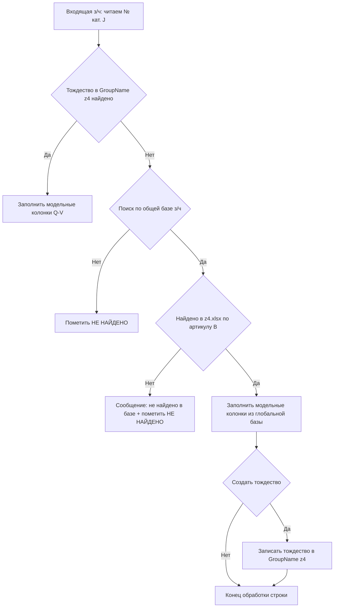

# План v1.0.13 — Рефакторинг поиска з/ч и работ, вынос глобальной базы

> Источник задачи: `plans/promt1.0.13.md`. Приоритет — правила `.ycarules`
> ([Z2], [Z5], [U1], [U2], [G2], [K1]/[K2], [S7], [E3]).
> Все изменения согласовываются с пользователем; отвечать на русском.

---

## 1. Цель

Переработать бизнес-логику автопоиска запасных частей (з/ч) и работ:

1. Вынести **глобальную базу з/ч** из модельных книг в отдельный файл `base/models/z4.xlsx`
   (структура совпадает с листом `z4` модельной книги; содержит все артикулы всех `GroupName`
   без фильтрации). Глобальная база з/ч составляет **650 000+ позиций**, поэтому она убирается
   из каждой модельной книги в единый файл.
2. В модельной книге лист `z4` становится **фрагментом глобальной базы**, актуальным для
   текущей `GroupName` (только релевантные группе позиции, а не все 650k).
3. Лист `{GroupName}z4` содержит **тождества** между глобальной базой и входящими з/ч для
   текущей `GroupName`.
4. В автопоиске (`Mod_AutoMatch`) реализовать многошаговый алгоритм с запросами пользователю
   и созданием тождеств.
5. Для **работ** отдельный глобальный файл **НЕ вводится**: глобальная база работ остаётся
   в модельных книгах (лист `{GroupName}` — все работы группы). Поиск по работам идёт по
   тождествам в `{GroupName}w`, при неудаче — по локальному листу `{GroupName}` этой же модели.

> **Расположение файла (согласовано):** путь `base/models/z4.xlsx` (модельные файлы уже лежат
> в `base/models/`; совпадает с фактической функцией `Mod_ModelDB.GetModelDBBasePath`).

---

## 2. Текущее состояние (подтверждено анализом)

### 2.1. Структура данных (SQLite `db/schema.sql`)
- `parts_catalog` — глобальный уникальный каталог з/ч (A=code, B=name, C=unit, D=price, E=note).
- `parts` — привязка з/ч к группам.
- `works` — каталог работ группы.
- `model_parts` — модельные з/ч + тождества (лист `{GroupName}z4`).
- `model_works` — модельные работы + тождества (лист `{GroupName}w`).
- `matlib_entries` — нормализованный реестр соответствий.

### 2.2. Лист `z4` (из `docs/table.md` §0.7.2)
A=№ п/п, B=Артикул, C=Наименование, D=Ед. изм., E=кол-во, F=Цена, G=Кол-во ЗН, H=Сумма ЗН, Z=Проверка.
Заголовки — строка 3, данные — с строки 4.

### 2.3. Тождества з/ч `{GroupName}z4` (§0.7.5)
A–H выходящие (B=Артикул, C=Наименование, F=Цена, G=Кол-во ЗН), I=АГРЕГАТ, J=№ кат. (входящий),
K=Наим-ние (входящее), L–N параметры входящей.

### 2.4. Тождества работ `{GroupName}w` (§0.7.3)
A–H выходящие (B=Артикул, C=Наименование, D=н/ч, G=Кол-во ЗН), I=Агрегат, J=Наим-ние (входящей), K–M.

### 2.5. Автопоиск `Mod_AutoMatch.bas`
- `AutoMatchParts()`: читает `GetPartIdentities(groupName)`, ищет по `InCatNum` (J), ненайденные
  помечает «НЕ НАЙДЕНО» + жёлтая подсветка.
- `AutoMatchWorks()`: читает `GetWorkIdentities(groupName)`, ищет по `InName` (J).
- Группа — из `main!B14`.

---

## 3. Целевая архитектура

### 3.1. Файлы
| Файл | Назначение |
| --- | --- |
| `base/models/z4.xlsx` | **новый** — глобальная база з/ч всех групп (структура как лист `z4`, без GroupName-фильтра; 650k+ позиций) |
| `base/models/{GroupName}.xlsm` | лист `z4` → **фрагмент** глобальной базы для `GroupName`; лист `{GroupName}z4` → тождества; лист `{GroupName}` → все работы группы (остаётся как есть) |
| `src/modules/Mod_AutoMatch.bas` | новый алгоритм автопоиска (правка `AutoMatchParts`, `AutoMatchWorks`) |
| `src/modules/Mod_ModelDB.bas` | функции чтения глобальной базы `z4.xlsx` и записи тождества |
| `src/classes/*` / `Mod_ModelTypes.bas` | при необходимости новые поля результата глобального поиска |
| `scripts/build_templates.py`, `build_all.py` | учёт нового глобального файла, сборка фрагментов `z4` |

### 3.2. Источники данных
- **З/ч:** глобальный источник — файл `base/models/z4.xlsx`. Запись новых тождеств — в лист
  `{GroupName}z4` модельной книги (не в SQLite).
- **Работы:** источник — локальные листы модельной книги (`{GroupName}` и `{GroupName}w`).

---

## 4. Новый алгоритм автопоиска з/ч (AutoMatchParts)

Для каждой входящей строки:

Ключевые моменты:
- Поиск в глобальной базе ведётся **по артикулу** (столбец B листа `z4.xlsx`) с использованием
  существующего маппинга колонок из `docs/table.md` (§8.2: ключ X=№ кат. 24, fallback Y=Наим-ние 25).
- Сопоставление входящего ключа с колонкой B глобальной базы — по правилу из `table.xlsx`
  (приоритет — № кат. X(24), fallback — наименование Y(25)).
- Диалоги только при `Not SilenceMsgBox`.

### 4.1. Запись тождества на `{GroupName}z4`
Новая строка после последней заполненной: A=№ п/п, B=модельный артикул, C=наименование,
F=цена (из глобальной базы), G=Кол-во ЗН (из входящей), I=АГРЕГАТ (пусто/код),
J=№ кат. входящей, K=Наим-ние входящей. Пустая строка после блока.

---

## 5. Новый алгоритм автопоиска работ (AutoMatchWorks)

Для каждой входящей строки:
- Поиск по тождествам в `{GroupName}w` по `InName` (J).
- При успехе — заполнить модельные колонки E-K.
- При неудаче — поиск по локальному листу работ `{GroupName}` (все работы группы) по
  наименованию; если найдено — спросить «создать тождество?», при «да» — записать в `{GroupName}w`.
- Если не найдено и в листе `{GroupName}` — пометить «НЕ НАЙДЕНО».

> Отдельный глобальный файл для работ **не создаётся** (глобальная база работ живёт в модельных
> книгах как лист `{GroupName}`).

---

## 6. Изменения по модулям

### 6.1. `src/modules/Mod_AutoMatch.bas`
- `AutoMatchParts()`: добавить шаги 2–5 (fallback в глобальную базу + создание тождества).
- `AutoMatchWorks()`: добавить fallback по локальному листу `{GroupName}` + создание тождества.
- Новые private-функции:
  - `SearchGlobalParts(article)` → найденная запись глобальной базы.
  - `AskGlobalSearch(entity)` → диалог «поиск по общей базе?».
  - `AskCreateIdentity(entity)` → диалог «создать тождество?».
  - `WritePartIdentityToSheet(groupName, ...)` → запись тождества в `{GroupName}z4`.

### 6.2. `src/modules/Mod_ModelDB.bas`
- `GetGlobalPartsBasePath()` → путь `base/models/z4.xlsx`.
- `ReadGlobalPartByArticle(article)` → чтение из `z4.xlsx` (открытие без изменений, закрытие).
- `AppendPartIdentity(groupName, identity)` → добавление строки на лист `{GroupName}z4`.
- `AppendWorkIdentity(groupName, identity)` → добавление строки на лист `{GroupName}w`.

### 6.3. `src/classes/PartIdentity.cls`, `WorkIdentity.cls`
- Дополнить поля под результат глобального поиска при необходимости (переиспользуя существующие:
  `OutArticle`, `OutName`, `Price`, `QtyZN`, `Aggregate`, `InCatNum`, `InName` / `NormHours`).

---

## 7. Обновление тестов и шаблонов

### 7.1. `src/modules/Mod_FullTestRunner.bas`
- TC: чтение глобальной базы `z4.xlsx` (существование, структура колонок B..).
- TC: fallback-ветка (поиск по глобальной базе при отсутствии тождества).
- TC: запись тождества на лист `{GroupName}z4` / `{GroupName}w`.
- Проверка неизменности существующих PASS-критериев TC-22/TC-23 и др.

### 7.2. Шаблоны
- `scripts/build_templates.py` / `build_all.py`: учесть `base/models/z4.xlsx` как источник
  глобального каталога; сборка фрагмента `z4` для каждой модели.
- `base/templates/model.xlsm`, `model0.xlsm`: лист `z4` как фрагмент.
- Проверить `base/templates/` на лишние файлы (см. п. 9).

---

## 8. Обновление документации
- `docs/ARCHITECTURE.md` — новый файл глобальной базы, схема листов, алгоритм.
- `docs/DEVELOPER.md` — новые функции `Mod_ModelDB`/`Mod_AutoMatch`.
- `docs/table.md` — описание алгоритма fallback и записи тождеств.
- `docs/ROADMAP.md`, `CHANGELOG.md` — версия v1.0.13.
- При необходимости `README.md`, `docs/sourcecraft-guide.md`.

---

## 9. Очистка проекта
- Удалить временные файлы (`_temp_*`, `*.tmp`, `~$*`).
- Проверить `base/templates/` на лишние файлы.
- Убрать устаревшие упоминания `UAZ`/`Parts` в коде/доках там, где это не требуется.

---

## 10. Критерии готовности (Definition of Done)
- Все решения пользователя из `plans/promt1.0.13.md` применены/согласованы.
- Глобальная база `base/models/z4.xlsx` создана; в моделях лист `z4` — фрагмент для `GroupName`.
- Автопоиск з/ч реализован с fallback в глобальную базу; автопоиск работ — по тождествам
  с fallback в локальный лист `{GroupName}`; создание тождеств работает.
- Тесты компилируются и проходят (TC-22/23 и новые).
- Документация актуализирована; проект очищен.
- Коммит и пуш на `dev`; слияние `dev → main` — по подтверждению пользователя; возврат на `dev`.

---

## 11. Порядок выполнения (роли)
1. **Architect** — данный план (на согласовании).
2. Согласование с пользователем.
3. **Code** — реализация (Mod_AutoMatch, Mod_ModelDB, тесты, шаблоны, новый файл базы).
4. **Debug** — компиляция, прогон тестов.
5. Обновление документации, очистка.
6. Коммит/пуш, слияние (по подтверждению).