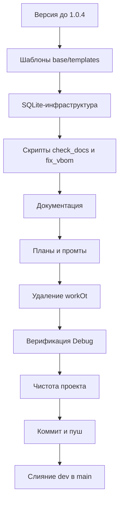

# План обновления SysW до версии 1.0.4

> **Этап:** Планирование (Architect).
> **Цель:** Полная интеграция изменений из эталонной копии `F:/MiTyA/PROject/copy/SysW` (v1.0.4) в рабочий проект `f:/MiTyA/PROject/SysW` (v1.0.3).
> **Основание:** [`plans/analysis_1.0.4.md`](analysis_1.0.4.md) — реестр планируемых изменений (§5), согласованные решения (§5.1, §6).
> **Правила:** строго соблюдать `.ycarules` ([G3], [G9], [Z2], [U1], [S7], [S9], [E3]).
> **Дата:** 2026-08-21.

---

## 0. Пререквизиты

- Рабочая ветка — `dev` (слияние в `main` выполняется на финальном этапе).
- Использовать PowerShell 7 (`pwsh.exe`) для всех команд терминала ([S9]).
- Git-операции выполнять через MCP Git Tools ([G10]); операции с файлами — через MCP File System ([G11]).
- Все критические файлы ([E3]) менять только после утверждения настоящего плана.

---

## 1. Версия системы → 1.0.4

Единый источник версии обновляется централизованно скриптом `scripts/update_version.py`, затем вручную актуализируется документация.

### 1.1 Запуск скрипта обновления версии
- Выполнить: `pwsh -Command "python scripts/update_version.py 1.0.4"` (рабочая директория — корень проекта).
- Скрипт синхронно обновит:
  - `src/modules/Mod_Constants.bas` — `APP_VERSION = "1.0.4"`;
  - `scripts/config.py` — `APP_VERSION = "1.0.4"`;
  - `scripts/config.ps1` — `$Script:AppVersion = "1.0.4"`.

### 1.2 Проверка результата
- Убедиться, что в перечисленных файлах версия равна `1.0.4`.

> Примечание: изменение `Mod_Constants.bas` — VBA-файл, правки только в рамках плана ([Z5]). После обновления версии в исходнике VBA необходимо переимпортировать модуль в `work.xlsm` через `impVBA.py` (см. раздел 6), если того требует процесс сборки.

---

## 2. Шаблоны `base/templates/`

### 2.1 Создание каталога и копирование файлов
Скопировать готовые бинарные файлы напрямую из копии (без пересоздания скриптом, решение §5.1 п.5):
- `base/templates/work.xlsm`
- `base/templates/work0.xlsm`
- `base/templates/model.xlsm`
- `base/templates/model0.xlsm`
- `base/templates/report0.xlsx`

Источник: `F:/MiTyA/PROject/copy/SysW/base/templates/`.

### 2.2 Перенос скриптов шаблонов
Скопировать из `F:/MiTyA/PROject/copy/SysW/scripts/`:
- `build_templates.py`
- `apply_protection_templates.py`
- `template_protection.py`

Защита листов (`Protect` + `AllowEditRanges` + `FreezePanes A4`) уже заложена в бинарных файлах копии; запуск скриптов защиты не требуется.

---

## 3. SQLite-инфраструктура (по плану миграции)

### 3.1 Файлы схемы и конфигурации
Скопировать из копии:
- `db/schema.sql` (DDL-схема `SysW.db`);
- `scripts/sqlite_schema.py` (версия схемы БД).

### 3.2 Константы в config.py
В `scripts/config.py` перенести блок SQLite-констант из копии:
- `DB_SCHEMA_VERSION`
- `DB_PATH`
- `DB_SCHEMA_PATH`
- `MODELS_DIR`
- `MIGRATION_REPORT_FILE`

(Константы совмещаются с обновлённым `APP_VERSION` из раздела 1.)

> Статус: SQLite — стадия проектирования (см. `migration_sqlite_plan.md`). Без миграции данных.

---

## 4. Скрипты

### 4.1 check_docs.py
Интегрировать изменения из копии:
- добавить функцию `check_expected_modules(files, issues)`;
- в `main` добавить вызов `check_expected_modules(...)`.

### 4.2 fix_vbom_and_venv.ps1
Скопировать из `F:/MiTyA/PROject/copy/SysW/scripts/fix_vbom_and_venv.ps1`.

### 4.3 Исключения (НЕ переносить)
- `scripts/_debug_*.py` — отладочные скрипты (мусор, [S7]);
- `logs/log.txt`, `logs/log_old.txt` — логи (`.codeassistantignore`).

---

## 5. Документация

Применяется принцип: **сохранить актуальные правки рабочего проекта + добавить новые разделы из копии**, не перенося регрессии копии (`L:\PROject\SysW`, «3 класса листов»).

### 5.1 README.md
- Версия → `v1.0.4`.
- Добавить в структуру каталог `base/templates/`.
- НЕ переносить регрессии копии (путь `L:\PROject\SysW`, упоминание «3 класса листов», `CHANGELOG.md` в корне).

### 5.2 docs/CHANGELOG.md
- Добавить раздел `## [v1.0.4]` (Keep a Changelog, [U2]):
  - каталог шаблонов `base/templates/`;
  - защита листов шаблонов (Protect + AllowEditRanges + FreezePanes A4) без изменения VBA;
  - версия системы 1.0.4;
  - удаление `workOt/`;
  - добавление скриптов и планов (в т.ч. SQLite-проектирование);
  - актуализация документации.

### 5.3 docs/DEVELOPER.md
- Версия → v1.0.4.
- Добавить раздел «Шаблоны `base/templates/`» (как в копии), сохранив фактическое число классов листов = 1.

### 5.4 docs/ARCHITECTURE.md
- Версия → v1.0.4.
- Добавить `base/templates/` в структуру и подраздел «Защита листов шаблонов (v1.0.4)».

### 5.5 docs/ROADMAP.md
- Версия → 1.0.4; актуализировать статус.

### 5.6 docs/table.md
- Перенести расширение из копии: раздел 0 «Рабочая панель для шаблонов» (структура листов, зоны Protect/AllowEditRanges, кнопки).

### 5.7 docs/sourcecraft-guide.md
- Актуализировать упоминания версии и `.sourcecraft` до v1.0.4.

### 5.8 docs/git-workflow.md
- Сверить с копией; внести незначительные правки при необходимости (версия не фиксируется).

---

## 6. Пересборка work.xlsm (при необходимости)

Если версия VBA в `work.xlsm` должна отражать 1.0.4:
1. Переимпортировать модули из `src/` через `scripts/impVBA.py`.
2. Проверить корректность импорта (К2: UTF‑8 → CP1251).

> Выполняется Code-режимом только если процесс сборки проекта этого требует и это согласовано.

---

## 7. Планы и промты

### 7.1 Интегрировать планы из копии
Скопировать в `plans/`:
- `integration_1.0.4.md`
- `migration_sqlite_plan.md`
- `debug_hang_templates_v104.md`

### 7.2 Промты
В `plans/_promts/` добавить файлы из копии:
- `promt.md`, `promt_templates.md`, `promt0.20.0.md`, `promt1.md`, `promt2.md`, `promt3.md`, `promt4.md`

Рабочие `promt7.md`, `promt8.md` — **оставить**.

### 7.3 Прочие планы
- `plans/integration_1.0.1.md` — остаётся в `plans/_archive/` (в корне `plans/` не дублировать).
- Рабочие `plans/integration_1.0.3.md`, `plans/update_plans_and_docs_plan.md` — переместить в `plans/_archive/` (решение пользователя, утверждено 2026-08-21).

---

## 8. Удаление workOt/

- Удалить каталог `workOt/` в рабочем проекте (явное решение пользователя §5.1 п.3; разрешено [Z2]).

---

## 9. Верификация (Debug)

После реализации выполнить проверку:
1. Все версии = 1.0.4 (`Mod_Constants.bas`, `config.py`, `config.ps1`, README, docs).
2. `check_docs.py` — прогон без ошибок (проверка актуальности документации).
3. `run_tests.py` — тесты проходят.
4. Структура `base/templates/` содержит 5 файлов.
5. Проект чист: нет `__pycache__`, `*.sync-conflict-*`, `~$*.xlsm`, временных файлов ([S7]).

---

## 10. Коммит и пуш

После утверждения верификации (запрос у пользователя):
- Git-операции через MCP Git Tools ([G10]).
- Коммит в `dev`, пуш.
- Слияние `dev` → `main`, пуш `main`, возврат на `dev`.

---

## Порядок выполнения (сводка)

---

## Примечания по ролям

- **Code** — реализация разделов 1–8.
- **Debug** — верификация (раздел 9).
- **Orchestrator** — контроль, координация, коммит/пуш/слияние (раздел 10).
- Все изменения критических файлов ([E3]) — только после утверждения плана пользователем.