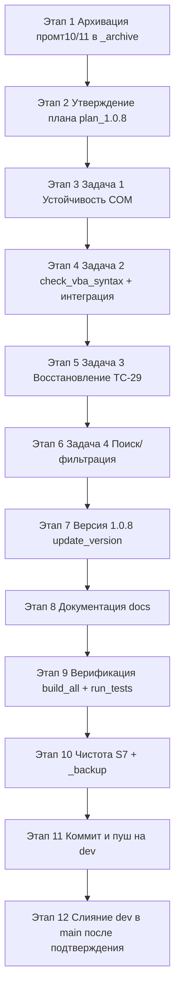

# Объединённый план реализации SysW v1.0.8

> **Статус:** черновик на согласование ([U1])
> **Исходное задание:** [`plans/promt11.md`](promt11.md)
> **Контекст предыдущей версии:** [`plans/promt10.md`](promt10.md) (v1.0.7)
> **Приоритет правил:** `.ycarules` ([Z6], [U1], [U2], [G2], [K1]/[K2], [S7], [E3], [G9], [S9], [G10]/[G11])

---

## 1. Цель и объём v1.0.8

**Цель:** стабилизация и надёжность процесса сборки проекта SysW —
устранение зависаний Excel COM, ранний контроль компиляции VBA в конвейере,
восстановление полного тестового покрытия импорта (TC-29) с учётом активной
глубокой подстановки модельных кодов, а также добавление удобного
поиска/фильтрации по листам запчастей.

**Опирается на:** v1.0.7 (активирована глубокая подстановка, единый конвейер
`build_all.py`, защита листов Вариант D).

### 1.1. Состав задач (пять задач)

| № | Задача | Ключевые файлы |
|---|--------|----------------|
| 1 | Устойчивость конвейера к зависаниям Excel COM | `impVBA.py`, `build_templates.py`, `run_tests.py`, `build_all.py` |
| 2 | Ранний контроль компиляции VBA в конвейере | новый шаг в `build_all.py` + чекер (в `impVBA.py` или отдельный скрипт) |
| 3 | Восстановление теста TC-29 (ImportDataToMain) | `Mod_FullTestRunner.bas` |
| 4 | Поиск/фильтрация по листам запчастей | `Mod_SheetButtons.bas`, шаблоны `base/templates/` |
| 5 | Документация, версия, чистота, git | `docs/*.md`, `update_version.py`, `_backup/`, git |

### 1.2. Что НЕ входит в объём v1.0.8 (вынесено юзером в промт 12)

- Проблемы TC-28, TC-48, TC-49 и ошибки тестовой части — **вынесены** в
  отдельное задание (промт 12) и здесь не рассматриваются.
- Лист `spisok` (список автомобилей) поиском **не затрагивается**.
- Известная ошибка компиляции из v1.0.7 (`Public ... As Boolean = True`)
  в текущих исходниках уже устранена; тем не менее механизм ранней
  статической проверки добавляется (задача 2) как защита от рецидивов.

---

## 2. Исходное состояние (по результатам анализа)

Ниже зафиксировано фактическое состояние, на которое опираются ТЗ.

### 2.1. Скрипты COM

- **`impVBA.py`:** использует `DispatchEx` (новый экземпляр), устанавливает
  `AutomationSecurity = 3` (`msoAutomationSecurityForceDisable`) и
  `DisplayAlerts = False`. Открытие книги: `excel.Workbooks.Open(EXCEL_PATH)` —
  **без** явных параметров и **без** обработки `None`/ретраев. Ошибка одного
  компонента прерывает весь импорт (без продолжения), но блок `finally`
  закрывает COM.
- **`build_templates.py`:** функция `get_excel()` ставит `Visible=False`,
  `DisplayAlerts=False`, но **не** устанавливает `AutomationSecurity`. Все вызовы
  `Workbooks.Open(...)` — без явных параметров, без обработки `None`, без ретраев.
  Именно этот этап исторически «зависал» на модальных окнах.
- **`run_tests.py`:** использует `DispatchEx` с fallback на `EnsureDispatch`,
  ставит `DisplayAlerts=False`. **Не** устанавливает `AutomationSecurity`
  (это правильно — скрипт **выполняет** макросы, поэтому
  `msoAutomationSecurityForceDisable` неприменим). Открытие без явных параметров,
  без ретраев. Читает итог из `Z1` листа `main`.
- **`build_all.py`:** вызывает шаги через `subprocess.run([...])` **без
  `timeout`**; отсутствует принудительное завершение зависших `EXCEL.EXE`.

### 2.2. Модуль тестов (TC-29)

- В `Mod_FullTestRunner.bas` процедура `RunImportDataTests` создаёт временный лист
  `TC29_Temp_*`, заполняет таблицы «Выполненные работы» и «Расходная накладная»,
  вызывает `Mod_Import.ImportDataToMain(wsTemp)`.
- Ветка проверки TC-29 на текущий момент — **временная заглушка** (строки
  1669–1676): `AddResult "TC-29", ..., True, "", True, "Временная заглушка..."`
  — то есть тест всегда помечен как SKIP и фактически ничего не проверяет.

### 2.3. Бизнес-логика `ImportDataToMain` (маппинг v1.0.6/v1.0.7)

Согласованное правило (см. `Mod_Import.bas`, `docs/table.md`):

- **Работы:** наименование `D(4)→L(12)`, «Всего» `I(9)→M(13)`, «в т.ч. НДС»
  `M(13)→N(14)`. Подставленный модельный артикул — колонка **O(15)**
  (`SubstituteWorkArticle`, ключ — наименование L, `target_type='mod_work'`).
- **Запчасти:** № кат. `B(2)→X(24)`, Наименование `C(3)→Y(25)`, Кол-во
  `D(4)→Z(26)`, Всего `G(7)→AA(27)`. Подставленный модельный артикул — колонка
  **AB(28)** (`SubstitutePartArticle`).
- **Правило подстановки запчасти (`SubstitutePartArticle`):**
  1. Сначала поиск по № кат. **X(24)**; если X не пуст и найден `MOD_PART` —
     результат в **AB(28)**, выход.
  2. Если X пуст **ИЛИ** по X нет совпадения `MOD_PART` — fallback по
     наименованию **Y(25)**.
  3. Если оба ключа пусты — AB(28) не заполняется.
- **Требование:** наименование запчасти **Y(25) обязательно** (непустое) —
  это ключевое условие для валидной записи импорта.

### 2.4. Образец UAZ-поиска (для задачи 4)

`Mod_SheetButtons.bas` содержит эталон:

- `IsSearchableSheet(ws)` — есть данные с 4-й строки.
- `ExecuteUAZSearch(searchColumn)` — поле ввода **C1**, данные с 4-й строки,
  `AutoFilter` «содержит» (`Criteria1:="*" & value & "*"`, `xlFilterValues`),
  подсчёт видимых строк, `MsgBox` «Найдено строк / Совпадений не найдено»,
  сброс фильтра через `ShowAllData`.
- Кнопки: `Btn_UAZ_SearchByArticle` (столбец **B=2**), `Btn_UAZ_SearchByName`
  (столбец **C=3**), `Btn_UAZ_ClearFilter` (сброс + очистка C1).

---

## 3. Задача 1 — Устойчивость конвейера к зависаниям Excel COM

**Цель:** ни один из COM-этапов (`impVBA`, `build_templates`, `run_tests`) не
должен «зависать» на модальных окнах/прерывистых ошибках `Workbooks.Open → None`
(`-2147352567`), а сам конвейер `build_all.py` должен гарантированно завершаться
(таймауты + принудительное завершение зависших процессов).

### 3.1. Общая «обёртка COM» во всех трёх скриптах

Ввести единые правила (реализуются в каждом скрипте без дублирования общей
логики в `build_all.py` — каждый скрипт остаётся самодостаточным):

1. **`DisplayAlerts = False`** — уже есть в `impVBA.py` и `run_tests.py`;
   в `build_templates.py` уже установлено в `get_excel()`. Проконтролировать,
   что свойство выставлено **до** открытия любой книги, и восстановить не требуется
   (процесс завершается после `Quit`).

2. **`AutomationSecurity`:**
   - `impVBA.py` — оставить `= 3` (`msoAutomationSecurityForceDisable`): при импорте
     макросы не выполняются, безопасно.
   - `build_templates.py` — **добавить** `excel.AutomationSecurity = 3` в
     `get_excel()` (скрипт не выполняет макросы, только открывает/копирует/сохраняет).
     Обернуть в `try/except` с логированием предупреждения (не критично при сбое).
   - `run_tests.py` — **НЕ добавлять** `msoAutomationSecurityForceDisable`:
     скрипт выполняет `RunAllTests`. Допустимо (опционально) выставить
     `AutomationSecurity = msoAutomationSecurityLow` / `ByUI` для снятия блока
     макросов, но по умолчанию **оставить без изменений**, т.к. `work.xlsm` уже
     проходит по доверенным путям. Закомментировать решение в коде.

3. **Явные параметры `Workbooks.Open`** во всех трёх скриптах (все вызовы
   `Open`, включая повторные `Open` в `build_templates.py`):
   ```python
   excel.Workbooks.Open(
       str(path),
       ReadOnly:=False,            # под win32com — kwargs: ReadOnly=False,
       UpdateLinks:=0,             # не обновлять связи
       ConfirmConversion:=False,   # не спрашивать про конвертацию
   )
   ```
   > Примечание: `pywin32`/`pythoncom` принимают именованные параметры
   > `ReadOnly`, `UpdateLinks`, `ConfirmConversion` как kwargs (без `:=` в Python).
   > В коде использовать обычный синтаксис `ReadOnly=False`.

4. **Обработка `None` из `Workbooks.Open` с ретраями** — ввести утилиту-функцию
   `open_workbook_with_retry(excel, path, retries=N, pause_sec=M)`:
   - Максимум **N = 5** попыток, пауза **M = 3 сек** между попытками.
   - Если возвращено `None` (не объект) или выброшено исключение вида
     `COMError -2147352567` — логировать попытку и повторить.
   - Перед повторной попыткой: `wb.Close` (если есть), `gc.collect()`,
     короткая пауза.
   - После исчерпания попыток — вернуть управление в `try/except` основного
     потока (скрипт завершится с ненулевым кодом, конвейер его перехватит).
   - Функцию разместить локально в каждом скрипте (избегая кросс-импортов,
     нарушающих самостоятельность шагов конвейера), либо в общий модуль
     `scripts/com_utils.py` — **решение принять на согласовании** (см. §7 риски).

5. **Таймауты на COM-операции:** гарантированно ограничить время работы
   каждого скрипта на уровне `build_all.py` (см. §3.3). Внутри скриптов отдельные
   COM-вызовы таймаутами не оборачиваются (win32com не поддерживает их штатно);
   защита обеспечивается внешним `timeout` подпроцесса + `taskkill`.

### 3.2. `impVBA.py` — дополнительные правки

- Заменить открытие на `open_workbook_with_retry`.
- Внутри цикла импорта компонентов: при исключении одного `.bas`/`.cls`
  логировать ошибку и **продолжать** остальные (сейчас прерывается весь импорт).
- При этом итоговый статус — `FAIL` с ненулевым кодом, если **хотя бы один**
  обязательный модуль (`src/modules/*.bas`) не импортирован. Обязательные модули
  задать списком (все `.bas`), чтобы ранняя проверка компиляции (задача 2)
  имела смысл.

### 3.3. `build_all.py` — правки

1. **`timeout` для каждого шага:**
   - `subprocess.run([...], timeout=STEP_TIMEOUT)` где
     `STEP_TIMEOUT` (сек): `impvba=300`, `templates=600`, `migrate=300`,
     `tests=900` (значения как стартовые, уточняются на согласовании).
   - При `subprocess.TimeoutExpired`: залогировать `[ТАЙМАУТ]`, выполнить
     `taskkill` (см. п.2), вернуть `False` с соответствующим кодом этапа.

2. **Принудительное завершение зависших `EXCEL.EXE` после каждого этапа**
   (безопасно, см. критерии ниже):
   - После завершения (успеха или ошибки) каждого COM-этапа вызывать функцию
     `terminate_stale_excel()`, которая запускает:
     `taskkill /F /IM EXCEL.EXE /FI "WINDOWTITLE eq <маркер>"` **или** выбирает
     только «свои» процессы по PID.
   - **Критерии безопасности (критично!):**
     - **НЕ убивать** сессии Excel, запущенные пользователем вручную
       (интерактивные окна с видимым UI).
     - Завершать только процесс, созданный самим скриптом. Для этого:
       а) запомнить `excel.Hwnd` / идентификатор процесса (через
       `win32process.GetWindowThreadProcessId` по `Hwnd`) сразу после создания
       COM-объекта; б) в `build_all.py` после этапа завершать именно этот PID.
     - Альтернатива (проще и надёжнее): завершать `EXCEL.EXE` только если он
       находится в «зависшем» состоянии, т.е. не отвечает
       (`taskkill /F` отрабатывает только для зависших). Однако такое поведение
       рискованно. **Рекомендуемый подход:** каждый COM-скрипт сам вызывает
       `excel.Quit()` и освобождает ссылки (уже есть в `finally`); в
       `build_all.py` дополнительно, **только при ненулевом/таймаутном завершении**
       этапа, завершать конкретный PID скрипта. Для этого скрипты пишут PID
       в лог-файл этапа (например, `logs/excel_pid_<stage>.txt`).
     - Функция `terminate_stale_excel()` реализуется в `build_all.py`:
       читает `logs/excel_pid_<stage>.txt` (если есть), проверяет, что процесс
       существует и является `EXCEL.EXE`, завершает именно его командой
       `taskkill /F /PID <pid>`. Файл PID удаляется после обработки.
   - Логировать каждое завершение процесса.

3. **Exit-коды** — сохранить существующую схему (`EXIT_CODES`), добавить код
   для таймаута: использовать код самого этапа (2/3/6) при таймауте, чтобы не
   менять схему.

4. **Логирование таймаутов и taskkill** — в `logs/build.log` с метками времени.

### 3.4. ТЗ для код-агента (Задача 1)

> Реализовать в `scripts/impVBA.py`, `scripts/build_templates.py`,
> `scripts/run_tests.py`, `scripts/build_all.py` согласно §3.1–3.3.
> Комментарии — на русском ([G9]). Не менять маппинг/алгоритмы ([Z6]).
> Сохранить существующие exit-коды конвейера.

---

## 4. Задача 2 — Ранний контроль компиляции VBA в конвейере

**Цель:** ловить синтаксические/компиляционные ошибки VBA (подобные
`Public ... As Boolean = True` из v1.0.7) сразу после `impVBA.py`,
**до** прогона тестов, чтобы `run_tests` не падал с «макрос недоступен».

### 4.1. Выбор подхода

Рекомендуемый: **статическая проверка синтаксиса на уровне исходников `src/`**
(без запуска Excel). Два подуровня:

1. **Первичная статическая проверка Python-скриптом** (без COM) — анализирует
   все `.bas`/`.cls` из `src/` на типовые ошибки, ловящие проблему v1.0.7:
   - запрещённая inline-инициализация модульных/глобальных переменных вида
     `Public/Private ... As Boolean = <literal>` (VBA не позволяет её на уровне
     модуля, кроме `Const`);
   - несбалансированные `Sub/Function/End Sub/End Function`, `If/End If`,
     `For/Next`, `With/End With`;
   - отсутствие `Attribute VB_Name` у `.bas`/`.cls` (или имя, не совпадающее
     с именем файла) — влияет на импорт;
   - дубликаты имён процедур в пределах одного модуля.
   - Это «дёшево» и быстро, не требует Excel.

2. **Проверка компиляции через COM (опциональная, более строгая):** после
   импорта в `work.xlsm` вызвать вспомогательный макрос `CompileVBAProject`
   (временный) через `excel.Run` либо эмулировать компиляцию через
   `VBComponents` и чтение `Application.VBE.ActiveVBProject`… — НЕ рекомендуется
   как основное, т.к. требует добавления кода в книгу и усложняет конвейер.

> **Решение для v1.0.8:** реализовать **вариант 1** (статический чекер) как
> основной и обязательный. Вариант 2 (COM-компиляция) — отложить как
> необязательное развитие (зафиксировать в разделе «Развитие»).

### 4.2. Куда поместить чекер

- Добавить **новый** скрипт `scripts/check_vba_syntax.py` (самодостаточный,
  читает `src/`). Он возвращает exit code: `0` — ошибок нет, `1` — найдены ошибки
  (с выводом списка `файл:строка:сообщение`).
- Вставить его отдельным шагом в `build_all.py` сразу после этапа `impVBA`
  (перед `build_templates`). Для согласованности схемы exit-кодов добавить
  новый код: `"vbacompile": 22` (диапазон 20+ для новых этапов) — или
  переиспользовать существующий `impvba` (2), зафиксировать на согласовании.
- **Что считать ошибкой:**
  - любая из статических находок п.4.1 (1);
  - нечитаемый файл (битый `utf-8`/`cp1251`);
  - пустой модуль (0 строк кода) для обязательного `.bas`;
  - наличие файла в `src/modules/`, не входящего в список импортируемых.

### 4.3. ТЗ для код-агента (Задача 2)

> Создать `scripts/check_vba_syntax.py` (на русском комментарии), реализующий
> статический анализ по §4.1(1)/§4.2. Интегрировать в `build_all.py` новым
> этапом после `impVBA`. Проверить на заведомо «плохом» образце (временный
> файл с `Public X As Boolean = True`) — чекер должен вернуть ненулевой код.
> Временный образец удалить после проверки ([S7]).

---

## 5. Задача 3 — Восстановление теста TC-29 (ImportDataToMain)

**Цель:** заменить временную заглушку в `RunImportDataTests` на реальную
проверку переноса данных `ImportDataToMain`, учитывающую глубокую подстановку
модельных кодов и требование непустого наименования запчасти.

### 5.1. Фактическая структура тестового листа (уже создаётся в тесте)

Таблица «Выполненные работы» (заголовок — строка 1, подзаголовок — строка 2,
данные со строки 4):

| Источник | Значение | Цель (main) |
|---|---|---|
| `D4` | «Тестовая работа 1» | **L(12)** наименование |
| `I4` | 100 | **M(13)** Всего |
| `M4` | 20 | **N(14)** в т.ч. НДС |
| `D5` | «Тестовая работа 2» | L |
| `I5` | 200 | M |
| `M5` | 40 | N |
| `D6` | «Итого работ» | (граница) |

Таблица «Расходная накладная» (заголовок — строка 8, подзаголовок — строка 9,
данные со строки 11):

| Источник | Значение | Цель (main) |
|---|---|---|
| `B11` | «ТК-001» | **X(24)** № кат. |
| `C11` | «Тестовая запчасть 1» | **Y(25)** Наименование |
| `D11` | 2 | **Z(26)** Кол-во |
| `G11` | 50 | **AA(27)** Всего |
| `M11` | 10 | (НДС, не переносится) |
| `B12` | «ТК-002» | X |
| `C12` | «Тестовая запчасть 2» | Y |
| `D12` | 3 | Z |
| `G12` | 60 | AA |
| `M12` | 12 | (НДС) |
| `B13` | «Итого» | (граница) |

> ВНИМАНИЕ: важно, что строки работ «Тестовая работа 1/2» и запчасти
> «Тестовая запчасть 1/2» с артикулами «ТК-001/ТК-002» в подавляющем случае
> **не имеют** точных совпадений `MOD_WORK`/`MOD_PART` в `matlib_entries`,
> поэтому колонки **O(15)** и **AB(28)** после подстановки останутся **пустыми**.
> Тест должен это допускать (см. §5.3).

### 5.2. Что проверять (после вызова `ImportDataToMain(wsTemp)`)

Проверки строятся на диапазонах листа `main` (предварительно сохранить
`L4:N{lastRow}` и `X4:AB{lastRow}` и восстановить после теста — уже есть в коде).

1. **Работы:**
   - `wsMain.Cells(4, 12).Value = "Тестовая работа 1"` (L4) — перенос наименования.
   - `wsMain.Cells(4, 13).Value = 100` (M4) — перенос «Всего».
   - `wsMain.Cells(4, 14).Value = 20` (N4) — перенос «в т.ч. НДС».
   - Аналогично строка 5: L5, M5=200, N5=40.
   - Колонка **O(15)**: допустима пустая (если нет точного совпадения `MOD_WORK`);
     тест **не требует** непустоты O. Опционально: если заполнена — проверить, что
     это числовой артикул (строка).
   - Проверить, что строка 6 (Итого работ) НЕ перенесена как работа (L6 пуст
     или не равно «Итого работ»).

2. **Запчасти:**
   - `wsMain.Cells(4, 24).Value = "ТК-001"` (X4) — перенос № кат.
   - `wsMain.Cells(4, 25).Value = "Тестовая запчасть 1"` (Y4) — перенос наименования.
   - `wsMain.Cells(4, 26).Value = 2` (Z4) — перенос Кол-во.
   - `wsMain.Cells(4, 27).Value = 50` (AA4) — перенос Всего.
   - Аналогично строка 5 (X5="ТК-002", Y5, Z5=3, AA5=60).
   - Колонка **AB(28)**: допустима пустая (нет точного совпадения `MOD_PART`).
   - Строка 6 (Итого материалов, исходно `B13`) НЕ перенесена как запчасть.

3. **Требование НЕПУСТОГО Y (наименование запчасти обязательно):**
   - Дополнительный проверочный кейс: в тестовом источнике сделать строку с
     пустым наименованием `C` (например, добавить строку с `B` заполненным,
     `C` пустым) и убедиться, что такая строка **не** переносится как валидная
     запись (Y целевой пуст), ИЛИ, если переносится — пометить FAIL, т.к.
     наименование обязательно. Это формализует бизнес-требование.

### 5.3. Обработка «пустого X4» (№ кат.) и fallback по Y

Тест должен корректно моделировать согласованное правило подстановки
(§2.3): у запчасти X может быть пустым, но тогда валидность определяется по Y.

- Добавить в тест **третью запчасть** (строка 13 источnика данных до «Итого»)
  с **пустым** `B` (№ кат.) и **непустым** `C` (наименование), например
  `B13=""`, `C13="Запчасть без артикула"`, `D13=1`, `G13=30`.
- Проверить, что эта строка перенесена: `X` целевой пуст или пуст после
  подстановки, `Y(25)` целевой = «Запчасть без артикула», `Z`/`AA` заполнены.
- Это подтверждает, что пустой X **не блокирует** перенос, если Y непусто.

### 5.4. Логика PASS/FAIL

- Тест **PASS**, если выполнены все проверки §5.2(1)(2)(3) и §5.3 (перенос корректен,
  границы «Итого» не переносятся, пустой X с непустым Y обработан).
- Тест **FAIL** (с указанием причины), если:
  - `ImportDataToMain` выбросил ошибку (Err.Number <> 0);
  - хотя бы одно значение работ/запчастей не перенесено в ожидаемые колонки;
  - строка «Итого работ»/«Итого» ошибочно попала как данные;
  - запись с пустым наименованием Y перенесена как валидная.
- Служебные колонки O(15)/AB(28) **не входят в критерий PASS/FAIL** по
  причине отсутствия гарантированных совпадений в `matlib_entries` — это
  зафиксировать комментарием. При желании добавить отдельный позитивный кейс
  с гарантированным совпадением — только после согласования (может потребовать
  вставки временных записей в БД, что запрещено [Z7]).

### 5.5. ТЗ для код-агента (Задача 3)

> В `Mod_FullTestRunner.bas`, в `RunImportDataTests`, заменить блок временной
> заглушки TC-29 (строки ~1669–1676) на реальные проверки по §5.1–5.4.
> Сохранить сохранение/восстановление диапазонов `L4:N`, `X4:AB` и удаление
> временного листа. Расширить заполнение тестового листа третьей запчастью с
> пустым № кат. (§5.3). Комментарии — на русском. НЕ менять маппинг/алгоритмы
> `Mod_Import.bas` ([Z6]) — тест только проверяет фактическое поведение.

---

## 6. Задача 4 — Поиск/фильтрация по листам запчастей

**Цель:** добавить UI-макросы поиска/фильтрации по артикулу и наименованию на
листах запчастей, по образцу существующего UAZ-поиска (§2.4).

### 6.1. Целевые листы и столбцы

По согласованному решению юзера — листы:
- **`z4`** — все запчасти группы; артикул **B(2)**, наименование **C(3)**.
- **`{GroupName}z4`** (например `UAZz4`) — модельные запчасти + тождества;
  артикул **B(2)**, наименование **C(3)**.
- **`{GroupName}`** (например `UAZ`) — по согласованному решению также включён;
  артикул **B(2)**, наименование **C(3)** (совпадает со структурой UAZ-листов).

> ⚠️ **Уточнение на согласование ([G2]):** по `docs/table.md` лист `{GroupName}`
> описан как «Все работы группы» (работы), а не запчасти. Если юзер имеет в виду
> **только** листы запчастей `z4` и `{GroupName}z4` — лист `{GroupName}` исключить.
> В план включён по буквальному списку из согласованного решения; окончательный
> состав подтверждается на этапе согласования.

Поле ввода поиска — **C1** (как в UAZ-поиске). Данные — с 4-й строки.
Лист `spisok` **не затрагивается**.

### 6.2. Новые макросы (в `Mod_SheetButtons.bas`)

Добавить общий механизм, аналогичный UAZ, но адаптированный под перечисленные
листы. Предлагаемые имена (латиница, [Z3]):

| Макрос | Назначение |
|---|---|
| `ExecutePartsSearch(searchColumn)` | Общий поиск «содержит» по столбцу на активном листе запчастей (переиспользует логику `ExecuteUAZSearch`, но общую, чтобы работала и на `{GroupName}`-листах) |
| `Btn_Parts_SearchByArticle` | Поиск по артикулу (столбец **B=2**) |
| `Btn_Parts_SearchByName` | Поиск по наименованию (столбец **C=3**) |
| `Btn_Parts_ClearFilter` | Сброс фильтра + очистка поля C1 |

Реализация — копия шаблона `ExecuteUAZSearch`/`Btn_UAZ_*` (§2.4) с русскими
комментариями, без изменения поведения. Если требуется ограничить набор листов —
добавить проверку имени активного листа (whitelist `z4`, `*z4`, `{GroupName}`)
в `ExecutePartsSearch`.

### 6.3. Автозапуск по Enter

- Автозапуск поиска по нажатию Enter в поле ввода **C1** на листе запчастей.
- Реализуется через событийную процедуру соответствующего `Worksheet`-класса в
  `src/sheets/` (например, обработчик `SelectionChange`/`Change` не подходит для
  Enter напрямую). Рекомендуемый способ: в классе листа запчастей (или общем
  обработчике) не отслеживать Enter штатными средствами VBA; вместо этого —
  **кнопки** выполняют поиск, а автозапуск по Enter обеспечивается назначением
  обработчика на макрос через `OnKey` (глобально) — НЕ рекомендуется, т.к.
  глобально.
- **Решение для v1.0.8 (на согласование):** предоставить автозапуск по Enter
  путём использования события `Worksheet.BeforeDoubleClick`? — нет.
  Фактически автозапуск по Enter в Excel на защищённом листе реализуется
  через назначение макроса на поле ввода невозможно без формы.
  Предлагается: **кнопки как основной интерфейс**, а «автозапуск по Enter»
  обеспечить привязкой макроса к ячейке C1 нельзя. Альтернатива — добавить на
  лист **кнопку «Поиск»** и (опционально) обработчик `Worksheet.Change` на C1,
  который при вводе значения ≥1 символа и нажатии Enter не срабатывает в VBA.
  Поэтому в v1.0.8 реализуем **кнопки**; автозапуск по Enter — зафиксировать как
  требование и уточнить механизм с юзером (вариант: событие в `Лист2_main.cls`
  для модельных листов отсутствует — нужны отдельные классы листов `src/sheets/`,
  что может потребовать новых `.cls` файлов). Включить создание классов листов
  для `z4`/`{GroupName}`/`{GroupName}z4` с событием `Change` на C1, если это
  согласуется (позволяет ловить Enter только через `Application.OnKey` — спорно).
  → Запрос на согласование в §7.

> **Окончательное решение по автозапуску Enter** принять на этапе согласования;
> минимальный объём v1.0.8 — рабочие кнопки поиска/сброса.

### 6.4. Кнопки в шаблонах

- Кнопки поиска размещаются на листах запчастей в `base/templates/`
  (модельные шаблоны `model.xlsm` / модельные файлы `base/models/*.xlsm`).
- Привязка — к `Mod_SheetButtons` (`Btn_Parts_*`). Защита листа уже разрешает
  `autoFilter` (Вариант D, v1.0.7), кнопки кликабельны при `Protect`.
- Точное размещение кнопок (координаты/подписи «Поиск в артикуле»,
  «Поиск в наименовании», «Очистить фильтр») — согласуется на этапе
  реализации (по образцу UAZ).

### 6.5. ТЗ для код-агента (Задача 4)

> В `Mod_SheetButtons.bas` добавить `ExecutePartsSearch`, `Btn_Parts_SearchByArticle`,
> `Btn_Parts_SearchByName`, `Btn_Parts_ClearFilter` по образцу §2.4 с whitelist
> листов §6.1. В `src/sheets/` при необходимости добавить классы листов для
> автозапуска по Enter (по согласованию). В шаблонах разместить кнопки.
> Лист `spisok` не трогать. Комментарии — на русском.

---

## 7. Документация, версия, чистота, git (Задача 5)

### 7.1. Обновление документации

- **`docs/table.md`:** актуализировать статус версии → v1.0.8; описать новые
  макросы поиска/фильтрации на листах запчастей (раздел 0.x); уточнить состав
  листов поиска и столбцы B/C; при необходимости отметить восстановление TC-29.
- **`docs/ARCHITECTURE.md`:** описать новый этап статической проверки VBA в
  конвейере (задача 2), устойчивость COM (задача 1), новые макросы поиска (задача 4).
- **`docs/DEVELOPER.md`:** описать новые скрипты (`check_vba_syntax.py`),
  изменения в COM-скриптах, порядок прогона.
- **`docs/CHANGELOG.md`:** новый раздел `## [v1.0.8]` (формат Keep a Changelog,
  [U2]) — сформируется автоматически через `update_version.py` (см. §7.2) и
  дополнится пунктами о задачах 1–4.

### 7.2. Версия 1.0.8

- Выполнить `python scripts/update_version.py 1.0.8` из корня проекта.
- Скрипт обновит: `src/modules/Mod_Constants.bas` (APP_VERSION),
  `scripts/config.py` (APP_VERSION), `scripts/config.ps1` ($Script:AppVersion),
  `README.md`, `docs/DEVELOPER.md`, `docs/ROADMAP.md`, `docs/ARCHITECTURE.md`,
  `docs/CHANGELOG.md` (новый раздел).
- **Дополнительно проверить** вручную (`check_docs.py --check` exit 0), что
  версия v1.0.8 везде (в т.ч. `docs/table.md`, `docs/sourcecraft-guide.md`,
  если там указана версия).

### 7.3. Чистота проекта ([S7])

- Удалить временные артефакты: `__pycache__/`, `*.sync-conflict-*`,
  `~$*.xlsm`, временные `.tmp`, заведомо ненужные `_temp_export/`, `_temp_import/`
  (создаются скриптами и должны быть пустыми после работы).
- Упорядочить `_backup/`: **оставить** актуальные резервные копии и папки
  `base_models_*`/`templates_*` при необходимости; удалить дубликаты/старые
  копии `work.xlsm`/`work0.xlsm` без явного запроса НЕ удалять ([Z2]) — только
  по отдельному согласованию. Чистка `_backup/` выполняется **по явному списку
  файлов**, согласованному с юзером.
- Проверить, что `logs/` не содержит мусора.

### 7.4. Git-операции (через MCP Git Tools, [G10])

- `git status`, `git diff` — контроль изменений.
- `git add`/`git commit` — зафиксировать изменения (этапные коммиты по задачам).
- Пуш на ветку `dev`.
- После подтверждения юзером — слияние `dev → main` (`git_checkout main`,
  `git_merge dev`, push).
- Конфликтные ветки — устранить до слияния.

---

## 8. Критерии приёмки v1.0.8

1. **`scripts/build_all.py` проходит без зависаний:** ретраи/таймауты работают,
   зависшие `EXCEL.EXE` принудительно завершаются (безопасно, по PID), финальный
   exit code = 0.
2. **Ранний контроль компиляции VBA включён** в конвейер (этап после `impVBA`);
   на заведомо «плохом» образце возвращает ненулевой код.
3. **`run_tests`:** TC-29 восстановлен (PASS либо обоснованный статус с
   зафиксированной причиной — см. §5.4); TC-47..TC-50 — PASS; **Failed=0**.
   (Проблемы TC-28/TC-48/TC-49 — вне объёма, вынесены в промт 12.)
4. **Поиск/фильтрация** на листах запчастей работает на защищённых листах
   (`autoFilter` разрешён); лист `spisok` не изменён.
5. **`check_docs.py --check`** exit 0; версия **v1.0.8** во всех файлах
   (config.py, config.ps1, Mod_Constants.bas, README.md, docs/*).
6. **Чистота проекта** соблюдена ([S7]); `_backup/` упорядочен.
7. **Коммит/пуш на `dev`** выполнен; **слияние `dev → main`** после подтверждения.

---

## 9. Риски и меры снижения

| Риск | Меры снижения |
|---|---|
| COM-зависание Excel (модальные окна, `Open→None`) | Задача 1: DisplayAlerts=False, AutomationSecurity (где безопасно), явные параметры Open, ретраи, внешние таймауты, taskkill по PID |
| Принудительный `taskkill` может убить чужие Excel-сессии | Завершать только конкретный PID, записанный скриптом в `logs/excel_pid_<stage>.txt`; не применять массовый `/IM EXCEL.EXE` без фильтра |
| `AutomationSecurity` в `run_tests` заблокирует макросы | Не устанавливать `ForceDisable` в `run_tests.py`; решение зафиксировать комментарием |
| Ошибка компиляции VBA, как в v1.0.7 | Задача 2: ранняя статическая проверка до `run_tests` |
| TC-29 требует точного соответствия бизнес-логике подстановки ([Z6]) | ТЗ §5 построено на согласованном правиле; служебные O(15)/AB(28) не входят в PASS/FAIL; перед реализацией — согласовать |
| Поиск на `{GroupName}` противоречит описанию «лист работ» | Уточнить состав листов на согласовании ([G2]); минимально — z4 и `{GroupName}z4` |
| Автозапуск по Enter в Excel сложен на защищённом листе | Минимум v1.0.8 — рабочие кнопки; автозапуск Enter — по согласованию механизма |
| Изменение файлов `_backup/` — риск для восстановления | Удалять только по явному согласованному списку ([Z2]) |
| Рассинхронизация версий | `update_version.py` единый источник + `check_docs.py --check` |

---

## 10. Последовательность реализации (этапы)



### Детализация по этапам

1. **Архивация планов:** переместить выполненные `plans/promt10.md`,
   `plans/promt11.md` в `plans/_archive/` (по правилам [U1]) — либо оставить
   актуальными до конца работ (решение на согласовании).
2. **Согласование плана** `plans/plan_1.0.8.md` с юзером (см. §7 уточнения).
3. **Задача 1** (код): правки 4 скриптов по §3.
4. **Задача 2** (код): `check_vba_syntax.py` + этап в `build_all.py` по §4.
5. **Задача 3** (код): восстановление TC-29 по §5.
6. **Задача 4** (код): макросы поиска по §6.
7. **Версия 1.0.8** (`update_version.py 1.0.8`).
8. **Документация** (§7.1) + `check_docs.py --check`.
9. **Верификация:** `build_all.py` (все этапы), `run_tests` (TC-29 PASS,
   TC-47..50 PASS, Failed=0).
10. **Чистота проекта** (§7.3).
11. **Git:** commit/push на `dev` (MCP Git Tools).
12. **Слияние `dev → main`** после подтверждения юзера.

---

## 11. Вопросы на согласование (перед реализацией)

1. **Состав листов поиска (задача 4):** включать ли лист `{GroupName}` (описан
   как «работы») в поиск, или только `z4` и `{GroupName}z4`?
2. **Механизм автозапуска поиска по Enter:** приемлемо ли ограничиться кнопками
   в v1.0.8, а Enter-автозапуск отложить, либо требуется создание классов листов
   (`src/sheets/`) с обработчиком?
3. **Размещение `open_workbook_with_retry`:** общий модуль `scripts/com_utils.py`
   или локальные функции в каждом скрипте (самодостаточность шагов конвейера)?
4. **Exit-код нового этапа проверки VBA:** новый код (например, `22`) или
   переиспользовать код этапа `impvba` (2)?
5. **Автозапуск `update_version.py` до или после правок кода** — принять порядок
   согласно §10 (после реализации задач 1–4).
6. **Чистка `_backup/`:** согласовать точный список файлов к удалению ([Z2]).

---

## 12. Примечания

- Все изменения согласовывать перед реализацией ([U1]).
- Отвечать и комментировать — только на русском ([G3], [G9]).
- Строго соблюдать `.ycarules`: [Z6] (маппинг/алгоритмы не меняются),
  [K1]/[K2] (кодировка UTF-8/CP1251), [S7] (чистота), [E3] (критические файлы),
  [G10]/[G11] (MCP Git/File System).
- После завершения всех задач — запрос у юзера на коммит/пуш и слияние.