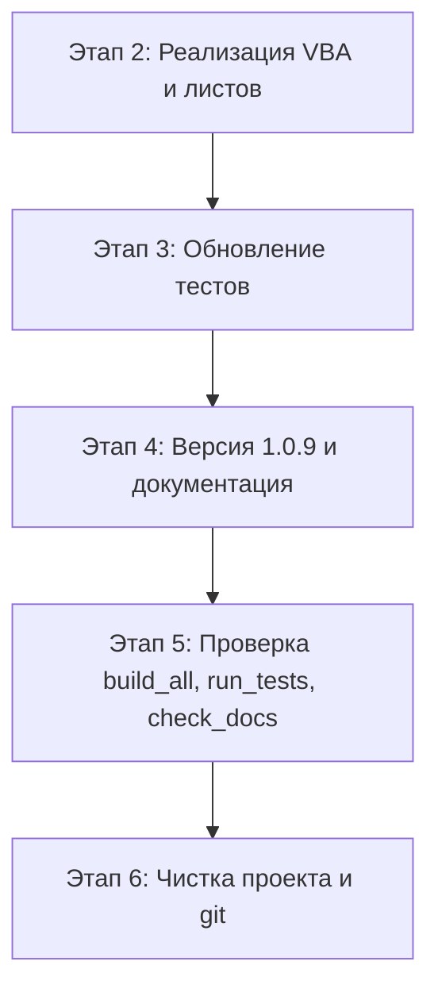

# План v1.0.9 — унификация структуры листов `work.xlsm` (Этап 1: проектирование)

> **Статус:** ЭТАП 1 (проектирование/архитектура). Код НЕ изменяется до согласования.
> Высший приоритет — правила [`.ycarules`](../.ycarules) (`[G1]`..`[E5]`).
> Все изменения VBA — только после утверждения плана (`[U1]`, `[Z5]`), маппинг — без нарушения `[Z6]`.

---

## 1. Целевой стандарт структуры листа

- Строки **1–2** — технические (пустые/служебные, не несут данных).
- Строка **3** — заголовки столбцов.
- Данные — начиная с **строки 4**.
- Закрепление строк 1–3: `FreezePanes` с точкой фиксации **A4** (закреплены только строки, не столбцы).

---

## 2. Маппинг строк по листам

| Лист | Файл | Текущие заголовки | Текущие данные | Целевые заголовки | Целевые данные | Действие |
| --- | --- | --- | --- | --- | --- | --- |
| `main` | `work.xlsm` | строка 3 (`A3="Поле"`, `B3="Значение"`) | с 4-й | строка 3 | с 4-й | **без сдвига**; добавить `Worksheet_Activate` + FreezePanes (A4). `B4` — ввод № ЗН уже корректен |
| `spisok` | `work.xlsm` | строка 1 (`A1=№ п/п`…`J1`) | со 2-й | строка 3 | с 4-й | **сдвиг +2**: заголовки→3, данные→4; FreezePanes |
| `models` | `work.xlsm` | двухрядная: стр.1 русские назв., стр.2 ключи (`A2=model`,`B2=group`,`C2=hlpr`) | с 3-й | строка 3 | с 4-й | **слить шапку в строку 3**, ключи вынести в константы; данные→4; FreezePanes |
| `libname` | `work.xlsm` | строка 1 (`A1={_name}`,`B1=England`,`C1=Русский`) | со 2-й | строка 3 | с 4-й | **сдвиг +2**; заголовки→3, данные→4; FreezePanes |
| `z4`, `{GroupName}`, `{GroupName}w`, `{GroupName}z4` | `base/models/*.xlsm` | строка 3 | с 4-й | строка 3 | с 4-й | **без сдвига**; только FreezePanes (A4) |

> Листы-макеты (`ЗНW`, `СчетW`, `3M`) и архивные (`*OLD`, `temp*`, `_SETTINGS`) **не стандартизируются** — имеют иную структуру и не входят в цель v1.0.9.

### 2.1. Решение для двухрядной шапки листа `models`

**Проблема:** текущая структура — стр.1 русские названия, стр.2 ключи, данные с 3-й.
Цель требует единой строки заголовков 3 и данных с 4-й.

**Предлагаемое решение (требует подтверждения пользователя — правило `[Z6]`):**
1. **Строки 1–2** — освободить (технические).
2. **Строка 3** — единая строка заголовков с **русскими названиями**:
   `A3="Модель"`, `B3="Группа"`, `C3="Цена н/ч"`, `D3="Работы исх"`, `E3="Работы мод"`, `F3="З/ч мод"`.
3. **Данные** — с **строки 4**.
4. **Ключи** (`model`, `group`, `hrpr`/`hlpr`, `works`, `mod_works`, `mod_z4`) — **не дублировать на листе**. Они уже формализованы как константы `MODELS_COL_MODEL_NAME="model_name"`, `MODELS_COL_GROUP_NAME="group"`, `MODELS_COL_PRICE_NAME="hrpr"` и хранятся в реестре `libname` (записи `models_col_*`).

**Обоснование безопасности:**
- Единственный VBA-код, читающий `models`, — [`Mod_OrderHeader.FillHeaderFromOrder()`](src/modules/Mod_OrderHeader.bas:109): цикл `Range("A3:A" & lastModelRow)` и автодобавление (`newRow>=3`). Он работает **по номеру столбца**, а не по ключу из строки 2.
- Поиск ключей `A2=model`, `B2=group` в рантайме в `src/**` **не обнаружен** (только константы). Удаление физической строки ключей код не ломает.
- Найденное расхождение для проверки в Этапе 2: константа `MODELS_COL_PRICE_NAME="hrpr"`, а факт. ключ на листе — `C2=hlpr` (по [`docs/table.md:150`](../docs/table.md:150)). Выровнять/зафиксировать в константах.

---

## 3. Константы `Mod_Constants.bas`

Файл: [`src/modules/Mod_Constants.bas`](src/modules/Mod_Constants.bas).

### 3.1. Единые (общие) значения — добавить
```vba
' Единый стандарт структуры листов v1.0.9
Public Const HEADER_ROW As Long = 3        ' строка заголовков для стандартизированных листов
Public Const DATA_START_ROW As Long = 4    ' строка начала данных
Public Const FREEZE_START_CELL As String = "A4"   ' точка фиксации FreezePanes (строки 1-3)
```

### 3.2. Константы по листам — заменить/добавить
| Константа | Старое значение | Новое значение | Примечание |
| --- | --- | --- | --- |
| `APP_VERSION` | `"1.0.8"` | `"1.0.9"` | строка 18 |
| `MAIN_HEADER_START_ROW` | `4` | — | **удалить**, заменить на `MAIN_HEADER_ROW = 3` (прежний смысл «4» был ошибочным — это строка ввода, не заголовков) |
| `MAIN_HEADER_ROW` (нов.) | — | `= HEADER_ROW` (3) | |
| `MAIN_DATA_START_ROW` | `4` | `= DATA_START_ROW` (4) | значение корректно, привести к константе |
| `MAIN_INPUT_CELL` (нов.) | — | `"B4"` | ввод № ЗН на `main` |
| `SPISOK_HEADER_ROW` (нов.) | — | `= HEADER_ROW` (3) | |
| `SPISOK_DATA_START_ROW` (нов.) | — | `= DATA_START_ROW` (4) | |
| `MODELS_HEADER_ROW` (нов.) | — | `= HEADER_ROW` (3) | |
| `MODELS_DATA_START_ROW` (нов.) | — | `= DATA_START_ROW` (4) | |
| `LIBNAME_HEADER_ROW` (нов.) | — | `= HEADER_ROW` (3) | |
| `LIBNAME_DATA_START_ROW` (нов.) | — | `= DATA_START_ROW` (4) | |
| `MANWRK_START_ROW` | `4` | `4` | без изменений (ручной подбор работ на `main`, E4:H) |

> Перед удалением `MAIN_HEADER_START_ROW` проверить ссылки на неё во всём `src/`; при наличии — заменить на `MAIN_HEADER_ROW`.

---

## 4. Правки VBA-модулей

### 4.1. `src/modules/Mod_Constants.bas`
- `APP_VERSION` → `"1.0.9"` (п. 3).
- Замена/добавление констант (п. 3).
- **`InitLibName`**:
  - строка 169: `If Not IsEmpty(wsLib.Cells(2, 1).Value)` → `Cells(LIBNAME_DATA_START_ROW, 1)` (4).
  - цикл записи (строки 179–181): `wsLib.Cells(i + 2, …)` → `wsLib.Cells(i + 4, …)` (три места: столбцы 1,2,3).
- **`AddWorkEntry`**:
  - строка 394: `If lastRow >= 2 Then` → `If lastRow >= LIBNAME_DATA_START_ROW Then`.

### 4.2. `src/modules/Mod_OrderHeader.bas` (`FillHeaderFromOrder`)
Данные `models` сдвигаются на строку 4:
- строка 103: `lastModelRow = wsModel.Cells(…).End(xlUp).Row` — ок (автоопределение).
- строка 109: `wsModel.Range("A3:A" & lastModelRow)` → `Range("A" & MODELS_DATA_START_ROW & ":A" & lastModelRow)`.
- строка 117: `If found And ModelRow.Row >= 3` → `>= MODELS_DATA_START_ROW`.
- строки 136–139: автодобавление `If lastModelRow < 3 Then newRow = 3 …` → `If lastModelRow < MODELS_DATA_START_ROW Then newRow = MODELS_DATA_START_ROW …`.
- Лист `spisok` читается через `Columns(1).Find` (строка 77) — поиск по всей колонке, **правка не требуется** (устойчив к сдвигу). Заполнение `B5:B17` на `main` — без изменений.

### 4.3. `src/modules/Mod_SheetButtons.bas` (R4 — смещение для z4/UAZ)
Обе функции (`ExecuteUAZSearch`, `ExecutePartsSearch`) ошибочно трактуют строку 4 как строку заголовков, а подсчёт ведут со строки 5.
Для модельных листов заголовок — **строка 3**, данные — с 4-й. Исправить (для обеих функций):
- `lastCol = ws.Cells(4, ws.Columns.Count).End(xlToLeft).Column` → `ws.Cells(MODELS_HEADER_ROW, …)` (3).
- `Set dataRange = ws.Range(ws.Cells(4,1), ws.Cells(lastRow,lastCol))` → `ws.Range(ws.Cells(MODELS_HEADER_ROW,1), …)` — включить строку заголовков в диапазон `AutoFilter`, чтобы Excel использовал её как строку заголовков.
- `countVisible = ws.Range(ws.Cells(5, …), …)` → `ws.Cells(MODELS_DATA_START_ROW, …)` (4) — первая строка данных.
- Константы `IsSearchableSheet`: условие `End(xlUp).Row >= 4` — оставить (данные с 4-й).

### 4.4. `src/modules/Mod_SheetOps.bas`
- Добавить общий помощник закрепления:
```vba
Public Sub ApplyFreezePanes(ByVal ws As Worksheet)
    If ws Is Nothing Then Exit Sub
    ws.Activate
    ws.Range(Mod_Constants.FREEZE_START_CELL).Select   ' A4 — закрепляем строки 1-3
    ActiveWindow.FreezePanes = True
End Sub
```
- `ClearMainSheet_UI` (B4:ZZ) и `ClearHeader_UI` (B5:B17) — **без изменений** (не затрагивают строки 1–3).

### 4.5. `src/modules/Mod_Import.bas`
- `targetRow = 4` (строка 149), очистка `L4:O`/`X4:AB` — **без изменений** (main уже в стандарте).

### 4.6. `src/modules/Mod_PickWork.bas`, `Mod_AutoMatch.bas`
- Читают `main!B13/B14` (цена н/ч, группа) — позиции стандарта `main` не меняются. **Без изменений.**

---

## 5. FreezePanes: классы листов

### 5.1. Рабочая книга `work.xlsm`
В [`src/sheets/`](src/sheets) сегодня только [`Лист2.cls`](src/sheets/Лист2.cls) (лист `main`). Необходимо:

| Класс (файл `.cls`) | Лист | Действие |
| --- | --- | --- |
| `Лист2.cls` | `main` | **изменить**: добавить `Worksheet_Activate` → `Mod_SheetOps.ApplyFreezePanes Me` (обработчик `Worksheet_Change` на B4 — без изменений) |
| `Лист3.cls` (новый) | `spisok` | создать: `Worksheet_Activate` → `ApplyFreezePanes` |
| `Лист4.cls` (новый) | `models` | создать: `Worksheet_Activate` → `ApplyFreezePanes` |
| `Лист5.cls` (новый) | `libname` | создать: `Worksheet_Activate` → `ApplyFreezePanes` |

> **Важно (для Этапа 2):** имя класса (`VB_Name`) должно совпадать с фактическим CodeName листа в книге (проверить в VBE по каждому листу; при необходимости переименовать CodeName листа или файл `.cls`). Импорт — через `impVBA.py` (UTF-8 → CP1251), кодировка классов с заголовком `VERSION 1.0 CLASS` сохраняется.

### 5.2. Модельные файлы `base/models/*.xlsm`
Листы `z4`, `{GroupName}`, `{GroupName}w`, `{GroupName}z4` уже соответствуют структуре (заголовки стр.3, данные с 4-й). Требуется только закрепление.

**Рекомендуемый механизм:** установить свойство закрепления напрямую через **openpyxl** (`ws.freeze_panes = "A4"`) в рамках этапа сборки/обработки файлов, **без добавления VBA-классов** в 6 критических файлов (`[E3]`). Это уменьшает риск правок защищённых файлов.

> **Альтернатива** (если нужен VBA-механизм): добавить `Worksheet_Activate`-классы в шаблон `base/templates/model.xlsm` и размножить на `base/models/*.xlsm` через `build_templates.py`. Выбор согласовать с пользователем.

**Ограничение `[Z2]`/`[E3]`:** перед любым изменением `base/models/*.xlsm` и `work.xlsm` — создать резервную копию.

---

## 6. Тесты `Mod_FullTestRunner.bas`

| Тест | Место | Причина | Изменение |
| --- | --- | --- | --- |
| **TC-13** (`RunLibNameTests`) | [строки 477–547](src/modules/Mod_FullTestRunner.bas:477) | libname: данные со 2-й → с 4-й | очистку `wsLib.Rows("2:"…)` → с `LIBNAME_DATA_START_ROW`; проверку `IsEmpty(Cells(2,1))` → `Cells(4,1)`; цикл обхода записей (`For i = …`) стартовать с `LIBNAME_DATA_START_ROW` |
| **TC-25..TC-28** (`RunOrderHeaderTests`) | [строки 1388–1548](src/modules/Mod_FullTestRunner.bas:1388) | spisok: поиск № заказа ведётся со строки 2 | строка 1423 `For i = 2 To wsSpisok…` → `For i = SPISOK_DATA_START_ROW …` (иначе в `orderNum` попадёт заголовок «№ п/п») |
| **TC-46** (`RunConstantsTests`) | [строки 1794–1858](src/modules/Mod_FullTestRunner.bas:1794) | `AddWorkEntry` пишет после последней строки | `End(xlUp)`-логика корректна при данных с 4-й; проверить, что стартовая граница записи ≥ `LIBNAME_DATA_START_ROW` |
| **TC-29** (`RunImportDataTests`) | [строки 1552–1750](src/modules/Mod_FullTestRunner.bas:1552) | временный лист-источник зеркалит **отчёт** (загол. 1–2, данные с 3) | **без изменений** — это структура источника импорта, не стандартизируемого листа; чтение `main` строк 4–6 корректно |

> Провести сквозной аудит `Mod_FullTestRunner.bas` на любые оставшиеся жёсткие ссылки на строки 2–3 для листов `spisok`/`models`/`libname` и заменить их константами. TC-01..TC-12, TC-14..TC-24, TC-30..TC-45, TC-47..TC-50 — не зависят от сдвига.

---

## 7. Скрипты и версия 1.0.9

### 7.1. Синхронное обновление версии
| Файл | Поле | Старое | Новое |
| --- | --- | --- | --- |
| [`src/modules/Mod_Constants.bas`](src/modules/Mod_Constants.bas:18) | `APP_VERSION` | `1.0.8` | `1.0.9` |
| [`scripts/config.py`](scripts/config.py:11) | `APP_VERSION` | `1.0.8` | `1.0.9` |
| [`scripts/config.ps1`](scripts/config.ps1:7) | `$Script:AppVersion` | `1.0.8` | `1.0.9` |
| [`README.md`](README.md:3) | Версия | `v1.0.8` | `v1.0.9` |
| [`docs/table.md`](docs/table.md:7) | статус | `v1.0.8` | `v1.0.9` + актуализация фактов (п. 7.2) |
| [`docs/CHANGELOG.md`](docs/CHANGELOG.md) | раздел | — | добавить `[v1.0.9]` |
| [`docs/ROADMAP.md`](docs/ROADMAP.md) | версия | — | содержать `v1.0.9` (проверяет `check_docs.py`) |

> Приоритет: обновлять через единый источник `scripts/update_version.py` (обновляет VBA+py+ps1+CHANGELOG), затем вручную README/table/ROADMAP.

### 7.2. Документация (`docs/`)
- `docs/table.md` — обновить фактические структуры листов `spisok` (загол. стр.3, данные с 4), `models` (единая строка 3, ключи в константах), `libname` (стр.3/4), отметить FreezePanes A4 для `main`/`spisok`/`models`/`libname` и модельных листов.
- `docs/ARCHITECTURE.md`, `docs/DEVELOPER.md` — описать единый стандарт (строки 1–2 технические, стр.3 заголовки, данные с 4, закрепление) и новые константы/классы.
- `docs/CHANGELOG.md` — раздел v1.0.9 (Keep a Changelog).

### 7.3. Критерий успеха
- `python scripts/run_tests.py` → `Failed=0` (SKIP допустим по отсутствию данных/провайдера).
- `python scripts/check_docs.py --check` → `exit 0`.
- `python scripts/build_all.py` → проходит все этапы.
- `python scripts/check_vba_syntax.py` → без ошибок компиляции.

---

## 8. Порядок выполнения (Этапы 2–6) и критерии приёмки



### Этап 2 — Реализация (роль Code)
1. Константы `Mod_Constants` (п. 3) + правки `InitLibName`/`AddWorkEntry` (4.1).
2. `Mod_OrderHeader` (4.2) — сдвиг `models` на строку 4.
3. `Mod_SheetButtons` (4.3) — исправление смещения z4/UAZ.
4. `Mod_SheetOps.ApplyFreezePanes` (4.4) + классы листов (5.1) для `main`/`spisok`/`models`/`libname`.
5. Реструктуризация листов в `work.xlsm`: сдвиг данных `spisok` (+2), `libname` (+2), слияние шапки `models` в строку 3; FreezePanes A4.
6. FreezePanes для `base/models/*.xlsm` (openpyxl, п. 5.2) с резервной копией.
- **Приёмка:** компиляция чистая; листы соответствуют таблице п. 2; FreezePanes держит строки 1–3.

### Этап 3 — Тесты (роль Debug/Code)
- Обновить TC-13, TC-25..TC-28, TC-46 (п. 6); сквозной аудит на жёсткие строки.
- **Приёмка:** `run_tests.py` → `Failed=0`.

### Этап 4 — Версия и документация (роль Code/Docs)
- `update_version.py 1.0.9` + ручная правка README/table/ROADMAP/ARCHITECTURE/DEVELOPER.
- **Приёмка:** `check_docs.py --check` → `exit 0`.

### Этап 5 — Сквозная проверка (роль Debug)
- `build_all.py` → ОК; `run_tests.py` → Failed=0; `check_docs.py --check` → exit 0.
- **Приёмка:** все три команды успешны.

### Этап 6 — Чистка и git (роль Orchestrator)
- Удалить временные файлы (`__pycache__`, `~$*.xlsm`, `*.sync-conflict-*`) — правило `[S7]`.
- Коммит на ветке `dev`, пуш через MCP Git Tools (`[G10]`); после подтверждения — слияние `dev → main`.
- **Приёмка:** репозиторий чист, изменения закоммичены.

---

## 9. Риски и решения
- **Модели — две строки шапки:** удаление физической строки ключей — изменение маппинга → **требует явного подтверждения пользователя** (`[Z6]`). Предложено решение, не ломающее рантайм-код.
- **Критические файлы** (`work.xlsm`, `base/models/*.xlsm`): только по плану, с резервной копией (`[E3]`, `[Z2]`).
- **CodeName классов листов:** проверить фактические имена в книге, иначе импорт `.cls` даст ошибку.
- **Расхождение ключа цены:** константа `hrpr` vs факт. `hlpr` — выровнять в константах в рамках Этапа 2.