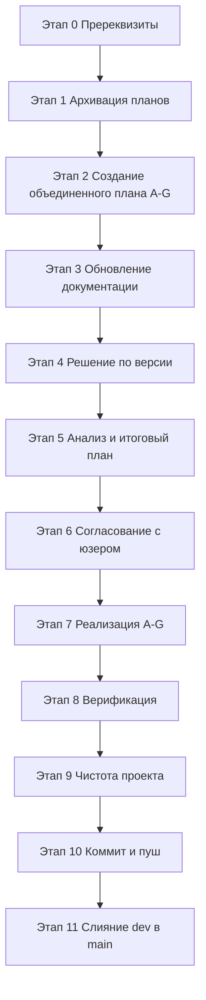
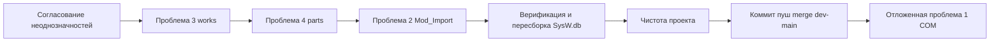

# Объединённый план исправлений — SysW v1.0.6

**Файл:** `plans/plan_promt9_1.0.6.md`
**Планируемая версия:** `1.0.6`
**Источник задания:** [`plans/promt9.md`](plans/promt9.md)
**Рабочая директория:** `f:/MiTyA/PROject/SysW`
**Статус:** готов к утверждению юзером и реализации в режиме Code.

> **Статус проблем**
> | № | Проблема | Статус |
> |---|----------|--------|
> | 1 | COM-ошибка Excel на `RunModelDBTests` | **ОТЛОЖЕНА** (зафиксировать диагноз, проверять гипотезу ByRef последним этапом) |
> | 2 | Глубокая подстановка модельных кодов в `Mod_Import` | **РЕШЕНО** юзером письменно → реализация |
> | 3 | Схлопывание дублей `works` | **РЕШЕНО** юзером письменно → реализация |
> | 4 | `SysW.db` ~500 МБ из-за дублирования `parts` | **РЕШЕНО** юзером письменно → реализация |

---

## 0. Правила и ограничения (основа плана)

- `.ycarules` — высший приоритет. Ключевые:
  - **[Z6]** Маппинг полей, алгоритмы, структура таблиц изменяются **только по письменному указанию Начальника мира**. Решения по проблемам 2–4 зафиксированы юзером письменно в задании → это основание для правок схемы/миграции/`Mod_Import`.
  - **[U1]** VBA-правки — только после плана; план в `plans/`, после исполнения — перенос в `plans/_archive/`.
  - **[U2]** Функциональные изменения → обновление `docs/CHANGELOG.md`.
  - **[G2]** Черновые/рабочие согласования — через `docs/table.md`.
  - **[S7]** Чистка проекта от мусора (конфликтные ветки, временные файлы, диагностический код).
  - **[K1]/[K2]** Двухфазная кодировка: на диске UTF-8, импорт VBA через `scripts/impVBA.py`, экспорт через `scripts/export_vba.py`; `.gitattributes` нормализует UTF-8.
  - **[E3]** Критические файлы (`work.xlsm`, `base/models/*`, `.ycarules`) — только по команде.
  - **[Z3]** Имена файлов/процедур/переменных — только латиница.
  - **[G9]** Комментарии в коде — на русском.
  - **[G10]/[G11]** Git-операции — через MCP Git Tools; файловые операции — через MCP File System, где уместно.
- Ветка работ: **dev** (опережает `origin/dev` на 1 коммит). Финал — слияние `dev → main` и возврат в `dev`.
- Незакоммиченные изменения на старте: удалены бэкапы `_backup/*` (6 файлов), изменены `_backup/work.xlsm`, `base/models/{4x4,2170,2180,2190,GAZ,UAZ}.xlsm`, `work.xlsm`; не отслеживается `plans/promt9.md`. Учитываются в этапе чистки/коммита.

---

## 1. Итоговая последовательность этапов



### Этап 0 — Пререквизиты
- Проверить статус веток и рабочего дерева (`git status`, `git branch`) через MCP Git Tools.
- Подтвердить наличие рабочей `SysW.db` и ODBC-драйвера `SQLite3 ODBC Driver` (64-bit).
- Согласовать с юзером пункты из раздела «Неоднозначности для юзера» (см. §6).

### Этап 1 — Архивация планов
- Перенести завершённые/устаревшие планы из `plans/` в `plans/_archive/` согласно [U1]: кандидаты — `promt8.md`, текущий после утверждения, а также те, что уже отражены в ранее выполненных работах.
- Сам `plan_promt9_1.0.6.md` остаётся в `plans/` до полного исполнения, затем переносится в `plans/_archive/`.

### Этап 2 — Создание объединённого плана A–G
- Настоящий документ. Разделы A–G соответствуют проблемам 2,3,4 и отложенной 1:
  - **A** — подстановка модельных кодов (проблема 2);
  - **B** — схлопывание дублей `works` (проблема 3);
  - **C** — нормализация `parts` / уменьшение размера БД (проблема 4);
  - **D** — верификация и пересборка `SysW.db`;
  - **E** — чистота проекта;
  - **F** — git-workflow (коммит, пуш, слияние dev→main);
  - **G** — (отложено) возврат к проблеме 1 — COM-ошибка.

### Этап 3 — Обновление документации
- `docs/CHANGELOG.md` — раздел `[v1.0.6]` ([U2]).
- `docs/table.md` — актуализация маппинга колонок листа `main` (входящие запчасти X/Y/AB и работы O) с учётом согласованного решения ([G2]).
- `docs/ARCHITECTURE.md`, `docs/DEVELOPER.md` — при необходимости (схема БД, нормализация `parts`).
- `db/schema.sql` — комментарии и сама схема (см. разделы C и B).

### Этап 4 — Решение по версии
- Поднять версию до `1.0.6` через `scripts/update_version.py` (централизованные источники: `scripts/config.py`, `scripts/config.ps1`, `src/modules/Mod_Constants.bas`, `README.md`, `docs/*`).
- Зафиксировать `APP_VERSION = 1.0.6`.

### Этап 5 — Анализ и итоговый план
- Подтвердить целевые колонки входящих запчастей на `main` (см. §6 Неоднозначности) и целевую ячейку для подстановленного артикула работ/запчастей.
- Зафиксировать целевую схему БД (см. §2-C) и способ пересборки.

### Этап 6 — Согласование с юзером
- Представить план на утверждение. Без письменного подтверждения изменений маппинга/схемы **не приступать** к реализации ([Z6]).

### Этап 7 — Реализация A–G (Code-режим)
- Порядок: проблемы **2 → 3 → 4**, затем отдельным этапом **проблема 1** (отложена).
- Детализация в §2–§4.

### Этап 8 — Верификация
- Пересборка `SysW.db` скриптом миграции (`--force`).
- Прогон `scripts/run_tests.py`; контроль прохождения TC-29 и TC-31..TC-35 (TC-35 — только после решения проблемы 1).
- Контроль объёма БД и числа строк (`works`, `parts`, `parts_catalog`).
- Ручная проверка подстановки артикулов в импорте (флаг включён).

### Этап 9 — Чистота проекта
- Удалить диагностический код и временные артефакты (см. §5).
- Удалить конфликтные ветки `*.sync-conflict-*` (локальные и на origin).
- Удалить `_temp_*`, неиспользуемые файлы.

### Этап 10 — Коммит и пуш
- Оформить коммит(ы) в `dev` (через MCP Git Tools): документация + код + схема + миграция, отдельно — очистка.
- Пуш `dev → origin/dev`.

### Этап 11 — Слияние dev → main
- Создать merge/Pull Request `dev → main`, разрешить конфликты (если есть), завершить слияние.
- Переключиться обратно в `dev` (по заданию promt9.md, п.11).

---

## 2. Реализуемые проблемы (этап 7)

### 2.A — Проблема 2: глубокая подстановка модельных кодов в `Mod_Import` (РЕШЕНО)

**Затронутые файлы**
- [`src/modules/Mod_Import.bas`](src/modules/Mod_Import.bas) — блоки работ и материалов в `ImportDataToMain`.
- [`src/classes/Mod_SQLiteDB.cls`](src/classes/Mod_SQLiteDB.cls) — уже есть `GetMatLibEntries` (читается без правок провайдера).
- [`src/modules/Mod_ModelDB.bas`](src/modules/Mod_ModelDB.bas) — уже есть обёртка `GetMatLibEntries`.
- [`docs/table.md`](docs/table.md) — фиксация маппинга.

**Суть решения (письменно зафиксировано юзером)**
- Флаг `ApplyMatLibSubstitution = False` по умолчанию в `Mod_Import`.
- При включении флага — подстановка артикула **только при точном совпадении входного ключа** в `matlib_entries`.
- **Работы:** ключ = наименование (источник **D → L**); найденный артикул `target_code` писать в **O(15)** листа `main`; наименование L сохраняется.
- **Запчасти:** ключ = № кат. (источник **B**, сейчас НЕ переносится → добавить перенос); найденный артикул писать в **AB(28)**; наименование X сохраняется.
- Использовать `GetMatLibEntries(groupName, entryCode)` (возвращает Collection массивов `[target_type, target_code, target_name, coefficient]`).
- Таблица `matlib_entries`: для работ `entry_code = in_name`; для частей `entry_code = in_catnum`; `target_code = out_article` (см. [`db/schema.sql:92`](db/schema.sql:92)).

**Конкретные правки (`Mod_Import.bas`)**
1. Объявить константу/переменную флага `ApplyMatLibSubstitution As Boolean` (значение `False` по умолчанию).
2. Для работ: после записи `D(4)→L(12)`, `I(9)→M(13)`, `M(13)→N(14)` — при включённом флаге вызвать `Mod_ModelDB.GetMatLibEntries(group, L-значение)`, при точном совпадении записать `target_code` в `Cells(targetRow, 15)` (O). Наименование L не менять.
3. Для запчастей: добавить перенос `B(2)→X(24)` (№ кат.). При включённом флаге использовать X-значение как ключ для `GetMatLibEntries` (для частей), при точном совпадении записать `target_code` в `Cells(targetRow, 28)` (AB). Наименование X не менять.
4. Обработать случай отсутствия совпадения (оставить ячейку пустой либо пометить — по решению юзера, см. §6).

**Расхождение, требующее согласования**
- [`Mod_Import.bas:193`](src/modules/Mod_Import.bas:193) пишет **наименование C(3)→X(24)**, а по [`docs/table.md`](docs/table.md:522) X = **№ кат.** входящей запчасти, Y = Наименование. Это ключевая неоднозначность (§6.2): определить целевые колонки входящих запчастей (X=№ кат., Y=Наименование по docs), прежде чем менять маппинг ([Z6]).

**Ожидаемый результат**
- При включённом флаге в колонках O (работы) и AB (запчасти) на `main` появляются модельные артикулы при точном совпадении ключей в `matlib_entries`; при выключенном — поведение идентично текущему.

**Критерии приёмки/верификации**
- TC-29 ([`Mod_FullTestRunner.bas:1483`](src/modules/Mod_FullTestRunner.bas:1483)) проходит (флаг выключен по умолчанию; тестовые строки не имеют совпадений в `matlib_entries`).
- Ручной импорт с включённым флагом: для известного ключа из `matlib_entries` артикул подставляется; для отсутствующего ключа — пустая ячейка.
- Маппинг X/Y/AB соответствует согласованному в `docs/table.md`.

**Риски**
- Нарушение маппинга (C→X vs B→X) — заблокировано до согласования (§6.2).
- Регрессия существующего импорта — снижается тем, что флаг выключен по умолчанию.
- Большие Collection из `GetMatLibEntries` на каждом совпадении — допустимо (точный ключ); при необходимости кэшировать.

**[Z6]-согласование**
- Правка маппинга входящих запчастей и добавление колонок O/AB выполняется **только после письменного подтверждения** целевых колонок (см. §6).

---

### 2.B — Проблема 3: схлопывание дублей `works` (РЕШЕНО)

**Затронутые файлы**
- [`db/schema.sql:53`](db/schema.sql:53) — первичный ключ таблицы `works`.
- [`scripts/migrate_models_to_sqlite.py:179`](scripts/migrate_models_to_sqlite.py:179) — `INSERT OR REPLACE` → `INSERT`.

**Суть решения (письменно зафиксировано юзером)**
- Изменить схему `works` на `PRIMARY KEY (group_name, code, name)` (добавить `name` в PK).
- Перемиграция из `xlsm` для восстановления всех строк (сейчас потеряно 2200: 10290 → 8090).
- SQL-запрос `GetWorks` фильтрует по `group_name` и **НЕ зависит от PK** — правок провайдера (`Mod_SQLiteDB.GetWorks`, [`src/classes/Mod_SQLiteDB.cls:255`](src/classes/Mod_SQLiteDB.cls:255)) не требуется.

**Конкретные правки**
1. [`db/schema.sql:53`](db/schema.sql:53): `PRIMARY KEY (group_name, code)` → `PRIMARY KEY (group_name, code, name)`.
2. [`scripts/migrate_models_to_sqlite.py:179`](scripts/migrate_models_to_sqlite.py:179): `INSERT OR REPLACE INTO works(...)` → `INSERT INTO works(...)` (чтобы сохранять дубли при одинаковом артикуле, но разных наименованиях работ).

**Ожидаемый результат**
- После перемиграции число строк `works` ≈ 10290 (все дубли сохранены).

**Критерии приёмки/верификации**
- `SELECT COUNT(*) FROM works;` после миграции ≈ 10290 (не 8090).
- Выборочная проверка: одинаковый артикул с разными наименованиями присутствует несколькими строками.
- `PRAGMA integrity_check` = ok.

**Риски**
- Появление дублей при чтении — запрос `GetWorks` уже возвращает все строки группы; ожидаемое поведение.
- Если в данных есть полностью идентичные строки (одинаковые group_name/code/name) — `INSERT` добавит абсолютные дубли. Уточнить у юзера: допускается ли полное дублирование (см. §6.3).

**[Z6]-согласование**
- Изменение структуры таблицы зафиксировано письменно юзером — правка допустима.

---

### 2.C — Проблема 4: `SysW.db` ~500 МБ из-за дублирования `parts` (РЕШЕНО)

**Затронутые файлы**
- [`db/schema.sql:40`](db/schema.sql:40) — таблица `parts` → разделение на `parts_catalog` + `parts`.
- [`src/classes/Mod_SQLiteDB.cls:291`](src/classes/Mod_SQLiteDB.cls:291) — `GetParts` → JOIN.
- [`scripts/migrate_models_to_sqlite.py:426`](scripts/migrate_models_to_sqlite.py:426) — вставка shared-каталога 6 раз → один раз в `parts_catalog` + привязки.
- [`scripts/migrate_models_to_sqlite.py:294`](scripts/migrate_models_to_sqlite.py:294) — `load_shared_parts`.
- [`scripts/migrate_models_to_sqlite.py:313`](scripts/migrate_models_to_sqlite.py:313) — `insert_shared_parts_for_group`.
- [`scripts/sqlite_schema.py`](scripts/sqlite_schema.py) — согласовать со схемой (если используется для создания БД).

**Суть решения (письменно зафиксировано юзером)**
- Нормализация:
  - `parts_catalog(code TEXT PRIMARY KEY, name, unit, price, note)` — уникальный каталог запчастей.
  - `parts(group_name, part_code)` — хранит только принадлежность запчасти к группе.
- Объём снизится ~в 6 раз (4 054 734 → ~675 789 строк).
- `GetParts` → `SELECT ... FROM parts p JOIN parts_catalog c ON p.part_code = c.code WHERE p.group_name = ?`.
- Excel-провайдер `Mod_ModelDBProvider` от схемы БД не зависит — правок не требуется.

**Конкретные правки**
1. [`db/schema.sql:40`](db/schema.sql:40): заменить таблицу `parts` на две:
   ```sql
   CREATE TABLE IF NOT EXISTS parts_catalog (
       code TEXT PRIMARY KEY,
       name TEXT NOT NULL,
       unit TEXT,
       price REAL,
       note TEXT
   );
   CREATE TABLE IF NOT EXISTS parts (
       group_name TEXT NOT NULL,
       part_code TEXT NOT NULL,
       PRIMARY KEY (group_name, part_code),
       FOREIGN KEY (part_code) REFERENCES parts_catalog(code)
   );
   ```
2. [`src/classes/Mod_SQLiteDB.cls:291`](src/classes/Mod_SQLiteDB.cls:291): заменить запрос `GetParts` на JOIN, чтобы возвращать `[code, name, unit, price, note]` из `parts_catalog`.
3. [`scripts/migrate_models_to_sqlite.py:294`](scripts/migrate_models_to_sqlite.py:294): `load_shared_parts` — заполняет `parts_catalog` (один раз).
4. [`scripts/migrate_models_to_sqlite.py:313`](scripts/migrate_models_to_sqlite.py:313): `insert_shared_parts_for_group` — заполняет `parts` только привязками `(group_name, part_code)`.
5. [`scripts/migrate_models_to_sqlite.py:426`](scripts/migrate_models_to_sqlite.py:426): вызывать загрузку каталога один раз, а не для каждой группы.
6. Проверить, что `extract_parts` ([`migrate_models_to_sqlite.py:187`](scripts/migrate_models_to_sqlite.py:187)) также использует `parts_catalog` (лист `z4` — общий каталог).

**Ожидаемый результат**
- Размер `SysW.db` снижается примерно в 6 раз (~500 МБ → ~80–90 МБ).
- `parts_catalog` содержит ~675 789 уникальных строк; `parts` — привязки по группам.
- `GetParts(group)` возвращает тот же набор данных, что и раньше.

**Критерии приёмки/верификации**
- `SELECT COUNT(*) FROM parts_catalog;` ≈ 675 789.
- `SELECT COUNT(*) FROM parts;` = сумма привязок по 6 группам (≈ 4 054 734 было → теперь равно числу уникальных × групп фактически встречающихся).
- Размер файла БД после пересборки подтверждён.
- `GetParts` через VBA/прямой SQL возвращает корректный набор для каждой группы.
- `PRAGMA integrity_check` = ok.

**Риски**
- Различие данных в `z4` разных групп (если каталог не строго общий): возможна потеря запчастей, уникальных для конкретной группы. Проверить факт единообразия `z4` по всем 6 файлам ([`docs/table.md`](docs/table.md:75) подтверждает единую структуру заголовков).
- Необходима полная пересборка БД (`--force`) — на время верификации зарезервировать исходную копию в `_backup/` (но не коммитить бэкапы, см. §5).

**[Z6]-согласование**
- Изменение структуры таблиц зафиксировано письменно юзером — правка допустима.

---

### 2.G — Проблема 1: COM-ошибка Excel на `RunModelDBTests` (ОТЛОЖЕНА — отдельный этап)

**Диагноз (подтверждён)**
- ODBC-драйвер `SQLite3 ODBC Driver` 64-bit установлен; `SysW.db` (~500 МБ) открывается извне за 0.017 с (база/драйвер исправны).
- Ошибка воспроизводится стабильно как сбой на уровне COM-маршалинга Excel.
- VBA доходит до TC-35 и зависает **на границе вызова** `Set prov = Mod_ModelDB.GetModelDataProvider()` (тело функции не входит; независимый trace `logs/com_trace.txt` не создаётся).
- В `scripts/run_tests.py` уже добавлены `DispatchEx` + `gc.collect()` (без `AutomationSecurity`, т.к. он отключает макросы).

**Затронутые точки**
- [`src/modules/Mod_ModelDB.bas`](src/modules/Mod_ModelDB.bas) — `GetModelDataProvider`.
- [`src/classes/Mod_SQLiteDB.cls`](src/classes/Mod_SQLiteDB.cls) — `OpenConnection`.
- [`src/modules/Mod_FullTestRunner.bas`](src/modules/Mod_FullTestRunner.bas) — `RunModelDBTests` / TC-35.
- [`scripts/run_tests.py`](scripts/run_tests.py) — COM-запуск.

**Гипотеза решения (проверяется отдельным этапом)**
- Переработать `GetModelDataProvider`, чтобы провайдер передавался **через ByRef-параметр**, а не возвращался интерфейсом из функции (избежать COM-маршалинга интерфейса в невидимом Excel).

**Конкретные правки (при подтверждении гипотезы)**
1. `Mod_ModelDB.bas`: добавить процедуру вида `GetModelDataProviderByRef(ByRef prov As IModelDataProvider) As Boolean` или изменить фабрику на передачу провайдера через `ByRef`.
2. Обновить вызовы в `Mod_FullTestRunner.bas` (TC-35, TC-S1 и др.) на новый механизм.
3. Сохранить обратную совместимость обёрток `GetWorks/GetParts/GetModelWorks/GetModelParts/GetMatLibEntries`, если они используются другими модулями.
4. Проверить отсутствие утечки COM-объектов (`Class_Terminate`/`CloseConnection`, `Application.Quit` в `run_tests.py`).

**Ожидаемый результат**
- `run_tests.py` проходит `RunModelDBTests` до конца (TC-31..TC-35) без зависания на границе вызова `GetModelDataProvider`.

**Критерии приёмки/верификации**
- Прогон `scripts/run_tests.py` завершается без COM-ошибки.
- TC-35 «GetModelDataProvider провайдер» = True.
- Отсутствие зависших процессов `EXCEL.EXE` после прогона.
- Диагностические логи (см. §5) удалены; финальный прогон без них.

**Риски**
- Гипотеза может не подтвердиться (сбой глубже в ODBC/ADO внутри невидимого Excel) → вернуться к диагностике в отдельном Debug-цикле; план предусматривает итерацию.
- Рефакторинг сигнатуры фабрики затрагивает несколько вызовов — риски регрессии, покрыть тестами TC-31..TC-35 и TC-S1.

**[Z6]-согласование**
- Изменение алгоритма/структуры вызова провайдера — только по отдельному письменному указанию; этап **не выполняется** в рамках проблем 2–4, выносится после них.

---

## 3. Порядок реализации и зависимости

1. Согласовать неоднозначности (§6) — обязательно до правок маппинга и схемы.
2. **Проблема 3** (схема `works` + миграция) и **Проблема 4** (нормализация `parts`) — вместе, т.к. обе требуют правки `db/schema.sql` и пересборки БД одним прогоном миграции.
3. **Проблема 2** (подстановка в `Mod_Import`) — после стабилизации БД (зависит от `matlib_entries`).
4. **Проблема 1** (COM) — отдельный отложенный этап после проблем 2–4.



---

## 4. Верификация (этап 8)

- Полная пересборка БД: `python scripts/migrate_models_to_sqlite.py --force` (с предварительным бэкапом в `_backup/`, не коммитить).
- Контрольные запросы:
  - `SELECT COUNT(*) FROM works;` ≈ 10290;
  - `SELECT COUNT(*) FROM parts_catalog;` ≈ 675 789;
  - `SELECT COUNT(*) FROM parts;` — корректная сумма привязок;
  - `PRAGMA integrity_check;` = ok.
- Прогон `python scripts/run_tests.py` — контроль TC-29, TC-31..TC-35, TC-S1.
- Ручной сценарий импорта (проблема 2) с включённым/выключенным флагом.
- Замер размера `SysW.db` (ожидается ~6× меньше).

---

## 5. Чистота проекта (этап 9) — удаляемые артефакты

**Диагностический код (обязательно убрать после отладки)**
- `TraceToFile` в [`src/modules/Mod_ModelDB.bas`](src/modules/Mod_ModelDB.bas) (строки 5–20 и вызовы внутри `GetModelDataProvider`).
- DIAG-логи в [`src/modules/Mod_FullTestRunner.bas`](src/modules/Mod_FullTestRunner.bas) (например, строки 615–616, 686–687) — `Call Mod_Logger.WriteLog(..., "DIAG ...")`.
- Файл `logs/com_trace.txt` (если создан) — удалить; проверить `logs/.gitkeep` остаётся.

**Ветки и файлы**
- Конфликтные ветки `*.sync-conflict-*` (локальные и на `origin`) — удалить ([S7]).
- Файлы `*.sync-conflict-*`, если есть в рабочем дереве.
- Временные директории `_temp_export/`, `_temp_import/` (см. `.codeassistantignore`).
- Бэкапы `_backup/*` (6 удалённых уже отсутствуют; не добавлять новые бэкапы в git) — оставить `_backup/` вне коммита.
- Прочие временные файлы, созданные ассистентом в ходе работ ([Z2] — удалять после завершения).

**Не отслеживаемые/незакоммиченные на старте**
- `plans/promt9.md` — при необходимости добавить в контроль либо удалить после выполнения.
- Изменённые `base/models/*.xlsm`, `_backup/work.xlsm`, `work.xlsm` — решение о включении в коммит согласовать с юзером ([E3]).

---

## 6. Неоднозначности для юзера (раздел G2 — уточнить ДО реализации)

**6.1. Расхождение кода и docs/table.md для входящих запчастей**
- [`Mod_Import.bas:193`](src/modules/Mod_Import.bas:193) пишет наименование C(3)→X(24).
- [`docs/table.md:522`](docs/table.md:522): X = «№ кат.», Y = «Наименование», Z = «Кол-во», AA = «Всего».
- **Вопрос:** какие колонки считать целевыми для входящих запчастей? Вариант по docs: B→X (№ кат.), C→Y (Наименование), D→Z (Кол-во), цена→AA.

**6.2. Целевые колонки входящих запчастей и куда писать подставленный артикул**
- Для работ целевая колонка подстановки — **O(15)**.
- Для запчастей — **AB(28)**. Подтвердить, что X остаётся под № кат. (или наименование) без перезаписи подставленным артикулом.

**6.3. Полное дублирование строк `works`**
- При `INSERT` вместо `INSERT OR REPLACE` полностью идентичные строки (одинаковые group_name/code/name) будут дублироваться. Подтвердить допустимость либо добавить дедупликацию с сохранением разных наименований.

**6.4. Единообразие каталога `z4` по группам**
- Перед нормализацией `parts` подтвердить, что `z4` во всех 6 файлах действительно идентичен (иначе при единственном `parts_catalog` часть запчастей может потеряться).

**6.5. Порядок возврата к проблеме 1 (COM)**
- Подтвердить, что возврат к COM-ошибке выполняется отдельным этапом после успешного завершения проблем 2–4 и что допускается рефакторинг сигнатуры `GetModelDataProvider` (ByRef) по отдельному письменному указанию.

---

## 7. Критерии готовности плана к реализации

- [ ] Письменное подтверждение всех неоднозначностей §6.
- [ ] Согласованная целевая схема `db/schema.sql` (works + parts_catalog + parts).
- [ ] Согласованный маппинг колонок `main` (X/Y/AB, O) зафиксирован в `docs/table.md`.
- [ ] Раздел «Реализация» (этап 7) самодостаточен для Code-режима: указаны файлы, правки, ожидания, критерии, риски.

---

## 8. Риски и меры

| Риск | Мера |
|------|------|
| Нарушение маппинга ([Z6]) | Согласование §6 до реализации; флаг `ApplyMatLibSubstitution=False` по умолчанию |
| Регрессия импорта | Выключенный флаг; TC-29 в верификации |
| Потеря строк/запчастей при пересборке БД | Бэкап перед `--force`; контрольные `COUNT(*)`; `integrity_check` |
| Различие `z4` между группами | Проверка единообразия (согласование §6.4) |
| Гипотеза COM (ByRef) не сработает | Итеративный Debug-цикл; этап вынесен отдельно, не блокирует 2–4 |
| Утечка COM-объектов | `Class_Terminate`/`CloseConnection`, `Application.Quit` + `gc.collect()` |
| Мусор/конфликтные ветки | Этап чистки §5, [S7] |

---

*Документ составлен в режиме Architect для последующего утверждения юзером и реализации в режиме Code.*