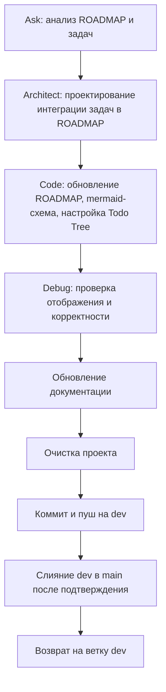

# Задание для SourceCraft `plans/promt1.0.11.md`

**!!!ВАЖНО: `.ycarules` имеет высший приоритет!!!**

## Цель

  Версия проекта SysW — **v1.0.11**: интеграция системы отслеживания задач непосредственно в **`docs/ROADMAP.md`**.
  В ROADMAP будут добавлены актуальные задачи (текущие и глобальные) с явным указанием типа, взаимосвязей/независимости и условий выполнения.
  Дополнительно в ROADMAP добавляется **mermaid-схема дерева задач**, визуализирующая структуру и зависимости.
  Настройка **Todo Tree** выполняется так, чтобы он отслеживал чекбоксы в ROADMAP и отображал их в виде дерева.

  ROADMAP становится единым источником задач и планов. SourceCraft сможет читать ROADMAP, обновлять статусы чекбоксов и контролировать прогресс.

## Задачи

### 1. Анализ задачи (роль: **Ask**)

- Проанализировать текущее содержимое `docs/ROADMAP.md`.
- Изучить структуру ROADMAP: разделы, уже выполненные и невыполненные задачи.
- Выделить актуальные **текущие** задачи (ближайшие шаги) и **глобальные** цели.
- Определить взаимосвязи между задачами и подзадачами, а также условия для их выполнения (или отсутствие условий).
- Запросить у пользователя приоритеты и уточнить, какие задачи должны попасть в ROADMAP.
- Анализ для планирования создать в виде временного или виртуального файла

### 2. Планирование (роль: **Architect**)

- Спроектировать интеграцию задач в ROADMAP на основе анализа сделанного Ask:
  - Ввести в ROADMAP раздел «Актуальные задачи и подзадачи» или дополнить существующие разделы.
  - Для каждой задачи/подзадачи указать тип (текущая/глобальная), взаимосвязь (зависит от … / независимая), условие выполнения (или «без условий»).
  - Использовать Markdown-чекбоксы `[ ]` и `[x]` для отслеживания статуса.
- Разработать mermaid-схему, отображающую дерево задач и зависимости между ними.
- Определить, как Todo Tree будет читать ROADMAP (теги, regex, исключения).
- Подготовить описание, как SourceCraft будет обновлять ROADMAP (менять `[ ]` на `[x]`).
- План для исполнения создать в виде временного или виртуального файла

### 3. Исполнение (роль: **Code**)

- Выполнить обновление по плану
- Проверить, что Todo Tree будет отображать дерево на основе ROADMAP.

### 4. Проверка (роль: **Debug**)

- Убедиться, что ROADMAP содержит все задачи с корректными атрибутами (тип, взаимосвязь, условие).
- Проверить, что mermaid-схема синтаксически верна и отображается в VS Code и на GitHub.
- Проверить, что Todo Tree распознаёт чекбоксы в ROADMAP и строит дерево.
- Убедиться, что SourceCraft может читать ROADMAP и при необходимости обновлять чекбоксы.
- Проверить отсутствие конфликтов настроек `.vscode/settings.json`.

### 5. Координация (роль: **Orchestrator**)

- Согласовать структуру и формат с пользователем.
- Распределить подзадачи между ролями.
- Проконтролировать выполнение всех этапов.

### 6. Обновление документации

- Обновить `docs/DEVELOPER.md`, добавив раздел о системе отслеживания задач в ROADMAP.
- При необходимости обновить `README.md` и `docs/sourcecraft-guide.md`, указав на ROADMAP как источник задач.
- Обновить `CHANGELOG.md`: добавить версию v1.0.11.

### 7. Очистка системы

- Удалить временные файлы, если они появились.
- Проверить, что не осталось устаревших дублирующих источников задач.
- Убедиться, что ROADMAP не содержит дублей и противоречий.

### 8. Коммит, пуш, слияние

- Закоммитить изменения в ветку `dev` с сообщением:
  `docs: интеграция дерева задач в ROADMAP, настройка Todo Tree, обновление документации`
- Отправить в `origin/dev`.
- Запросить у пользователя подтверждение на слияние `dev → main`.
- После подтверждения выполнить слияние.
- Вернуться на ветку `dev`.

## Итоговая последовательность

## Риски

- **ROADMAP становится перегруженным** — согласовать с пользователем уровень детализации.
- **Дублирование с другими планами** — убедиться, что только один файл является источником задач.
- **Mermaid может не отображаться** — проверить поддержку в VS Code и GitHub; при необходимости использовать простые диаграммы.
- **SourceCraft не обновляет чекбоксы** — в промтах явно указывать изменение `[ ]` на `[x]`.

## Критерии приёмки

- ROADMAP (`docs/ROADMAP.md`) содержит актуальные задачи и подзадачи с указанием типа, взаимосвязи и условий.
- В ROADMAP добавлена mermaid-схема дерева задач, корректно отображающая структуру и зависимости.
- Todo Tree настроен и отображает дерево на основе ROADMAP.
- SourceCraft способен читать ROADMAP и редактировать чекбоксы.
- Документация обновлена: ARCHITECTURE.md , CHANGELOG.md , DEVELOPER.md , git-workflow.md , ROADMAP.md , sourcecraft-guide.md , table.md , README.md
- Проект очищен от временных файлов и дублирующих источников.
- Коммит выполнен, ветка `dev` актуальна, слияние с `main` завершено (если подтверждено), текущая ветка — `dev`.

## Примечания

- Все изменения согласовывать с пользователем.
- Отвечать на русском языке.
- Соблюдать `.ycarules`, особенно [Z2], [Z5], [U1], [U2], [G2], [K1]/[K2], [S7], [E3].
- При неоднозначности — переспрашивать.
- После завершения — запрос на коммит и пуш.
