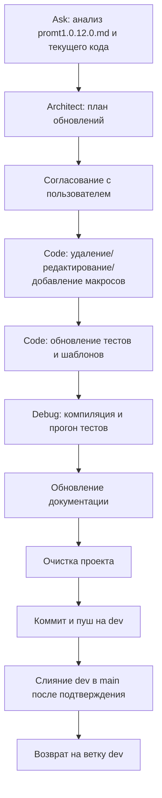

# Задание для SourceCraft `plans/promt1.0.12.md`

**!!!ВАЖНО: `.ycarules` имеет высший приоритет!!!**

## Цель

Версия проекта SysW — **v1.0.12**: анализ заполненной пользователем таблицы реестра макросов (`plans/promt1.0.12.0.md`), формирование плана обновлений, внесение изменений в VBA-код, обновление тестов и документации, тестирование, очистка проекта, коммит и пуш, а также слияние по запросу пользователя.

Основной источник решений пользователя — таблица в файле `plans/promt1.0.12.0.md`. В ней пользователь уже пометил часть макросов: что оставить, что удалить, что переделать, что актуализировать. Задача SourceCraft — обработать эти решения, а по незаполненным пунктам либо оставить текущее поведение, либо уточнить у пользователя.

Дополнительно необходимо учесть следующие требования пользователя:

1. **Раздел 1.3 (поиск листов) содержит ошибку**: UAZ — это пример, а не фиксированное имя листа. Имя листа должно браться динамически из `main!$B$14` (значение группы). Все макросы поиска должны работать в книге с любым именем листа; из названий макросов и процедур убрать `UAZ`/`Parts` как фиксированные имена.
2. **Разработать новую структуру книги `model`** так, чтобы имена листов легко подходили под макросы в книгах с разными именами.
3. **Шаблоны книг**:
   - `base\templates\work.xlsm` — исходный файл с импортированными модулями, но без данных.
   - `base\templates\work0.xlsm` — исходный файл без данных и без модулей, но с исходным форматированием.
   - `base\templates\model.xlsm` — исходный образец с импортированными модулями, но без данных.
   - `base\templates\model0.xlsm` — исходный образец без данных и без модулей, но с исходным форматированием.
   - В случае поломки брать исходники из `base\templates\`.
4. **Настроить импорт модулей VBA в модельные книги `base\models\`** аналогично импорту в `work.xlsm`.

## Задачи

### 1. Анализ задачи (роль: **Ask**)

- Прочитать файл `plans/promt1.0.12.0.md` с заполненной пользователем таблицей.
- Составить полный список решений пользователя по каждому макросу:
  - оставить (`+`),
  - удалить,
  - редактировать,
  - актуализировать после обновлений,
  - рассказать подробнее,
  - сравнить с другим макросом,
  - добавить новый функционал (например, «РУЧ ЗЧ»).
- Выявить незаполненные ячейки «Решение юзера» и определить, что с ними делать: оставить как было или запросить уточнение.
- Проанализировать текущую структуру `base\templates\` и `base\models\`, импорт модулей, макросы `Mod_SheetButtons`.
- Подготовить отчёт-анализ в виде временного/виртуального файла для передачи Architect.

### 2. Планирование (роль: **Architect**)

- На основе анализа Ask спроектировать план обновлений:
  - какие макросы удалить (полное удаление процедур и связанных кнопок/обработчиков);
  - какие макросы отредактировать (с учётом новых имён, динамической логики);
  - какие макросы актуализировать (после изменения структуры);
  - какие макросы оставить без изменений;
  - какие макросы требуют дополнительного разъяснения пользователю (если неясно назначение).
- Спроектировать переработку `Mod_SheetButtons`:
  - убрать жёсткую привязку к `UAZ` и `Parts`;
  - реализовать универсальные процедуры поиска/сброса, работающие на любом листе (в т.ч. `z4`, `*z4`, `work`, `*w`);
  - имена процедур и кнопок должны быть нейтральными, без конкретных имён листов.
- Спроектировать обновление `Mod_ButtonDispatcher`, `Mod_PickWork`, `Mod_AutoMatch`, `Mod_Import` и других затронутых модулей согласно решениям пользователя.
- Спроектировать обновление тестового модуля `Mod_FullTestRunner` под новые макросы и удалённые кнопки.
- Спроектировать процесс работы с шаблонами `base\templates\` и модельными книгами `base\models\` (импорт/синхронизация VBA-модулей).
- Подготовить план в виде временного/виртуального файла для Code.

### 3. Исполнение (роль: **Code**)

- Выполнить изменения строго по утверждённому плану:
  - удалить макросы, помеченные пользователем как «удалить»;
  - отредактировать макросы, требующие изменений;
  - заменить жёсткие имена `UAZ`/`Parts` на универсальные;
  - добавить новые процедуры, если это подтверждено (например, «РУЧ ЗЧ»);
  - обновить `Mod_SheetButtons` и `Mod_ButtonDispatcher`;
  - при необходимости обновить `Mod_PickWork`, `Mod_AutoMatch`, `Mod_Import`;
  - обновить `Mod_FullTestRunner` — убрать тесты удалённых макросов, добавить/актуализировать тесты для новых;
  - синхронизировать модули с книгой `work.xlsm` и шаблонами `base\templates\work.xlsm`, `base\templates\model.xlsm`.
- Обновить `.vscode/settings.json` или конфигурации импорта, если требуется.

### 4. Проверка (роль: **Debug**)

- Проверить компиляцию VBA после всех изменений.
- Убедиться, что удалённые макросы действительно удалены из кода и из обработчиков кнопок.
- Проверить, что универсальные процедуры поиска корректно работают на листах с разными именами.
- Запустить тесты `run_tests.py` и добиться `Failed=0`; `SKIP` допускается только с обоснованием.
- Убедиться, что шаблоны `base\templates\` актуальны и содержат правильные модули.
- Проверить, что документация обновлена и ссылки не сломаны.

### 5. Координация (роль: **Orchestrator**)

- Согласовать план с пользователем перед реализацией.
- Распределить подзадачи между ролями.
- Проконтролировать выполнение всех этапов.
- Вести итеративный процесс: анализ → план → согласование → правки → проверка.

### 6. Обновление документации

- Обновить `docs/DEVELOPER.md`: актуализировать реестр макросов после удаления/переименования/добавления.
- Обновить `docs/ARCHITECTURE.md`: отразить изменения в структуре макросов и работе с шаблонами.
- Обновить `docs/ROADMAP.md` (если требуется): отметить выполненные/изменённые задачи.
- Обновить `docs/table.md` (если затрагиваются таблицы/листы).
- Обновить `CHANGELOG.md`: добавить версию v1.0.12 с перечнем изменений.
- При необходимости обновить `README.md` и `docs/sourcecraft-guide.md`.

### 7. Очистка системы

- Удалить временные файлы, если они появились.
- Проверить, что не осталось устаревших упоминаний `UAZ`/`Parts` в коде и документации.
- Убедиться, что шаблоны `base\templates\` не содержат лишних файлов.

### 8. Коммит, пуш, слияние

- Закоммитить изменения в ветку `dev` с сообщением:
  `feat: рефакторинг макросов согласно решениям пользователя, универсальный поиск листов, обновление тестов и документации`
- Отправить в `origin/dev`.
- Запросить у пользователя подтверждение на слияние `dev → main`.
- После подтверждения выполнить слияние.
- Вернуться на ветку `dev`.

## Итоговая последовательность



## Риски

- **Неполное заполнение таблицы пользователем** — при неясных пунктах уточнять, а не додумывать.
- **Жёсткие ссылки на UAZ/Parts в разных местах** — тщательный поиск по коду перед рефакторингом.
- **Ошибки в тестах после удаления макросов** — актуализировать `Mod_FullTestRunner` сразу.
- **Шаблоны могут быть не синхронизированы** — проверить импорт модулей в `base\templates\` и `base\models\`.
- **Потеря данных при изменении книг** — работать с копиями, не трогать реальные данные без согласования.

## Критерии приёмки

- Все решения пользователя из `plans/promt1.0.12.0.md` применены (или явно согласованы).
- Удалённые макросы отсутствуют в коде и обработчиках.
- Универсальный поиск листов работает на любых именах (не только UAZ).
- Тесты обновлены, `Failed=0`.
- Документация актуализирована (DEVELOPER, ARCHITECTURE, CHANGELOG, table, ROADMAP при необходимости).
- Шаблоны `base\templates\` и модельные книги настроены согласно требованиям.
- Проект очищен.
- Коммит и пуш выполнены, текущая ветка — `dev`; слияние с `main` — по запросу пользователя.

## Примечания

- Все изменения согласовывать с пользователем.
- Отвечать на русском языке.
- Соблюдать `.ycarules`, особенно [Z2], [Z5], [U1], [U2], [G2], [K1]/[K2], [S7], [E3].
- При неоднозначности — переспрашивать.
- После завершения — запрос на коммит и пуш.

```

```
