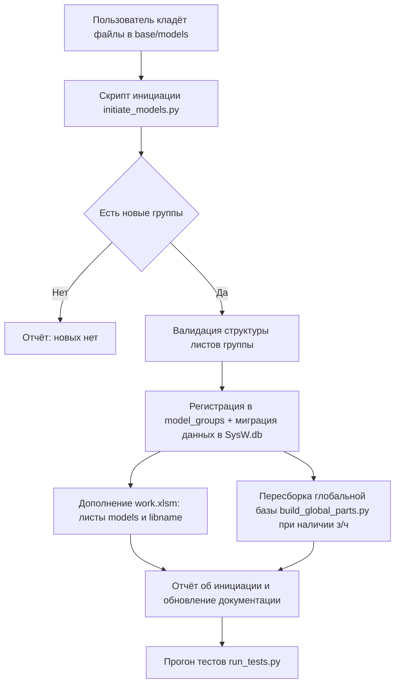

# План обновлений v1.0.15 — инициация пользовательских файлов, рефакторинг макросов, тесты и документация

> Источник задачи: `plans/promt1.0.15.md`. Приоритет — правила `.ycarules`
> ([Z2], [Z5], [U1], [U2], [G2], [K1]/[K2], [S7], [E3], [G10]).
> Статус: **ПЛАН (на согласовании)**. Роль: Architect. Код не изменяется.
> Все изменения согласовываются с пользователем; отвечать на русском.

---

## 1. Цель и ядро версии

Ядро v1.0.15 — единственная новая строка задания:
> «начать работу с реальными данными основной бизнес-логики, попутно заполняя базы и дополняя систему».

Пользователь уточнил направление: **«пользователь сам будет создавать файлы, а вы инициировать их в систему»**.
То есть проектируется **механизм приёма/инициации пользовательских файлов** (модельных книг, книг работ,
данных з/ч) в систему: регистрация новых групп в `SysW.db`, миграция данных, дополнение листов
`work.xlsm` (`models`, `libname`), пересборка глобальной базы з/ч. Попутно — доводка универсального
поиска листов, устранение дублирования чтения имени группы (DRY), стилевой рефакторинг `Mod_AutoMatch`,
проверка замечания аудита ImportVH, обновление версии, тестов и документации.

Схема конвейера:

---

## 2. Текущее состояние (подтверждено анализом)

### 2.1. Версия
- `src/modules/Mod_Constants.bas:18` — `APP_VERSION = "1.0.14"`.
- `scripts/config.py:11` — `APP_VERSION = "1.0.14"`.
- `scripts/config.ps1:7` — `$Script:AppVersion = "1.0.14"`.
- `docs/ROADMAP.md:3` — «Версия системы: 1.0.14».
- Единый скрипт обновления: `scripts/update_version.py` (правит `Mod_Constants.bas`, `config.py`,
  `config.ps1`, `README.md`, `DEVELOPER.md`, `ROADMAP.md`, `ARCHITECTURE.md`, `CHANGELOG.md`).

### 2.2. Существующие механизмы импорта/регистрации данных
| Механизм | Файл | Назначение | Готовность для v1.0.15 |
|----------|------|------------|------------------------|
| Миграция моделей → `SysW.db` | `scripts/migrate_models_to_sqlite.py` | Читает все `base/models/*.xlsm`, идемпотентно пишет в `works/parts/parts_catalog/model_works/model_parts/matlib_entries/model_groups`; регистрирует группы `INSERT OR REPLACE` (стр. 444) | ✅ готово для полной пересборки; нужен **инкрементальный режим** |
| Создание записи группы | `Mod_ModelDB.CreateModelGroupFile` → SQLite-ветка `Mod_SQLiteDB.cls:513` | `INSERT OR REPLACE INTO model_groups` | ✅ SQLite работает; Excel-ветка — заглушка (`Mod_ModelDBProvider.cls:429`) |
| Список групп | `Mod_ModelDB.GetAllModelGroups` → `GetAllModelGroups` SQLite/Excel | Collection имён групп из `model_groups` / каталога | ✅ готово |
| Сборка глобальной базы з/ч | `scripts/build_global_parts.py` | Из `parts_catalog` → `base/models/z4.xlsx` | ⚠️ скрипт есть; **z4.xlsx отсутствует** (задача R-Z4GEN отложена — нет источника 650k позиций) |
| Сборка шаблонов | `scripts/build_templates.py` | Пересборка `base/templates/` + защита/FreezePanes; `GROUPS` динамически из каталога | ✅ подхватывает новые группы автоматически |
| Импорт отчётов (входящие заказы) | `Mod_Import` (`ImportSheet`, `ImportDataToMain`, `ImportFromB2_UI`) | Импорт из `report.xlsx` / листа `{B4}M` → main | Не относится к инициации моделей |

### 2.3. Дублирование чтения имени группы из `main!$B$14` (нарушение DRY)
1. `Mod_SheetButtons.bas:33` — `Private Function GetGroupName()`.
2. `Mod_PickWork.bas:20` — `Public Function GetGroupNameFromMain()` (**вызывается TC-36**).
3. `Mod_AutoMatch.bas:49` — `Private Function GetGroupName()`.

Три независимые реализации одного действия → единый публичный хелпер.

### 2.4. Универсальный поиск листов (v1.0.12, уже реализован)
`Mod_SheetButtons.bas`: `ClassifySheet`, `ResolveGroupName`, `ExecuteSearch`, `Btn_Search_ByArticle`,
`Btn_Search_ByName`, `Btn_ClearFilter`. Требует не создания, а доводки (см. п. 5.3).

### 2.5. Замечание аудита ImportVH (docs/reestr.md:316)
Комментарий в `Mod_ButtonDispatcher.bas:76` ссылается на «{B2}M», фактически `ImportFromB2_UI`
читает `B4`/`{B4}M`. Также устаревшее упоминание «импорт из `{B2}M`» в `docs/ROADMAP.md:35`.
Код менять не нужно — исправить комментарий и доки.

### 2.6. Тесты
Набор `TC-01..TC-62` + `TC-S1..TC-S3`. Прогон v1.0.14: **Total=63, Passed=54, Failed=0, Skipped=9**.
Управление: `Mod_FullTestRunner.bas`, запуск `python scripts/run_tests.py` (пишет в `logs/test_results.log`).

### 2.7. База и модели
- `base/models/`: `4x4.xlsm`, `2170.xlsm`, `2180.xlsm`, `2190.xlsm`, `GAZ.xlsm`, `UAZ.xlsm`, `.gitkeep`.
- `base/models/z4.xlsx` — **отсутствует** (R-Z4GEN отложена).
- `base/templates/`: `model.xlsm`, `model0.xlsm`, `report0.xlsx`, `work.xlsm`, `work0.xlsm`.

---

## 3. Раздел A — Механизм инициации пользовательских файлов в систему (ядро v1.0.15)

### 3.1. Принимаемые типы файлов и их размещение
| Тип | Формат | Размещение | Что делает система |
|-----|--------|------------|--------------------|
| Модельная книга новой группы | `base/models/{GroupName}.xlsm` | `base/models/` | валидация структуры → регистрация в `model_groups` → миграция `works/model_works/model_parts/parts` |
| Обновлённая модельная книга существующей группы | `base/models/{GroupName}.xlsm` | `base/models/` | повторная миграция группы (идемпотентно) |
| Глобальная база з/ч | `base/models/z4.xlsx` (650k) | `base/models/` | **отложено (R-Z4GEN)**; при появлении файла — сборка из него через `build_global_parts.py` |
| Книги работ / данные з/ч как новые сущности | `work.xlsm` листы `spisok`/`models` | корень / работа с отчётами | дополнение листов, заполнение шапок, реестр `libname` |

> **Допущение (требует подтверждения):** каталог приёма по умолчанию — существующий `base/models/`
> (не вводим отдельный `base/incoming/`, чтобы не усложнять; согласуется с `.ycarules [S1]/[S6]`).
> При необходимости добавим staging-каталог.

### 3.2. Шаги инициации (автоматизация)
**Новый скрипт `scripts/initiate_models.py`** (или флаг `--new-only` в `migrate_models_to_sqlite.py` — решение за Code):

1. Сканировать `base/models/*.xlsm` (+ `*.xlsx`), исключая служебные (`z4.xlsx`, `~$*`, `.gitkeep`).
2. Получить зарегистрированные группы из `SysW.db` (`SELECT group_name FROM model_groups`).
3. Вычислить **новые** группы (файл есть, в БД нет) и **изменившиеся** (для повторной миграции).
4. Для каждой новой группы:
   - валидация структуры: обязателен лист `{Group}` (работы); опциональны `{Group}w` (тождества работ),
     `{Group}z4` (тождества з/ч); общий `z4` — единый каталог;
   - регистрация: `INSERT INTO model_groups(group_name)` (через тот же код, что `CreateModelGroupFile`);
   - миграция данных группы в `SysW.db` (переиспользуя `extract_works/extract_model_works/…` из
     `migrate_models_to_sqlite.py`, но **только для добавляемой группы**, без `--force` пересборки всех).
5. **Дополнение `work.xlsm`**:
   - лист `models` (список групп + цена н/ч) — обновить для новых групп (макрос или правка через скрипт);
   - лист `libname` (реестр имён) — при необходимости добавить записи (`InitLibName`/`AddWorkEntry`).
6. Если появилась глобальная база з/ч — вызвать `build_global_parts.py` (иначе пропустить).
7. Сформировать **отчёт об инициации** в `logs/initiation_report.log` (новые группы, объёмы по таблицам).

### 3.3. Что уже готово и что доработать
**Готово (переиспользуем):**
- `migrate_models_to_sqlite.py` — чтение листов и запись в БД, идемпотентность, WAL, отчёт.
- `Mod_ModelDB.CreateModelGroupFile` (SQLite-ветка) — регистрация группы в `model_groups`.
- `Mod_ModelDB.GetAllModelGroups` — список групп.
- `build_templates.py` — динамически подхватывает новые группы.
- `build_global_parts.py` — сборка глобальной базы з/ч (при наличии данных).

**Доработать / добавить:**
- `scripts/initiate_models.py` — новый оркестратор инициации (детекция новых групп + вызов миграции + дополнение `work.xlsm` + отчёт).
- `scripts/migrate_models_to_sqlite.py` — выделить функцию миграции **одной группы** (для точечного добавления новых групп без полного `--force`).
- VBA-макрос `Mod_ModelDB.InitiateModelGroup_UI(groupName)` — UI-точка регистрации новой группы прямо из Excel
  (использует `CreateModelGroupFile` + обновление листа `models`). *Опционально, по согласованию.*
- Excel-ветка `IModelDataProvider_CreateModelGroupFile` (`Mod_ModelDBProvider.cls:429`) — заглушка; фактическое создание файла группы из шаблона `base/templates/model.xlsm` — кандидат на доработку при подтверждении.

### 3.4. Ручная процедура (для пользователя)
1. Поместить модельную книгу `{GroupName}.xlsm` в `base/models/`.
2. Сообщить агенту; агент запускает инициацию (скрипт + прогон тестов).
3. Агент отчитывается о новой группе, объёмах и обновлении документации.

---

## 4. Раздел B — Рефакторинг макросов

### 4.1. Единый публичный хелпер имени группы (устранение трёх дублей)
**Целевая точка:** `Mod_Utils.bas` — `Public Function GetGroupName() As String` (читает `main!$B$14`,
с логированием ошибки, возвращает `""` при сбое).

| Файл | Было | Станет |
|------|------|--------|
| `Mod_SheetButtons.bas:33` | `Private GetGroupName()` | удалить дубль; вызывать `Mod_Utils.GetGroupName()` |
| `Mod_AutoMatch.bas:49` | `Private GetGroupName()` | удалить дубль; вызывать `Mod_Utils.GetGroupName()` |
| `Mod_PickWork.bas:20` | `Public GetGroupNameFromMain()` | **сохранить как Public-обёртку** → `Mod_Utils.GetGroupName()` (для обратной совместимости TC-36) |

**Обратная совместимость TC-36:** `Mod_FullTestRunner.bas` вызывает `Mod_PickWork.GetGroupNameFromMain`.
Оставляем функцию-обёртку (без изменения сигнатуры) → тест не ломается. Логика не меняется (только централизация).

### 4.2. Стилевой рефакторинг `Mod_AutoMatch.bas`
Перенести объявления `Dim` из середины циклов в шапку процедур:
- `AutoMatchWorks` — `Dim lw As WorkIdentity` (стр. 213), `Dim askWId As VbMsgBoxResult` (стр. 231),
  `Dim newW As WorkIdentity` (стр. 235) → в блок объявлений в начале процедуры (после стр. 118).
- `AutoMatchParts` — аналогично (проверить тело процедуры, строки 293+).
Только косметика, без изменения логики ([Z4]).

### 4.3. Проверка замечания ImportVH
Исправить устаревший комментарий:
- `Mod_ButtonDispatcher.bas:76` — «из листа {B2}M» → «из листа {B4}M» (код не менять).
- `docs/ROADMAP.md:35` и, при наличии, `docs/DEVELOPER.md`/`docs/table.md` — упоминания `{B2}M` актуализировать на `{B4}M`.

### 4.4. Доводка универсального поиска листов (без новой функциональности)
- Заменить вызовы локального `GetGroupName()` в `Mod_SheetButtons` на `Mod_Utils.GetGroupName()`
  (см. 4.1), сохранив поведение `ResolveGroupName`/`ClassifySheet`/`ExecuteSearch`.
- Проверить актуальность комментариев модуля (названия `Btn_UAZ_*`/`Btn_Parts_*` уже удалены в v1.0.12).

---

## 5. Раздел C — Версия и конфигурация

1. Выполнить `python scripts/update_version.py 1.0.15` — обновит:
   `Mod_Constants.bas` (APP_VERSION), `config.py`, `config.ps1`, `README.md`, `DEVELOPER.md`,
   `ROADMAP.md` («Версия системы»), `ARCHITECTURE.md`, добавит раздел в `CHANGELOG.md`.
2. Вручную дополнить разделы `CHANGELOG.md` и `ROADMAP.md` содержательными записями про v1.0.15
   (инициация файлов, хелпер `GetGroupName`, рефакторинг, тесты).
3. Проверить согласованность версии во всех точках (`scripts/check_docs.py --check`).

---

## 6. Раздел D — Тесты и шаблоны

### 6.1. Проверка существующих тестов
- Прогнать `python scripts/run_tests.py` после рефакторинга.
- **Ожидание:** TC-36 (GetGroupNameFromMain) остаётся PASS благодаря обёртке.
- TC-22/23/24, TC-S1..S3, TC-60..62 — PASS/SKIP по условиям окружения (SysW.db, `z4.xlsx`).

### 6.2. Новые/доработанные тесты (в `Mod_FullTestRunner.bas`)
- **TC-63** — `Mod_Utils.GetGroupName` читает `main!$B$14` (единый хелпер), группа `RunUtilsTests`/`RunPickWorkTests`.
- **TC-64** — `CreateModelGroupFile` регистрирует новую группу в `model_groups` (SQLite-ветка), группа `RunModelDBTests`.
- Актуализировать реестр в `docs/reestr.md` (перечень TC, состав групп).

### 6.3. Шаблоны
- Проверить чистоту `base/templates/` (должны остаться только `model.xlsm`, `model0.xlsm`,
  `report0.xlsx`, `work.xlsm`, `work0.xlsm`).
- `build_templates.py` при необходимости прогнать (подхватит новые группы динамически).
- `base/models/z4.xlsx` — **НЕ создавать** (R-Z4GEN отложена); при предоставлении пользователем
  глобальной базы з/ч — инициировать через `build_global_parts.py`.

---

## 7. Раздел E — Документация и очистка

### 7.1. Документация
| Файл | Действие |
|------|----------|
| `docs/DEVELOPER.md` | раздел про инициацию файлов, хелпер `GetGroupName`, актуализировать перечень TC |
| `docs/ARCHITECTURE.md` | схема инициации пользовательских файлов, роль `initiate_models.py`, `model_groups` |
| `docs/ROADMAP.md` | версия v1.0.15, цель «инициация файлов» |
| `docs/table.md` | при необходимости: структура листов, описание инициации |
| `docs/CHANGELOG.md` | раздел v1.0.15 (формат Keep a Changelog) |
| `docs/reestr.md` | отметить исправленное замечание ImportVH (стр. 316), новый хелпер и TC-63/64 |
| `README.md` / `docs/sourcecraft-guide.md` | при необходимости |

### 7.2. Очистка
- Удалить временные файлы (`__pycache__`, `*.sync-conflict-*`, `~$*.xlsm`, `_temp_*`, `*.tmp`) — [S7].
- Проверить, что не осталось устаревших упоминаний `UAZ`/`Parts` (в смысле `Btn_UAZ_*`/`Btn_Parts_*`;
  сама группа `UAZ` в `base/models/UAZ.xlsm` является реальной и не удаляется) и `{B2}M`.
- Убедиться, что `base/templates/` не содержит лишних файлов.

---

## 8. Раздел F — Коммит, пуш, слияние

1. Ветка **dev** (актуальная ветка для работы).
2. Закоммитить изменения с сообщением из плана:
   `feat: рефакторинг макросов согласно решениям пользователя, универсальный поиск листов, обновление тестов и документации`.
3. Отправить в `origin/dev` (Git через MCP Git Tools — [G10]).
4. Запросить у пользователя подтверждение на слияние `dev → main`.
5. После подтверждения — слияние.
6. Вернуться на ветку `dev`.

---

## 9. Последовательность и зависимости

```mermaid
flowchart LR
    P1[Согласование плана] --> P2[Code: рефакторинг макросов - хелпер GetGroupName]
    P2 --> P3[Code: Mod_AutoMatch style + комментарий ImportVH]
    P3 --> P4[Code: initiate_models.py + миграция одной группы]
    P4 --> P5[Code: update_version.py 1.0.15 + CHANGELOG]
    P5 --> P6[Debug: компиляция + прогон тестов TC-63/64]
    P6 --> P7[Инициация тестовой новой группы + проверка]
    P7 --> P8[Документация и очистка]
    P8 --> P9[Коммит и пуш на dev]
    P9 --> P10[Слияние dev в main после подтверждения]
    P10 --> P11[Возврат на dev]
```

**Зависимости:**
- Раздел B (рефакторинг) — перед прогоном тестов (P6), т.к. меняет VBA-код.
- Раздел A (инициация) — независим от B; использует уже готовую миграцию.
- Раздел C (версия) — в конце цикла кода, перед документацией.
- Разделы D/E — после стабилизации кода.
- Раздел F — последним, после успешного прогона тестов и очистки.

---

## 10. Критерии приёмки (Definition of Done)

- Механизм инициации пользовательских файлов спроектирован и реализован: новые модельные книги
  регистрируются в `SysW.db` (`model_groups` + данные) и дополняют `work.xlsm`.
- Три дубля чтения `main!$B$14` заменены единым `Mod_Utils.GetGroupName()`; `GetGroupNameFromMain`
  сохранена как обёртка (TC-36 проходит).
- `Mod_AutoMatch.bas` приведён к стилевому стандарту (Dim в шапке), логика не изменена.
- Комментарий ImportVH и упоминания `{B2}M` актуализированы на `{B4}M`.
- Версия во всех точках — **v1.0.15**; `CHANGELOG.md`/`ROADMAP.md` актуализированы.
- Тесты компилируются и проходят (TC-01..TC-62 + TC-S1..S3 + новые TC-63/64); прогон без новых FAIL.
- Документация актуализирована; проект очищен (без временных артефактов).
- Коммит и пуш на `dev`; текущая ветка — `dev`; слияние `dev → main` — по подтверждению пользователя.

---

## 11. Открытые вопросы / допущения (требуют подтверждения пользователя)

1. **Каталог приёма файлов:** использовать существующий `base/models/` напрямую (по умолчанию) или
   ввести staging-каталог `base/incoming/`? (п. 3.1)
2. **Объём инициации:** в первую очередь — новые модельные группы, или также обновление существующих
   групп и данных з/ч? (п. 3.2)
3. **Формат новых файлов:** всегда полные `.xlsm`-модели группы, или возможны частичные источники
   (отдельные книги работ / листы з/ч)? (п. 3.1)
4. **UI-макрос** `InitiateModelGroup_UI` — нужен ли для ручной регистрации группы из Excel, или
   достаточно скрипта `initiate_models.py`? (п. 3.3)
5. **Глобальная база з/ч** `base/models/z4.xlsx` — подтвердить, что задача R-Z4GEN остаётся отложенной
   на v1.0.15 (нет источника 650k позиций). (п. 6.3)
6. **Версия схемы БД** — остаётся `user_version = 1` (миграция новых групп не требует изменения схемы).