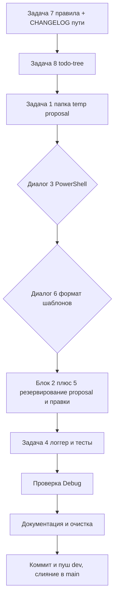

# Единый план обновлений SysW — версия 1.0.17

> **Статус:** План подготовлен (этап «Планирование», роль Architect).
> **Вход:** `plans/promt1.0.17.md` + результаты предшествующего анализа (этап «Анализ», роль Ask).
> **Выход:** единый план всех обновлений для реализации командой Code, проверки Debug и координации Orchestrator.
> **Формат:** только markdown-документ. Изменение кода и критических файлов — вне компетенции этого документа.

---

## 0. Сводка задач и порядок исполнения

| № задачи | Краткая суть | Тип | Обязательный коммит |
|----------|--------------|-----|---------------------|
| 7 | Единый запрос на все критические файлы подзадачи (в правила) | Правила системы | ✅ после Задачи 7 |
| 8 | Интеграция `gruntfuggly.todo-tree@0.0.226` | Конфигурация VS Code | ✅ после Задачи 8 |
| 1 | Папка временных скриптов/файлов | Инфраструктура (proposal) | (в составе шага) |
| 3 | Вывод PowerShell в чате (кракозябры) | Диалог с пользователем | (в составе шага) |
| 6 | Формат шаблонов целевых листов (кнопки/ячейки) | Диалог с пользователем + proposal | ✅ после Задачи 6 |
| 2 + 5 | Резервирование ключевых Excel + правило копий | Proposal → правки (общий блок) | ✅ после Задачи 5 |
| 4 | Двухпоточный логгер + переработка списка тестов | Код (VBA/скрипты) | ✅ после Задачи 4 |

**Порядок исполнения (согласно Задаче 9 промта):**
1. **Задача 7 — ПЕРВОЙ** (включая устранение расхождения путей `CHANGELOG`).
2. Задачи **1, 2+5, 3, 6, 8** — в удобном порядке (блоки 2+5 и диалоговые 3/6 — с ожиданием решений пользователя).
3. **Задача 4 — ПОСЛЕДНЕЙ** (кодовая правка логгера и тестов).
4. Далее — этапы «РАБОЧЕЙ СХЕМЫ»: Проверка → Обновление документации → Очистка → Коммит/пуш dev → слияние dev→main.

> **Важно по коммитам:** промежуточные коммиты выполняются **после Задачи 7, после Задачи 5, после Задачи 6, после Задачи 8 и после Задачи 4**. Каждый смысловой блок 1 и 3 рекомендуется закоммитить отдельно либо объединить с ближайшим обязательным коммитом — решение фиксируется Orchestrator'ом и согласуется с пользователем.

---

## 1. Предварительные консистентные правки (внутри Задачи 7)

Анализ выявил расхождение путей `CHANGELOG.md`: фактический файл — `docs/CHANGELOG.md`, тогда как в `.ycarules` ([S1], [E3]) и в CI [`vba-check.yml`](../.github/workflows/vba-check.yml) указан корневой `CHANGELOG.md`. Это приводит к провалу шага CI «Check CHANGELOG updated».

### Файлы для изменения
- `.ycarules` — раздел `[S1]` (таблица структуры проекта) и `[E3]` (список критических файлов): `CHANGELOG.md` → `docs/CHANGELOG.md`.
- `.github/workflows/vba-check.yml` — шаг «Check CHANGELOG updated»: проверять `docs/CHANGELOG.md` вместо `CHANGELOG.md`.

### Суть изменений
Привести все ссылки на changelog к фактическому пути `docs/CHANGELOG.md`.

### Порядок действий
1. Исправить `.ycarules` (две секции).
2. Исправить `vba-check.yml`.
3. Устранить при необходимости другие упоминания корневого `CHANGELOG.md` (поиском по репозиторию).

### Критерии приёмки
- Поиск `CHANGELOG.md` в `.ycarules` и CI указывает на `docs/CHANGELOG.md`.
- Шаг CI «Check CHANGELOG updated» корректно находит файл.

---

## 2. Задача 7 — Единый запрос на критические файлы подзадачи (выполняется ПЕРВОЙ)

**Суть правила (из промта):** *«Если выполнение подзадачи требует изменения критических файлов — запрос на изменение следует провести 1 раз для всех файлов подзадачи»* (пример — комбинация git-команд).

### Декомпозиция (подзадачи)
- **7.1** Сформулировать текст правила и место размещения в `.ycarules`.
- **7.2** Внести правило в `.ycarules` (раздел 5 «Управление изменениями», дополнение к `[U1]`; и/или раздел 8 `[E3]` «порядок действий»).
- **7.3** Продублировать/синхронизировать в `.sourcecraft` (секция `rules.critical` — комментарий/описание поведения) и в `docs/sourcecraft-guide.md` (описание процесса согласования).
- **7.4** Выполнить предварительные консистентные правки `CHANGELOG` (раздел 1).
- **7.5** Обновить `docs/CHANGELOG.md` (запись о правиле) — на этапе документации.
- **7.6** **Коммит** после Задачи 7.

### Файлы для изменения
- `.ycarules` (критический) — добавление правила.
- `.sourcecraft` (критический) — синхронизация описания.
- `docs/sourcecraft-guide.md` — описание процесса.
- `.github/workflows/vba-check.yml` — правка пути CHANGELOG (раздел 1).
- `docs/CHANGELOG.md` — запись (этап документации).

### Суть изменений
Ввести в правила единоразовый сводный запрос на все критические файлы в рамках подзадачи (вместо поочерёдных запросов), с одной точкой подтверждения.

### Порядок действий
1. Согласовать формулировку правила (пункт блока «Предложения к пользователю», раздел 9).
2. Внести правки в `.ycarules`, `.sourcecraft`, `vba-check.yml`, `sourcecraft-guide.md`.
3. Закоммитить.

### Критерии приёмки
- В `.ycarules` зафиксировано правило единого запроса.
- Описания в `.sourcecraft` и `sourcecraft-guide.md` согласованы.
- Пути CHANGELOG исправлены.
- Коммит выполнен.

---

## 3. Задача 8 — Интеграция `gruntfuggly.todo-tree@0.0.226`

**Суть (из промта):** интегрировать расширение Todo Tree; расширение уже скачано пользователем в VS Code.

### Декомпозиция (подзадачи)
- **8.1** Добавить расширение в рекомендации `.vscode/extensions.json`.
- **8.2** Настроить Todo Tree в `.vscode/settings.json` (проверить/дополнить существующий блок `todo-tree.*` под актуальные потребности: теги чекбоксов ROADMAP, исключения, подсветка).
- **8.3** Проверить отображение чекбоксов ROADMAP в дереве задач.
- **8.4** **Коммит** после Задачи 8.

### Файлы для изменения
- `.vscode/extensions.json` — добавить `"gruntfuggly.todo-tree"` в `recommendations`.
- `.vscode/settings.json` — блок `todo-tree.*` (уже частично присутствует, строки 60–99; донастроить при необходимости).

### Суть изменений
Расширение уже в `settings.json` имеет базовую конфигурацию (v1.0.11). Интеграция сводится к добавлению в `extensions.json` и финальной доводке настроек (проверка regex, кастомная подсветка, excludeGlobs).

### Порядок действий
1. Правка `extensions.json`.
2. Ревью/доводка блока `todo-tree.*` в `settings.json`.
3. Проверка в IDE (дерево задач по чекбоксам `docs/ROADMAP.md`).
4. Коммит.

### Критерии приёмки
- Расширение в `recommendations`.
- Todo Tree корректно подсвечивает `[ ]`/`[x]`, TODO, FIXME.
- Коммит выполнен.

---

## 4. Задача 1 — Папка временных скриптов/файлов

**Суть (из промта):** создать и интегрировать в проект папку для временных скриптов, файлов и т.д.

### Декомпозиция (подзадачи)
- **1.1** Согласовать имя и расположение папки (предложение — раздел 9).
- **1.2** Создать папку (например `_temp/`).
- **1.3** Интегрировать в систему исключений: `.gitignore`, `.codeassistantignore`, `.sourcecraft` (`rules.exclude`), при необходимости `config.py` (единый путь `TEMP_DIR`).
- **1.4** Обновить документацию (`README.md`, `docs/DEVELOPER.md`, `docs/sourcecraft-guide.md`).
- **1.5** Обновить `docs/CHANGELOG.md`.
- **1.6** Коммит (в составе ближайшего обязательного коммита или отдельно по решению Orchestrator).

### Файлы для изменения
- Новая папка `_temp/` (предлагаемое имя — см. предложения).
- `.gitignore` — добавить `_temp/`.
- `.codeassistantignore` — добавить `_temp/`.
- `.sourcecraft` — добавить `_temp/*` в `rules.exclude`.
- `scripts/config.py` — при необходимости единая константа `TEMP_DIR` (уже есть `TEMP_EXPORT_DIR`/`TEMP_IMPORT_DIR`).
- Документация: `README.md`, `docs/DEVELOPER.md`, `docs/sourcecraft-guide.md`, `docs/CHANGELOG.md`.

### Суть изменений
Единое место для временных артефактов ассистента/скриптов, не попадающее в Git и в контекст ИИ (исключения), но учитываемое системой путей.

### Критерии приёмки
- Папка создана и исключена из Git/контекста.
- Путь учтён в конфигурации скриптов.
- Документация актуализирована.

> **Открытый вопрос:** точное имя и структура папки (см. раздел 9, предложение по Задаче 1).

---

## 5. Задача 3 — Вывод PowerShell в чате SourceCraft (диалоговая)

**Суть (из промта):** исправить отображение кракозябр в выводе PowerShell в чате SourceCraft; обсудить возможность расширения выводимой информации и влияние на контекст/нейрокредиты.

### Декомпозиция (подзадачи)
- **3.1** Проанализировать причину кракозябр (кодировка вывода `pwsh` → чат; связь с `[K3]`).
- **3.2** Подготовить и представить пользователю варианты исправления (раздел 9).
- **3.3** По решению — внести правки в `.vscode/settings.json` (профиль терминала, кодировка), при необходимости `scripts/config.ps1`/`config.py`.
- **3.4** Проверить вывод.
- **3.5** Обновить `docs/CHANGELOG.md` и, при необходимости, `docs/sourcecraft-guide.md`.

### Файлы для изменения
- `.vscode/settings.json` — параметры терминала/кодировки (профиль `SourceCraft`, `$OutputEncoding`/`chcp 65001`).
- `scripts/config.ps1` — при необходимости установка кодировки вывода (`[Console]::OutputEncoding`, `$OutputEncoding`).
- `docs/sourcecraft-guide.md`, `docs/CHANGELOG.md`.

### Суть изменений
Обеспечить корректную UTF-8 передачу кириллицы из PowerShell в чат SourceCraft.

### Критерии приёмки
- Кириллица в выводе `pwsh` отображается корректно.
- Принято решение по расширению выводимой информации (влияние на контекст/нейрокредиты задокументировано).

> **Диалоговая задача:** правки выполняются только после выбора пользователем варианта из раздела 9.

---

## 6. Задача 6 — Формат шаблонов целевых листов (диалоговая + proposal)

**Суть (из промта):** совместно с пользователем разработать формат шаблонов для целевых листов, включая кнопки и формат ячеек. Представить предложение.

### Декомпозиция (подзадачи)
- **6.1** Подготовить proposal-документ формата целевых листов (кнопки, формат ячеек, зоны ввода/защиты) с опорой на текущие шаблоны `base/templates/` и `docs/table.md` (раздел «Рабочая панель для шаблонов»).
- **6.2** Представить пользователю, собрать решения.
- **6.3** По решениям — внести правки в шаблоны `base/templates/` (`work.xlsm`, `model.xlsm`, `work0.xlsm`, `model0.xlsm`, `report0.xlsx`).
- **6.4** Синхронизировать логику защиты: `scripts/template_protection.py`, `scripts/apply_protection_templates.py` (зоны `WORK_MAIN_EDIT`, `WORK_LIST_EDIT`, `MODEL_DATA` и т.п.), при необходимости `scripts/build_templates.py`.
- **6.5** Актуализировать `docs/table.md`, `docs/ARCHITECTURE.md` (раздел «Защита листов шаблонов»).
- **6.6** Обновить `docs/CHANGELOG.md`.
- **6.7** **Коммит** после Задачи 6.

### Файлы для изменения
- `base/templates/*.xlsm`, `base/templates/*.xlsx` (критические, `base/`).
- `scripts/template_protection.py`, `scripts/apply_protection_templates.py`, `scripts/build_templates.py`.
- `docs/table.md`, `docs/ARCHITECTURE.md`, `docs/CHANGELOG.md`.

### Суть изменений
Зафиксировать и реализовать единый формат целевых листов (кнопки + оформление ячеек + защита/зоны редактирования) для шаблонов и пересборки.

### Критерии приёмки
- Proposal согласован с пользователем.
- Шаблоны пересобраны по утверждённому формату.
- Логика защиты синхронизирована; документация актуализирована.
- Коммит выполнен.

> **Диалоговая задача:** не начинать правки шаблонов до утверждения proposal.

---

## 7. Блок «Задача 2 + Задача 5» — Резервирование ключевых Excel (общий блок)

**Суть (из промта):**
- Задача 2: внести во все правила — перед изменением ключевых файлов Excel **всегда делать копию**.
- Задача 5: разработать схему резервирования, обновления ключевых Excel и шаблонов перед редактированием кодовой части; включить библиотеку запретов редактирования; представить предложение.

Задачи объединены по общности темы (анализ, п.6).

### Декомпозиция (подзадачи)
- **2/5.1** Подготовить proposal схемы резервирования (какие файлы копировать, куда, когда; связь с уже существующим этапом бэкапа в `build_all.py`) и перечень «библиотеки запретов редактирования».
- **2/5.2** Согласовать с пользователем (раздел 9).
- **2/5.3** Внести правило копий во все правила (`.ycarules` — например дополнение к `[Z]`/`[U]`, `.sourcecraft`, `docs/sourcecraft-guide.md`).
- **2/5.4** Реализовать/расширить резервирование (расширение этапа бэкапа `build_all.py` на `base/templates/*` и `base/models/*`, при необходимости отдельный скрипт резервирования).
- **2/5.5** Реализовать «библиотеку запретов редактирования» (перечень файлов, блокируемых от прямой правки; вероятно константы/реестр + проверка в скриптах).
- **2/5.6** Обновить `docs/CHANGELOG.md`, документацию.
- **2/5.7** **Коммит** после Задачи 5.

### Файлы для изменения
- `.ycarules`, `.sourcecraft`, `docs/sourcecraft-guide.md` — правило копий.
- `scripts/build_all.py` — расширение этапа бэкапа (этап 1 уже копирует `work.xlsm`/`SysW.db` в `_backup/`); добавить шаблоны/модели.
- Возможно новый скрипт резервирования, например `scripts/backup_key_files.py`.
- «Библиотека запретов»: `src/modules/Mod_Constants.bas` (константы перечня критических файлов) и/или `scripts/config.py`; реализация проверки.
- `docs/DEVELOPER.md`, `docs/ARCHITECTURE.md`, `docs/CHANGELOG.md`.

### Суть изменений
Единая схема: перед любым редактированием ключевых Excel (work.xlsm, report.xlsx, base/templates, base/models) создаётся копия; перечень «запрещённых к прямой правке» файлов централизован и проверяется скриптами.

### Критерии приёмки
- Правило копий внесено во все правила.
- Схема резервирования согласована и реализована.
- Библиотека запретов редактирования реализована и проверена.
- Коммит после Задачи 5 выполнен.

> **Открытый вопрос:** состав «библиотеки запретов редактирования» и способ хранения (константы VBA vs конфиг vs БД) — требует решения (раздел 9).

---

## 8. Задача 4 — Двухпоточный логгер + переработка списка тестов (выполняется ПОСЛЕДНЕЙ)

**Суть (из промта):**
1. Модифицировать логгер так, чтобы выводились **2 лога**:
   - общие системные;
   - расширенные от тестов (включая ошибки VBA).
2. Переработать список тестов исходя из актуальной версии системы.

**После этой задачи выполнить коммит.**

### Декомпозиция (подзадачи)
- **4.1** Проанализировать текущий логгер (`Mod_Logger` пишет в `logs/log.txt`; Python `run_tests.py` — в `logs/test_results.log`; `WriteResultsToSheet`/`GetTestResults` — в `Z1`).
- **4.2** Модифицировать `Mod_Logger.bas`:
  - общий системный лог (текущее поведение, `log.txt`);
  - расширенный тестовый лог (`test_results.log`) с уровнями и ошибками VBA.
- **4.3** Модифицировать `Mod_FullTestRunner.bas`:
  - писать детальный тестовый лог (включая ошибки VBA) в расширенный лог;
  - переработать список тестов под актуальную версию (актуализировать заголовки «TC-01..TC-62», фактические группы/номера TC-01..TC-64 + TC-S1..TC-S3).
- **4.4** Синхронизировать пути/константы: `src/modules/Mod_Constants.bas` (при необходимости константы путей логов), `scripts/config.py` (`TEST_LOG_FILE` уже есть), `scripts/run_tests.py`, `scripts/build_all.py`.
- **4.5** Актуализировать реестр и документацию: `docs/reestr.md` (перечень тестов), `docs/DEVELOPER.md` (раздел Mod_Logger/Mod_FullTestRunner), `docs/CHANGELOG.md`.
- **4.6** Прогнать тесты (этап Проверка).
- **4.7** **Коммит** после Задачи 4.

### Файлы для изменения
- `src/modules/Mod_Logger.bas` (VBA).
- `src/modules/Mod_FullTestRunner.bas` (VBA).
- `src/modules/Mod_Constants.bas` (VBA, при необходимости).
- `scripts/config.py`, `scripts/run_tests.py`, `scripts/build_all.py`.
- `docs/reestr.md`, `docs/DEVELOPER.md`, `docs/CHANGELOG.md`.

### Суть изменений
Разделить системное и тестовое логирование; расширить тестовый лог ошибками VBA; привести список тестов в соответствие фактическому покрытию актуальной версии (v1.0.17).

### Порядок действий (VBA)
1. Все правки `.bas`/`.cls` — **только через `impVBA.py` / `export_vba.py`** (`[Z5]`, `[K2]`): править исходники в `src/`, затем импортировать и, при необходимости, экспортировать для верификации.
2. Синхронизировать конфиги и скрипты.
3. Прогнать `scripts/run_tests.py` / `scripts/build_all.py`.
4. Закоммитить.

### Критерии приёмки
- Существуют 2 отдельных лога (системный и тестовый расширенный).
- Тестовый лог содержит ошибки VBA.
- Список тестов соответствует фактическому покрытию актуальной версии.
- Тесты проходят (Total/Passed/Skipped согласованы с реестром).
- Коммит после Задачи 4 выполнен.

---

## 9. Блок «Предложения к пользователю» (для получения решений Orchestrator'ом)

Здесь сгруппированы решения, которые требуют выбора пользователя. Каждое — с рекомендуемым вариантом.

### По Задаче 1 (папка временных файлов)
- **Вариант А (рекомендуется):** единая папка `_temp/` в корне проекта для всех временных артефактов ассистента и скриптов; исключить из Git/контекста; учесть в `config.py` как `TEMP_DIR`.
- **Вариант Б:** использовать существующие `_temp_export/` и `_temp_import/` (расширить назначение) без новой папки.
- **Вариант В:** папка внутри `scripts/_temp/`.
- **Решение пользователя:** выбрать вариант и имя папки.

### По блоку «Задача 2 + Задача 5» (резервирование + правило копий)
- **Рекомендация:** правило копий внести в `.ycarules` как дополнение к `[Z]`/`[U]` («перед изменением ключевых файлов Excel всегда создавать копию»); схему резервирования реализовать расширением этапа 1 `build_all.py` (добавить `base/templates/*` и `base/models/*`) либо отдельным скриптом `scripts/backup_key_files.py`.
- **Открытый вопрос по «библиотеке запретов редактирования»:**
  - Вариант А (рекомендуется): перечень критических/запрещённых файлов в `scripts/config.py` + проверка в скриптах сборки.
  - Вариант Б: константы в `Mod_Constants.bas` (единый источник и для VBA, и для проверок).
  - Вариант В: хранение в БД `SysW.db`.
  - **Решение пользователя:** выбрать способ хранения и состав перечня.

### По Задаче 3 (вывод PowerShell)
- **Вариант А (рекомендуется):** в профиле терминала `SourceCraft` (`.vscode/settings.json`) установить UTF-8 для вывода (`chcp 65001` / `[Console]::OutputEncoding`), а в `scripts/config.ps1` задать `$OutputEncoding = [Console]::OutputEncoding = [System.Text.UTF8Encoding]::new()`.
- **Вариант Б:** только настройки VS Code без правки `config.ps1`.
- **Открытый вопрос:** «расширение выводимой информации и влияние на контекст/нейрокредиты» — требуется оценка; рекомендуемый ответ: расширение возможно, но увеличивает токены/контекст; предложить точечное расширение (например, только для тестов и сборки). **Решение пользователя.**

### По Задаче 6 (формат шаблонов)
- **Рекомендация:** подготовить proposal на основе текущих шаблонов `base/templates/` и `docs/table.md` (зоны ввода/защиты, кнопки, FreezePanes A4), затем утвердить и пересобрать шаблоны через `build_templates.py` + `apply_protection_templates.py`.
- **Открытые вопросы:** набор и расположение кнопок на целевых листах; оформление ячеек (цвета/шрифты/границы); список листов, охваченных шаблонами. **Решение пользователя.**

### По Задаче 4 (логгер)
- **Рекомендация:** системный лог `logs/log.txt` (текущий) + расширенный тестовый `logs/test_results.log` с уровнями и ошибками VBA; переработка списка тестов под фактическое покрытие (TC-01..TC-64 + TC-S1..TC-S3).
- **Открытый вопрос:** названия файлов логов и уровень детализации тестового лога. **Решение пользователя.**

### По Задаче 8 (todo-tree)
- **Рекомендация:** добавить `gruntfuggly.todo-tree` в `extensions.json` и донастроить блок `todo-tree.*` в `settings.json` (regex/подсветка уже есть). Версия расширения 0.0.226 фиксируется в `extensions.json` при необходимости через `version`.
- **Решение пользователя:** принять настройки как есть или уточнить состав тегов/исключений.

### По версии системы
- **Рекомендация:** бамп версии `1.0.15 → 1.0.17` скриптом `python scripts/update_version.py 1.0.17` на этапе документации (обновляет `Mod_Constants.bas`, `config.py`, `config.ps1`, `README.md`, `DEVELOPER.md`, `ROADMAP.md`, `ARCHITECTURE.md`, `CHANGELOG.md`).
- **Решение пользователя:** подтвердить бамп до `1.0.17`.

---

## 10. Открытые вопросы (не изобретать решения за пользователя)

1. Точное имя/расположение папки временных файлов (Задача 1).
2. Состав и способ хранения «библиотеки запретов редактирования» (Задача 5).
3. Способ исправления кракозябр PowerShell и объём расширения вывода (Задача 3).
4. Формат целевых листов: набор кнопок, оформление ячеек, перечень листов (Задача 6).
5. Имена/детализация тестового лога (Задача 4).
6. Целевой набор тестов после переработки (Задача 4).
7. Порядок коммитов задач 1 и 3 (отдельные vs объединённые) — решение Orchestrator/пользователя.

---

## 11. Этапы «РАБОЧЕЙ СХЕМЫ»

### 1. Анализ (роль Ask) — ✅ выполнено
Проведён; выводы отражены в этом плане.

### 2. Планирование (роль Architect) — настоящий документ
Единый план всех обновлений; декомпозиция; порядок; предложения пользователю.

### 3. Исполнение (роль Code)
Реализация Задач 1, 2+5, 3, 4, 6, 7, 8 строго по плану. VBA-правки — через `impVBA.py`/`export_vba.py`.

### 4. Проверка (роль Debug)
- Прямой диагностический прогон с автозакрытием диалогов (`SilenceMsgBox` уже поддерживается; `run_tests.py`/`run_p1_business_test.py` работают через COM без модальных окон).
- Прогон `scripts/build_all.py` (полный конвейер) и `scripts/run_tests.py`.
- Проверка двух логов (Задача 4).

### 5. Координация (роль Orchestrator)
- Контроль todo, порядка выполнения, ожидания решений пользователя по диалоговым задачам, промежуточных коммитов.

### 6. Обновление документации
Обновить: `docs/DEVELOPER.md`, `docs/ARCHITECTURE.md`, `docs/ROADMAP.md`, `docs/table.md`, `docs/CHANGELOG.md`; при необходимости `README.md` и `docs/sourcecraft-guide.md`. Бамп версии до `1.0.17` (`update_version.py`).

### 7. Очистка системы (`[S7]`)
- Удалить временные файлы (`__pycache__`, `*.sync-conflict-*`, `~$*.xlsm`, содержимое `_temp/` при наличии).
- Проверить отсутствие устаревших упоминаний.
- Убедиться, что `base/templates/` чистые и рабочие.

### 8. Коммит, пуш, слияние
- Закоммитить изменения в ветку `dev`.
- Отправить в `origin/dev`.
- Запросить у пользователя подтверждение слияния `dev → main`.
- После подтверждения выполнить слияние и вернуться на `dev`.

---

## 12. Критерии приёмки (общие)

- Все решения пользователя из раздела 9 применены (или явно согласованы).
- Документация актуализирована; версия `1.0.17`.
- Шаблоны `base/templates/` и модельные книги настроены по требованиям (Задача 6).
- Два лога работают; список тестов актуален; тесты проходят (Задача 4).
- Правило копий и резервирование действуют (Задача 2+5); правило единого запроса внесено (Задача 7).
- Todo Tree интегрирован (Задача 8).
- Проект очищен; коммит/пуш выполнены; текущая ветка — `dev`; слияние с `main` — по запросу пользователя.