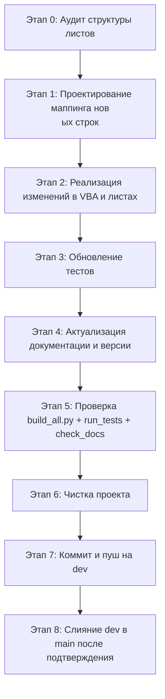

# Задание для SourceCraft `plans/promt1.0.9.md`

**!!!ВАЖНО: `.ycarules` имеет высший приоритет!!!

3 [🏗️ Architect](#️-architect) - план исправления/обновления на основе анализа
4 [💻 Code](#-code) - исправление/обновление по плану
2 [❓ Ask](#-ask) - составить анализ
1 [🪲 Debug](#-debug) - проверить исправления/обновления
0 [🪃 Orchestrator](#-orchestrator) - контроль, координация работы**

## Цель

Следующая версия проекта SysW — **v1.0.9**: унификация структуры всех листов книги `work.xlsm`.
Во всех листах данные должны начинаться **не ранее 4-й строки**. Строки 1–2 — технические
(резерв под будущую логику), строка 3 — заголовки столбцов. Первые три строки закрепляются
как область (Freeze Panes), чтобы заголовки всегда оставались видимыми при прокрутке.
Вносятся соответствующие изменения в VBA-код, тесты, скрипты и документацию.

Особое внимание: **на листе `main` ячейка ввода номера заказа переносится с B2 на B4**.
Вся шапка смещается на +2 строки; номер заказа теперь вводится в B4, а не в B2.

## Список задач

1. **АУДИТ ТЕКУЩЕЙ СТРУКТУРЫ ЛИСТОВ:**

   - Для каждого листа (`main`, `spisok`, `models`, `work`, `z4`, при необходимости
     другие) определить текущее расположение данных и заголовков.
   - Зафиксировать отклонения от целевого стандарта: данные должны начинаться со строки 4,
     заголовки — строка 3, строки 1–2 не содержат значимых данных.
   - Составить таблицу соответствия «лист → текущая строка данных → целевая строка данных».
2. **РЕФАКТОРИНГ ЛИСТОВ И VBA-КОДА:**

   - Для каждого листа изменить структуру так, чтобы:
     - строки 1–2 пустые (или содержат только технические пометки, не влияющие на работу);
     - строка 3 — заголовки столбцов (русские названия/латинские имена);
     - данные начинаются со строки 4.
   - Обновить все жёсткие ссылки на строки в VBA-модулях:
     - `Mod_OrderHeader`: номер заказа читается из **B4** (ранее B2), шапка заполняется
       начиная с **B4** (а не B3). Уточнить точный маппинг: B4 – номер заказа,
       B5 – номер заказ-наряда и т.д. (согласно утверждённой логике).
     - `Mod_Import`: целевые строки для импорта работ/запчастей на листе `main`
       начинаются со строки 4 (вместо 2 или 3).
     - `Mod_SheetOps`: процедуры очистки не должны затирать строки 1–3.
     - `Mod_MainButtons`, `Mod_ButtonDispatcher`, `Mod_Constants` — обновить константы
       начальных строк (`*_START_ROW`, `*_HEADER_ROW` и т.п.) и ссылки.
     - `Лист2_main.cls`: обработчик `Worksheet_Change` должен реагировать на изменение
       ячейки **B4** (не B2) и вызывать `FillHeaderFromOrder` с новым значением.
   - Закрепить область: `ActiveWindow.FreezePanes = True` с точкой фиксации на строке 4
     (или через код при активации листа). Для каждого листа прописать в соответствующем
     классе листа (`Лист2_main`, `Sheet_work`, `Sheet_z4` и др.) событие
     `Worksheet_Activate`, устанавливающее закрепление.
3. **ИСПРАВЛЕНИЕ ТЕСТОВ ПОД НОВУЮ СТРУКТУРУ:**

   - Обновить ожидаемые диапазоны в `Mod_FullTestRunner` (TC-01..TC-50), чтобы они
     соответствовали данным начиная со строки 4.
   - Проверить, что все тесты, связанные с чтением/записью ячеек, используют новые
     начальные строки.
   - Критерий: `run_tests.py` → `Failed=0`; SKIP допускается только по отсутствию данных.
4. **АКТУАЛИЗАЦИЯ СКРИПТОВ И КОНСТАНТ:**

   - `scripts/config.py`, `scripts/config.ps1`, `scripts/impVBA.py`, `scripts/export_vba.py`
     — проверить, что пути/параметры не зависят от конкретных строк листов (если
     зависят, исправить).
   - `Mod_Constants` — ввести единые константы: `MAIN_HEADER_ROW = 3`,
     `MAIN_DATA_START_ROW = 4`; аналогично для других листов, если требуется.
   - Убедиться, что автоподбор (`Mod_AutoMatch`), ручной подбор (`Mod_PickWork`) и
     `Mod_ModelDB` используют корректные начальные строки (обычно 4).
5. **ДОКУМЕНТАЦИЯ И ВЕРСИЯ:**

   - Обновить `docs/table.md`, `docs/ARCHITECTURE.md`, `docs/DEVELOPER.md`,
     `docs/CHANGELOG.md` с описанием новой структуры листов (данные с 4-й строки,
     заголовки — 3-я, закрепление).
   - Поднять версию до **1.0.9** через `scripts/update_version.py` (или вручную
     синхронно во всех местах: `Mod_Constants`, `config.py`, `config.ps1`, README и т.д.).
   - Выполнить `scripts/check_docs.py --check`, добиться `exit 0`.
6. **ЧИСТОТА ПРОЕКТА И GIT:**

   - Удалить временные и мусорные файлы, резервные копии, неиспользуемые модули/скрипты
     (согласовать с пользователем).
   - Закоммитить изменения на ветке `dev`, убедиться, что `.gitignore` актуален.
   - После подтверждения пользователя выполнить слияние `dev → main`.

## Итоговая последовательность

