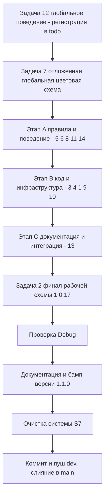

# Единый план обновлений SysW — версия 1.1.0

> **Статус:** План подготовлен (этап «Планирование», роль Architect).
> **Вход:** [`plans/promt1.1.0.md`](promt1.1.0.md) (15 задач) + выводы предшествующего анализа (этап «Анализ», роль Ask).
> **Выход:** единый план всех обновлений для реализации командой Code, проверки Debug и координации Orchestrator.
> **Формат:** только markdown-документ. Изменение кода и критических файлов — вне компетенции этого документа ([U1], [E3]).
> **Высший приоритет:** `.ycarules` ([Z2], [Z5], [U1], [U2], [G2], [K1]/[K2], [S7], [E3]).

---

## 0. Сводка задач, порядок исполнения и обязательные коммиты

| № задачи | Краткая суть | Тип | Коммит/пуш |
|----------|--------------|-----|-----------|
| **12** | Глобальное поведение агентов: «вместо плана — регистрация задачи в todo» (выполняется **ПЕРВОЙ**) | Правила/поведение | ✅ коммит + пуш |
| **7** | Цветовая схема листов — вынести в **отложенную глобальную задачу**, зарегистрировать в todo (**второй**, без исполнения кодом) | Отложенная глобальная | ✅ коммит/пуш |
| **5** | Внести во все правила: «если путь заблокирован — запрос пользователю на снятие блокировки» | Правила | (в составе блока) |
| **6** | Расширить правило `[U4]`/новое: ключевые файлы (скрипты, модули) + последовательности команд; запустить в системе | Правила | ✅ коммит + пуш |
| **8** | Анализ актуальности миграции на Ubuntu → отложенная глобальная задача в todo | Отложенная глобальная | возможен коммит |
| **11** | Добавлять команду мониторинга pwsh к длительным процессам | Правила/инфраструктура | возможен коммит |
| **14** | Прокомментировать пользователю настройку вывода лога процессов без контекста ИИ | Диалог с пользователем | — |
| **3** | Модернизировать версионность до формата **X.Y.Z.W** (`update_version.py`) | Код/инфраструктура | возможен коммит |
| **4** | Синхронизировать todo ↔ CHANGELOG ↔ git-коммиты (единая версия) | Код/документация | ✅ коммит |
| **1** | Логгер «2 лога» (системный + тестовый расширенный с ошибками VBA) + переработка списка тестов | Код (VBA) | ✅ коммит |
| **9** | Скрипт очистки системы (запуск вручную через терминал VSCode) | Код/инфраструктура | возможен коммит |
| **10** | В схеме резервирования — указание кол-ва хранимых бэкапов | Код/инфраструктура | возможен коммит |
| **13** | Интегрировать `docs/reestr.md` в общую документацию с удалением | Документация/интеграция | ✅ коммит + пуш |
| **2** | Завершить незакрытые этапы «РАБОЧЕЙ СХЕМЫ» 1.0.17 | Финал | ✅ пуш + слияние |
| **15** | Порядок: все задачи в todo; 12 → 7; остальные произвольно; затем РАБОЧАЯ СХЕМА | Оркестрация | — |

**Фиксированный порядок (согласно Задаче 15 промта и требованиям):**
1. **Задача 12** — ПЕРВОЙ (глобальное поведение агентов, запуск в системе).
2. **Задача 7** — ВТОРОЙ (регистрация отложенной глобальной задачи в todo, **без** исполнения кодом; требует диалога Architect+пользователь).
3. Задачи **1–6, 8–11, 13–15** — в любом удобном порядке (рекомендации — внутри блоков ниже).
4. Далее — этапы «РАБОЧЕЙ СХЕМЫ»: Проверка (Debug) → Обновление документации → Очистка → Коммит/пуш `dev` → слияние `dev → main`.



> **Важно по коммитам:** обязательные промежуточные коммиты/пуши — **после Задач 1, 4, 6, 7, 12, 13**; возможны после 8, 9, 10. Каждый смысловой блок рекомендуется коммитить отдельно — решение фиксирует Orchestrator и согласует с пользователем ([U4] — единый запрос на критические файлы подзадачи).

---

## 1. Контекст текущего состояния (ключевые факты)

1. Версия во всех точках **v1.0.15**: `src/modules/Mod_Constants.bas` (`APP_VERSION = "1.0.15"`), `scripts/config.py` (`APP_VERSION = "1.0.15"`), `scripts/config.ps1` (`$Script:AppVersion`), заголовки `docs/*`. В `docs/CHANGELOG.md` уже есть раздел `[Unreleased]` с задокументированными изменениями 1.0.17. Нужен бамп до **1.1.0** на этапе документации.
2. `scripts/update_version.py` поддерживает **только формат X.Y.Z** (`VERSION_RE = ^\d+\.\d+\.\d+$`, сообщения «Ожидается формат X.Y.Z»). Для версии X.Y.Z.W требуется доработка (Задача 3).
3. Из 1.0.17 готово и закоммичено: папка `_temp/`, правило `[U5]`, кодировка PowerShell, схема резервирования + `PROTECTED_FILES`, правило `[U4]`, todo-tree. **Не выполнено:** логгер «2 лога» + переработка тестов (Задача 1 1.1.0) и незакрытые этапы РАБОЧЕЙ СХЕМЫ (Задача 2 1.1.0).
4. `docs/reestr.md` используется перекрёстно (ROADMAP/ARCHITECTURE/DEVELOPER/README/table/sourcecraft-guide) — интеграция+удаление (Задача 13) потребует правки ссылок и согласования по `[Z2]`.
5. Все VBA-правки — только через `impVBA.py` / `export_vba.py` (`[Z5]`, `[K2]`).
6. Правки `.ycarules`/`.sourcecraft` сами являются правками критических файлов (`[E3]`) — требуют плана (данный документ) и одобрения.
7. Отложенные глобальные задачи: Задача 7 (цветовая схема), Задача 8 (Ubuntu-миграция). Зарегистрировать в todo (раздел §11 `docs/ROADMAP.md`).

---

## 2. Этап A — Правила и поведение (Задачи 12, 7, 5, 6, 8, 11, 14)

### 2.1 Задача 12 — Глобальное поведение агентов: «вместо плана — регистрация в todo» (выполняется ПЕРВОЙ)

**Суть (из промта):** внести изменение в глобальное поведение агентов: *«Вместо создания плана на промт — необходимо регистрация задачи в todo»*. Запустить в системе. После — коммит/пуш.

> **Важно:** настоящий план-документ создаётся по явному указанию пользователя ([G1] — ввод пользователя приоритетнее). Задача 12 фиксирует будущее правило: при новых промтах вместо полноценного плана задачи регистрируются в todo (единый источник — `docs/ROADMAP.md` §11).

#### Файлы для изменения (критические, `[E3]`, `[U4]`)
- `.ycarules` — раздел 5 «Управление изменениями» (`[U1]`), раздел 9 «Шаблон промта пользователя» (инструкция для агента), при необходимости раздел 1 «Оркестратор и роли» (`[O1]`) и раздел 2 (`[G]`).
- `.sourcecraft` — секция `rules`/`customInstructions` (описание поведения).
- `docs/sourcecraft-guide.md` — раздел «Рабочий процесс → Создание плана» (переформулировать: «Создание плана или регистрация задачи в todo»).
- `docs/CHANGELOG.md` — запись.

#### Суть изменений
Зафиксировать правило: при постановке промта агент регистрирует задачи в todo (чекбоксы `[ ] **ID**` в `docs/ROADMAP.md` §11), а полноценный план создаётся только при явном требовании пользователя. Это меняет поведение всех ролей (Architect/Code/Debug/Orchestrator).

#### Порядок действий
1. Согласовать формулировку правила с пользователем.
2. Внести правки в `.ycarules`, `.sourcecraft`, `docs/sourcecraft-guide.md` (единый запрос по `[U4]`).
3. Продублировать действие в `docs/ROADMAP.md` §11 (добавить задачу-маркер о новом поведении).
4. Обновить `docs/CHANGELOG.md`.
5. **Коммит + пуш** (обязательно).

#### Критерии приёмки
- Правило внесено во все правила/инструкции.
- Задачи промта 1.1.0 зарегистрированы в `docs/ROADMAP.md` §11 как чекбоксы.
- Коммит и пуш выполнены.

---

### 2.2 Задача 7 — Цветовая схема листов (отложенная глобальная задача; выполняется ВТОРОЙ)

**Суть (из промта):** Architect совместно с пользователем разработать цветовую схему листов, формат ячеек и другие дизайнерские аспекты. **Вынести в отдельную глобальную отложенную задачу.** После — коммит/пуш.

> **Здесь, на этапе планирования, задача НЕ исполняется кодом** — только регистрируется как отложенная глобальная задача в todo. Проработка цветовой схемы требует отдельного диалога Architect+пользователь (вынесено в раздел 8).

#### Файлы для изменения (критические)
- `docs/ROADMAP.md` §11 — добавить отложенную глобальную задачу (например, `- [ ] **G-COLOR** · глобальная · отложенная · без условий — цветовая схема листов, формат ячеек и дизайнерские аспекты`).
- `docs/CHANGELOG.md` — запись о регистрации отложенной задачи.

#### Суть изменений
Регистрация глобальной отложенной задачи в едином источнике задач (`docs/ROADMAP.md` §11) без внесения изменений в код/шаблоны.

#### Порядок действий
1. Сформулировать ID и описание отложенной глобальной задачи (см. раздел 8, предложение по Задаче 7).
2. Добавить строку-чекбокс в `docs/ROADMAP.md` §11 (раздел «Глобальные цели верхнего уровня»).
3. Обновить `docs/CHANGELOG.md`.
4. **Коммит + пуш** (обязательно).

#### Критерии приёмки
- Отложенная глобальная задача зарегистрирована в `docs/ROADMAP.md` §11.
- Изменений кода/шаблонов нет.
- Коммит и пуш выполнены.

---

### 2.3 Задача 5 — Правило: «если путь заблокирован — запрос пользователю на снятие блокировки»

**Суть (из промта):** внести во все правила и инструкции системы: *«Если путь к объекту заблокирован, приоритет — запрос к пользователю на снятие блокировки»*.

#### Файлы для изменения (критические)
- `.ycarules` — раздел 3 «Запреты и ограничения» (дополнение к `[Z2]`/`[E1]`) либо новый пункт в разделе 2 (`[G]`).
- `.sourcecraft` — секция `rules` (комментарий/поведение при заблокированном пути).
- `docs/sourcecraft-guide.md` — описание процесса.
- `docs/CHANGELOG.md` — запись.

#### Суть изменений
Зафиксировать приоритетное правило: при обращении к объекту по заблокированному пути (исключение `[E1]`, временные/защищённые файлы) агент не пытается обойти блокировку, а запрашивает у пользователя разрешение на снятие блокировки.

#### Порядок действий
1. Согласовать формулировку (раздел 8).
2. Внести правки в `.ycarules`, `.sourcecraft`, `docs/sourcecraft-guide.md` (единый запрос `[U4]`).
3. Обновить `docs/CHANGELOG.md`.
4. Коммит — в составе ближайшего обязательного коммита (после 12 или 7) либо отдельно по решению Orchestrator.

#### Критерии приёмки
- Правило присутствует во всех правилах и инструкциях.
- Поведение описано и задокументировано.

---

### 2.4 Задача 6 — Расширение правила `[U4]`: ключевые файлы (скрипты/модули) + последовательности команд; запустить в системе

**Суть (из промта):** добавить в правило `[U4]` или создать новое: перечень ключевых файлов системы (скрипты, модули) и выполнение последовательностей команд (python, ps и др.). **Запустить в системе.** После — коммит и пуш.

> Текст `[U4]` уже присутствует в `.ycarules` (раздел 5) и `.sourcecraft`. Задача требует его расширения на: (а) ключевые файлы `scripts/*` и `src/modules/*`; (б) выполнение последовательности команд одним блоком.

#### Файлы для изменения (критические)
- `.ycarules` — расширение `[U4]` (раздел 5) и/или `[E3]` (перечень критических файлов — добавить `scripts/`, `src/`).
- `.sourcecraft` — секция `rules.critical` (добавить `scripts/*`, `src/modules/*`) и описание.
- `docs/sourcecraft-guide.md` — синхронизация.
- `docs/CHANGELOG.md` — запись.

#### Суть изменений
Расширить правило единого запроса: (1) перечень критических файлов охватывает скрипты и модули; (2) групповая последовательность команд (python/ps и др.) покрывает все файлы подзадачи за один вызов.

#### Порядок действий
1. Согласовать формулировку и состав перечня ключевых файлов (раздел 8).
2. Внести правки в `.ycarules`, `.sourcecraft`, `docs/sourcecraft-guide.md`.
3. Проверить применение правила на практике («запустить в системе» — убедиться, что правило согласуется с реальными процессами).
4. Обновить `docs/CHANGELOG.md`.
5. **Коммит + пуш** (обязательно).

#### Критерии приёмки
- Правило `[U4]` расширено на ключевые файлы и последовательности команд.
- Перечень `rules.critical` в `.sourcecraft` дополнен `scripts/`, `src/`.
- Коммит и пуш выполнены.

---

### 2.5 Задача 8 — Анализ актуальности миграции на Ubuntu (отложенная глобальная задача)

**Суть (из промта):** провести анализ актуальности задачи *«Создать и поместить в todo отложенную задачу по параллельной разработке/миграции системы на Ubuntu XX.X.X»*. Вынести в отдельную глобальную отложенную задачу. После — возможен коммит (при необходимости).

#### Файлы для изменения (критические)
- `docs/ROADMAP.md` §11 — добавить отложенную глобальную задачу (например, `- [ ] **G-UBUNTU** · глобальная · отложенная · без условий — анализ и/или параллельная разработка/миграция системы на Ubuntu`).
- `docs/CHANGELOG.md` — запись (при необходимости).

#### Суть изменений
Регистрация отложенной глобальной задачи в todo после анализа актуальности. Анализ проводится Architect/Ask совместно с пользователем (вынесено в раздел 8).

#### Порядок действий
1. Провести анализ актуальности (результат — предложение в раздел 8).
2. Добавить отложенную глобальную задачу в `docs/ROADMAP.md` §11.
3. При необходимости обновить `docs/CHANGELOG.md`.
4. **Возможен коммит** (по решению Orchestrator).

#### Критерии приёмки
- Отложенная глобальная задача зарегистрирована.
- Решение по актуальности зафиксировано.

---

### 2.6 Задача 11 — Команда мониторинга длительных процессов

**Суть (из промта):** добавлять с выполнением длительных процессов команду мониторинга `pwsh` (опрос EXCEL/python каждые 180с, до 40 опросов, лог `logs/monitor_task6.log`).

#### Файлы для изменения
- `scripts/` — возможно новый скрипт `scripts/monitor_processes.ps1` (инкапсулировать команду из промта).
- `docs/DEVELOPER.md` и/или `docs/sourcecraft-guide.md` — описание применения команды к длительным процессам (сборка, тесты, миграция).
- `docs/CHANGELOG.md` — запись.

#### Суть изменений
Зафиксировать правило/практику: при запуске длительных процессов (например, `build_all.py`, `run_tests.py`, миграция) параллельно запускается команда мониторинга, пишущая прогресс в `logs/monitor_task6.log` и завершающаяся при отсутствии активных EXCEL/python.

#### Порядок действий
1. Определить форму подачи: отдельный `.ps1`-скрипт или документированная команда (решение — раздел 8).
2. Добавить/задокументировать команду мониторинга.
3. Описать применение к длительным процессам в документации.
4. Обновить `docs/CHANGELOG.md`.
5. **Возможен коммит.**

#### Критерии приёмки
- Команда/скрипт мониторинга добавлена и задокументирована.
- Применяется к длительным процессам.

---

### 2.7 Задача 14 — Комментарий пользователю про вывод логов процессов без контекста ИИ (диалоговая)

**Суть (из промта):** прокомментировать пользователю возможность настройки вывода лога процессов в терминал VS Code **без предоставления контекста ИИ**.

> **Диалоговая задача:** никакого кода не изменяется. Требуется подготовить пояснение для пользователя (как настроить терминал SourceCraft так, чтобы поток логов не попадал в контекст модели / не расходовал нейрокредиты). Это связано с текущей конфигурацией профиля терминала в `.vscode/settings.json` и логированием `logs/*.log` (исключены из контекста в `.sourcecraft rules.exclude`).

#### Файлы для изменения
- Нет (только комментарий/предложение пользователю в ответе; при желании — заметка в `docs/sourcecraft-guide.md`).

#### Суть изменений
Разъяснить пользователю: логи процессов пишутся в `logs/` и исключены из контекста ИИ (`.sourcecraft rules.exclude: "logs/*.log"`, `logs/*.txt`); вывод в терминал не передаётся модели автоматически. Варианты настройки — в разделе 8.

#### Критерии приёмки
- Пользователю дан понятный комментарий с вариантами настройки.

---

## 3. Этап B — Код и инфраструктура (Задачи 3, 4, 1, 9, 10)

> Рекомендуемый порядок: **3 → 4 → 1 → 9 → 10**. Логика: сначала дорабатывается версионность (3), затем синхронизация версии (4), далее кодовая правка логгера (1), после — утилиты очистки (9) и резервирования (10).

### 3.1 Задача 3 — Модернизация версионности до формата X.Y.Z.W

**Суть (из промта):** модернизировать версионность — если есть изменения внутри одного промта с изменением todo/CHANGELOG/commits, то версия проекта становится **X.Y.Z.W** (пример: `1.0.18.1`).

#### Файлы для изменения
- `scripts/update_version.py` — расширить валидацию и обработку формата:
  - `VERSION_RE` с `^\d+\.\d+\.\d+$` на `^\d+\.\d+\.\d+(\.\d+)?$` (или `^\d+\.\d+\.\d+\.\d+$`);
  - сообщение об ошибке: «Ожидается формат X.Y.Z или X.Y.Z.W»;
  - `replace_in_file` — паттерн `(\d+\.\d+\.\d+)` расширить до учёта опционального 4-го сегмента (`(\d+\.\d+\.\d+(?:\.\d+)?)`), чтобы не оставались «хвосты» вида `1.0.18.1.0`;
  - docstring и help (аргумент `version`).
- `scripts/config.py` — комментарий у `APP_VERSION` (формат допускает 4 сегмента).
- `scripts/config.ps1` — при необходимости комментарий.
- `docs/CHANGELOG.md` — запись.

#### Суть изменений
Скрипт `update_version.py` должен корректно принимать и заменять версии с четвёртым сегментом (patch-build), не оставляя хвостов.

#### Порядок действий
1. Правка `scripts/update_version.py` (regex, сообщения, docstring).
2. Проверка на тестовых значениях: `1.0.18` → `1.0.18.1`, `1.0.18.1` → `1.0.18.2`, `1.1.0` → `1.1.0.1`.
3. Обновить `docs/CHANGELOG.md`.
4. **Возможен коммит.**

#### Критерии приёмки
- `update_version.py` принимает формат `X.Y.Z.W` без ошибки.
- Замена не оставляет хвостов предыдущей версии.

---

### 3.2 Задача 4 — Синхронизация todo ↔ CHANGELOG ↔ git-коммиты (единая версия)

**Суть (из промта):** синхронизировать с взаимными ссылками и одинаковой версией (проекта) todo — CHANGELOG — git commits. После — коммит.

#### Файлы для изменения (критические)
- `docs/ROADMAP.md` — §11: статусы задач должны соответствовать фактическому исполнению; версия в заголовке — `1.1.0`.
- `docs/CHANGELOG.md` — записи по каждой выполненной задаче с указанием версии.
- git-коммиты — Conventional Commits, включающие/ссылающиеся на версию (например, `feat(version): 1.1.0 ...`).
- `.ycarules` — при необходимости правило «версия в коммитах/ссылках» (раздел 5, дополнение к `[U2]`).

#### Суть изменений
Единая связка: каждая задача отражается в todo (ROADMAP §11) → в CHANGELOG → в git-коммитах, все с одинаковой версией проекта и взаимными ссылками.

#### Порядок действий
1. Привести `docs/ROADMAP.md` §11 в соответствие фактическому исполнению.
2. Обеспечить записи в `docs/CHANGELOG.md` под текущей версией.
3. Согласовать формат версии в коммитах (раздел 8).
4. **Коммит** (обязательно).

#### Критерии приёмки
- todo/CHANGELOG/commits синхронизированы по одной версии.
- Коммит выполнен.

---

### 3.3 Задача 1 — Логгер «2 лога» + переработка списка тестов (выполняется ПОСЛЕ 3, 4)

**Суть (из промта):**
1. Модифицировать логгер так, чтобы выводилось **2 лога**: общие системные; расширенные от тестов (включая ошибки VBA).
2. Переработать список тестов исходя из актуальной версии системы.

**После этой задачи — коммит.**

#### Файлы для изменения (VBA — только через `impVBA.py`/`export_vba.py`)
- `src/modules/Mod_Logger.bas` — разделить логирование: системный лог (текущее поведение, `logs/log.txt`) + тестовый лог (`logs/test_results.log`) с уровнями и ошибками VBA.
- `src/modules/Mod_FullTestRunner.bas` — писать детальный тестовый лог (включая ошибки VBA); переработать список тестов под фактическое покрытие актуальной версии.
- `src/modules/Mod_Constants.bas` — при необходимости константы путей логов (`LOG_FILE`, `TEST_LOG_FILE`).
- `scripts/config.py` — `TEST_LOG_FILE` (уже есть), при необходимости `LOG_FILE`.
- `scripts/run_tests.py` — чтение/запись в тестовый лог (уже пишет в `logs/test_results.log`).
- `docs/reestr.md` — актуализация перечня тестов (раздел 3) — **до интеграции reestr.md (Задача 13)**.
- `docs/DEVELOPER.md` — раздел `Mod_Logger`/`Mod_FullTestRunner`.
- `docs/CHANGELOG.md` — запись.

#### Суть изменений
Разделить системное и тестовое логирование; расширить тестовый лог ошибками VBA; привести список тестов в соответствие фактическому покрытию актуальной версии (v1.1.0).

#### Порядок действий (VBA)
1. Править исходники `src/` (UTF-8), затем импортировать через `python scripts/impVBA.py`; после работы в Excel при необходимости экспортировать (`export_vba.py`) для верификации ([Z5], [K2]).
2. Синхронизировать конфиги и скрипты.
3. Прогнать `python scripts/run_tests.py` и, при необходимости, `python scripts/build_all.py`.
4. Актуализировать `docs/reestr.md`, `docs/DEVELOPER.md`.
5. **Коммит** (обязательно).

#### Критерии приёмки
- Существуют 2 отдельных лога (системный и тестовый расширенный).
- Тестовый лог содержит ошибки VBA.
- Список тестов соответствует фактическому покрытию актуальной версии.
- Тесты проходят (Total/Passed/Skipped согласованы с реестром).
- Коммит выполнен.

---

### 3.4 Задача 9 — Скрипт очистки системы

**Суть (из промта):** создать скрипт очистки системы, чтобы пользователь мог вручную запускать очистку от временных файлов, старых логов, файлов, бэкапов, кэша через терминал VSCode. После — возможен коммит.

#### Файлы для изменения
- Новый `scripts/clean_system.py` (+ возможно `scripts/clean_system.ps1`): очистка `_temp/`, `_temp_export/`, `_temp_import/`, `__pycache__/`, старых логов `logs/`, бэкапов `_backup/` (по правилу Задачи 10 — сохранять N последних), `*.tmp`, `~$*.xlsm`.
- `scripts/config.py` — константы путей очистки (при необходимости `CLEAN_TARGETS`, `BACKUP_DIR` уже есть).
- `docs/DEVELOPER.md`, `docs/sourcecraft-guide.md` — описание запуска.
- `docs/CHANGELOG.md` — запись.

#### Суть изменений
Скрипт ручной очистки, безопасно удаляющий временные/кэш-артефакты с учётом защищённых файлов (`[Z2]`, `[E3]`) и объёма бэкапов (Задача 10).

#### Порядок действий
1. Согласовать перечень очищаемых объектов (раздел 8).
2. Создать скрипт очистки + интеграция в `config.py`.
3. Описать в документации.
4. Обновить `docs/CHANGELOG.md`.
5. **Возможен коммит.**

#### Критерии приёмки
- Скрипт запускается вручную из терминала VSCode.
- Не удаляет защищённые/рабочие файлы.
- Учитывает правило количества бэкапов.

---

### 3.5 Задача 10 — Указание количества бэкапов в схеме резервирования

**Суть (из промта):** в схеме резервирования реализовать указание кол-ва бэкапов. После — возможен коммит.

#### Файлы для изменения
- `scripts/build_all.py` — этап 1 (резервное копирование): ограничить количество хранимых точек отката `_backup/<stamp>/` (удалять старые сверх лимита).
- `scripts/config.py` — константа количества хранимых бэкапов (например, `BACKUP_KEEP_COUNT = 5`).
- `scripts/clean_system.py` (Задача 9) — учитывать этот лимит.
- `docs/DEVELOPER.md` — описание схемы резервирования.
- `docs/CHANGELOG.md` — запись.

#### Суть изменений
Схема резервирования хранит фиксированное число последних точек отката, остальные удаляются автоматически (или через скрипт очистки).

#### Порядок действий
1. Определить значение количества бэкапов (раздел 8).
2. Добавить константу и логику ограничения в `build_all.py`/`config.py`.
3. Синхронизировать со скриптом очистки.
4. Обновить документацию и `docs/CHANGELOG.md`.
5. **Возможен коммит.**

#### Критерии приёмки
- В схеме резервирования задано и соблюдается количество хранимых бэкапов.

---

## 4. Этап C — Документация и интеграция (Задача 13)

### 4.1 Задача 13 — Интеграция `docs/reestr.md` в общую документацию с удалением

**Суть (из промта):** интегрировать `docs/reestr.md` в общую документацию системы с удалением из системы. При необходимости вынести в отдельную глобальную отложенную задачу. После — коммит/пуш.

> **Важно (`[Z2]`):** удаление файла — только после явного согласования и полной интеграции содержимого. Также потребуется правка всех ссылок (раздел 8 — открытый вопрос о судьбе reestr.md).

#### Файлы для изменения (критические)
- Источники интеграции содержимого reestr.md:
  - `docs/DEVELOPER.md` — реестр макросов, скриптов, тестов (разделы 2, 6, Приложения);
  - `docs/ARCHITECTURE.md` — реестр провайдеров/скриптов;
  - `docs/table.md` — при необходимости;
  - `README.md` — сводка;
  - `docs/ROADMAP.md` — упоминания реестра.
- Правки ссылок на `docs/reestr.md` в: `docs/DEVELOPER.md`, `docs/ARCHITECTURE.md`, `docs/ROADMAP.md`, `docs/table.md`, `docs/sourcecraft-guide.md`, `README.md`.
- `.ycarules` — раздел `[S1]` (список `docs/`: убрать `reestr.md`).
- `.sourcecraft` — при необходимости секция `include`/структура.
- `scripts/check_docs.py` — при наличии проверки на reestr.md.
- Удаление `docs/reestr.md` (после интеграции, по согласованию).
- `docs/CHANGELOG.md` — запись.

#### Суть изменений
Содержимое реестра распределяется по целевым документам, ссылки заменяются, файл `docs/reestr.md` удаляется (либо переносится в `plans/_archive/` — решение пользователя).

#### Порядок действий
1. Согласовать способ интеграции: полное распределение vs перенос в архив (раздел 8).
2. Интегрировать содержимое реестра в целевые документы.
3. Исправить все ссылки на `docs/reestr.md`.
4. Обновить `.ycarules`, `.sourcecraft`, `check_docs.py`.
5. Удалить/перенести `docs/reestr.md` (`[Z2]`).
6. Обновить `docs/CHANGELOG.md`.
7. **Коммит + пуш** (обязательно).

#### Критерии приёмки
- Содержимое реестра представлено в общей документации.
- Нет висячих ссылок на `docs/reestr.md`.
- Файл удалён/перенесён по согласованию.
- Коммит и пуш выполнены.

---

## 5. Задача 2 — Завершение незакрытых этапов «РАБОЧЕЙ СХЕМЫ» 1.0.17

**Суть (из промта):** завершить незакрытые этапы РАБОЧЕЙ СХЕМЫ 1.0.17: Проверка (Debug), обновление документации, очистка системы, коммит/пуш в `dev` и слияние `dev → main` (по согласованию с пользователем). Это — финальный блок версии 1.1.0.

#### Файлы для изменения (документация, этап 6 РАБОЧЕЙ СХЕМЫ)
- `docs/DEVELOPER.md`, `docs/ARCHITECTURE.md`, `docs/ROADMAP.md`, `docs/table.md`, `docs/CHANGELOG.md`; при необходимости `README.md` и `docs/sourcecraft-guide.md`.
- Бамп версии до `1.1.0` скриптом `python scripts/update_version.py 1.1.0` (после доработки Задачи 3) — обновляет `Mod_Constants.bas`, `config.py`, `config.ps1`, `README.md`, `DEVELOPER.md`, `ROADMAP.md`, `ARCHITECTURE.md`, `CHANGELOG.md`.
- Очистка (`[S7]`): `__pycache__`, `*.sync-conflict-*`, `~$*.xlsm`, временные файлы; содержимое `_temp/` при необходимости.

#### Порядок действий (финал)
1. **Проверка (Debug):** прямой диагностический прогон с автозакрытием диалогов (`SilenceMsgBox` уже поддерживается); прогон `scripts/build_all.py` и `scripts/run_tests.py`; проверка двух логов (Задача 1).
2. **Обновление документации** (перечень выше) + бамп версии до `1.1.0`.
3. **Очистка системы** (`[S7]`).
4. **Коммит/пуш `dev`** и запрос подтверждения на слияние `dev → main`; после подтверждения — слияние и возврат на `dev`.

#### Критерии приёмки
- Все этапы РАБОЧЕЙ СХЕМЫ закрыты.
- Версия `1.1.0` во всех точках.
- Документация актуализирована; проект очищен.
- Пуш в `dev` и слияние `dev → main` по согласованию; текущая ветка — `dev`.

---

## 6. Регистрация отложенных глобальных задач 7 и 8 в todo

Единый источник задач — [`docs/ROADMAP.md`](../docs/ROADMAP.md), раздел «11. Актуальные задачи и подзадачи» (формат `- [ ] **ID** · тип · связь · условие — описание`). Отображается в Todo Tree (настроен в `.vscode/settings.json`).

**Задача 7 (цветовая схема):**
```
- [ ] **G-COLOR** · глобальная · отложенная · без условий — цветовая схема листов, формат ячеек и дизайнерские аспекты объектов для лучшей восприимчивости информации (требует диалога Architect + пользователь)
```

**Задача 8 (Ubuntu-миграция):**
```
- [ ] **G-UBUNTU** · глобальная · отложенная · без условий — анализ актуальности и/или параллельная разработка/миграция системы на Ubuntu (версия ОС уточняется)
```

**Правила регистрации:**
1. Строки добавляются в раздел «Глобальные цели верхнего уровня» §11 ROADMAP (тип — `глобальная`, `отложенная`).
2. Отметка `[x]` — только после фактического исполнения (для отложенных — при их активации/закрытии).
3. Глобальная цель не отмечается выполненной, пока не выполнены релевантные текущие задачи.
4. После правок ROADMAP обновляется `docs/CHANGELOG.md` ([U2]) и выполняется коммит.
5. Задача 12 (глобальное поведение) также фиксируется в §11 как задача-маркер нового поведения агентов.

---

## 7. Этапы «РАБОЧЕЙ СХЕМЫ» (финал версии 1.1.0)

### 1. Анализ (роль Ask) — ✅ выполнено
Проведён предшествующий анализ; выводы отражены в этом плане.

### 2. Планирование (роль Architect) — настоящий документ
Единый план всех обновлений; декомпозиция; порядок; предложения пользователю.

### 3. Исполнение (роль Code)
Реализация Задач 1, 3, 4, 9, 10, 11, 13 и правок правил (5, 6, 12, 7-регистрация, 8-регистрация) строго по плану. VBA-правки — только через `impVBA.py`/`export_vba.py`.

### 4. Проверка (роль Debug)
- Прямой диагностический прогон с автозакрытием диалогов.
- Прогон `scripts/build_all.py` (полный конвейер) и `scripts/run_tests.py`.
- Проверка двух логов (Задача 1).

### 5. Координация (роль Orchestrator)
- Контроль todo, порядка, ожидания решений пользователя по диалоговым задачам (7, 14), промежуточных коммитов.

### 6. Обновление документации
Обновить: `docs/DEVELOPER.md`, `docs/ARCHITECTURE.md`, `docs/ROADMAP.md`, `docs/table.md`, `docs/CHANGELOG.md`; при необходимости `README.md` и `docs/sourcecraft-guide.md`. Бамп версии до `1.1.0` (`update_version.py` после доработки Задачи 3).

### 7. Очистка системы (`[S7]`)
- Удалить временные файлы (`__pycache__`, `*.sync-conflict-*`, `~$*.xlsm`, содержимое `_temp/` при необходимости).
- Проверить отсутствие устаревших упоминаний.
- Убедиться, что `base/templates/` и рабочие книги чисты.

### 8. Коммит, пуш, слияние
- Закоммитить изменения в ветку `dev`.
- Отправить в `origin/dev`.
- Запросить у пользователя подтверждение слияния `dev → main`.
- После подтверждения выполнить слияние и вернуться на `dev`.

---

## 8. Блок «Предложения к пользователю» (решения для Orchestrator)

Здесь сгруппированы решения, требующие выбора пользователя. Каждое — с рекомендуемым вариантом.

### 8.1 По версии (X.Y.Z.W) — Задача 3
- **Рекомендация:** поддержать в `update_version.py` формат `X.Y.Z` **и** `X.Y.Z.W` (четвёртый сегмент — «шаг внутри промта», когда менялись todo/CHANGELOG/commits). Целевая версия релиза 1.1.0; промежуточные — `1.1.0.1`, `1.1.0.2` и т.д.
- **Открытый вопрос:** считать ли «W» только для внутри-промтовых изменений, а при релизе сбрасывать до `X.Y.Z`? **Решение пользователя.**

### 8.2 По количеству бэкапов — Задача 10
- **Рекомендация:** хранить **5** последних точек отката `_backup/<stamp>/`, старые удалять автоматически (или через скрипт очистки).
- **Открытый вопрос:** сколько бэкапов хранить (3/5/10)? **Решение пользователя.**

### 8.3 По объёму очистки — Задача 9
- **Рекомендация:** скрипт `clean_system.py` очищает: `_temp/`, `_temp_export/`, `_temp_import/`, `__pycache__/`, `*.tmp`, `~$*.xlsm`, старые логи (сверх N последних), бэкапы (сверх лимита Задачи 10). Рабочие/защищённые файлы (`work.xlsm`, `report.xlsx`, `SysW.db`, `base/`) — не трогать.
- **Открытый вопрос:** включать ли в очистку старые логи `logs/` (сколько последних сохранять)? Какой уровень детализации отчёта очистки? **Решение пользователя.**

### 8.4 По именам логов — Задача 1
- **Рекомендация:** системный лог `logs/log.txt` (текущий, ротация) + расширенный тестовый `logs/test_results.log` (с уровнями и ошибками VBA). Уровни в тестовом логе: INFO/WARN/ERROR.
- **Открытый вопрос:** названия файлов логов и уровень детализации тестового лога? **Решение пользователя.**

### 8.5 По судьбе `docs/reestr.md` — Задача 13
- **Вариант А (рекомендуется):** полностью интегрировать содержимое реестра в `DEVELOPER.md`/`ARCHITECTURE.md`/`README.md`/`table.md`, исправить ссылки, файл удалить (`[Z2]` после согласования).
- **Вариант Б:** интегрировать ссылки, а сам `reestr.md` перенести в `plans/_archive/`.
- **Решение пользователя.**

### 8.6 По цветовой схеме — Задача 7 (отложенная)
- **Рекомендация:** зарегистрировать глобальную отложенную задачу `G-COLOR` в ROADMAP §11; фактическую проработку (варианты цветов, формата ячеек, кнопок) выполнить отдельным диалогом Architect+пользователь с proposal в `plans/` до применения к шаблонам.
- **Открытый вопрос:** параметры цветовой схемы (основной цвет, подсветка зон ввода/защиты, кнопки) — согласовать в рамках отдельной задачи. **Решение пользователя.**

### 8.7 По Ubuntu-миграции — Задача 8 (отложенная)
- **Рекомендация:** зарегистрировать глобальную отложенную задачу `G-UBUNTU` в ROADMAP §11. Актуальность: COM/Excel/VBA-зависимость делает полную миграцию сложной — провести отдельный анализ целесообразности параллельной разработки.
- **Открытый вопрос:** актуальна ли миграция/параллельная разработка на Ubuntu; какая версия ОС. **Решение пользователя.**

### 8.8 По выводу логов процессов без контекста ИИ — Задача 14
- **Рекомендация:** логи `logs/*.log`/`logs/*.txt` уже исключены из контекста ИИ (`.sourcecraft rules.exclude`). Настройка вывода в терминал VS Code (профиль `SourceCraft`) не передаёт поток в модель автоматически. При желании — точечно выводить только сводки (например, итог сборки), чтобы не увеличивать контекст/нейрокредиты.
- **Открытый вопрос:** какой объём логов выводить в терминал без передачи в контекст ИИ? **Решение пользователя.**

### 8.9 По правилу блокировки — Задача 5 и расширению `[U4]` — Задача 6
- **Рекомендация (Задача 5):** внести правило «при заблокированном пути — запрос пользователю на снятие блокировки» в `.ycarules` (дополнение `[Z2]`/`[E1]`) и `.sourcecraft`.
- **Рекомендация (Задача 6):** расширить `[U4]` перечнем ключевых файлов (`scripts/*`, `src/modules/*`) и включить групповые последовательности команд (python/ps) как единый запрос/блок.
- **Открытый вопрос:** точный состав «ключевых файлов системы» (только `scripts/`+`src/`, или также CI `.github/`)? **Решение пользователя.**

### 8.10 По команде мониторинга — Задача 11
- **Вариант А (рекомендуется):** выделить команду из промта в отдельный скрипт `scripts/monitor_processes.ps1` (параметризуемый интервал/число опросов/имя лога).
- **Вариант Б:** документировать команду как есть и использовать для длительных процессов без отдельного скрипта.
- **Решение пользователя.**

---

## 9. Открытые вопросы (не изобретать решения за пользователя)

1. Трактовка 4-го сегмента версии `W` (внутри-промтовые шаги; сброс при релизе?) — Задача 3.
2. Количество хранимых бэкапов — Задача 10.
3. Объём очистки и число сохраняемых логов — Задача 9.
4. Имена и детализация двух логов — Задача 1.
5. Судьба `docs/reestr.md`: интеграция+удаление vs перенос в архив — Задача 13.
6. Параметры цветовой схемы (отложенная задача) — Задача 7.
7. Актуальность/объём Ubuntu-миграции — Задача 8.
8. Объём вывода логов в терминал без контекста ИИ — Задача 14.
9. Состав «ключевых файлов системы» для расширения `[U4]` — Задача 6.
10. Форма подачи команды мониторинга (скрипт vs документированная команда) — Задача 11.
11. Порядок и объединение промежуточных коммитов блоков — решение Orchestrator/пользователя.

---

## 10. Критерии приёмки (общие)

- Все решения пользователя из раздела 8 применены (или явно согласованы).
- Версия `1.1.0` (или `1.1.0.W`) во всех точках; `update_version.py` поддерживает `X.Y.Z.W`.
- Два лога работают; список тестов актуален; тесты проходят (Задача 1).
- todo (ROADMAP §11), CHANGELOG и git-коммиты синхронизированы по версии (Задача 4).
- Отложенные глобальные задачи (цветовая схема, Ubuntu) зарегистрированы (Задачи 7, 8).
- Правила блокировки пути (5) и расширенный `[U4]` (6) внесены; поведение «вместо плана — todo» (12) действует.
- Скрипт очистки (9) и лимит бэкапов (10) реализованы; команда мониторинга (11) добавлена.
- `docs/reestr.md` интегрирован/удалён или перенесён (13); ссылки исправлены.
- Этапы РАБОЧЕЙ СХЕМЫ закрыты: документация актуализирована, проект очищен (`[S7]`).
- Коммит/пуш выполнены; текущая ветка — `dev`; слияние `dev → main` — по запросу пользователя.