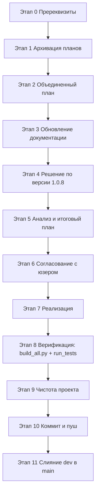

# Задание для SourceCraft `plans/promt11.md`

`plans/promt11.md`

**!!!ВАЖНО-.ycarules имеет высший приоритет!!!**

## Цель

Следующая версия проекта SysW — **v1.0.8**: стабилизация и надёжность процесса сборки
(устранение зависаний Excel COM, ранний контроль компиляции VBA), восстановление полного
тестового покрытия импорта (TC-29) с учётом активной глубокой подстановки модельных кодов,
а также добавление удобного поиска/фильтрации по справочнику.

Опирается на результаты v1.0.7 (активирована подстановка, единый конвейер `build_all.py`,
защита листов Вариант D).

## Список задач

1. **УСТОЙЧИВОСТЬ КОНВЕЙЕРА К ЗАВИСАНИЯМ EXCEL COM:**
   - В v1.0.7 конвейер периодически зависал на этапе `build_templates` из-за модальных
     окон Excel и прерывистых ошибок `Workbooks.Open` → `None` (`-2147352567`).
   - Требуется: во всех COM-скриптах (`scripts/impVBA.py`, `scripts/build_templates.py`,
     `scripts/run_tests.py`) задать `DisplayAlerts=False`, `AutomationSecurity`,
     явные параметры `Open` (`ReadOnly:=False`, `UpdateLinks:=0`), обработку `None`
     из `Workbooks.Open` с повторными попытками (ретраи), таймауты и принудительное
     завершение зависших процессов `EXCEL.EXE` после каждого этапа.

2. **РАННИЙ КОНТРОЛЬ КОМПИЛЯЦИИ VBA В КОНВЕЙЕРЕ:**
   - В v1.0.7 обнаружена ошибка компиляции VBA (недопустимая inline-инициализация
     `Public ... As Boolean = True`), из-за которой падал этап `run_tests` (макрос
     `RunAllTests` «недоступен»).
   - Требуется: после `impVBA.py` добавить шаг проверки компиляции VBA-проекта
     (например, вызов вспомогательного макроса/метода через COM либо статическую
     проверку синтаксиса), чтобы ловить такие ошибки до прогона тестов, и включить
     его в `scripts/build_all.py`.

3. **ПОИСК/ФИЛЬТРАЦИЯ ПО СПРАВОЧНИКУ (лист spisok):**
   - Добавить UI-макросы поиска по артикулу/наименованию с `AutoFilter`
     (пример согласованной логики пользователя: `ВыполнитьПоиск`, кнопки
     «Поиск в артикуле»/«Поиск в наименовании»/«Очистить фильтр», автозапуск
     по Enter). Защита листа уже разрешает `autoFilter` (Вариант D в v1.0.7).

4. **ДОКУМЕНТАЦИЯ, ВЕРСИЯ, ЧИСТОТА, GIT:**
   - Обновить `docs/table.md`, `docs/ARCHITECTURE.md`, `docs/DEVELOPER.md`,
     `docs/CHANGELOG.md` ([U2], [G2]).
   - Версия 1.0.8 (`update_version.py`/`config.py`).
   - Чистка проекта от мусора ([S7]), конфликтные ветки, коммит/пуш, слияние `dev→main`.

## Итоговая последовательность

## Риски

- COM-зависания Excel (модальные окна) — адресуются задачей 1 (ретраи, таймауты,
  завершение зависших процессов).
- Ошибки компиляции VBA — адресуются задачей 2 (ранняя проверка).
- Восстановление TC-29 требует точного соответствия бизнес-логике подстановки —
  согласовать с юзером перед реализацией ([Z6]).

## Критерии приёмки

- `scripts/build_all.py` проходит без зависаний (ретраи/таймауты работают);
  ранний контроль компиляции VBA включён.
- `run_tests`: TC-29 восстановлен (PASS либо обоснованный статус), TC-47..TC-50 —
  PASS; Failed=0.
- Макросы поиска/фильтрации работают на защищённом листе spisok.
- `check_docs.py --check` exit 0; версия v1.0.8 везде.
- Коммит/пуш на `dev`, слияние `dev → main` после подтверждения.

## Примечания

- все изменения согласовывать перед реализацией (создавать план в `plans/` или
  устный запрос у юзера)
- отвечать — только на русском языке
- комментарии в коде — на русском языке
- строго соблюдать правила `.ycarules` (особенно [Z6], [U1], [U2], [G2], [K1]/[K2],
  [S7], [E3])
- при неоднозначности — переспрашивать, а не делать предположения
- после завершения задачи проверка чистоты проекта от мусора
- после завершения всех задач - запрос у юзера и выполнение коммита и пуша