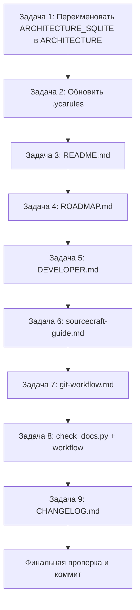

# План обновления и актуализации документации проекта SysW

## Заголовок и цель

**Цель:** Привести документацию проекта SysW в соответствие с фактическим состоянием кодовой базы версии **v0.20.0**. Устранить устаревшие упоминания удалённого модуля `Mod_MainButtons.bas`, отразить новые элементы (`Mod_ModelTypes.bas`, `PartIdentity.cls`, `WorkIdentity.cls`, `sync_fix.ps1`), исправить несоответствия путей и версий, а также автоматизировать контроль актуальности документации.

**Ожидаемый результат:** Все ключевые документы (`README.md`, `docs/ROADMAP.md`, `docs/DEVELOPER.md`, `docs/sourcecraft-guide.md`, `docs/git-workflow.md`, `docs/ARCHITECTURE.md`, `.ycarules`, `docs/CHANGELOG.md`) отражают актуальную структуру проекта и версию v0.20.0. Добавлен инструмент проверки документации.

---

## Текущее состояние (кратко)

| Документ | Актуальная версия | Статус |
|----------|-------------------|--------|
| `README.md` | v0.14.0 | Устарел |
| `docs/ROADMAP.md` | v0.14.0 | Устарел |
| `docs/DEVELOPER.md` | v0.15.0 | Устарел |
| `docs/sourcecraft-guide.md` | до v0.16.0 | Устарел |
| `docs/CHANGELOG.md` | v0.20.0 | Актуален |
| `docs/ARCHITECTURE_SQLITE.md` | — | Требует переименования |

**Ключевые проблемы:**
- Модуль `Mod_MainButtons.bas` удалён (зафиксировано в `[Unreleased]` CHANGELOG), но упоминается в `DEVELOPER`, `ROADMAP`, `ARCHITECTURE_SQLITE`, `sourcecraft-guide` и в `.ycarules` (таблица S2).
- Новые элементы не отражены: `Mod_ModelTypes.bas`, `PartIdentity.cls`, `WorkIdentity.cls`, `sync_fix.ps1`.
- Запланировано переименование `docs/ARCHITECTURE_SQLITE.md` → `docs/ARCHITECTURE.md`.
- Несоответствия путей: `plans/ROADMAP.md` (фактически `docs/ROADMAP.md`), команды без `scripts/` (например `python export_vba.py` вместо `python scripts/export_vba.py`), `python3` вместо `python`, пути к `Mod_Utils.bas` из корня вместо `src/modules/Mod_Utils.bas`.
- Классы листов `Sheet_work.cls` и `Sheet_z4.cls` фактически переименованы в `.bak`.

**Фактическая структура `src/modules/`** (13 модулей, БЕЗ `Mod_MainButtons`):
`Mod_AutoMatch`, `Mod_ButtonDispatcher`, `Mod_Constants`, `Mod_FullTestRunner`, `Mod_Import`, `Mod_Logger`, `Mod_ModelDB`, `Mod_ModelTypes`, `Mod_OrderHeader`, `Mod_PickWork`, `Mod_SheetButtons`, `Mod_SheetOps`, `Mod_Utils`.

**Фактическая структура `src/classes/`:** `PartIdentity.cls`, `WorkIdentity.cls`.

**Фактическая структура `src/sheets/`:** `Лист2_main.cls`, `Sheet_work.cls.bak`, `Sheet_z4.cls.bak`.

**Фактические скрипты в `scripts/`:** `config.ps1`, `config.py`, `export_vba.py`, `impVBA.py`, `run_tests.py`, `Set-ExcelTrust.ps1`, `sync_fix.ps1`.

---

## Список задач с детальным описанием

### Задача 1. Переименовать `docs/ARCHITECTURE_SQLITE.md` → `docs/ARCHITECTURE.md`

- Выполнить переименование файла через `git mv docs/ARCHITECTURE_SQLITE.md docs/ARCHITECTURE.md` (сохранить историю).
- Обновить все внутренние ссылки на этот файл в других документах (README, DEVELOPER, ROADMAP, sourcecraft-guide, git-workflow, `.ycarules`).
- Внутри самого файла:
  - Убрать упоминания `Mod_MainButtons.bas`.
  - Добавить `Mod_ModelTypes.bas` в перечень модулей.
  - Добавить классы `PartIdentity.cls`, `WorkIdentity.cls`.
  - Обновить пути к модулям (например, `src/modules/Mod_Utils.bas` вместо корневого пути).
  - Обновить структуру `src/sheets/` с учётом `.bak`-файлов.

### Задача 2. Обновить `.ycarules`

- **Таблица S2** (перечень модулей):
  - Убрать `Mod_MainButtons`.
  - Добавить `Mod_ModelTypes`.
- **Секция `[S1]`** (или аналогичная, где упоминается имя ARCHITECTURE):
  - Обновить имя файла `ARCHITECTURE_SQLITE.md` → `ARCHITECTURE.md`.
- Проверить, нет ли других упоминаний удалённого модуля или устаревших путей в `.ycarules`.

### Задача 3. Актуализировать `README.md`

- Обновить версию проекта с v0.14.0 на **v0.20.0**.
- Обновить перечень модулей: убрать `Mod_MainButtons`, добавить `Mod_ModelTypes`.
- Обновить перечень классов: добавить `PartIdentity.cls`, `WorkIdentity.cls`.
- Обновить перечень скриптов: добавить `sync_fix.ps1`.
- Исправить пути к скриптам: `python export_vba.py` → `python scripts/export_vba.py`; `python3` → `python`.
- Исправить пути к модулям: `Mod_Utils.bas` → `src/modules/Mod_Utils.bas`.
- Обновить ссылку на `docs/ARCHITECTURE_SQLITE.md` → `docs/ARCHITECTURE.md`.
- Обновить структуру `src/sheets/` с учётом `.bak`-файлов.

### Задача 4. Актуализировать `docs/ROADMAP.md`

- Обновить версию проекта с v0.14.0 на **v0.20.0**.
- Убрать упоминания `Mod_MainButtons.bas` (если есть в планах/истории).
- Добавить отражение новых элементов: `Mod_ModelTypes.bas`, `PartIdentity.cls`, `WorkIdentity.cls`, `sync_fix.ps1`.
- Исправить пути к скриптам (добавить `scripts/`).
- Исправить пути к модулям (добавить `src/modules/`).
- Обновить ссылку на `docs/ARCHITECTURE_SQLITE.md` → `docs/ARCHITECTURE.md`.

### Задача 5. Актуализировать `docs/DEVELOPER.md`

- Обновить версию проекта с v0.15.0 на **v0.20.0**.
- Убрать упоминания `Mod_MainButtons.bas`.
- Добавить `Mod_ModelTypes.bas`, `PartIdentity.cls`, `WorkIdentity.cls`, `sync_fix.ps1`.
- Исправить пути к скриптам (добавить `scripts/`).
- Исправить пути к модулям (добавить `src/modules/`).
- Обновить ссылку на `docs/ARCHITECTURE_SQLITE.md` → `docs/ARCHITECTURE.md`.
- Обновить структуру `src/sheets/` с учётом `.bak`-файлов.

### Задача 6. Актуализировать `docs/sourcecraft-guide.md`

- Обновить версию проекта (актуальная v0.20.0).
- Убрать упоминания `Mod_MainButtons.bas`.
- Добавить `Mod_ModelTypes.bas`, `PartIdentity.cls`, `WorkIdentity.cls`, `sync_fix.ps1`.
- Исправить пути к скриптам (добавить `scripts/`).
- Исправить пути к модулям (добавить `src/modules/`).
- Обновить ссылку на `docs/ARCHITECTURE_SQLITE.md` → `docs/ARCHITECTURE.md`.

### Задача 7. Актуализировать `docs/git-workflow.md`

- Проверить и обновить упоминания версий и путей.
- Исправить пути к скриптам (добавить `scripts/`).
- Обновить ссылку на `docs/ARCHITECTURE_SQLITE.md` → `docs/ARCHITECTURE.md`.
- Убедиться, что нет упоминаний `Mod_MainButtons.bas`.

### Задача 8. Создать инструмент проверки документации (Вариант D)

- Создать Python-скрипт **`scripts/check_docs.py`**, который проверяет:
  - Наличие актуальной версии v0.20.0 в ключевых документах.
  - Отсутствие упоминаний удалённого модуля `Mod_MainButtons`.
  - Наличие новых элементов (`Mod_ModelTypes`, `PartIdentity`, `WorkIdentity`, `sync_fix`).
  - Корректность путей к скриптам (наличие `scripts/`).
  - Корректность путей к модулям (наличие `src/modules/`).
  - Отсутствие ссылок на `ARCHITECTURE_SQLITE.md` (должен быть `ARCHITECTURE.md`).
  - Соответствие перечня модулей фактической структуре `src/modules/`.
- Скрипт должен возвращать ненулевой код при обнаружении проблем (для CI).
- Создать GitHub Actions workflow **`.github/workflows/docs-check.yml`**:
  - Запуск на `push` и `pull_request`.
  - Установка Python.
  - Выполнение `python scripts/check_docs.py`.
  - Публикация отчёта о проверке.

### Задача 9. Обновить `docs/CHANGELOG.md`

- Добавить запись в `[Unreleased]` (или в раздел новой версии) о:
  - Переименовании `docs/ARCHITECTURE_SQLITE.md` → `docs/ARCHITECTURE.md`.
  - Актуализации документации до v0.20.0.
  - Добавлении инструмента проверки документации (`scripts/check_docs.py`, `.github/workflows/docs-check.yml`).

---

## Порядок выполнения

**Обоснование порядка:**
1. Сначала переименование файла (Задача 1), чтобы все последующие правки ссылок были корректными.
2. Затем `.ycarules` (Задача 2) — базовые правила проекта.
3. Затем основные документы (Задачи 3–7) — от наиболее общего к специализированным.
4. Затем инструмент проверки (Задача 8) — для автоматического контроля.
5. В конце CHANGELOG (Задача 9) — фиксация изменений.
6. Финальная проверка через `scripts/check_docs.py` и коммит.

---

## Критерии проверки

1. **Переименование:** файл `docs/ARCHITECTURE.md` существует, `docs/ARCHITECTURE_SQLITE.md` отсутствует; история сохранена через `git mv`.
2. **Отсутствие устаревших упоминаний:** ни в одном документе и в `.ycarules` нет `Mod_MainButtons`.
3. **Наличие новых элементов:** `Mod_ModelTypes`, `PartIdentity`, `WorkIdentity`, `sync_fix` отражены в README, ROADMAP, DEVELOPER, sourcecraft-guide, ARCHITECTURE.
4. **Версии:** README, ROADMAP, DEVELOPER, sourcecraft-guide указывают v0.20.0.
5. **Пути:** все команды содержат `scripts/`; все пути к модулям содержат `src/modules/`; нет `python3` (только `python`).
6. **Ссылки:** нет ссылок на `ARCHITECTURE_SQLITE.md`; все ссылки указывают на `ARCHITECTURE.md`.
7. **Структура sheets:** `Sheet_work.cls.bak` и `Sheet_z4.cls.bak` отражены корректно.
8. **Инструмент проверки:** `scripts/check_docs.py` запускается без ошибок и возвращает код 0 при актуальной документации; workflow `.github/workflows/docs-check.yml` корректно настроен.
9. **CHANGELOG:** добавлена запись о проделанной работе в `[Unreleased]`.

---

## Риски и ограничения

- **Риск пропуска упоминаний:** `Mod_MainButtons` может встречаться в неочевидных местах (комментарии, примеры кода, таблицы). Требуется полный поиск по репозиторию (`search_files`).
- **Риск рассинхронизации ссылок:** после переименования ARCHITECTURE могут остаться ссылки на старое имя в файлах, не входящих в список задач. Рекомендуется глобальный поиск `ARCHITECTURE_SQLITE`.
- **Ограничение по `.bak`-файлам:** классы `Sheet_work.cls.bak` и `Sheet_z4.cls.bak` не являются активными модулями; их следует упоминать как архивные, а не как активные.
- **Ограничение инструмента проверки:** `check_docs.py` должен быть устойчив к отсутствию файлов и не падать на несуществующих путях; проверки должны быть настраиваемыми (список ожидаемых модулей/версий).
- **CI-ограничение:** workflow должен корректно работать в GitHub Actions (установка Python, запуск скрипта); при отсутствии Python в окружении — использовать `actions/setup-python`.
- **Риск конфликта с `.codeassistantignore`:** файлы `*.log`, `*.db` и др. игнорируются; проверка документации не должна затрагивать игнорируемые файлы.
- **Ограничение режима:** правки вносятся только в файлы документации и новые файлы инструмента; не изменять исходный код VBA.