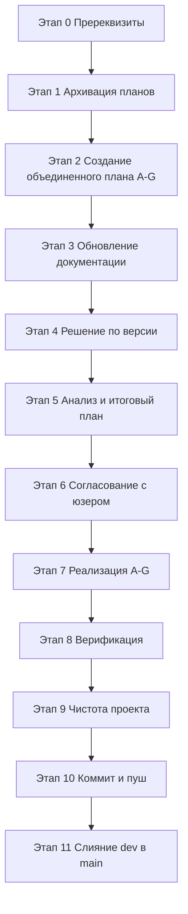

# План работ по промту `promt6.md`

> Этот документ — **план работ по promt6 в целом** (упорядочивание планов + обновление документации + реализация невыполненных работ + версия).
> Создан в режиме 🏗️ Architect на основе данных анализа (раздел «Данные анализа» в задаче).
> Правила: строго соблюдать `.ycarules`. Версия проекта — **v1.0.2** (внимание: в `promt6.md` заявлено поднять до **1.0.5**, что противоречит анализу — см. Этап 8).

---

## Сводка состояния (из анализа)

| План | Вердикт | Статус архива |
|------|---------|---------------|
| `fix_architecture_matlib_plan.md` | ✅ ВЫПОЛНЕН | копия в `_archive` есть |
| `fix_consistency_discrepancies_plan.md` | ⚠️ ЧАСТИЧНО | нет копии |
| `fix_deploy_path_plan.md` | ⚠️ ЧАСТИЧНО | нет копии |
| `fix_tc23_compile_error_plan.md` | ⚠️ ЧАСТИЧНО | копия в `_archive` есть |
| `integration_1.0.1.md` | ❌ НЕ ВЫПОЛНЕН по содержанию | копия `integration_1.0.2.md` в `_archive` |
| `update_docs_plan.md` | ⚠️ ЧАСТИЧНО | копия в `_archive` есть |

Фактические метрики: `src/` = **13 `.bas` + 2 класса (`PartIdentity`, `WorkIdentity`) + 1 лист (`Лист2_main`) = 16 VBA-файлов**.

---

## Этап 0. Пререквизиты (Debug/Architect)

**Цель:** убедиться, что рабочая ветка — `dev`, рабочее дерево чистое, актуальные данные анализа совпадают с реальностью.

Шаги:
1. Проверить текущую ветку (ожидается `dev`). При необходимости — переключиться через MCP Git Tools (`git_checkout`).
2. Проверить `git_status` / `git_log` для подтверждения коммитов `c7f7f5c`, `386a264`, `99a5327`, факта версии `v1.0.2`.
3. Сверить перечень активных планов `plans/*.md` со списком из промта (6 планов).
4. Сверить фактический состав `src/` (пересчитать метрики: 16 VBA-файлов).
5. Зафиксировать расхождения между данными анализа и реальностью (если есть) — сообщить пользователю перед началом.

**Исполнитель:** 🏗️ Architect (анализ) + 🪲 Debug (проверка фактов).

---

## Этап 1. Архивация планов (Architect)

**Цель:** привести `plans/` к актуальному состоянию: выполненные — в архив, оставить только живые рабочие планы.

Шаги:
1. **`fix_architecture_matlib_plan.md`** — ВЫПОЛНЕН:
   - Активная копия `plans/fix_architecture_matlib_plan.md` **удаляется** из корня `plans/`.
   - Одноимённая копия `plans/_archive/fix_architecture_matlib_plan.md` уже существует → **перезаписывается** финальной версией (при наличии более свежей) либо остаётся как есть.
2. **`fix_tc23_compile_error_plan.md`** — ЧАСТИЧНО, но есть незакрытые пункты (Приоритет 2, Приоритет 3):
   - Незакрытые пункты переносятся в объединённый план (см. Этап 2, разделы C).
   - Активная копия `plans/fix_tc23_compile_error_plan.md` **удаляется** из корня.
   - Одноимённая копия в `plans/_archive/` уже есть → **перезаписывается** (или дополняется пометкой о переносе остатков в объединённый план).
3. **`update_docs_plan.md`** — ЧАСТИЧНО:
   - Незакрытая часть документации переносится в объединённый план (раздел F).
   - Активная копия `plans/update_docs_plan.md` **удаляется** из корня.
   - Копия в `plans/_archive/` уже есть → **перезаписывается** (или дополняется пометкой о переносе).
4. **`fix_consistency_discrepancies_plan.md`** — ЧАСТИЧНО, остаются хвосты (CI, `.sourcecraft`, `.ycarules`):
   - Хвосты переносятся в объединённый план (разделы D, E).
   - Активная копия **удаляется** из корня; **создаётся новая копия** в `plans/_archive/`.
5. **`fix_deploy_path_plan.md`** — ЧАСТИЧНО, остаются `requirements.txt`, `.venv`:
   - Остатки переносятся в объединённый план (раздел B).
   - Активная копия **удаляется** из корня; **создаётся копия** в `plans/_archive/`.
6. **`integration_1.0.1.md`** — НЕ ВЫПОЛНЕН по содержанию:
   - Незакрытое содержание переносится в объединённый план (разделы A, B, C).
   - Активная копия `plans/integration_1.0.1.md` **удаляется** из корня.
   - В `plans/_archive/` уже лежит `integration_1.0.2.md` (превзойдённая версия) — оставляется в архиве как историческая.

Итог этапа: в корне `plans/` остаются только объединённый план и служебные (`_promts/`, `_archive/`), все закрытые/перенесённые планы — в архиве.

**Исполнитель:** 🏗️ Architect. Операции с файлами — через MCP File System.

---

## Этап 2. Создание объединённого плана невыполненных работ (Architect)

**Цель:** единый план всех открытых работ. **Предлагаемое имя файла:** `plans/integration_1.0.3.md`.

Структура (разделы A–G):

- **A. Логгер** (ВЫСОКИЙ РИСК — изменение VBA-кода):
  - Добавить `Enum LogLevel` (например: `LOG_DEBUG`, `LOG_INFO`, `LOG_WARN`, `LOG_ERROR`).
  - Добавить параметр уровня в сигнатуру `WriteLog` в `Mod_Logger.bas`.
  - Формат записи: `[УРОВЕНЬ]` в начале строки лога.
  - Заменить **9 вызовов** `Mod_Utils.WriteLog(...)` на прямые `Mod_Logger.WriteLog(модуль, ..., уровень)`.
  - Удалить/ослабить обёртку `Mod_Utils.WriteLog` после замены всех вызовов.
  - **Требуется согласование с пользователем и тестирование** (`run_tests.py`, запуск Excel).

- **B. Окружение** (Code):
  - Создать `requirements.txt` (перечень зависимостей Python-скриптов).
  - Пересоздать `.venv` (активация через `.venv\Scripts\Activate.ps1`, PowerShell 7 — правило `[S9]`).

- **C. Рефакторинг** (Code/Debug):
  - Исправить рассинхрон имени `"Sheet1_main"` → `"Лист2_main"` в `src/sheets/Лист2_main.cls:45`.
  - Перенести объявления `Dim` в начало процедур в `src/modules/Mod_FullTestRunner.bas` (ВЫСОКИЙ РИСК — изменение VBA-кода).
  - Проверка данных `UAZz4` (МОЖЕТ ТРЕБОВАТЬ ручного запуска Excel — согласовать и выполнить, вероятно, в режиме Debug с участием пользователя).

- **D. CI** (Code):
  - Исправить шаги `Check CHANGELOG updated` и `Check .gitignore consistency` в `.github/workflows/vba-check.yml` под фактические пути (`docs/CHANGELOG.md`, корневой `.gitignore`).

- **E. Конфиги** (Code):
  - `.sourcecraft`: critical-пути `table.md` → `docs/table.md`, `CHANGELOG.md` → `docs/CHANGELOG.md`, `plans/ROADMAP.md` → `docs/ROADMAP.md`.
  - `.ycarules`: убрать упоминание удалённого `scripts/sync_fix.ps1` (см. `[S4]`), привести пути документации в соответствие (раздел 6, `[S1]`).

- **F. Документация** (Architect/Code): подробно — Этап 3.

- **G. Завершение** (Architect/Debug/Code):
  - Обновить `docs/CHANGELOG.md`.
  - Проверить `scripts/check_docs.py` и `docs-check.yml` (прогон, отсутствие ошибок).
  - Перенести закрытые планы в `plans/_archive/` (по завершении соответствующих работ).

**Пометки о высоком риске:**
- Раздел A (логгер) — меняется сигнатура публичной функции, затрагивается 9 вызовов → отдельное согласование + тестирование в Excel.
- Раздел C (перенос `Dim`) — структурные правки `Mod_FullTestRunner.bas` → отдельное согласование + прогон `run_tests.py` / Excel.
- Раздел C (проверка `UAZz4`) — может требовать ручного открытия Excel.

**Исполнитель:** 🏗️ Architect (структура плана), затем 💻 Code (реализация), 🪲 Debug (проверка).

---

## Этап 3. Обновление документации (Architect)

По каждому документу `docs/` — конкретные правки.

1. **`README.md`**:
   - Актуализировать описание проекта под версию `v1.0.2` (или целевую `v1.0.3` после реализации).
   - Обновить перечень компонентов (16 VBA-файлов, структура `src/`).
   - Скорректировать ссылки на документацию (`docs/*.md`).
   - Убрать `.bak`-листы, если упоминаются.

2. **`docs/ARCHITECTURE.md`**:
   - Убрать `.bak`-листы.
   - Обновить описание архитектуры логирования под новую сигнатуру `Mod_Logger.WriteLog` с уровнем (после раздела A).
   - Привести пути/названия листов в соответствие (`Лист2_main` вместо `Sheet1_main`).
   - Убрать пути `L:\...` (локальные диски) — заменить на относительные пути репозитория.

3. **`docs/DEVELOPER.md`**:
   - Убрать `.bak`-листы.
   - Исправить «3 `.cls` листа» → **1** (`Лист2_main`).
   - Исправить «18 VBA-файлов» → **16**.
   - Убрать пути `L:\...`.
   - Обновить описание окружения (учесть `requirements.txt`, пересозданный `.venv`).

4. **`docs/CHANGELOG.md`**:
   - Добавить запись под целевую версию (`v1.0.3` после реализации) со списком изменений разделов A–G.
   - Проверить формат Keep a Changelog (правило `[U2]`).

5. **`docs/ROADMAP.md`**:
   - Убрать `.bak`-листы.
   - Обновить статусы задач с учётом выполненных/перенесённых работ.
   - Привести соответствие текущей версии и ближайших планов.

6. **`docs/git-workflow.md`**:
   - Актуализировать порядок слияния `dev → main` (см. Этап 9).
   - Убрать `.bak`-листы и пути `L:\...` при наличии.
   - Синхронизировать с фактическим процессом (MCP Git Tools).

7. **`docs/sourcecraft-guide.md`**:
   - Убрать `.bak`-листы.
   - Обновить таблицу истории версий до актуальной (`v1.0.2`, после реализации — `v1.0.3`).
   - Убрать пути `L:\...`.
   - Актуализировать упоминания модулей/листов под фактические метрики (16 VBA-файлов, 1 лист).

8. **`docs/table.md`**:
   - Исправить неточности (структура `src/`, количество модулей/классов/листов).
   - Привести в соответствие фактическому составу проекта.

**Исполнитель:** 🏗️ Architect (план правок) → 💻 Code (внесение правок в `.md`).

---

## Этап 4. Версия системы (Architect/Code)

- По промту: поднять версию до **1.0.5**.
- **Конфликт с анализом:** анализ фиксирует текущую версию `v1.0.2`, а задача требует `v1.0.5` и новый объединённый план предлагается как `integration_1.0.3.md`.
- **Требуется решение пользователя** (Этап 6, согласование): какой целевой номер версии фиксировать (`1.0.3` — консистентно с планом, либо `1.0.5` — по буквальному тексту промта).
- После решения — обновить версию (скрипт `scripts/update_version.py`), синхронизировать с `docs/CHANGELOG.md` и README.

---

## Этап 5. Составление итогового плана и анализ (Ask)

- Сформировать итоговый сводный анализ и финальный перечень правок (разделы A–G + версия + документация).
- Зафиксировать роли и очерёдность: Ask (анализ) → Architect (план) → Code (реализация) → Debug (проверка).
- Подготовить материал для согласования с пользователем.

**Исполнитель:** ❓ Ask (анализ) + 🏗️ Architect (оформление).

---

## Этап 6. Согласование плана с пользователем (Architect)

> Обязательный пункт — изменения не начинаются до одобрения (правила `[U1]`, `[Z5]`, `[E3]`).

1. Представить пользователю:
   - Итоги Этапа 1 (архивация).
   - Содержимое объединённого плана `plans/integration_1.0.3.md` (разделы A–G).
   - План правок документации (Этап 3).
   - Целевой номер версии (Этап 4 — просить решение).
2. Отметить высокорисковые пункты (логгер, перенос `Dim`, проверка `UAZz4`) и потребность в отдельном тестировании.
3. Дождаться явного утверждения.

**Исполнитель:** 🏗️ Architect. Инструмент — `ask_followup_question` / устное согласование.

---

## Этап 7. Реализация плана (Code/Debug)

Выполняется **после** утверждения (Этап 6).

1. **Раздел A (логгер)** — изменения `Mod_Logger.bas`, `Mod_Utils.bas` и 9 вызовов. Согласование + прогон `run_tests.py` / Excel.
2. **Раздел B (окружение)** — создать `requirements.txt`, пересоздать `.venv`.
3. **Раздел C (рефакторинг)** — `Лист2_main.cls:45`, перенос `Dim` в `Mod_FullTestRunner.bas`, проверка `UAZz4` (возможен ручной запуск Excel).
4. **Раздел D (CI)** — правки `vba-check.yml`.
5. **Раздел E (конфиги)** — правки `.sourcecraft`, `.ycarules`.
6. **Раздел F (документация)** — правки по Этапу 3.
7. **Версия** — обновление по решению Этапа 4.
8. **Раздел G (завершение)** — обновить `docs/CHANGELOG.md`, прогнать `check_docs.py` / `docs-check.yml`, перенести закрытые планы в `_archive`.

**Исполнители:** 💻 Code (реализация), 🪲 Debug (проверка на каждом рискованном шаге).

---

## Этап 8. Верификация после реализации (Debug)

1. Прогнать `scripts/run_tests.py` — все тесты зелёные.
2. Прогнать `scripts/check_docs.py` и CI-шаг `docs-check.yml` — без ошибок.
3. Проверить CI-шаги `vba-check.yml` (`Check CHANGELOG updated`, `Check .gitignore consistency`) — проходят.
4. Проверить компиляцию VBA (при возможности — экспорт/импорт через `export_vba.py` / `impVBA.py`, запуск Excel для рискованных разделов A и C).
5. Подтвердить актуальность метрик (16 VBA-файлов) и отсутствие регрессий.

**Исполнитель:** 🪲 Debug.

---

## Этап 9. Проверка чистоты проекта (Architect/Code)

- Удалить временные файлы: `__pycache__`, `*.sync-conflict-*`, `~$*.xlsm`, `*.tmp` (правило `[S7]`).
- Проверить отсутствие `.bak`-листов и мусорных артефактов.
- Проверить, что в корне `plans/` не осталось лишних активных планов.
- Проект должен оставаться чистым.

---

## Этап 10. Финальный коммит и пуш (Architect/Code)

- После завершения всех задач — **запросить у пользователя подтверждение** на коммит и пуш (согласно примечаниям промта).
- Выполнить `git_add` → `git_commit` → `git_push` через **MCP Git Tools** (правило `[G10]`).
- Комментарий коммита — на русском языке, отражает суть (архивация планов, объединённый план, документация, реализация разделов A–G, версия).

---

## Этап 11. Слияние dev → main и возврат в dev (Architect/Code)

1. Убедиться, что `dev` готова (все правки закоммичены и запушены).
2. Выполнить слияние `dev → main` через MCP Git Tools (`git_checkout main`, `git_merge dev`, разрешить возможные конфликты, `git_push`).
3. Переключиться обратно в ветку `dev` (`git_checkout dev`).
4. Проверить статус репозитория после переключения.

---

## Матрица рисков

| Пункт | Риск | Мера |
|-------|------|------|
| Раздел A — логгер | Высокий (смена сигнатуры, 9 вызовов) | Отдельное согласование + тест в Excel/`run_tests.py` |
| Раздел C — перенос `Dim` | Высокий (структурные правки) | Отдельное согласование + прогон тестов |
| Раздел C — проверка `UAZz4` | Средний (возможен ручной запуск Excel) | Привлечь пользователя / Debug |
| Этап 4 — версия 1.0.5 vs 1.0.3 | Средний (конфликт с анализом) | Явное решение пользователя на Этапе 6 |
| Редактирование критических файлов (`.ycarules`, `README`, `CHANGELOG`, docs) | Средний (правило `[E3]`) | План → согласование → правка |

---

## Итоговая последовательность

> Примечание: Этап 4 (версия) может выполняться параллельно с Этапом 3 (документация) после принятия решения пользователем.