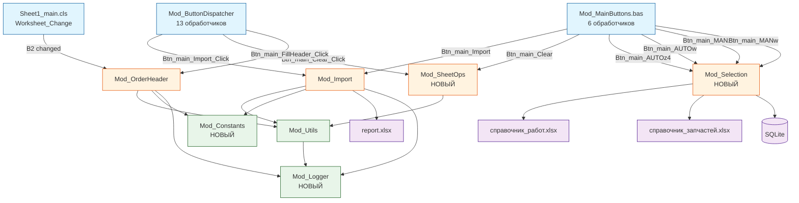
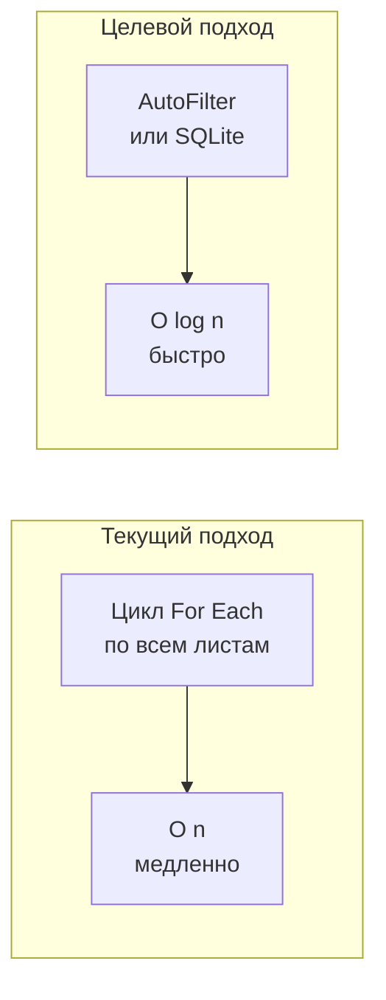

# Предложение по модернизации архитектуры SysW

**Дата:** 2026-07-14
**Автор:** SourceCraft Architect
**Статус:** Черновик (на рассмотрение)

---

## 1. Целевая архитектура

### 1.1 Схема модулей и зон ответственности

```
┌─────────────────────────────────────────────────────────────────────────────┐
│                        ЦЕЛЕВАЯ АРХИТЕКТУРА SYSW                            │
├─────────────────────────────────────────────────────────────────────────────┤
│                                                                             │
│  ┌──────────────────────┐    ┌──────────────────────────────────────────┐   │
│  │   СЛОЙ UI/ВВОДА      │    │         СЛОЙ БИЗНЕС-ЛОГИКИ               │   │
│  │                      │    │                                          │   │
│  │ Sheet1_main.cls      │───▶│ Mod_OrderHeader.bas                     │   │
│  │  (события листа)     │    │  - FillHeaderFromOrder()                │   │
│  │                      │    │  - FindOrder()                          │   │
│  │ Sheet_z4.cls         │    │                                          │   │
│  │  (события листа z4)  │    │ Mod_Import.bas                          │   │
│  │                      │    │  - ImportSheet()                        │   │
│  │ Sheet_work.cls       │    │  - ImportDataToMain()                   │   │
│  │  (события листа work)│    │  - ExtractNumberFromGRZ()               │   │
│  │                      │    │  - SearchSheetByGRZ()                   │   │
│  │ Mod_ButtonDispatcher │    │  - RenameSheetsByGRZ()                  │   │
│  │  (диспетчер кнопок)  │───▶│                                          │   │
│  │                      │    │ Mod_SheetOps.bas  [НОВЫЙ]               │   │
│  │                      │    │  - ClearMainSheet()                     │   │
│  │                      │    │  - ClearHeader()                        │   │
│  │                      │    │  - CopySheet()                          │   │
│  │                      │    │                                          │   │
│  │                      │    │ Mod_Selection.bas  [НОВЫЙ]              │   │
│  │                      │    │  - AutoSelectParts()  (заглушка→реализ.)│   │
│  │                      │    │  - AutoSelectWorks()  (заглушка→реализ.)│   │
│  │                      │    │  - ManualSelectParts() (заглушка→реализ)│   │
│  │                      │    │  - ManualSelectWorks() (заглушка→реализ)│   │
│  │                      │    │                                          │   │
│  └──────────────────────┘    └──────────────────────────────────────────┘   │
│           │                                       │                         │
│           │                                       ▼                         │
│           │                            ┌──────────────────────────┐         │
│           │                            │   СЛОЙ УТИЛИТ            │         │
│           │                            │                          │         │
│           └───────────────────────────▶│ Mod_Utils.bas            │         │
│                                        │  - GetSheetByName()      │         │
│                                        │  - FileExists()          │         │
│                                        │  - FormatDateSQL()       │         │
│                                        │  - WriteLog()            │         │
│                                        │                          │         │
│                                        │ Mod_Constants.bas [НОВ.]│         │
│                                        │  - SPISOK_COL_*          │         │
│                                        │  - MODEL_COL_*           │         │
│                                        │  - OrderHeader TYPE      │         │
│                                        │  - LOG_PATH, APP_NAME    │         │
│                                        │                          │         │
│                                        │ Mod_Logger.bas [НОВЫЙ]   │         │
│                                        │  - InitLogger()          │         │
│                                        │  - WriteLog()            │         │
│                                        │  - RotateLog()           │         │
│                                        │  - GetLogPath()          │         │
│                                        └──────────────────────────┘         │
│                                                                             │
│  ┌──────────────────────────────────────────────────────────────────────┐   │
│  │  ВНЕШНИЕ РЕСУРСЫ                                                     │   │
│  │                                                                      │   │
│  │  work.xlsm  (основная книга с макросами)                             │   │
│  │  report.xlsx (внешний отчёт, открывается ReadOnly)                   │   │
│  │  справочник_работ.xlsx [ОПЦИОНАЛЬНО]  (10000+ записей)              │   │
│  │  справочник_запчастей.xlsx [ОПЦИОНАЛЬНО] (700000+ записей)          │   │
│  │  SysW.db (SQLite, через ADO)                                         │   │
│  └──────────────────────────────────────────────────────────────────────┘   │
└─────────────────────────────────────────────────────────────────────────────┘
```

### 1.2 Потоки данных



### 1.3 Таблица модулей (текущее vs целевое состояние)

| # | Модуль | Текущая роль | Целевая роль | Изменения |
|---|--------|-------------|--------------|-----------|
| 1 | `Mod_Utils.bas` | Утилиты + тип OrderHeader | Только утилиты | Перенести OrderHeader → Mod_Constants |
| 2 | `Mod_OrderHeader.bas` | Заполнение шапки заказа | Без изменений | Убрать MsgBox из FillHeaderFromOrder |
| 3 | `Mod_Import.bas` | Импорт + очистка + переименование | Только импорт | Выделить очистку в Mod_SheetOps |
| 4 | `Mod_ButtonDispatcher.bas` | Диспетчер кнопок (13 шт) | Диспетчер кнопок | Унифицировать нейминг |
| 5 | `Mod_FullTestRunner.bas` | Тестирование | Без изменений | Исправить кодировку |
| 6 | `Mod_MainButtons.bas` | 6 кнопок main | 6 кнопок main | Убрать дублирование с Mod_Import |
| 7 | `Mod_SheetButtons.bas` | 6 кнопок z4/work | Без изменений | — |
| 8 | **`Mod_Constants.bas`** | — | **НОВЫЙ**: константы, типы | Выделить из Mod_Utils |
| 9 | **`Mod_SheetOps.bas`** | — | **НОВЫЙ**: операции с листами | Выделить из Mod_Import |
| 10 | **`Mod_Selection.bas`** | — | **НОВЫЙ**: подбор запчастей/работ | Создать из заглушек |
| 11 | **`Mod_Logger.bas`** | — | **НОВЫЙ**: логирование с ротацией | Выделить из Mod_Utils |

---

## 2. Обоснование каждого изменения

### 2.1 Mod_Constants.bas — вынос констант и типов

**Проблема (P7):** Тип `OrderHeader` определён в [`Mod_Utils.bas`](Mod_Utils.bas:12), хотя по смыслу относится к модулю заказа. Константы столбцов разбросаны по `Mod_OrderHeader` и `Mod_Import`.

**Решение:** Создать `Mod_Constants.bas` — единый модуль для:
- Типа `OrderHeader`
- Констант столбцов `SPISOK_COL_*`, `MODEL_COL_*`
- Констант путей (`LOG_PATH`, `REPORT_PATH`)
- Констант приложения (`APP_NAME`, `APP_VERSION`)

**Плюсы:**
- Единая точка изменений для констант
- Упрощение зависимостей (не нужно импортировать Mod_Utils ради типа)
- Улучшение читаемости

**Минусы:**
- Дополнительный модуль (но это стандартная практика в VBA)

### 2.2 Mod_SheetOps.bas — выделение операций с листами

**Проблема (P8):** [`Mod_Import.bas`](Mod_Import.bas) (370 строк) смешивает:
- Импорт данных из report.xlsx
- Очистку листа main
- Переименование листов
- UI-обёртки

**Решение:** Выделить в `Mod_SheetOps.bas`:
- `ClearMainSheet()` — очистка данных на main
- `ClearHeader()` — очистка шапки B3:B15
- `CopySheet()` — копирование листа между книгами

**Плюсы:**
- Mod_Import.bas сократится с 370 до ~200 строк
- Чёткое разделение: импорт vs операции с листами
- Возможность тестировать операции с листами независимо

**Минусы:**
- Временные затраты на рефакторинг
- Риск сломать вызовы из Mod_ButtonDispatcher

### 2.3 Mod_Selection.bas — модуль подбора

**Проблема:** 4 заглушки в [`Mod_MainButtons.bas`](Mod_MainButtons.bas:232) для автоподбора и ручного подбора запчастей/работ. Логика подбора будет разрастаться.

**Решение:** Создать `Mod_Selection.bas` с процедурами:
- `AutoSelectParts()` — автоподбор запчастей
- `AutoSelectWorks()` — автоподбор работ
- `ManualSelectParts()` — ручной подбор запчастей
- `ManualSelectWorks()` — ручной подбор работ

**Плюсы:**
- Изоляция сложной логики подбора
- Возможность подключения внешних справочников
- Mod_MainButtons остаётся тонким диспетчером

**Минусы:**
- Пока все процедуры — заглушки, модуль избыточен
- Но это «инвестиция» в будущую архитектуру

### 2.4 Mod_Logger.bas — ротация логов

**Проблема (P9):** Нет ротации логов. [`Mod_Utils.WriteLog`](Mod_Utils.bas) пишет в один файл, который может разрастись.

**Решение:** Выделить `Mod_Logger.bas`:
- `InitLogger()` — создание директории логов
- `WriteLog(Message, Level)` — запись с уровнем (INFO/WARN/ERROR)
- `RotateLog()` — архивация при превышении размера (например, 1MB)
- `GetLogPath()` — путь к текущему лог-файлу

**Плюсы:**
- Контроль размера логов
- Разделение уровней логирования
- Возможность централизованной настройки

**Минусы:**
- Дополнительный модуль для простой функции
- Ротация в VBA требует дополнительного кода

### 2.5 Унификация обработчиков кнопок

**Проблема (P3):** [`Mod_MainButtons.Btn_main_Import`](Mod_MainButtons.bas:81) дублирует [`Mod_Import.ImportSheet`](Mod_Import.bas:131). Разный нейминг: `Btn_main_Clear_Click` (Mod_ButtonDispatcher) vs `Btn_main_Clear` (Mod_MainButtons).

**Решение:**
1. Удалить дублирующийся `Btn_main_Import` из Mod_MainButtons
2. Перенаправить кнопку на `Mod_ButtonDispatcher.Btn_main_Import_Click`
3. Унифицировать нейминг: все обработчики кнопок называют `Btn_<лист>_<действие>_Click`

**Плюсы:**
- Устранение дублирования (P3)
- Единый стиль именования
- Единая точка входа для всех кнопок

**Минусы:**
- Изменение привязок кнопок на листе (нужно переназначить макросы)

### 2.6 Исправление кодировки Mod_FullTestRunner.bas

**Проблема (P2):** Русские комментарии в [`Mod_FullTestRunner.bas`](Mod_FullTestRunner.bas) повреждены (отображаются как `� � � � �`).

**Решение:** Пересохранить файл в UTF-8 без BOM через export_vba.py, затем импортировать обратно через import_all_vba.py.

**Плюсы:**
- Восстановление читаемости
- Возможность редактировать в VS Code

**Минусы:**
- Риск повреждения других частей файла (нужен diff до/после)

### 2.7 Обновление export_vba.py / import_all_vba.py

**Проблема (P1, P11):** В [`export_vba.py`](export_vba.py:29) не включены:
- `Mod_SheetButtons.bas`
- `Mod_MainButtons.bas`
- `Sheet_z4.cls`
- `Sheet_work.cls`

**Решение:** Добавить недостающие компоненты в `COMPONENTS` словарь.

**Плюсы:**
- Все модули под версионным контролем
- Возможность редактировать в VS Code

**Минусы:**
- Нет (чистое добавление)

---

## 3. Схема перехода (поэтапно)

### 3.1 Этапы и зависимости


### 3.2 Детальное описание этапов

#### Этап 1: Критические исправления (P1, P2, P11)
**Риск:** Низкий
**Можно делать параллельно:** Да

1.1. Добавить в [`export_vba.py`](export_vba.py:29) недостающие модули:
  - `Mod_SheetButtons.bas`
  - `Mod_MainButtons.bas`
  - `Sheet_z4.cls`
  - `Sheet_work.cls`

1.2. Экспортировать все модули через `python export_vba.py`

1.3. Исправить кодировку [`Mod_FullTestRunner.bas`](Mod_FullTestRunner.bas):
  - Пересохранить файл в UTF-8 без BOM
  - Проверить diff: изменились только комментарии

1.4. Обновить [`import_all_vba.py`](import_all_vba.py) — добавить те же модули

**Проверка:** `python run_tests.py` проходит все тесты

#### Этап 2: Выделение констант (P7)
**Риск:** Средний (затрагивает все модули)
**Зависимости:** Этап 1

2.1. Создать `Mod_Constants.bas`:
  - Перенести тип `OrderHeader` из `Mod_Utils.bas`
  - Перенести константы столбцов из `Mod_OrderHeader.bas` и `Mod_Import.bas`
  - Добавить константы путей и приложения

2.2. Обновить импорты во всех модулях:
  - `Mod_Utils.bas` — удалить `OrderHeader`, добавить ссылку на `Mod_Constants`
  - `Mod_OrderHeader.bas` — заменить локальные константы на `Mod_Constants.*`
  - `Mod_Import.bas` — заменить локальные константы на `Mod_Constants.*`
  - `Mod_FullTestRunner.bas` — обновить ссылки на `OrderHeader`

**Проверка:** Все тесты проходят, функциональность не изменилась

#### Этап 3: Рефакторинг Mod_Import → Mod_Import + Mod_SheetOps (P8)
**Риск:** Высокий (затрагивает ядро системы)
**Зависимости:** Этап 2

3.1. Создать `Mod_SheetOps.bas`:
  - `ClearMainSheet()` — из Mod_Import.ClearMainSheet_UI (без MsgBox)
  - `ClearHeader()` — из Mod_Import.ClearHeader_UI (без MsgBox)
  - `CopySheetBetweenWorkbooks()` — новая функция

3.2. Сократить `Mod_Import.bas`:
  - Удалить `ClearMainSheet_UI`, `ClearHeader_UI`
  - Оставить: `ExtractNumberFromGRZ`, `SearchSheetByGRZ`, `RenameSheetsByGRZ`, `ImportSheet`, `ImportDataToMain`, `ImportSheet_UI`, `ImportByInput_UI`, `ImportDataToMain_UI`, `RenameSheets_UI`

3.3. Обновить `Mod_ButtonDispatcher.bas`:
  - `Btn_main_Clear_Click` → `Mod_SheetOps.ClearMainSheet_UI`
  - `Btn_main_ClearHeader_Click` → `Mod_SheetOps.ClearHeader_UI`

**Проверка:** Все кнопки работают как раньше

#### Этап 4: Унификация кнопок и устранение дублирования (P3)
**Риск:** Средний
**Зависимости:** Этап 3

4.1. Удалить дублирующийся `Btn_main_Import` из `Mod_MainButtons.bas`

4.2. Перенаправить кнопку на листе на `Mod_ButtonDispatcher.Btn_main_Import_Click`

4.3. Унифицировать нейминг:
  - `Btn_main_Clear` → `Btn_main_Clear_Click` (в Mod_MainButtons)
  - `Btn_main_Import` → удалён (используется Mod_ButtonDispatcher)
  - Заглушки `Btn_main_AUTOz4`, `Btn_main_AUTOw`, `Btn_main_MANz4`, `Btn_main_MANw` — оставить как есть, но перенести вызовы в Mod_Selection на Этапе 6

**Проверка:** Все 6 кнопок на листе main работают корректно

#### Этап 5: Выделение Mod_Logger.bas с ротацией (P9)
**Риск:** Низкий
**Можно делать параллельно:** С Этапом 3

5.1. Создать `Mod_Logger.bas`:
  - `InitLogger()` — создаёт `logs/` рядом с книгой
  - `WriteLog(Message, Optional Level = "INFO")` — пишет с timestamp
  - `RotateLog()` — если файл > 1MB, архивирует в `logs/archive/`

5.2. Обновить `Mod_Utils.bas`:
  - Удалить `WriteLog` (или оставить как обёртку над Mod_Logger)

5.3. Обновить все вызовы `Mod_Utils.WriteLog` → `Mod_Logger.WriteLog`

**Проверка:** Логи пишутся, ротация работает

#### Этап 6: Создание Mod_Selection.bas (подбор)
**Риск:** Низкий (заглушки)
**Зависимости:** Этап 4

6.1. Создать `Mod_Selection.bas`:
  - Перенести заглушки из `Mod_MainButtons.bas`
  - `AutoSelectParts()` — заглушка
  - `AutoSelectWorks()` — заглушка
  - `ManualSelectParts()` — заглушка
  - `ManualSelectWorks()` — заглушка

6.2. Обновить `Mod_MainButtons.bas`:
  - Заменить вызовы MsgBox на вызовы `Mod_Selection.*`

**Проверка:** Кнопки подбора показывают те же сообщения

#### Этап 7: Вынос справочников в отдельные книги (опционально)
**Риск:** Высокий
**Зависимости:** Этап 6

7.1. Создать `справочник_запчастей.xlsx`:
  - Отдельная книга, открывается ReadOnly
  - Индексация по VIN/модели для быстрого поиска среди 700000+ записей

7.2. Создать `справочник_работ.xlsx`:
  - Отдельная книга, открывается ReadOnly
  - Индексация по модели/группе работ

7.3. Обновить `Mod_Selection.bas`:
  - Подключение к внешним справочникам через `Workbooks.Open(ReadOnly:=True)`
  - Поиск с использованием AutoFilter (быстрее, чем цикл)

**Проверка:** Подбор работает с внешними справочниками

---

## 4. Плюсы и минусы каждого решения

### 4.1 Сводная таблица

| Решение | Плюсы | Минусы | Риск | Приоритет |
|---------|-------|--------|------|-----------|
| **Mod_Constants.bas** | Единая точка конфигурации | Ещё один модуль | Низкий | P7 → High |
| **Mod_SheetOps.bas** | Разделение ответственности | Рефакторинг вызовов | Средний | P8 → High |
| **Mod_Selection.bas** | Изоляция сложной логики | Пока заглушки | Низкий | Будущее |
| **Mod_Logger.bas** | Ротация, уровни | Избыточно для малого проекта | Низкий | P9 → Medium |
| **Унификация кнопок** | Нет дублирования | Переназначение макросов | Средний | P3 → High |
| **Исправление кодировки** | Читаемые комментарии | Риск повреждения файла | Низкий | P2 → Critical |
| **Обновление export_vba.py** | Все модули в Git | Нет | Низкий | P1 → Critical |
| **Внешние справочники** | Производительность, модульность | Сложность синхронизации | Высокий | Будущее |

### 4.2 Оценка влияния на существующую функциональность

| Изменение | Влияние | Обратная совместимость |
|-----------|---------|----------------------|
| Добавление модулей в export_vba.py | Нулевое | Полная |
| Исправление кодировки | Косметическое | Полная (те же тесты) |
| Выделение Mod_Constants | Все модули меняют импорты | Полная (те же имена) |
| Выделение Mod_SheetOps | Mod_ButtonDispatcher меняет вызовы | Полная (те же кнопки) |
| Удаление дублирования | Одна кнопка меняет макрос | Полная (тот же результат) |
| Выделение Mod_Logger | Все вызовы лога меняются | Полная |
| Внешние справочники | Новая функциональность | Полная (старая не меняется) |

---

## 5. Учёт будущего роста

### 5.1 Большие справочники (10000+ записей)

**Проблема:** Текущий подход с поиском через цикл `For Each ws In wbReport.Sheets` не масштабируется.

**Рекомендации:**
1. **Вынос в отдельные книги** — справочник запчастей (700000+ записей) и справочник работ (10000+ записей) в отдельных `.xlsx` файлах
2. **Использование AutoFilter** вместо циклов VBA для поиска
3. **SQLite через ADO** — для сложных запросов (JOIN, WHERE, ORDER BY) использовать SQLite вместо Excel
4. **Индексация** — предварительная сортировка и индексация по ключевым полям (VIN, модель, ГРЗ)



### 5.2 Новые функции подбора

**Принцип:** Модуль `Mod_Selection.bas` спроектирован так, что новые функции подбора добавляются без изменения существующих модулей:

1. Создать новую процедуру в `Mod_Selection.bas`
2. Добавить кнопку на лист
3. Добавить обработчик в `Mod_ButtonDispatcher` или `Mod_MainButtons`
4. Вызвать новую процедуру

**Никакие другие модули не меняются.**

### 5.3 Тестируемость

**Текущее состояние:** Тесты в `Mod_FullTestRunner.bas` (564 строки, 20 тестов) — интеграционные, зависят от данных на листах.

**Рекомендации:**
1. **Выделение чистых функций** — функции без `MsgBox` и `ThisWorkbook` можно тестировать изолированно
2. **Моки для листов** — передавать `Worksheet` как параметр, а не использовать `ThisWorkbook.Sheets()`
3. **Разделение тестов**:
   - Unit-тесты для чистых функций (ExtractNumberFromGRZ, FormatDateSQL)
   - Интеграционные тесты для UI-обёрток
4. **Параметризация** — `FillHeaderFromOrder(OrderNum, Optional wsMain, Optional wsSpisok, Optional wsModel)` — если листы не переданы, использовать `ThisWorkbook.Sheets()`

---

## 6. Резюме

### Приоритеты выполнения

| Приоритет | Что делать | Почему |
|-----------|-----------|--------|
| **P0** | Этап 1: export_vba.py + кодировка | Без этого нельзя работать с кодом |
| **P1** | Этап 2: Mod_Constants.bas | Упрощает все последующие изменения |
| **P1** | Этап 3: Mod_SheetOps.bas | Устраняет перегруженность Mod_Import |
| **P2** | Этап 4: Унификация кнопок | Устраняет дублирование |
| **P2** | Этап 5: Mod_Logger.bas | Ротация логов |
| **P3** | Этап 6: Mod_Selection.bas | Подготовка к новым функциям |
| **P4** | Этап 7: Внешние справочники | Масштабирование |

### Ключевые принципы целевой архитектуры

1. **SRP (Single Responsibility Principle)** — каждый модуль отвечает за одну зону
2. **Слабая связанность** — модули общаются через вызовы функций, без глобальных переменных
3. **UI-обёртки** — функции с `_UI` содержат диалоги, чистые функции — нет
4. **Единая точка входа** — все кнопки проходят через `Mod_ButtonDispatcher`
5. **Тестируемость** — чистые функции можно тестировать без Excel
6. **Масштабируемость** — внешние справочники для больших объёмов данных