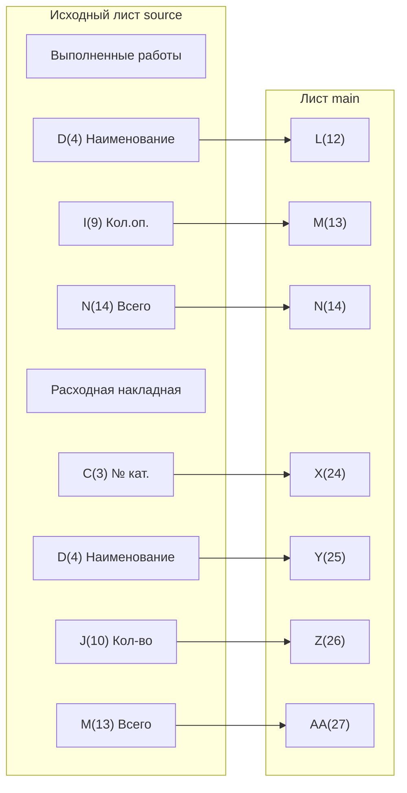

# План исправления `ImportDataToMain` — точный маппинг столбцов v2

## Проблема

В процедуре `ImportDataToMain` (`src/modules/Mod_Import.bas:56`) используются **неверные индексы столбцов** исходных таблиц из-за того, что в исходном листе Excel присутствуют **объединённые ячейки**, которые сдвигают реальные индексы колонок.

Текущий код ориентируется на «визуальную» нумерацию столбцов (A=1, B=2, C=3...), но из-за объединённых ячеек фактические индексы не совпадают с визуальными.

---

## Точный маппинг столбцов

### Таблица «Выполненные работы» — импорт в L(12), M(13), N(14)

| Поле | Исходный лист (визуально) | Исходный лист (реальный индекс) | Лист main (колонка) | Лист main (индекс) |
|------|--------------------------|-------------------------------|-------------------|-------------------|
| Наименование | D | **4** | L | **12** |
| Кол. оп. | I | **9** | M | **13** |
| Всего | N | **14** | N | **14** |

### Таблица «Расходная накладная» — импорт в X(24), Y(25), Z(26), AA(27)

| Поле | Исходный лист (визуально) | Исходный лист (реальный индекс) | Лист main (колонка) | Лист main (индекс) |
|------|--------------------------|-------------------------------|-------------------|-------------------|
| № кат. (Артикул) | C | **3** | X | **24** |
| Наименование | D | **4** | Y | **25** |
| Кол-во | J | **10** | Z | **26** |
| Всего | M | **13** | AA | **27** |

---

## Текущее состояние кода и необходимые изменения

### Блок «Выполненные работы» (строки 86–148)

#### Комментарий (строка 94)
**Текущее содержание (неверно):**
```
' Маппинг на main: D(Наименование)→L(12), E(Кол.оп.)→M(13), I(Всего)→N(14)
```
**Должно быть:**
```
' Маппинг на main: D(4)→L(12), I(9)→M(13), N(14)→N(14)
```

#### Строка 133 — Наименование (D→L) — **ВЕРНО**
```vba
wsMain.Cells(targetRow, 12).Value = wsSource.Cells(i, 4).Value ' D(4) -> L(12)
```
Изменений не требуется.

#### Строка 134 — Кол. оп. (E→M) — **НЕВЕРНО**, нужно I(9)→M(13)
**Текущее:**
```vba
wsMain.Cells(targetRow, 13).Value = wsSource.Cells(i, 5).Value ' E(Кол.оп.) -> M
```
**Должно быть:**
```vba
wsMain.Cells(targetRow, 13).Value = wsSource.Cells(i, 9).Value ' I(9) -> M(13)
```

#### Строка 135 — Всего (I→N) — **НЕВЕРНО**, нужно N(14)→N(14)
**Текущее:**
```vba
wsMain.Cells(targetRow, 14).Value = wsSource.Cells(i, 9).Value ' I(Всего) -> N
```
**Должно быть:**
```vba
wsMain.Cells(targetRow, 14).Value = wsSource.Cells(i, 14).Value ' N(14) -> N(14)
```

---

### Блок «Расходная накладная» (строки 150–205)

#### Комментарий (строка 158)
**Текущее содержание (неверно):**
```
' Маппинг на main: B(№ кат.)→X(24), C(Наименование)→Y(25), D(Кол-во)→Z(26), G(Всего)→AA(27)
```
**Должно быть:**
```
' Маппинг на main: C(3)→X(24), D(4)→Y(25), J(10)→Z(26), M(13)→AA(27)
```

#### Строка 189 — № кат. (B→X) — **НЕВЕРНО**, нужно C(3)→X(24)
**Текущее:**
```vba
wsMain.Cells(targetRow, 24).Value = wsSource.Cells(i, 2).Value ' B(№ кат.) -> X
```
**Должно быть:**
```vba
wsMain.Cells(targetRow, 24).Value = wsSource.Cells(i, 3).Value ' C(3) -> X(24)
```

#### Строка 190 — Наименование (C→Y) — **НЕВЕРНО**, нужно D(4)→Y(25)
**Текущее:**
```vba
wsMain.Cells(targetRow, 25).Value = wsSource.Cells(i, 3).Value ' C(Наименование) -> Y
```
**Должно быть:**
```vba
wsMain.Cells(targetRow, 25).Value = wsSource.Cells(i, 4).Value ' D(4) -> Y(25)
```

#### Строка 191 — Кол-во (D→Z) — **НЕВЕРНО**, нужно J(10)→Z(26)
**Текущее:**
```vba
wsMain.Cells(targetRow, 26).Value = wsSource.Cells(i, 4).Value ' D(Кол-во) -> Z
```
**Должно быть:**
```vba
wsMain.Cells(targetRow, 26).Value = wsSource.Cells(i, 10).Value ' J(10) -> Z(26)
```

#### Строка 192 — Всего (G→AA) — **НЕВЕРНО**, нужно M(13)→AA(27)
**Текущее:**
```vba
wsMain.Cells(targetRow, 27).Value = wsSource.Cells(i, 7).Value ' G(Всего) -> AA
```
**Должно быть:**
```vba
wsMain.Cells(targetRow, 27).Value = wsSource.Cells(i, 13).Value ' M(13) -> AA(27)
```

---

## Сводка изменений

| № | Файл | Строка | Суть изменения |
|---|------|--------|----------------|
| 1 | `Mod_Import.bas` | 94 | Исправить комментарий маппинга для «Выполненные работы» |
| 2 | `Mod_Import.bas` | 134 | `Cells(i, 5)` → `Cells(i, 9)` (Кол.оп.: E→I) |
| 3 | `Mod_Import.bas` | 135 | `Cells(i, 9)` → `Cells(i, 14)` (Всего: I→N) |
| 4 | `Mod_Import.bas` | 158 | Исправить комментарий маппинга для «Расходная накладная» |
| 5 | `Mod_Import.bas` | 189 | `Cells(i, 2)` → `Cells(i, 3)` (№ кат.: B→C) |
| 6 | `Mod_Import.bas` | 190 | `Cells(i, 3)` → `Cells(i, 4)` (Наименование: C→D) |
| 7 | `Mod_Import.bas` | 191 | `Cells(i, 4)` → `Cells(i, 10)` (Кол-во: D→J) |
| 8 | `Mod_Import.bas` | 192 | `Cells(i, 7)` → `Cells(i, 13)` (Всего: G→M) |

**Важно:** Индексы **целевых колонок** на листе `main` (L=12, M=13, N=14, X=24, Y=25, Z=26, AA=27) остаются без изменений. Меняются только индексы **источника** (первый аргумент `wsSource.Cells`).

---

## Диаграмма потока данных



---

## Порядок выполнения

1. Открыть `src/modules/Mod_Import.bas`
2. Внести 8 изменений согласно сводке выше
3. Проверить, что все комментарии отражают реальные индексы
4. Протестировать импорт на реальном файле `report.xlsx`