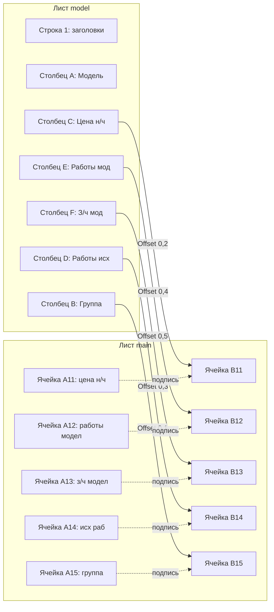

# План исправлений VBA-модулей проекта SysW

## Общая информация

- **Проект:** `L:\PROject\SysW`
- **Ветка:** `dev`
- **Кодировка файлов:** Windows-1251
- **Язык комментариев:** Русский
- **Принцип:** Только исправление существующего кода, без добавления нового функционала

---

## Исправление 1 (Критическое): `Btn_main_Import_Click` — замена вызова

### Файл
[`Mod_ButtonDispatcher.bas`](../Mod_ButtonDispatcher.bas:10)

### Суть
В строке 11 вызывается `Mod_Import.RunImport`, но такой процедуры нет в [`Mod_Import.bas`](../Mod_Import.bas). Правильное название — `ImportFromReport`.

### Изменение
```diff
- Mod_Import.RunImport
+ Mod_Import.ImportFromReport
```

### Риски
- Отсутствуют. `ImportFromReport` — публичная процедура, принимает 0 параметров, что совпадает с текущим вызовом.

---

## Исправление 2 (Высокое): `FillHeaderFromOrder` — коррекция маппинга B11:B15

### Файл
[`Mod_OrderHeader.bas`](../Mod_OrderHeader.bas:46)

### Суть
Заголовки в A11:A15 листа `main`:
| Ячейка | Заголовок | Источник в model | Столбец model |
|--------|-----------|-------------------|---------------|
| A11 | цена н/ч | Цена н/ч | C |
| A12 | работы модел | Работы мод | E |
| A13 | з/ч модел | З/ч мод | F |
| A14 | исх раб | Работы исх | D |
| A15 | группа | Группа | B |

Текущий код (неправильный):
```vba
wsMain.Range("B11").Value = ModelFound.Value              ' A: Модель
wsMain.Range("B12").Value = ModelFound.Offset(0, 1).Value ' B: Группа
wsMain.Range("B13").Value = ModelFound.Offset(0, 2).Value ' C: Цена н/ч
wsMain.Range("B14").Value = ModelFound.Offset(0, 3).Value ' D: Работы исх
```

### Изменение
```diff
- wsMain.Range("B11").Value = ModelFound.Value              ' A: Модель
- wsMain.Range("B12").Value = ModelFound.Offset(0, 1).Value ' B: Группа
- wsMain.Range("B13").Value = ModelFound.Offset(0, 2).Value ' C: Цена н/ч
- wsMain.Range("B14").Value = ModelFound.Offset(0, 3).Value ' D: Работы исх
+ wsMain.Range("B11").Value = ModelFound.Offset(0, 2).Value ' C: Цена н/ч → A11=цена н/ч
+ wsMain.Range("B12").Value = ModelFound.Offset(0, 4).Value ' E: Работы мод → A12=работы модел
+ wsMain.Range("B13").Value = ModelFound.Offset(0, 5).Value ' F: З/ч мод → A13=з/ч модел
+ wsMain.Range("B14").Value = ModelFound.Offset(0, 3).Value ' D: Работы исх → A14=исх раб
```

Также добавить заполнение B15 из model (Группа):
```diff
+ wsMain.Range("B15").Value = ModelFound.Offset(0, 1).Value ' B: Группа → A15=группа
```

**Важно:** B15 сейчас заполняется из `FoundCell.Offset(0, 9)` (столбец J листа spisok — Примечание). Нужно заменить на данные из model, т.к. A15=группа.

### Риски
- B15 ранее брался из spisok (столбец J: Примечание). После исправления B15 будет браться из model (столбец B: Группа). Это изменение семантики ячейки B15 — теперь она будет содержать "Группу", а не "Примечание". Необходимо убедиться, что это соответствует ожидаемому поведению.

---

## Исправление 3 (Среднее): `Btn_main_Clear_Click` — очистка UsedRange без заголовков

### Файл
[`Mod_ButtonDispatcher.bas`](../Mod_ButtonDispatcher.bas:28)

### Суть
Сейчас `ws.Cells.ClearContents` очищает весь лист, включая заголовки. Нужно очищать только область данных, исключая строки и столбцы заголовков.

### Изменение
Заменить строку 28:
```diff
- ws.Cells.ClearContents
+ ClearDataArea ws
```

И добавить вспомогательную процедуру в этот же модуль (или в `Mod_Utils.bas`):

```vba
' Очищает область данных на листе, сохраняя заголовки
Private Sub ClearDataArea(ByVal ws As Worksheet)
    Dim UsedRng As Range
    Dim ClearRng As Range
    Dim HeaderRow As Long
    Dim HeaderCol As Long

    On Error Resume Next
    Set UsedRng = ws.UsedRange
    On Error GoTo 0

    If UsedRng Is Nothing Then Exit Sub

    ' Определяем границы заголовков: пропускаем строку 1 (если там заголовки)
    ' и столбец A (если там подписи строк)
    HeaderRow = 1
    HeaderCol = 1

    ' Если UsedRange умещается только в заголовках — ничего не очищаем
    If UsedRng.Rows.Count <= HeaderRow Then Exit Sub
    If UsedRng.Columns.Count <= HeaderCol Then Exit Sub

    ' Диапазон очистки: со 2-й строки и 2-го столбца до конца UsedRange
    Set ClearRng = ws.Range( _
        ws.Cells(HeaderRow + 1, HeaderCol + 1), _
        ws.Cells(UsedRng.Rows.Count, UsedRng.Columns.Count) _
    )

    ClearRng.ClearContents
End Sub
```

**Альтернатива (проще):** Если структура листа фиксированная (заголовки в строке 1 и столбце A), можно очищать фиксированный диапазон:
```vba
ws.Range("B2:XFD1048576").ClearContents
```

Но первый вариант (программное определение) предпочтительнее, т.к. пользователь сказал "очищать UsedRange за вычетом строки заголовков".

### Риски
- Если на листе нет данных, `UsedRange` может быть `Nothing` — нужна проверка.
- Если UsedRange = одна ячейка с заголовком — ничего не очищаем (корректно).

---

## Исправление 4 (Низкое): Dead code в `Mod_Import.bas`

### Файл
[`Mod_Import.bas`](../Mod_Import.bas:108)

### Суть
Строка 108: `If DestRow < 2 Then DestRow = 2` никогда не сработает, т.к. `DestRow` вычисляется как `wsMain.Cells(wsMain.Rows.Count, "L").End(xlUp).Row + 1`, что минимально = 2 (если в столбце L нет данных, `End(xlUp)` вернёт 1, +1 = 2).

### Изменение
```diff
- If DestRow < 2 Then DestRow = 2
```

### Риски
- Отсутствуют. Это dead code, удаление не влияет на логику.

---

## Исправление 5 (Низкое): TC-17 — оставить SKIP

### Файл
[`Mod_FullTestRunner.bas`](../Mod_FullTestRunner.bas:414)

### Суть
TC-17 (`ImportFromReport`) пропускается, если нет листа `report`. Создание временных листов не требуется.

### Изменение
Не требуется. Оставить как есть:
```vba
If wsReport Is Nothing Then
    AddResult "TC-17", "ImportFromReport", True, "", True, "Нет листа 'report'"
```

---

## Исправление 6 (Низкое): TC-14 — оставить SKIP

### Файл
[`Mod_FullTestRunner.bas`](../Mod_FullTestRunner.bas:376)

### Суть
TC-14 (`SearchSheetByGRZ`) пропускается, если нет листа `GRZ_12345`. Создание временных листов не требуется.

### Изменение
Не требуется. Оставить как есть:
```vba
If wsFound Is Nothing Then
    AddResult "TC-14", "SearchSheetByGRZ существующий", True, "", True, "Нет листа с GRZ_12345"
```

---

## Порядок применения изменений

| № | Приоритет | Файл | Описание | Сложность |
|---|-----------|------|----------|-----------|
| 1 | Критический | `Mod_ButtonDispatcher.bas` | Замена вызова RunImport → ImportFromReport | 1 строка |
| 2 | Высокий | `Mod_OrderHeader.bas` | Коррекция Offset для B11:B15 | 4-5 строк |
| 3 | Средний | `Mod_ButtonDispatcher.bas` | Очистка UsedRange без заголовков | ~20 строк |
| 4 | Низкий | `Mod_Import.bas` | Удаление dead code | 1 строка |
| 5 | Низкий | `Mod_FullTestRunner.bas` | TC-17 — без изменений | 0 строк |
| 6 | Низкий | `Mod_FullTestRunner.bas` | TC-14 — без изменений | 0 строк |

---

## Схема маппинга model → main (B11:B15)



---

## Проверка после исправлений

1. **Исправление 1:** Нажать кнопку "Импорт" — должен запускаться `ImportFromReport`, а не вызывать ошибку "Sub not found".
2. **Исправление 2:** Ввести номер заказа в B2 — B11:B15 должны заполниться данными из model в соответствии с заголовками A11:A15.
3. **Исправление 3:** Нажать кнопку "Очистить" — должны очиститься только данные, заголовки должны сохраниться.
4. **Исправление 4:** Импорт данных должен работать без ошибок (dead code удалён).
5. **Исправление 5-6:** Тесты TC-14 и TC-17 должны проходить со статусом SKIP (без ошибок).