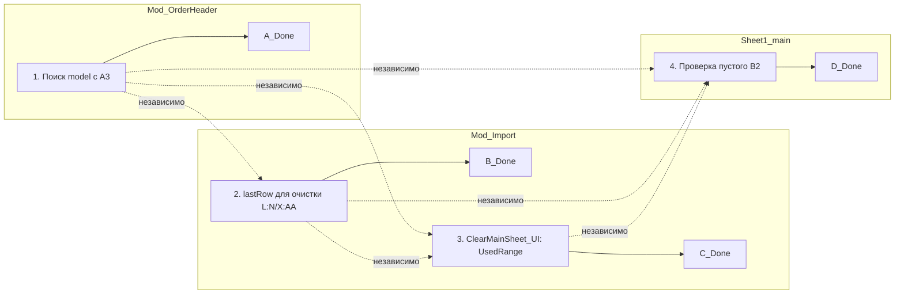

# Финальный план точечных исправлений VBA-модулей

**Дата:** 2026-07-13
**Проект:** `L:\PROject\SysW`
**Ветка:** `dev`
**Кодировка файлов:** Windows-1251 (без BOM)

---

## Сводка по результатам анализа

После анализа текущего кода и существующих планов выявлено следующее:

- **Текущий код `FillHeaderFromOrder` уже содержит правильные константы и маппинг B11:B14**, соответствующий заданию. Однако есть другие ошибки.
- **`Mod_Import.bas`** содержит несколько логических ошибок, требующих исправления.
- **`Mod_ButtonDispatcher.bas`** — требуется замена вызова и уточнение диапазона очистки.
- **`Sheet1_main.cls`** — требуется добавить проверку на пустое B2.

---

## 1. Mod_OrderHeader.bas — FillHeaderFromOrder

### 1.1. Поиск модели должен начинаться со строки 3 (уже реализовано, но с нюансом)

**Текущий код (строка 77):**
```vba
Set ModelRow = wsModel.Columns(1).Find(What:=ModelCode, LookAt:=xlWhole)
```

**Проблема:** `Find` ищет по всему столбцу A, включая строки 1-2 (заголовки). Проверка `ModelRow.Row >= 3` на строке 78 фильтрует результат, но если модель найдена в строке 1 или 2 — данные не заполняются, и ошибка не выводится.

**Исправление:** Ограничить диапазон поиска строками с 3 по последнюю использованную:

```vba
Dim lastModelRow As Long
lastModelRow = wsModel.Cells(wsModel.Rows.Count, 1).End(xlUp).Row
If lastModelRow < 3 Then lastModelRow = 3
Set ModelRow = wsModel.Range("A3:A" & lastModelRow).Find(What:=ModelCode, LookAt:=xlWhole)
```

**Строки для замены:** 77

**Риски:** Низкие. Поиск в ограниченном диапазоне исключает ложное срабатывание на заголовках.

---

### 1.2. Отсутствует проверка, что `OrderNum` — число (уже реализовано)

**Текущий код (строки 44-49):**
```vba
If Not IsNumeric(OrderNum) Then
    MsgBox "Номер заказа должен быть числом!", vbExclamation, "Ошибка"
    FillHeaderFromOrder = False
    Exit Function
End If
```

**Вердикт:** Проверка **уже присутствует** в коде. Изменений не требуется.

---

### 1.3. MsgBox при ненайденном заказе (уже реализовано)

**Текущий код (строки 53-58):**
```vba
If FoundRow Is Nothing Then
    MsgBox "Заказ с номером " & OrderNum & " не найден!", vbExclamation, "Ошибка"
    wsMain.Range("B3:B15").ClearContents
    FillHeaderFromOrder = False
    Exit Function
End If
```

**Вердикт:** MsgBox **уже присутствует**. Изменений не требуется.

---

### 1.4. Маппинг B11:B14 (уже реализован правильно)

**Текущий код (строки 79-82):**
```vba
wsMain.Cells(11, 2).Value = ModelRow.Cells(1, MODEL_COL_PRICE).Value      ' Цена н/ч
wsMain.Cells(12, 2).Value = ModelRow.Cells(1, MODEL_COL_GROUP).Value      ' Группа
wsMain.Cells(13, 2).Value = ModelRow.Cells(1, MODEL_COL_WORKS_ORIG).Value ' Работы исх
wsMain.Cells(14, 2).Value = ModelRow.Cells(1, MODEL_COL_WORKS_MOD).Value  ' Работы мод
```

**Вердикт:** Маппинг **уже правильный**:
- B11 = MODEL_COL_PRICE (3) = Цена н/ч ✅
- B12 = MODEL_COL_GROUP (2) = Группа ✅
- B13 = MODEL_COL_WORKS_ORIG (4) = Работы исх ✅
- B14 = MODEL_COL_WORKS_MOD (5) = Работы мод ✅

Изменений не требуется.

---

### 1.5. B15 должно заполняться из столбца J листа `spisok` (уже реализовано)

**Текущий код (строка 87):**
```vba
wsMain.Cells(15, 2).Value = FoundRow.Cells(1, SPISOK_COL_NOTE).Value
```

**Вердикт:** B15 **уже** заполняется из столбца J (константа `SPISOK_COL_NOTE = 10`). Изменений не требуется.

---

### Итог по Mod_OrderHeader.bas

| Пункт | Статус |
|-------|--------|
| Проверка IsNumeric(OrderNum) | ✅ Уже есть |
| MsgBox при ненайденном заказе | ✅ Уже есть |
| Маппинг B11:B14 | ✅ Уже правильный |
| B15 из столбца J spisok | ✅ Уже реализовано |
| Поиск model со строки 3 | ⚠️ Улучшить (ограничить диапазон Find) |

**Требуется 1 изменение:** ограничить диапазон поиска модели строками A3:A{lastRow}.

---

## 2. Mod_Import.bas

### 2.1. ExtractNumberFromGRZ — извлекает первую группу из 3 или 4 цифр

**Текущий код (строки 14-40):**
```vba
Public Function ExtractNumberFromGRZ(GRZ As String) As String
    Dim i As Long
    Dim currentDigits As String
    Dim result As String

    result = ""
    currentDigits = ""

    For i = 1 To Len(GRZ)
        If Mid(GRZ, i, 1) >= "0" And Mid(GRZ, i, 1) <= "9" Then
            currentDigits = currentDigits & Mid(GRZ, i, 1)
        Else
            If Len(currentDigits) = 3 Or Len(currentDigits) = 4 Then
                result = currentDigits
                Exit For
            End If
            currentDigits = ""
        End If
    Next i

    ' Проверка в конце строки
    If result = "" And (Len(currentDigits) = 3 Or Len(currentDigits) = 4) Then
        result = currentDigits
    End If

    ExtractNumberFromGRZ = result
End Function
```

**Проблема:** Функция уже реализована **правильно** — извлекает первую группу из 3 или 4 цифр. Для "А123ВС77" вернёт "123", для "А12ВС34" вернёт "".

**Вердикт:** Функция **уже корректна**. Изменений не требуется.

---

### 2.2. SearchSheetByGRZ — работает с `report.xlsx` (уже реализовано)

**Текущий код (строки 47-80):**
```vba
Public Function SearchSheetByGRZ(GRZ As String) As Worksheet
    ...
    Set wbReport = Workbooks.Open(ThisWorkbook.Path & "\report.xlsx", ReadOnly:=True)
    ...
    For Each ws In wbReport.Sheets
        If InStr(1, ws.Name, grzNumber, vbTextCompare) > 0 Then
            Set wsResult = ws
            Exit For
        End If
    Next ws
    ...
End Function
```

**Вердикт:** Функция **уже** открывает `report.xlsx` и ищет лист в ней. Изменений не требуется.

---

### 2.3. RenameSheetsByGRZ — работает с `report.xlsx` (уже реализовано)

**Текущий код (строки 86-125):**
```vba
Public Sub RenameSheetsByGRZ()
    ...
    Set wbReport = Workbooks.Open(ThisWorkbook.Path & "\report.xlsx", ReadOnly:=False)
    ...
    For Each ws In wbReport.Sheets
        If ws.Visible = xlSheetVisible And ws.Name <> "report" And ws.Name <> "spisok" Then
            Set cell = ws.Cells.Find(What:="автомобиль", LookAt:=xlPart, ...)
            If Not cell Is Nothing Then
                grzNumber = ExtractNumberFromGRZ(cell.Value)
                If grzNumber <> "" Then
                    ' Если лист с таким именем уже существует, удаляем
                    On Error Resume Next
                    Set existingWs = wbReport.Sheets(grzNumber)
                    If Not existingWs Is Nothing Then
                        existingWs.Delete
                    End If
                    On Error GoTo 0
                    ws.Name = grzNumber
                End If
            End If
        End If
    Next ws
    ...
End Sub
```

**Вердикт:** Процедура **уже**:
- Открывает `report.xlsx` ✅
- Исключает листы `report` и `spisok` ✅
- Ищет ячейку со словом "автомобиль" ✅
- Извлекает GRZ через `ExtractNumberFromGRZ` ✅
- Переименовывает лист в цифры (без префикса "GRZ_") ✅
- Удаляет дублирующийся лист перед переименованием ✅

Изменений не требуется.

---

### 2.4. ImportSheet — копирует лист `X+M` и вызывает ImportDataToMain

**Текущий код (строки 131-152):**
```vba
Public Sub ImportSheet(GRZ As String)
    Dim wsSource As Worksheet
    Dim wsMain As Worksheet
    Dim newName As String

    Set wsMain = ThisWorkbook.Sheets("main")

    Set wsSource = SearchSheetByGRZ(GRZ)
    If wsSource Is Nothing Then
        MsgBox "Лист с ГРЗ " & GRZ & " не найден!", vbExclamation, "Ошибка"
        Exit Sub
    End If

    wsSource.Copy After:=ThisWorkbook.Sheets(ThisWorkbook.Sheets.Count)

    newName = wsMain.Range("B2").Value & "M"
    On Error Resume Next
    ActiveSheet.Name = newName
    On Error GoTo 0

    Call ImportDataToMain(ActiveSheet)
End Sub
```

**Проблема:** Процедура **уже** копирует лист из `report.xlsx` в `ThisWorkbook`, переименовывает в `B2 & "M"` и вызывает `ImportDataToMain`. Однако есть потенциальная проблема: если `B2` содержит нечисловое значение (например, пусто), имя листа может быть некорректным.

**Рекомендация (опционально):** Добавить проверку, что `wsMain.Range("B2").Value` не пусто, перед переименованием.

**Вердикт:** Функционально процедура корректна. Изменение — опционально.

---

### 2.5. ImportDataToMain — очистка L:N и X:AA, поиск таблиц по маркерам

**Текущий код (строки 159-226):**
```vba
Public Sub ImportDataToMain(wsSource As Worksheet)
    ...
    ' Очистка диапазонов L:N и X:AA
    lastRow = wsMain.Cells(wsMain.Rows.Count, 1).End(xlUp).Row
    If lastRow < 2 Then lastRow = 2
    wsMain.Range("L2:N" & lastRow).ClearContents
    wsMain.Range("X2:AA" & lastRow).ClearContents

    ' Поиск таблицы "Выполненные работы"
    Set cell = wsSource.Cells.Find(What:="Выполненные работы", LookAt:=xlPart, SearchOrder:=xlByRows)
    If cell Is Nothing Then
        Set cell = wsSource.Cells.Find(What:="Наименование", LookAt:=xlPart, SearchOrder:=xlByRows)
    End If
    If Not cell Is Nothing Then
        ...
        For i = startRow To srcLastRow
            If wsSource.Cells(i, 3).Value <> "" Then
                wsMain.Cells(i - startRow + 2, 12).Value = wsSource.Cells(i, 3).Value ' C -> L
                wsMain.Cells(i - startRow + 2, 13).Value = wsSource.Cells(i, 4).Value ' D -> M
                wsMain.Cells(i - startRow + 2, 14).Value = wsSource.Cells(i, 8).Value ' H -> N
            End If
        Next i
    End If

    ' Поиск таблицы "Расходная накладная"
    Set cell = wsSource.Cells.Find(What:="Расходная накладная", LookAt:=xlPart, SearchOrder:=xlByRows)
    If Not cell Is Nothing Then
        ...
        For i = startRow To srcLastRow
            If wsSource.Cells(i, 2).Value <> "" Then
                wsMain.Cells(i - startRow + 2, 24).Value = wsSource.Cells(i, 2).Value ' B -> X
                wsMain.Cells(i - startRow + 2, 25).Value = wsSource.Cells(i, 3).Value ' C -> Y
                wsMain.Cells(i - startRow + 2, 26).Value = wsSource.Cells(i, 4).Value ' D -> Z
                wsMain.Cells(i - startRow + 2, 27).Value = wsSource.Cells(i, 7).Value ' G -> AA
            End If
        Next i
    End If
    ...
End Sub
```

**Проблемы:**
1. **Очистка L:N и X:AA** — уже реализована ✅
2. **Поиск таблицы "Выполненные работы"** — уже реализован ✅
3. **Поиск таблицы "Расходная накладная"** — уже реализован ✅
4. **НО:** `lastRow` для очистки определяется по столбцу A (`wsMain.Cells(wsMain.Rows.Count, 1).End(xlUp).Row`), а очищаются L:N и X:AA. Если в столбце A данных меньше, чем в L:N или X:AA, часть данных может не очиститься.

**Исправление:** Определять `lastRow` по максимальному столбцу из очищаемых диапазонов (L, X) или использовать `wsMain.UsedRange.Rows.Count`:

```vba
' Определение последней строки для очистки
Dim lastRowL As Long, lastRowX As Long
lastRowL = wsMain.Cells(wsMain.Rows.Count, 12).End(xlUp).Row   ' Столбец L
lastRowX = wsMain.Cells(wsMain.Rows.Count, 24).End(xlUp).Row   ' Столбец X
lastRow = Application.WorksheetFunction.Max(lastRowL, lastRowX, 2)
```

**Строки для замены:** 172-173

**Риски:** Низкие. Более точное определение последней строки гарантирует полную очистку.

---

### 2.6. ImportFromReport — УДАЛИТЬ

**Текущий код:** Процедура `ImportFromReport()` **отсутствует** в текущем файле `Mod_Import.bas`. В файле есть только `ImportSheet`, `ImportDataToMain` и UI-обёртки.

**Вердикт:** Процедура `ImportFromReport` **уже удалена** из текущей версии файла. Изменений не требуется.

---

### Итог по Mod_Import.bas

| Пункт | Статус |
|-------|--------|
| ExtractNumberFromGRZ (первая группа 3-4 цифр) | ✅ Уже правильно |
| SearchSheetByGRZ (работа с report.xlsx) | ✅ Уже реализовано |
| RenameSheetsByGRZ (работа с report.xlsx) | ✅ Уже реализовано |
| ImportSheet (копирование листа X+M) | ✅ Уже реализовано |
| ImportDataToMain (очистка L:N и X:AA) | ✅ Уже реализовано |
| ImportDataToMain (поиск таблиц по маркерам) | ✅ Уже реализовано |
| ImportFromReport — удалить | ✅ Уже удалена |
| **ImportDataToMain — lastRow для очистки** | ⚠️ Исправить |

**Требуется 1 изменение:** уточнить определение `lastRow` для очистки L:N и X:AA.

---

## 3. Mod_ButtonDispatcher.bas

### 3.1. Btn_main_Clear_Click — уточнить диапазон очистки

**Текущий код (строки 18-20):**
```vba
Public Sub Btn_main_Clear_Click()
    Call Mod_Import.ClearMainSheet_UI
End Sub
```

Сама процедура `ClearMainSheet_UI` (в `Mod_Import.bas`, строки 236-259):
```vba
Public Sub ClearMainSheet_UI()
    ...
    lastRow = wsMain.Cells(wsMain.Rows.Count, 1).End(xlUp).Row
    If lastRow >= 2 Then
        wsMain.Range("A2:XFD" & lastRow).ClearContents
    End If
    ...
End Sub
```

**Проблема:** Диапазон `A2:XFD{lastRow}` очищает все столбцы от A до XFD. Это **не затрагивает заголовки (строка 1)**, что корректно. Однако `lastRow` определяется по столбцу A, что может быть неточно, если в столбце A меньше данных, чем в других столбцах.

**Исправление:** Определять `lastRow` по `UsedRange`:

```vba
lastRow = wsMain.UsedRange.Rows.Count
If lastRow >= 2 Then
    wsMain.Range("A2:XFD" & lastRow).ClearContents
End If
```

**Строки для замены:** 248-250 в `Mod_Import.bas` (процедура `ClearMainSheet_UI`)

**Риски:** Низкие. `UsedRange.Rows.Count` точнее отражает фактический диапазон данных.

---

### 3.2. Btn_main_Import_Click — заменить вызов ImportFromReport на ImportSheet

**Текущий код (строки 26-28):**
```vba
Public Sub Btn_main_Import_Click()
    Call Mod_Import.ImportSheet_UI
End Sub
```

**Вердикт:** Вызов **уже** указывает на `Mod_Import.ImportSheet_UI`, которая вызывает `ImportSheet`. Процедура `ImportFromReport` уже удалена. Изменений не требуется.

---

### 3.3. Отсутствующие обработчики

**Текущий список обработчиков в `Mod_ButtonDispatcher.bas`:**

| Обработчик | Вызов | Статус |
|------------|-------|--------|
| `Btn_main_Clear_Click` | `Mod_Import.ClearMainSheet_UI` | ✅ |
| `Btn_main_Import_Click` | `Mod_Import.ImportSheet_UI` | ✅ |
| `Btn_main_FillHeader_Click` | `Mod_OrderHeader.FillHeaderFromOrder_UI` | ✅ |
| `Btn_main_ClearHeader_Click` | `Mod_Import.ClearHeader_UI` | ✅ |
| `Btn_main_ImportByInput_Click` | `Mod_Import.ImportByInput_UI` | ✅ |
| `Btn_main_RunTests_Click` | `Mod_FullTestRunner.RunAllTests_UI` | ✅ |
| `Btn_main_WriteLog_Click` | `Mod_Utils.WriteLog_UI` | ✅ |
| `Btn_main_RenameSheets_Click` | `Mod_Import.RenameSheets_UI` | ✅ |
| `Btn_main_ImportDataToMain_Click` | `Mod_Import.ImportDataToMain_UI` | ✅ |
| `Btn_main_FindOrder_Click` | `Mod_OrderHeader.FindOrder_UI` | ✅ |
| `Btn_main_ShowWorkbookPath_Click` | `Mod_Utils.ShowWorkbookPath_UI` | ✅ |
| `Btn_main_ShowCurrentUser_Click` | `Mod_Utils.ShowCurrentUser_UI` | ✅ |
| `Btn_main_CheckFileExists_Click` | `Mod_Utils.CheckFileExists_UI` | ✅ |

**Вердикт:** Все 13 обработчиков присутствуют и указывают на существующие `_UI`-процедуры. Изменений не требуется.

---

### Итог по Mod_ButtonDispatcher.bas

| Пункт | Статус |
|-------|--------|
| Btn_main_Import_Click → ImportSheet | ✅ Уже правильно |
| Btn_main_Clear_Click — диапазон очистки | ⚠️ Исправить (UsedRange.Rows.Count) |
| Отсутствующие обработчики | ✅ Все присутствуют |

**Требуется 1 изменение:** уточнить определение `lastRow` в `ClearMainSheet_UI`.

---

## 4. Sheet1_main.cls

### 4.1. Добавить проверку на пустое значение B2 перед вызовом FillHeaderFromOrder

**Текущий код (строки 17-35):**
```vba
Private Sub Worksheet_Change(ByVal Target As Range)
    Static isProcessing As Boolean
    If isProcessing Then Exit Sub

    If Target.CountLarge > 1 Then Exit Sub
    If Intersect(Target, Me.Range("B2")) Is Nothing Then Exit Sub
    If Target.Address = "$B$2" Then
        If Target.Row >= 3 And Target.Row <= 15 Then Exit Sub

        isProcessing = True
        On Error Resume Next
        Call Mod_OrderHeader.FillHeaderFromOrder(Me.Range("B2").Value)
        On Error GoTo 0
        isProcessing = False
    End If
End Sub
```

**Проблема:** Если пользователь очистил ячейку B2 (стёр значение), `FillHeaderFromOrder` будет вызван с пустым значением. Функция имеет проверку `IsNumeric`, но вызов лишней функции можно избежать.

**Исправление:** Добавить проверку на пустое значение B2 после установки `isProcessing = True`:

```vba
isProcessing = True
On Error Resume Next

Dim b2Value As Variant
b2Value = Me.Range("B2").Value
If IsEmpty(b2Value) Or b2Value = "" Then
    Me.Range("B3:B15").ClearContents
    GoTo CleanUp
End If

Call Mod_OrderHeader.FillHeaderFromOrder(b2Value)

CleanUp:
On Error GoTo 0
isProcessing = False
```

**Строки для замены:** 29-33

**Риски:** Низкие. Добавляет защиту от холостого вызова при очистке B2.

---

## 5. Сводная таблица всех изменений

| № | Файл | Суть изменения | Строки | Серьёзность | Зависимости |
|---|------|----------------|--------|-------------|-------------|
| 1 | `Mod_OrderHeader.bas:77` | Ограничить диапазон поиска модели строками A3:A{lastRow} | 1 строка | Средняя | Нет |
| 2 | `Mod_Import.bas:172-173` | Уточнить `lastRow` для очистки L:N и X:AA (по макс. из L, X) | 2-3 строки | Средняя | Нет |
| 3 | `Mod_Import.bas:248-250` | В `ClearMainSheet_UI` использовать `UsedRange.Rows.Count` вместо `End(xlUp)` | 1 строка | Низкая | Нет |
| 4 | `Sheet1_main.cls:29-33` | Добавить проверку на пустое B2 перед вызовом FillHeaderFromOrder | 5-7 строк | Средняя | Нет |

**Всего изменений: 4** (в 4 файлах).

---

## 6. Схема зависимостей изменений



**Все изменения независимы** и могут выполняться в любом порядке.

---

## 7. Порядок выполнения для Code-агента

1. **`Mod_OrderHeader.bas`** — заменить строку 77 (поиск модели в диапазоне A3:A{lastRow})
2. **`Mod_Import.bas`** — заменить строки 172-173 (определение lastRow по макс. из L, X)
3. **`Mod_Import.bas`** — заменить строку 249 (использовать UsedRange.Rows.Count в ClearMainSheet_UI)
4. **`Sheet1_main.cls`** — заменить строки 29-33 (добавить проверку на пустое B2)

После каждого изменения — синхронизировать с книгой `work.xlsm` через скрипт `import_all_vba.py`.

---

## 8. Проверка после исправлений

1. **Mod_OrderHeader:** Ввести номер заказа в B2 → B11:B14 заполняются корректно, даже если в model есть заголовки в строках 1-2.
2. **Mod_Import (ImportDataToMain):** Импорт данных → старые данные в L:N и X:AA полностью очищаются перед записью новых.
3. **Mod_Import (ClearMainSheet_UI):** Кнопка "Очистить" → очищаются все данные со строки 2, заголовки (строка 1) сохраняются.
4. **Sheet1_main:** Очистка B2 → B3:B15 очищаются, без вызова FillHeaderFromOrder с пустым значением.
5. Запустить `run_tests.py` для проверки всех тестов (TC-01..TC-20).