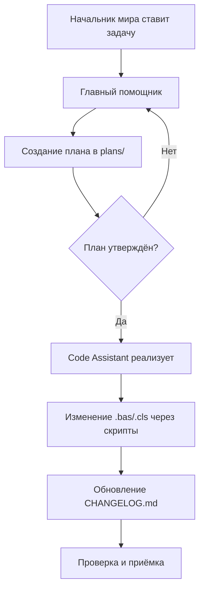

# План Этапа 1: Интеграция SourceCraft Code Assistant

## Обзор

Проект SysW уже частично интегрирован с SourceCraft:
- `.ycarules` существует (18 правил)
- `.vscode/settings.json` настроен (VBA Language Server, UTF-8, кастомный терминал)
- `README.md` упоминает SourceCraft Code Assistant

Требуется доработать интеграцию по трём направлениям.

---

## 1. Проверка и обновление `.ycarules`

### Текущее состояние
Файл содержит 18 правил, но есть пробелы:

| # | Чего не хватает | Почему важно |
|---|-----------------|--------------|
| 1 | Нет правила про `plans/` директорию | Агент должен знать, что планы хранятся в `plans/`, и перед изменением VBA-модулей必须先 создать план |
| 2 | Нет явного указания на двухфазную модель для PowerShell-скрипта | Новый `Import-VbaFromExcel.ps1` должен работать с CP1251→UTF-8 |
| 3 | Нет правила про `scripts/` директорию | Нужно закрепить, что вспомогательные скрипты — в `scripts/` |
| 4 | Нет правила про формат планов | Планы должны быть в Markdown с чеклистами |
| 5 | Нет упоминания `CHANGELOG.md` | Агент должен обновлять changelog при изменениях |
| 6 | Нет правила про `docs/` директорию | Если появится документация — где её хранить |

### Предлагаемые изменения

**Добавить в `.ycarules` следующие блоки:**

#### Блок 1: Директория планов
```yaml
## Директория планов
Перед внесением изменений в VBA-модули (.bas, .cls, .frm) необходимо:
1. Создать план в директории `plans/` с описанием предполагаемых изменений
2. Согласовать план с пользователем
3. Только после утверждения плана вносить изменения
Формат плана: Markdown (.md) с чеклистами задач.
```

#### Блок 2: Структура проекта
```yaml
## Структура проекта
- `plans/` — планы изменений, архитектурные решения, отчёты
- `scripts/` — вспомогательные PowerShell-скрипты автоматизации
- `docs/` — документация проекта (если требуется)
- `.vscode/` — настройки VS Code
- Корень проекта — VBA-модули (.bas, .cls), Python-скрипты, конфиги
```

#### Блок 3: PowerShell-скрипты и двухфазная кодировка
```yaml
## PowerShell-скрипты и двухфазная кодировка VBA
PowerShell-скрипты в `scripts/` должны:
- Работать с двухфазной моделью кодировки VBA (UTF-8 на диске, CP1251 в Excel)
- Использовать кодировку UTF-8 с BOM для самого скрипта (требование PowerShell)
- Не изменять VBA-модули напрямую — только через скрипты импорта/экспорта
```

#### Блок 4: CHANGELOG
```yaml
## Обновление CHANGELOG.md
При любых изменениях, влияющих на функциональность проекта, обновлять `CHANGELOG.md` в формате Keep a Changelog.
```

### Итоговый diff для `.ycarules`

Добавить после строки 60 (после блока про двухфазную модель кодировки):

```
## Директория планов
Перед внесением изменений в VBA-модули (.bas, .cls, .frm) необходимо:
1. Создать план в директории `plans/` с описанием предполагаемых изменений
2. Согласовать план с пользователем
3. Только после утверждения плана вносить изменения
Формат плана: Markdown (.md) с чеклистами задач.

## Структура проекта
- `plans/` — планы изменений, архитектурные решения, отчёты
- `scripts/` — вспомогательные PowerShell-скрипты автоматизации
- `docs/` — документация проекта (если требуется)
- `.vscode/` — настройки VS Code
- Корень проекта — VBA-модули (.bas, .cls), Python-скрипты, конфиги

## PowerShell-скрипты и двухфазная кодировка VBA
PowerShell-скрипты в `scripts/` должны:
- Работать с двухфазной моделью кодировки VBA (UTF-8 на диске, CP1251 в Excel)
- Использовать кодировку UTF-8 с BOM для самого скрипта (требование PowerShell)
- Не изменять VBA-модули напрямую — только через скрипты импорта/экспорта

## Обновление CHANGELOG.md
При любых изменениях, влияющих на функциональность проекта, обновлять `CHANGELOG.md` в формате Keep a Changelog.
```

---

## 2. PowerShell-скрипт `scripts/Import-VbaFromExcel.ps1`

### Назначение
Импортировать VBA-модули из Excel-файла (`work.xlsm`) в текстовые `.bas`/`.cls` файлы на диске с конвертацией CP1251 → UTF-8.

### Отличие от `export_vba.py`
`export_vba.py` — Python-скрипт, требует `pywin32`. PowerShell-скрипт — альтернатива для случаев, когда Python недоступен или нужно быстро выполнить импорт из Excel.

### Структура скрипта

```powershell
# scripts/Import-VbaFromExcel.ps1
# -*- coding: utf-8-with-bom -*-
<#
.SYNOPSIS
    Import VBA modules from work.xlsm to UTF-8 source files.
.DESCRIPTION
    Two-phase encoding model:
      1. Excel exports VBA modules in Windows-1251 encoding
      2. This script converts them to UTF-8 for storage on disk
.PARAMETER ExcelPath
    Path to the Excel workbook. Default: L:\PROject\SysW\work.xlsm
.PARAMETER OutputDir
    Output directory for .bas/.cls files. Default: L:\PROject\SysW
.PARAMETER DryRun
    Show what would be exported without actually doing it.
.EXAMPLE
    .\scripts\Import-VbaFromExcel.ps1
    .\scripts\Import-VbaFromExcel.ps1 -DryRun
#>
```

**Логика работы:**

1. **Параметры**: `[string]$ExcelPath`, `[string]$OutputDir`, `[switch]$DryRun`
2. **Проверка**: существует ли `work.xlsm`
3. **Создание COM-объекта**: `New-Object -ComObject Excel.Application`
4. **Открытие книги**: `$excel.Workbooks.Open($ExcelPath)`
5. **Доступ к VBAProject**: `$workbook.VBProject`
6. **Маппинг компонентов** (тот же, что в `export_vba.py`):
   - `Mod_Utils` → `Mod_Utils.bas`
   - `Mod_OrderHeader` → `Mod_OrderHeader.bas`
   - `Mod_Import` → `Mod_Import.bas`
   - `Mod_ButtonDispatcher` → `Mod_ButtonDispatcher.bas`
   - `Mod_FullTestRunner` → `Mod_FullTestRunner.bas`
   - `Sheet1` → `Sheet1_main.cls`
7. **Экспорт каждого компонента** во временную директорию
8. **Чтение временного файла** в кодировке CP1251
9. **Запись в целевую директорию** в UTF-8 (без BOM)
10. **Очистка временной директории**
11. **Закрытие Excel**

**Обработка ошибок:**
- Проверка `Trust access to VBA project object model`
- Проверка, что файл не открыт в Excel
- Graceful cleanup в `finally`-блоке

**Требования к кодировке самого скрипта:**
- UTF-8 with BOM (требование PowerShell для корректной обработки кириллицы)
- В `.gitattributes` добавить `*.ps1 text`

---

## 3. Документация по SourceCraft

### Вариант А: Отдельный файл `docs/sourcecraft-guide.md`

Рекомендуемый вариант, т.к. README.md уже содержит базовое описание, и добавление большого раздела сделает его перегруженным.

### Содержание `docs/sourcecraft-guide.md`

```markdown
# Руководство по работе с SourceCraft Code Assistant

## Архитектура взаимодействия

### Роли
- **Начальник мира** — генерация идей, постановка задач, ключевые решения
- **Главный помощник** — координация, декомпозиция, промты для Code Assistant
- **Code Assistant (DevOps-команда)** — написание кода по готовым промтам

### Процесс разработки
1. Начальник мира ставит задачу
2. Главный помощник декомпозирует задачу в план (`plans/`)
3. План утверждается Начальником мира
4. Code Assistant реализует план
5. Результат проверяется и принимается

## Правила работы (из .ycarules)

### Двухфазная модель кодировки VBA
- **На диске** — UTF-8 (VS Code, Git, code review)
- **В Excel/VBA Editor** — Windows-1251 (COM-автоматизация)
- Конвертация: `import_all_vba.py` (UTF-8 → CP1251) и `export_vba.py` (CP1251 → UTF-8)

### Запрет самовольных правок VBA-модулей
Изменения в .bas/.cls/.frm — только после создания и утверждения плана.

### Запрет кириллицы в именах
Имена файлов, папок, модулей, процедур, переменных — только латиница.

## Рабочий процесс

### Ежедневная работа
1. Открыть VS Code в `L:\PROject\SysW`
2. Терминал SourceCraft (PowerShell с UTF-8 и .venv) — автоматически
3. Работа с VBA-модулями через Python-скрипты:
   - `python export_vba.py` — выгрузить из Excel на диск
   - `python import_all_vba.py` — загрузить с диска в Excel
   - `python run_tests.py` — запустить тесты

### PowerShell-скрипты
- `scripts/Import-VbaFromExcel.ps1` — альтернативный импорт из Excel (без Python)
- Все PowerShell-скрипты в UTF-8 with BOM

## Структура проекта
- `plans/` — планы изменений
- `scripts/` — PowerShell-скрипты
- `docs/` — документация
- Корень — VBA-модули, Python-скрипты, конфиги
```

### Вариант Б: Раздел в README.md

Если предпочтительнее дополнить README.md, добавить раздел перед "История изменений":

```markdown
## Работа с SourceCraft Code Assistant

### Процесс
1. Задача ставится Начальником мира
2. Главный помощник создаёт план в `plans/`
3. После утверждения плана Code Assistant реализует

### Ключевые правила
- **Двухфазная кодировка VBA**: UTF-8 на диске, CP1251 в Excel
- **Запрет самовольных правок VBA**: только через план
- **Запрет кириллицы в именах**: только латиница

### Скрипты
| Скрипт | Назначение |
|--------|------------|
| `export_vba.py` | Выгрузка VBA из Excel (CP1251 → UTF-8) |
| `import_all_vba.py` | Загрузка VBA в Excel (UTF-8 → CP1251) |
| `run_tests.py` | Запуск тестов VBA |
| `scripts/Import-VbaFromExcel.ps1` | Альтернативный импорт из Excel |

### Структура
- `plans/` — планы изменений
- `scripts/` — PowerShell-скрипты
- `docs/` — документация
```

---

## Итоговый список изменений (для Code-агента)

| # | Файл | Действие | Описание |
|---|------|----------|----------|
| 1 | `.ycarules` | **Изменить** | Добавить 4 новых блока правил (директория планов, структура проекта, PowerShell-скрипты, CHANGELOG) |
| 2 | `scripts/Import-VbaFromExcel.ps1` | **Создать** | PowerShell-скрипт импорта VBA из Excel с конвертацией CP1251 → UTF-8 |
| 3 | `docs/sourcecraft-guide.md` | **Создать** | Руководство по работе с SourceCraft Code Assistant |
| 4 | `.gitattributes` | **Изменить** | Добавить `*.ps1 text` для PowerShell-скриптов |
| 5 | `CHANGELOG.md` | **Изменить** | Добавить запись о версии 0.3.0 с изменениями Этапа 1 |

### Блок-схема процесса



### Примечания для Code-агента

1. **`.ycarules`** — добавлять новые блоки после строки 60, перед концом файла. Сохранить все существующие правила.
2. **`scripts/Import-VbaFromExcel.ps1`** — создать директорию `scripts/`, если её нет. Скрипт должен быть в UTF-8 with BOM.
3. **`docs/sourcecraft-guide.md`** — создать директорию `docs/`, если её нет.
4. **`.gitattributes`** — добавить строку `*.ps1 text` в секцию текстовых файлов.
5. **`CHANGELOG.md`** — добавить запись `[0.3.0]` с датой и списком изменений.