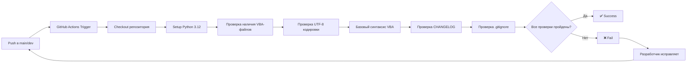

# Этап 2: Интеграция GitHub репозитория

## Цель

Настроить CI-проверки через GitHub Actions и добавить Git-инструкции в документацию проекта.

---

## 1. GitHub Actions Workflow

### Файл: `.github/workflows/vba-check.yml`

**Назначение:** Автоматическая проверка VBA-модулей при пуше в `main`/`dev` и при Pull Request.

```yaml
name: VBA Check

on:
  push:
    branches: [main, dev]
  pull_request:
    branches: [main, dev]

jobs:
  check-vba:
    runs-on: ubuntu-latest

    steps:
      - name: Checkout repository
        uses: actions/checkout@v4

      - name: Setup Python
        uses: actions/setup-python@v5
        with:
          python-version: "3.12"

      - name: Install dependencies
        run: |
          python -m pip install --upgrade pip
          # Устанавливаем только для проверки UTF-8 и синтаксиса
          # pywin32 НЕ устанавливается — он не работает на Linux
          # Вместо этого используем built-in проверки

      - name: Check VBA files exist
        run: |
          echo "=== Checking VBA module files ==="
          for f in Mod_Utils.bas Mod_OrderHeader.bas Mod_Import.bas Mod_ButtonDispatcher.bas Mod_FullTestRunner.bas Sheet1_main.cls; do
            if [ -f "$f" ]; then
              echo "  [OK] $f exists"
            else
              echo "  [FAIL] $f is MISSING!"
              exit 1
            fi
          done

      - name: Check UTF-8 encoding
        run: |
          echo "=== Checking UTF-8 encoding ==="
          for f in Mod_Utils.bas Mod_OrderHeader.bas Mod_Import.bas Mod_ButtonDispatcher.bas Mod_FullTestRunner.bas Sheet1_main.cls; do
            if python3 -c "
import codecs
with open('$f', 'rb') as f:
    raw = f.read()
try:
    raw.decode('utf-8')
    print(f'  [OK] $f is valid UTF-8')
except UnicodeDecodeError:
    print(f'  [FAIL] $f is NOT valid UTF-8')
    exit(1)
"; then
              :
            else
              exit 1
            fi
          done

      - name: Check VBA syntax (basic)
        run: |
          echo "=== Basic VBA syntax checks ==="
          for f in *.bas *.cls; do
            if [ ! -f "$f" ]; then continue; fi
            echo "--- Checking $f ---"
            # Проверка: нет ли двоичных символов (кроме разрешённых \n\r\t)
            if python3 -c "
with open('$f', 'rb') as f:
    raw = f.read()
# Декодируем как UTF-8
text = raw.decode('utf-8')
# Проверка на непечатные символы (кроме \n \r \t)
for i, ch in enumerate(text):
    if ord(ch) < 32 and ch not in '\n\r\t':
        print(f'  [FAIL] Non-printable char U+{ord(ch):04X} at line {text[:i].count(chr(10))+1}')
        exit(1)
print(f'  [OK] No binary characters found')
"; then
              :
            else
              exit 1
            fi
          done

      - name: Check CHANGELOG updated
        run: |
          echo "=== Checking CHANGELOG.md ==="
          if [ ! -f CHANGELOG.md ]; then
            echo "[FAIL] CHANGELOG.md is missing!"
            exit 1
          fi
          # Проверяем, что CHANGELOG содержит секцию с текущей датой
          # (упрощённая проверка — ищем дату в формате YYYY-MM-DD)
          TODAY=$(date +%Y-%m-%d)
          if grep -q "$TODAY" CHANGELOG.md; then
            echo "  [OK] CHANGELOG.md contains entry for $TODAY"
          else
            echo "  [WARN] No CHANGELOG entry found for $TODAY"
            echo "  (non-blocking — может быть не выпускная версия)"
          fi

      - name: Check .gitignore consistency
        run: |
          echo "=== Checking .gitignore ==="
          if [ ! -f .gitignore ]; then
            echo "[FAIL] .gitignore is missing!"
            exit 1
          fi
          echo "  [OK] .gitignore exists"
          # Проверяем, что work.xlsm не попал в репозиторий
          if git ls-files --error-unmatch work.xlsm 2>/dev/null; then
            echo "[FAIL] work.xlsm is tracked by Git! It should be in .gitignore."
            exit 1
          else
            echo "  [OK] work.xlsm is not tracked"
          fi
```

**Что делает workflow:**

| Шаг | Проверка | Поведение при ошибке |
|-----|----------|---------------------|
| Check VBA files exist | Все 6 VBA-файлов присутствуют | Fail |
| Check UTF-8 encoding | Каждый .bas/.cls — валидный UTF-8 | Fail |
| Check VBA syntax (basic) | Нет двоичных символов, непечатных ASCII | Fail |
| Check CHANGELOG updated | CHANGELOG.md существует и содержит дату | Warn (non-blocking) |
| Check .gitignore consistency | .gitignore существует, work.xlsm не в Git | Fail |

**Почему нет `pywin32`:** GitHub Actions runners — Linux, `pywin32` требует Windows + Excel. Все проверки реализованы на чистом Python без внешних зависимостей.

---

## 2. Git-инструкции для документации

### Файл: `docs/git-workflow.md`

**Назначение:** Инструкция по работе с Git в проекте SysW для всех участников.

```markdown
# Git Workflow — SysW

## Веточная стратегия

```
main  ───●────────────●────────── (стабильная, только релизы)
          \          /
dev   ─────●──●──●──●──────────── (разработка, интеграция)
              \
feature/fix ───●──●────────────── (рабочие ветки от dev)
```

| Ветка | Назначение | Кто пушит |
|-------|-----------|-----------|
| `main` | Стабильная версия, только релизы. Защищена от прямых пушей | Только через PR из `dev` |
| `dev` | Интеграционная ветка разработки. Все изменения проходят через неё | Разработчики |
| `fix/*` | Ветки для исправлений (например, `fix/python-import`) | Разработчики |
| `feature/*` | Ветки для новых функций (например, `feature/new-report`) | Разработчики |

## Формат сообщений коммитов

```
тип(область): краткое описание в повелительном наклонении

Тело сообщения (опционально) — подробное описание изменений,
их причин и последствий.
```

### Типы коммитов

| Тип | Когда использовать |
|-----|-------------------|
| `feat` | Новая функциональность |
| `fix` | Исправление ошибки |
| `docs` | Изменения в документации |
| `chore` | Обслуживание (настройка CI, .gitignore, .gitattributes) |
| `refactor` | Рефакторинг без изменения функциональности |
| `test` | Добавление или изменение тестов |
| `style` | Форматирование, отступы, точки с запятой (не CSS) |

### Примеры

```
feat(import): add order number validation before import
fix(orderheader): handle empty customer name field
docs(git): add branching strategy documentation
chore(ci): add GitHub Actions workflow for VBA checks
refactor(utils): extract string formatting to separate function
test(runner): add test case for empty order list
```

### Области (scope) для проекта SysW

| Область | Описание |
|---------|----------|
| `import` | Mod_Import, импорт данных |
| `orderheader` | Mod_OrderHeader, заполнение шапки |
| `utils` | Mod_Utils, утилиты |
| `buttons` | Mod_ButtonDispatcher, кнопки |
| `tests` | Mod_FullTestRunner, run_tests.py |
| `vba` | Любые изменения в .bas/.cls файлах |
| `docs` | Документация |
| `ci` | GitHub Actions, CI/CD |
| `scripts` | Python/PowerShell скрипты автоматизации |

## Что делать перед коммитом

### 1. Проверить статус

```bash
git status
```

Убедиться, что:
- Нет случайных файлов (`.tmp`, `_temp_*`, `__pycache__`)
- `work.xlsm` **НЕ** отображается в списке изменений (он в `.gitignore`)
- Все нужные изменения проиндексированы

### 2. Синхронизировать VBA-модули (если работали в Excel)

Если изменения вносились в Excel/VBA Editor:

```bash
# Windows: экспорт VBA-модулей из Excel на диск
python export_vba.py
```

### 3. Обновить CHANGELOG.md

Добавить запись в `CHANGELOG.md` в формате [Keep a Changelog](https://keepachangelog.com/ru/1.0.0/):

```markdown
## [версия] — YYYY-MM-DD

### Добавлено
- ...

### Изменено
- ...

### Исправлено
- ...
```

### 4. Проверить кодировку

VBA-файлы должны быть в UTF-8 (без BOM). Проверка:

```bash
python3 -c "
with open('Mod_Utils.bas', 'rb') as f:
    raw = f.read()
raw.decode('utf-8')  # вызовет ошибку, если не UTF-8
print('OK: UTF-8')
"
```

### 5. Проиндексировать и закоммитить

```bash
git add <файлы>
git commit -m "тип(область): описание"
```

### 6. Отправить на GitHub

```bash
# Если ветка новая — первый пуш с -u
git push -u origin dev

# Если ветка уже существует
git push
```

## Синхронизация с GitHub

### Забрать изменения из remote

```bash
# Забрать изменения из origin/dev
git pull origin dev

# Если есть конфликты — разрешить и закоммитить
```

### Pull Request (PR)

1. Создать PR из `dev` → `main` через интерфейс GitHub
2. Дождаться прохождения GitHub Actions checks
3. Получить approval от ревьюера
4. Merge через "Squash and merge" (один коммит в `main`)

## Полезные команды

```bash
# Просмотр лога
git log --oneline --graph --all

# Просмотр изменений
git diff
git diff --staged

# Отмена индексации файла
git restore --staged <файл>

# Переключение веток
git checkout dev
git checkout -b fix/some-bug  # создать и переключиться

# Отмена незакоммиченных изменений (осторожно!)
git restore <файл>
```

## .gitignore

Файл `.gitignore` уже настроен и игнорирует:
- `work.xlsm` — Excel-файл с макросами (бинарный, не подлежит контролю версий)
- `_temp_*` — временные директории скриптов
- `__pycache__/` — кэш Python
- `.venv/` — виртуальное окружение Python
- `*.tmp`, `*.log` — временные и лог-файлы

**Не добавляйте эти файлы в Git!**
```

---

## 3. Обновление `.gitignore`

### Текущее состояние

Файл `.gitignore` существует, но его содержимое недоступно для чтения (заблокировано `.codeassistantignore`). Из `CHANGELOG.md` (v0.1.0) известно, что `.gitignore` был создан на начальном этапе.

### Рекомендуемое содержимое `.gitignore`

```gitignore
# Excel — бинарный файл с макросами (не подлежит контролю версий)
work.xlsm

# Временные директории скриптов
_temp_export/
_temp_import/

# Python
__pycache__/
*.pyc
*.pyo
.venv/
venv/

# Временные файлы
*.tmp
*.log
~$*.xls*

# VS Code
.vscode/settings.json  # (опционально — если содержит локальные пути)

# OS
Thumbs.db
Desktop.ini
.DS_Store
```

### Изменения относительно текущего (предполагаемого) `.gitignore`

| Что добавить | Причина |
|-------------|---------|
| `_temp_export/` | Временная директория `export_vba.py` |
| `_temp_import/` | Временная директория `import_all_vba.py` |
| `*.pyc` | Скомпилированные Python-файлы |
| `*.pyo` | Оптимизированные Python-файлы |
| `venv/` | Альтернативное имя виртуального окружения |
| `~$*.xls*` | Временные файлы Excel (уже есть в `.codeassistantignore`) |

**Важно:** Если `.gitignore` уже содержит эти правила — изменения не нужны. Агенту Code следует прочитать текущий `.gitignore` и добавить только отсутствующие строки.

---

## 4. План реализации (для агента Code)

### Задача 1: Создать GitHub Actions workflow

- [ ] Создать директорию `.github/workflows/`
- [ ] Создать файл `.github/workflows/vba-check.yml` с содержимым из раздела 1
- [ ] Проверить синтаксис YAML (можно через `python3 -c "import yaml; yaml.safe_load(open(...))"`)

### Задача 2: Создать Git-инструкции

- [ ] Создать файл `docs/git-workflow.md` с содержимым из раздела 2
- [ ] Обновить `docs/sourcecraft-guide.md` — добавить ссылку на `docs/git-workflow.md` в раздел "Структура проекта"

### Задача 3: Обновить `.gitignore`

- [ ] Прочитать текущий `.gitignore`
- [ ] Добавить отсутствующие правила из раздела 3
- [ ] Убедиться, что `work.xlsm` не отслеживается Git

### Задача 4: Обновить CHANGELOG.md

- [ ] Добавить запись для версии 0.4.0:

```markdown
## [0.4.0] — 2026-07-14

### Добавлено
- GitHub Actions workflow `.github/workflows/vba-check.yml` для автоматической проверки VBA-модулей
- Git-инструкции `docs/git-workflow.md` с описанием веточной стратегии и формата коммитов
- CI-проверки: наличие VBA-файлов, кодировка UTF-8, базовый синтаксис, CHANGELOG

### Изменено
- `.gitignore` — добавлены правила для временных директорий скриптов и Python-кэша
- `docs/sourcecraft-guide.md` — добавлена ссылка на `docs/git-workflow.md`
```

### Задача 5: Проверить результат

- [ ] Убедиться, что `.github/workflows/vba-check.yml` существует и валиден
- [ ] Убедиться, что `docs/git-workflow.md` существует
- [ ] Убедиться, что `.gitignore` содержит все необходимые правила
- [ ] Убедиться, что `CHANGELOG.md` обновлён
- [ ] Выполнить `git status` для проверки состояния

---

## 5. Диаграмма процесса CI



---

## 6. Зависимости

- **GitHub Actions workflow** — не требует внешних зависимостей (чистый Python + bash)
- **Git-инструкции** — только документация, не требует установки
- **.gitignore** — только конфигурация Git

Никакие Python-пакеты не требуются для CI (pywin32 не работает на Linux).