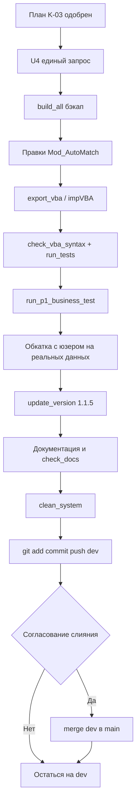

# План реализации — SysW v1.1.5, задача K-03

> Роль: **Architect** (планирование + единый запрос [U4]).
> Исполнение: **Code** → проверка **Debug** → координация **Orchestrator**.
> Входные данные: анализ Ask для v1.1.5 (`plans/1.1.5.md`).

## 1. Цель подзадачи (K-03)

Устранить дефект состояния «не найдено» в автоподборе:

- [`AutoMatchWorks`](src/modules/Mod_AutoMatch.bas:87) при совпадении по тождеству/локальному листу, у которого **артикул пуст**, сейчас проставляет пустую ячейку колонки E (`MAIN_W_ARTICLE`), а должна проставляться пометка «НЕ НАЙДЕНО».
- [`AutoMatchParts`](src/modules/Mod_AutoMatch.bas:330) аналогично: при совпадении по тождеству/общей базе с **пустым артикулом** проставляет пустую ячейку колонки Q (`MAIN_P_ARTICLE`), вместо «НЕ НАЙДЕНО».

Требование: любая строка, для которой итоговый артикул не определён (пустой), должна получать маркер «НЕ НАЙДЕНО» + жёлтую подсветку с красным текстом, согласованно с уже существующей веткой «не найдено».

## 2. Диагностика текущего поведения

### 2.1 AutoMatchWorks — ветка кэш-индекса
`src/modules/Mod_AutoMatch.bas:184-199`
```
If idIndex.Exists(inKey) Then
    Set identity = idIndex(inKey)
    wsMain.Cells(i, MAIN_W_ARTICLE).Value = identity.OutArticle   ' может быть ""
    ...
    found = True
End If
```
Нет проверки `identity.OutArticle = ""` → строка помечается найденной с пустым артикулом.

### 2.2 AutoMatchWorks — ветка локального списка работ группы
`src/modules/Mod_AutoMatch.bas:216-224`
```
Else
    wsMain.Cells(i, MAIN_W_ARTICLE).Value = lw.OutArticle   ' может быть ""
    ...
```
Так же без проверки пустоты артикула.

### 2.3 AutoMatchParts — ветка тождеств
`src/modules/Mod_AutoMatch.bas:405-421`
```
For Each identity In identities
    If UCase$(Trim$(identity.InCatNum)) = UCase$(inCatNum) Then
        wsMain.Cells(i, MAIN_P_ARTICLE).Value = identity.OutArticle   ' может быть ""
        ...
        Exit For
```
Без проверки пустоты артикула.

### 2.4 AutoMatchParts — ветка общей базы з/ч
`src/modules/Mod_AutoMatch.bas:446-452`
```
wsMain.Cells(i, MAIN_P_ARTICLE).Value = gPart.OutArticle   ' может быть ""
```
Без проверки пустоты артикула.

### 2.5 Существующий механизм пометки
`HighlightNotFound` (`src/modules/Mod_AutoMatch.bas:49`) выполняет подсветку (жёлтый фон + красный текст); текст «НЕ НАЙДЕНО» проставляется отдельно в местах веток «не найдено» (например, строки 205-206, 213-214, 427-428, 434-435, 442-443).

**Вывод:** дефект связан с тем, что условие «найдено» не учитывает пустой артикул. Требуется добавить проверку артикула во всех четырёх точках заполнения.

## 3. Планируемые правки

### 3.1 Вспомогательный helper (рекомендуется)
Ввести приватный `Private Sub MarkNotFound(ByVal cell As Range)` в `Mod_AutoMatch.bas`, который инкапсулирует пару:
```vba
Private Sub MarkNotFound(ByVal cell As Range)
    HighlightNotFound cell
    cell.Value = "НЕ НАЙДЕНО"
End Sub
```
Затем заменить им все дублирующиеся пары `HighlightNotFound ... : .Value = "НЕ НАЙДЕНО"` (строки 205-206, 213-214, 427-428, 434-435, 442-443). Это упрощает логику и не меняет поведение существующих веток ([Z4] — рефакторинг без изменения логики, согласуется с одобрением).

> Альтернатива (минимальная, без рефакторинга): оставить существующие пары, а новую проверку пустого артикула выполнять через вызов `MarkNotFound` или прямую пару `HighlightNotFound` + `.Value`. Окончательный выбор за исполнителем Code с учётом консистентности.

### 3.2 AutoMatchWorks — ветка кэш-индекса
После `Set identity = idIndex(inKey)`:
```vba
If Trim$(CStr(identity.OutArticle)) <> "" Then
    ' заполнить E:F:J как сейчас
    matchCount = matchCount + 1
    found = True
Else
    ' пустой артикул — пометить «НЕ НАЙДЕНО»
    MarkNotFound wsMain.Cells(i, MAIN_W_IN_NAME)
    notFoundCount = notFoundCount + 1
End If
```

### 3.3 AutoMatchWorks — ветка локального списка работ
После получения `lw` (не Nothing) дополнительно проверить `Trim$(CStr(lw.OutArticle)) <> ""`:
- если не пуст — заполнить и, при необходимости, предложить создание тождества (как сейчас);
- если пуст — `MarkNotFound wsMain.Cells(i, MAIN_W_IN_NAME)`, `notFoundCount += 1`.

### 3.4 AutoMatchParts — ветка тождеств
Внутри `For Each identity In identities`, при совпадении `InCatNum`:
```vba
If UCase$(Trim$(identity.InCatNum)) = UCase$(inCatNum) Then
    If Trim$(CStr(identity.OutArticle)) <> "" Then
        ' заполнить Q:R:V как сейчас
        matchCount = matchCount + 1
        found = True
        Exit For
    Else
        ' пустой артикул — пометить «НЕ НАЙДЕНО»
        MarkNotFound wsMain.Cells(i, MAIN_P_IN_CATNUM)
        notFoundCount = notFoundCount + 1
        found = True     ' строка обработана (дефект устранён)
        Exit For
    End If
End If
```

### 3.5 AutoMatchParts — ветка общей базы з/ч
После получения `gPart` (не Nothing):
- если `Trim$(CStr(gPart.OutArticle)) <> ""` — заполнить и предложить создание тождества (как сейчас);
- иначе — `MarkNotFound wsMain.Cells(i, MAIN_P_IN_CATNUM)`, `notFoundCount += 1`.

> Примечание по счётчикам: важно сохранить корректный подсчёт `matchCount`/`notFoundCount` и итоговые MsgBox «Найдено/Не найдено». Служебный маркер `found=True` в ветке пустого артикула предотвращает повторную обработку строки в других ветках.

## 4. Тестирование

### 4.1 Автоматизированное
- Расширить [`RunAutoMatchTests`](src/modules/Mod_FullTestRunner.bas:864) тестом **TC-69 «AutoMatch: при пустом артикуле ставится НЕ НАЙДЕНО»**.
  - Безопасная реализация (без загрязнения данных): на временном листе/в памяти сформировать тождество с пустым `OutArticle`, прогнать проверку через вспомогательную функцию (если вынести логику проверки артикула в приватную Pure-функцию вида `HasValidArticle`) ИЛИ выполнить бизнес-прогон на реальных данных.
  - Учитывая ограничение безопасности (изменение данных листа main в авторежиме, как в TC-44), допустимо пометить как SKIP с обоснованием и покрыть сценарий бизнес-прогоном совместно с юзером.
- Обязательные регрессионные прогоны:
  - `python scripts/check_vba_syntax.py` — проверка синтаксиса VBA.
  - `python scripts/run_tests.py` — полный набор TC (через COM, с автозакрытием диалогов).

### 4.2 Бизнес-прогон
- `python scripts/run_p1_business_test.py` — основной бизнес-сценарий.
- Совместно с юзером обкатать автоподбор на реальных данных (задачи 1 и 2 версии v1.1.5): выполнить «АВТО РАБ» и «АВТО ЗЧ», убедиться, что строки без артикула помечаются «НЕ НАЙДЕНО» жёлтым, а найденные заполняются корректно.

## 5. Обновление версии и документации

### 5.1 Версия
Выполнить `python scripts/update_version.py 1.1.5`. Скрипт обновит:
`src/modules/Mod_Constants.bas`, `scripts/config.py`, `scripts/config.ps1`, `README.md`, `docs/DEVELOPER.md`, `docs/ROADMAP.md`, `docs/ARCHITECTURE.md`, `docs/CHANGELOG.md` (новый раздел `## [v1.1.5]`). ([U2])

### 5.2 Обязательная документация
Актуализировать по итогам подзадачи (раздел «Обновление документации» версии v1.1.5):
- `docs/DEVELOPER.md` — описание логики автоподбора (пометка «НЕ НАЙДЕНО» при пустом артикуле), ссылка на K-03.
- `docs/ARCHITECTURE.md` — поведение AutoMatchWorks/AutoMatchParts в состоянии «не найдено».
- `docs/ROADMAP.md` — отметка задачи K-03 как выполненной, синхронизация версии.
- `docs/table.md` — при необходимости уточнить маппинг колонок/маркеров.
- `docs/CHANGELOG.md` — запись раздела v1.1.5 (раздел Generated затем актуализировать вручную).
- `README.md` — краткое упоминание улучшения автоподбора (если уместно).
- `docs/sourcecraft-guide.md` — актуализация ролевых/рабочих инструкций при изменениях процесса.

> Версия документации вносятся исполнителем **Code** после согласования [U4] (файлы — критические по [E3]).

## 6. Кодировка и защита ключевых файлов

- Перед правками ключевых Excel-файлов (`work.xlsm`) выполнить `python scripts/build_all.py` — этап 1 создаёт точку отката `_backup/<stamp>/` ([U5]).
- Правки VBA выполнять только через `impVBA.py` (UTF-8→CP1251) и после — `export_vba.py` (CP1251→UTF-8) ([K1]/[K2]); прямые правки `.bas` в репозитории допустимы в UTF-8, но сборка в Excel идёт через скрипты.
- Операции с файлами и git — через MCP File System / Git Tools ([G10]/[G11]).

## 7. Команды и скрипты к выполнению (п.5 версии v1.1.5 — без доп. запроса)

| № | Команда | Назначение |
|---|---------|-----------|
| 1 | `python scripts/build_all.py` | Бэкап ключевых файлов + сборка ([U5]) |
| 2 | `python scripts/check_vba_syntax.py` | Проверка синтаксиса VBA |
| 3 | `python scripts/run_tests.py` | Полный набор TC (COM, автозакрытие) |
| 4 | `python scripts/run_p1_business_test.py` | Бизнес-прогон основного сценария |
| 5 | `python scripts/update_version.py 1.1.5` | Поднятие версии ([U2]) |
| 6 | `python scripts/check_docs.py` | Контроль актуальности документации |
| 7 | `python scripts/clean_system.py` | Очистка временных файлов ([S7]) |

> Групповое выполнение команд — одной точкой подтверждения по [U4] ([S8]).

## 8. Git-этапы ([G10], схема v1.1.5 §8)

1. `git_add` критических изменённых файлов подзадачи + `git_commit` (Conventional Commits, scope `K03`) в ветке `dev`.
2. `git_push` в `origin/dev`.
3. Запросить у пользователя подтверждение на слияние `dev → main`.
4. После подтверждения — `git_merge` в `main`, возврат на `dev`.
5. Синхронизация todo ↔ CHANGELOG ↔ commits ([U7]).

## 9. Схема процесса



## 10. Критерии приёмки

- Во всех четырёх точках заполнения артикула присутствует проверка на пустоту; при пустом артикуле проставляется «НЕ НАЙДЕНО» + подсветка.
- Регрессионные TC и бизнес-прогон — PASS; при добавлении TC-69 — PASS или обоснованный SKIP.
- Автоподбор обкатан с юзером на реальных данных до удовлетворения (задачи 1–2 версии v1.1.5).
- Версия поднята до v1.1.5; документация и CHANGELOG актуализированы.
- Проект очищен ([S7]); ветка `dev`, слияние с `main` — по подтверждению юзера.