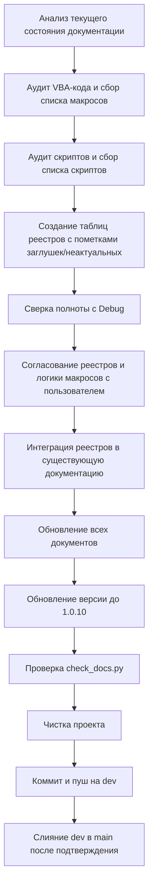

# Задание для SourceCraft `plans/promt1.0.10.md`

**!!!ВАЖНО: `.ycarules` имеет высший приоритет!!!**

## Цель

Версия проекта SysW — **v1.0.10**: наведение порядка в документации. Создать **реестр
макросов основной бизнес-логики** и **реестр скриптов** в виде таблиц, согласовать
с пользователем их содержание и правильность логики, интегрировать в существующую
документацию (без создания новых файлов), обновить всю документацию до актуального
состояния, выполнить чистку и зафиксировать изменения в Git.

## Список задач

### 1. СОЗДАНИЕ РЕЕСТРА МАКРОСОВ ОСНОВНОЙ БИЗНЕС-ЛОГИКИ

- Собрать данные обо всех действующих макросах (процедурах/функциях), участвующих
  в основной бизнес-логике: заполнение шапки, импорт, подбор работ/запчастей,
  работа с файлами модельных групп, очистка листов.
- **Формат реестра — таблица** со столбцами:
  | Имя макроса | Краткое описание функционала | Кнопка (если есть) | Модуль |
- Заглушки и неиспользуемые процедуры **включать**, но в столбце «Краткое описание»
  явно указывать, что это заглушка.
- Для максимальной полноты реестра:
  - проанализировать все модули `src/modules/*.bas` и `src/classes/*.cls`,
    имеющие отношение к бизнес-логике;
  - сверить с `Mod_ButtonDispatcher` и обработчиками кнопок;
  - привлечь агента **Debug** для аудита: сверить список процедур в коде
    с будущим реестром и выявить пропущенные;
  - при необходимости уточнить у пользователя, какие макросы он считает
    частью основной бизнес-логики.

### 2. СОЗДАНИЕ РЕЕСТРА СКРИПТОВ

- Собрать данные обо всех скриптах проекта (Python, PowerShell, CMD и др.),
  которые используются в рабочем процессе (`scripts/*.py`, `scripts/*.ps1` и т.п.).
- **Формат реестра — таблица** со столбцами:
  | Имя скрипта | Краткое описание функционала | Тип (Python/PowerShell) | Расположение |
- Для каждого скрипта указать его назначение, ключевые аргументы (если есть)
  и связь с бизнес-логикой (импорт/экспорт VBA, тесты, документация, чистка).
- Включить все актуальные скрипты; неиспользуемые или устаревшие пометить как
  неактуальные, но не удалять без согласования.

### 3. СОГЛАСОВАНИЕ РЕЕСТРОВ С ПОЛЬЗОВАТЕЛЕМ

- Представить пользователю черновики обоих реестров (таблиц) для проверки.
- Согласовать:
  - полноту и правильность списка макросов и скриптов;
  - корректность описаний функционала;
  - правильность логики макросов (при обнаружении расхождений с фактическим
    поведением — зафиксировать замечания, но не менять код в рамках этой задачи).
- Дождаться явного подтверждения пользователя перед интеграцией реестров
  в документацию.

### 4. ИНТЕГРАЦИЯ РЕЕСТРОВ В ДОКУМЕНТАЦИЮ

- Интегрировать оба реестра в **текущую документацию**, без создания новых файлов.
- Рекомендуемое место: `docs/DEVELOPER.md` — добавить разделы
  «Реестр макросов основной бизнес-логики» и «Реестр скриптов проекта».
  Окончательное место согласовать с пользователем.
- Обновить перекрёстные ссылки в `README.md`, `docs/ROADMAP.md`,
  `docs/DEVELOPER.md`, `docs/sourcecraft-guide.md` при необходимости.

### 5. ОБНОВЛЕНИЕ ВСЕЙ ДОКУМЕНТАЦИИ ДО АКТУАЛЬНОГО СОСТОЯНИЯ

- Пройтись по всем документам проекта: `README.md`, `docs/ROADMAP.md`,
  `docs/DEVELOPER.md`, `docs/ARCHITECTURE.md`, `docs/git-workflow.md`,
  `docs/sourcecraft-guide.md`, `docs/table.md`, `docs/CHANGELOG.md`.
- Добавить все изменения и обновления в документацию.
- Исправить устаревшие ссылки, описания, состав модулей, структуру.
- Поднять версию до **1.0.10** через `scripts/update_version.py` (или вручную
  синхронно во всех местах: `Mod_Constants`, `config.py`, `config.ps1`,
  README, документация).
- Проверить `scripts/check_docs.py --check` → добиться `exit 0`.

### 6. ЧИСТКА ПРОЕКТА

- Удалить временные и мусорные файлы: `_temp_export/`, `_temp_import/`,
  `__pycache__/`, `~$*`, устаревшие резервные копии, неиспользуемые артефакты.
- Не трогать рабочие файлы без явного запроса пользователя ([Z2], [S7]).

### 7. КОММИТ И ПУШ

- Закоммитить изменения на ветке `dev` с осмысленным сообщением
  (например, `docs: реестры макросов и скриптов, актуализация документации, чистка проекта`).
- Отправить в `origin/dev`.
- Слияние `dev → main` — только после подтверждения пользователем.

## Итоговая последовательность

