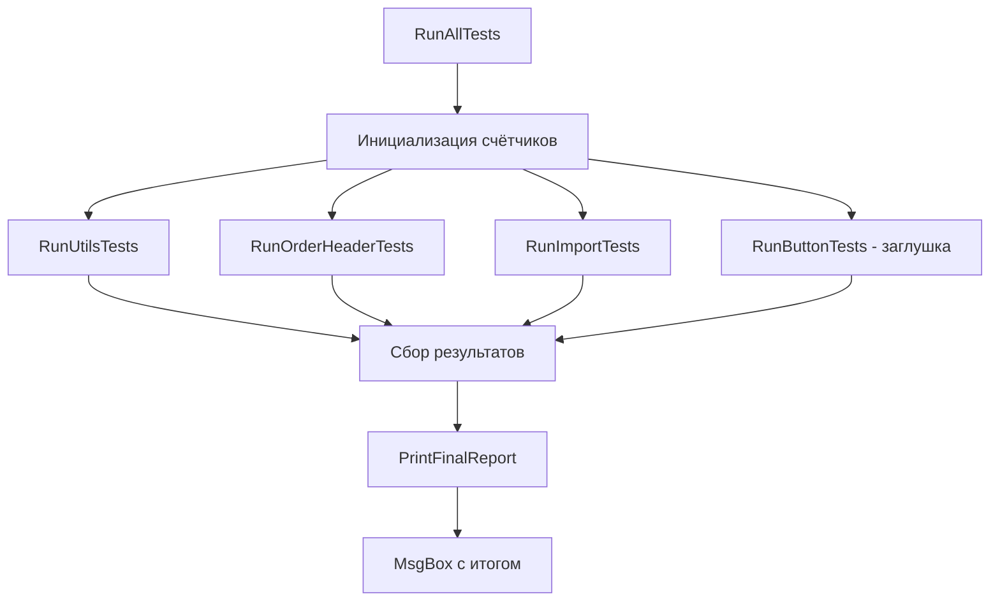

# План: Модуль Mod_FullTestRunner.bas (финальная версия)

## 1. Архитектура модуля

### 1.1. Структура

```
Mod_FullTestRunner.bas
├── Public Sub RunAllTests()          — Главная точка входа
├── Private Sub RunUtilsTests()       — TC-01..TC-04, TC-06, TC-07, TC-19, TC-20
├── Private Sub RunOrderHeaderTests() — TC-08, TC-09, TC-11, TC-12 (TC-10 ручной)
├── Private Sub RunImportTests()      — TC-05, TC-13, TC-14(SKIP), TC-15(SKIP), TC-17(SKIP)
│                                      (TC-16 ручной)
├── Private Sub RunButtonTests()      — (TC-18 ручной, заглушка)
├── Private вспомогательные функции:
│   ├── SaveSheetState / RestoreSheetState
│   └── AddResult
└── Private переменные-счётчики:
    ├── m_Total As Long
    ├── m_Passed As Long
    ├── m_Failed As Long
    └── m_Skipped As Long
```

### 1.2. Поток выполнения



## 2. Детальное описание тестов

### 2.1. RunUtilsTests — TC-01..TC-04, TC-06, TC-07, TC-19, TC-20

| ID | Описание | Вызов | Ожидаемый результат |
|----|----------|-------|---------------------|
| TC-01 | FileExists с существующим файлом | `FileExists("C:\Windows\notepad.exe")` | `True` |
| TC-02 | FileExists с несуществующим файлом | `FileExists("C:\nonexistent_file_12345.txt")` | `False` |
| TC-03 | FormatDateSQL с валидной датой | `FormatDateSQL(DateSerial(2026, 7, 12))` | `"2026-07-12"` |
| TC-04 | FormatDateSQL с нулевой датой | `FormatDateSQL(0)` | `"1899-12-30"` |
| TC-06 | GetSheetByName существующий | `GetSheetByName(ThisWorkbook, "main")` | `Not Nothing` |
| TC-07 | GetSheetByName несуществующий | `GetSheetByName(ThisWorkbook, "NONEXISTENT")` | `Nothing` |
| TC-19 | WriteLog | `WriteLog("Test message")` + проверка `FileExists(log.txt)` | Файл существует |
| TC-20 | GetWorkbookPath / GetCurrentUser | Вызов обеих функций | Пути непустые |

### 2.2. RunOrderHeaderTests — TC-08, TC-09, TC-11, TC-12

| ID | Описание | Вызов | Ожидаемый результат |
|----|----------|-------|---------------------|
| TC-08 | FindOrder существующий (№ п/п "1") | `FindOrder("1", Header)` | `True`, Header.OrderNumber = "1" |
| TC-09 | FindOrder несуществующий | `FindOrder("999", Header)` | `False` |
| TC-11 | FillHeaderFromOrder с Nothing-листами | Передать Nothing в wsSpisok | Ошибки нет (Exit Sub) |
| TC-12 | FillHeaderFromOrder заказ не найден | Номер "999" с корректными листами | B3:B15 очищены |

**Защита данных для TC-11, TC-12:**
- Сохраняем содержимое B3:B15 листа main перед тестом
- Восстанавливаем после теста

### 2.3. RunImportTests — TC-05, TC-13, TC-14, TC-15, TC-17

| ID | Описание | Вызов | Ожидаемый результат |
|----|----------|-------|---------------------|
| TC-05 | ExtractNumberFromGRZ | `ExtractNumberFromGRZ("А123ВВ77")` | `"12377"` |
| TC-13 | ExtractNumberFromGRZ различные форматы | `"А123ВВ77"`, `"В456ЕК"`, `""` | `"12377"`, `"456"`, `""` |
| TC-14 | SearchSheetByGRZ существующий | Поиск листа с именем, содержащим цифры из "12345" | SKIP если нет такого листа |
| TC-15 | SearchSheetByGRZ несуществующий | Поиск "ЗН" | `Nothing` (SKIP если нет листа "ЗН") |
| TC-17 | ImportFromReport | Если лист report существует | Импорт выполнен (SKIP если нет листа) |

**Защита данных для TC-17:**
- Сохраняем содержимое столбцов A, B, C листа main
- Восстанавливаем после теста

### 2.4. RunButtonTests — заглушка (TC-18 ручной)

| ID | Описание | Статус |
|----|----------|--------|
| TC-18 | Btn_main_Clear_Click | Ручной тест, не включён в автоматический прогон |

## 3. Система подсчёта результатов

### 3.1. Внутренние переменные

```vba
Private m_Total As Long
Private m_Passed As Long
Private m_Failed As Long
Private m_Skipped As Long
```

### 3.2. Формат вывода каждого теста

```
[TC-01] ✓ FileExists с существующим файлом: PASS
[TC-15] ⚠ SearchSheetByGRZ несуществующий: SKIP (нет листа "ЗН")
[TC-08] ✗ FindOrder существующий: FAIL — ожидалось True, получено False
```

### 3.3. Итоговый отчёт

```
Всего: 17, Пройдено: 15, Провалено: 1, Пропущено: 1
```

## 4. Вспомогательные функции

### 4.1. SaveSheetState / RestoreSheetState

```vba
Private Function SaveSheetState(ws As Worksheet) As Variant
    On Error Resume Next
    SaveSheetState = ws.UsedRange.Value
    On Error GoTo 0
End Function

Private Sub RestoreSheetState(ws As Worksheet, data As Variant)
    If ws Is Nothing Then Exit Sub
    If IsEmpty(data) Then Exit Sub
    On Error Resume Next
    ws.UsedRange.ClearContents
    If Not IsNull(data) Then
        If IsArray(data) Then
            ws.Range("A1").Resize(UBound(data, 1), UBound(data, 2)).Value = data
        End If
    End If
    On Error GoTo 0
End Sub
```

### 4.2. AddResult

```vba
Private Sub AddResult(testId As String, testName As String, _
                      passed As Boolean, Optional failReason As String = "", _
                      Optional skipped As Boolean = False, Optional skipReason As String = "")
    m_Total = m_Total + 1
    If skipped Then
        m_Skipped = m_Skipped + 1
        Debug.Print "[" & testId & "] " & ChrW(&H26A0) & " " & testName & ": SKIP (" & skipReason & ")"
    ElseIf passed Then
        m_Passed = m_Passed + 1
        Debug.Print "[" & testId & "] " & ChrW(&H2713) & " " & testName & ": PASS"
    Else
        m_Failed = m_Failed + 1
        Debug.Print "[" & testId & "] " & ChrW(&H2717) & " " & testName & ": FAIL " & failReason
    End If
End Sub
```

## 5. Обработка ошибок

Каждый тест обёрнут в `On Error Resume Next` / `On Error GoTo 0`.

## 6. Зависимости модуля

- `Mod_Utils` — FileExists, FormatDateSQL, GetSheetByName, GetWorkbookPath, GetCurrentUser, WriteLog, OrderHeader
- `Mod_OrderHeader` — FillHeaderFromOrder, FindOrder
- `Mod_Import` — ExtractNumberFromGRZ, SearchSheetByGRZ, ImportFromReport

## 7. Кодировка и формат файла

- Кодировка: Windows-1251 (ANSI)
- Перевод строк: CRLF (Windows)
- Первая строка: `Attribute VB_Name = "Mod_FullTestRunner"`
- Вторая строка: `Option Explicit`

## 8. Итоговый список тестов (17 автоматических)

| ID | Статус | Причина |
|----|--------|---------|
| TC-01 | Авто | - |
| TC-02 | Авто | - |
| TC-03 | Авто | - |
| TC-04 | Авто | - |
| TC-05 | Авто | - |
| TC-06 | Авто | - |
| TC-07 | Авто | - |
| TC-08 | Авто | - |
| TC-09 | Авто | - |
| TC-10 | **Ручной** | Требует проверки визуального результата на листе |
| TC-11 | Авто | - |
| TC-12 | Авто | - |
| TC-13 | Авто | - |
| TC-14 | Авто (SKIP если нет листа) | - |
| TC-15 | Авто (SKIP если нет листа "ЗН") | - |
| TC-16 | **Ручной** | Требует создания временного листа |
| TC-17 | Авто (SKIP если нет листа report) | - |
| TC-18 | **Ручной** | Требует взаимодействия с MsgBox |
| TC-19 | Авто | - |
| TC-20 | Авто | - |